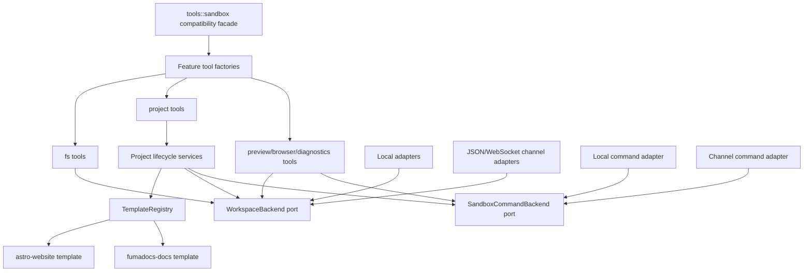

# Sandbox Tools 代码架构拆分与约束方案

日期：2026-07-11
状态：Proposed
适用范围：`services/runtime/src/tools/sandbox.rs`、`services/runtime/src/profiles/build.rs`、相关 Runtime/Sandbox 测试

## 1. 结论

保留 `project.init` 由 Runtime 写入确定性 Astro/Fumadocs 骨架的产品与技术决策，但不再允许模板正文、Workspace 传输、通用文件工具、项目生命周期、Preview、Browser 和 Fidelity 逻辑继续集中在同一个文件中。

本次拆分采用以下原则：

1. `tools::sandbox` 保留为兼容门面，不做一次性公共 API 改名。
2. 先机械移动并保持行为等价，再引入新的模板抽象。
3. 模板是纯声明与纯渲染，不直接访问 RuntimeStore、网络、进程或本地文件系统。
4. 所有 Workspace 读写必须经过 `WorkspaceBackend`；所有命令执行必须经过 `SandboxCommandBackend`。
5. `project.init`、内部 template build 和真实 Agent Build 必须共用同一套模板注册表，禁止复制模板实现。
6. 通用 `fs.*` 工具不得包含 Astro、Fumadocs、Next.js 等框架专属判断。
7. 模板骨架只提供可构建结构，不提供演示业务内容、最终信息架构或最终视觉方案。

### 1.1 可引用的强制规则

以下规则使用稳定 ID，设计评审、Code Review 和架构门禁应直接引用对应 ID：

| Rule ID | 级别 | 约束 |
|---|---|---|
| `SBX-001` | MUST | `tools::sandbox` 只能是兼容 façade、factory 和 re-export，不承载 feature 实现。 |
| `PORT-001` | MUST | Workspace I/O 只经过 `WorkspaceBackend`，命令执行只经过 `SandboxCommandBackend`。 |
| `PORT-002` | MUST | 除具体 adapter 外，业务模块不得判断当前是 Local、JSON Channel 或 WebSocket Channel。 |
| `TPL-001` | MUST | 每个 template key 只能对应一个 `TemplateSpec` 和一套 template assets。 |
| `TPL-002` | MUST | Template 模块必须是纯声明/纯渲染，不得访问 RuntimeStore、网络、进程和具体 Workspace adapter。 |
| `TPL-003` | MUST | 新增模板不得要求修改通用 FS、Workspace adapter 或 Preview 核心逻辑。 |
| `PRJ-001` | MUST | Project Tool 只处理工具协议，生命周期逻辑必须委托 Project service。 |
| `FS-001` | MUST | 通用 `fs.*` 不得出现具体 framework/template 判断，项目约束统一经过 `ProjectMutationPolicy`。 |
| `STATE-001` | MUST | RuntimeStore/run snapshot 是 project state 权威来源，Workspace JSON 只是诊断副本。 |
| `DET-001` | MUST | 内置模板必须使用受控版本、完整 lockfile、template version 和 manifest hash。 |
| `ERR-001` | MUST | 拆分必须保持稳定的 error kind、关键 metadata 和 suggested action。 |
| `TEST-001` | MUST | Workspace 行为必须通过 Local、JSON Channel 和 WebSocket 三类 backend conformance tests。 |
| `CHANGE-001` | MUST | 机械移动、行为修改和依赖升级默认拆成不同 PR。 |
| `SIZE-001` | SHOULD | façade 不超过 200 行，普通生产模块不超过 800 行；例外需要评审说明。 |

规则例外必须同时包含：

- 被豁免的 Rule ID；
- 无法遵守的具体原因；
- 影响范围和风险；
- 移除例外的后续事项；
- 明确的 reviewer 同意。

“暂时方便”“只支持两个模板”或“测试已经通过”不能作为架构例外理由。

## 2. 当前问题基线

当前 `services/runtime/src/tools/sandbox.rs` 超过 8,000 行，混合了以下职责：

- Tool factory 和注册顺序；
- Workspace/Command ports；
- Local、JSON Channel、WebSocket Channel adapters；
- `fs.*`、chunk write、patch、read tracking；
- `shell.run`、package install、dependency restore；
- `project.init`、`project.write_page`、`project.inspect`、`project.build`；
- Astro/Fumadocs 模板源码、样式 token 和 source contract；
- Preview 生命周期与静态文件服务；
- Browser 状态、截图和 DOM 检查；
- Design Profile Fidelity 采集与比较；
- Diagnostics 和 Promotion Gate 辅助逻辑。

同时，`services/runtime/src/profiles/build.rs` 还保留另一套 Astro/Fumadocs 生成实现。两条生成路径已经存在配置、样式、内容和构建行为漂移的风险。

这会导致三个直接后果：

- 修改 Workspace Channel 时会连带影响 project、package、preview 测试；
- 升级一个模板时需要同时修改多个实现；
- 新增模板会继续扩大通用工具中的框架分支。

## 3. 目标架构



依赖只能从上向下：

```text
tool facade
  -> feature tools
    -> application services
      -> template domain / ports
        <- adapters implement ports
```

禁止出现以下反向依赖：

- Workspace adapter 依赖 project/template；
- template 依赖 tool、HTTP API、RuntimeStore 或具体 adapter；
- generic fs tool 依赖某个具体模板；
- `profiles/build.rs` 再维护独立模板文件集。

## 4. 目标目录

第一阶段保持 `tools::sandbox` 模块路径：

```text
services/runtime/src/tools/
  sandbox/
    mod.rs                     # 兼容门面和 re-export，目标 <= 200 行
    factory.rs                 # sandbox_tools*，只负责组装
    ports.rs                   # WorkspaceBackend、SandboxCommandBackend、数据类型
    path.rs                    # workspace path 标准化与安全检查适配
    adapters/
      mod.rs
      local_workspace.rs
      local_command.rs
      channel_transport.rs
      channel_workspace.rs
      channel_command.rs
    fs/
      mod.rs                   # fs_tools factory
      read.rs
      list.rs
      search.rs
      write.rs
      patch.rs
      staged_write.rs
      policy.rs                # 通用路径权限，不出现框架名称
    package/
      mod.rs
      install.rs
      dependency_state.rs
    project/
      mod.rs                   # project_tools factory
      init.rs
      inspect.rs
      build.rs
      write_page.rs
      service.rs
      state.rs
      mutation_policy.rs
    preview/
      mod.rs
      publish.rs
      server.rs
      candidate.rs
      promotion.rs
    browser/
      mod.rs
      open.rs
      screenshot.rs
      inspect.rs
    diagnostics/
      mod.rs
      build_log.rs
      typescript.rs
    fidelity/
      mod.rs
      evaluate.rs
      computed_style.rs
      compare.rs
    support/
      input.rs
      errors.rs
      json.rs
      process_output.rs

services/runtime/src/templates/
  mod.rs
  key.rs                      # TemplateKey，唯一字符串解析入口
  registry.rs                 # TemplateRegistry
  spec.rs                     # TemplateSpec、BuildSpec、RoutePolicy 等
  astro_website/
    mod.rs
    contract.rs
    files/
      package.json
      package-lock.json
      astro.config.mjs
      tsconfig.json
      src/pages/index.astro
      src/styles/tokens.css
      src/styles/global.css
      src/components/ui/Button.astro
  fumadocs_docs/
    mod.rs
    contract.rs
    files/
      package.json
      package-lock.json
      next.config.mjs
      source.config.ts
      app/...
      content/docs/index.mdx
```

模板资产使用 `include_str!` / `include_bytes!` 编译进 Runtime。第一轮不引入运行时 YAML/JSON 模板解释器，避免把编译期错误变成运行时错误。

## 5. 核心抽象

### 5.1 TemplateKey

模板字符串只能在 `templates/key.rs` 中解析：

```rust
pub enum TemplateKey {
    AstroWebsite,
    FumadocsDocs,
}

impl TemplateKey {
    pub fn parse(value: &str) -> Result<Self, UnsupportedTemplate>;
    pub fn as_str(&self) -> &'static str;
}
```

业务代码不得散落：

```rust
if template == "fumadocs-docs" { ... }
```

允许的写法是：

```rust
match template_key {
    TemplateKey::AstroWebsite => ...,
    TemplateKey::FumadocsDocs => ...,
}
```

### 5.2 TemplateSpec

模板必须提供声明式契约：

```rust
pub struct TemplateSpec {
    pub key: TemplateKey,
    pub template_version: &'static str,
    pub framework: FrameworkKind,
    pub package_manager: PackageManager,
    pub lockfile: &'static str,
    pub files: &'static [TemplateFile],
    pub build: BuildSpec,
    pub preview: PreviewSpec,
    pub style: StyleContractSpec,
    pub source_contract: SourceContractSpec,
    pub mutation_policy: MutationPolicySpec,
    pub capabilities: TemplateCapabilities,
}
```

其中：

- `TemplateFile` 只描述相对路径、内容、写入策略和文件角色；
- `BuildSpec` 只描述受控 argv、超时和输出目录，不执行命令；
- `SourceContractSpec` 描述必需文件和结构校验；
- `MutationPolicySpec` 描述禁止路径和受保护文件；
- `TemplateCapabilities` 声明是否支持 structured page、MDX docs、static export 等能力。

### 5.3 TemplateRegistry

所有模板选择只能经过注册表：

```rust
pub trait TemplateRegistry: Send + Sync {
    fn resolve(&self, key: TemplateKey) -> &'static TemplateSpec;
}
```

Runtime 默认使用 `BuiltInTemplateRegistry`。测试可以注入只包含一个最小 fixture 的 registry，避免复制生产模板。

### 5.4 ProjectInitializer

`ProjectInitTool` 只负责输入、权限、进度与错误映射；真正初始化放在 service：

```rust
pub struct ProjectInitializer {
    workspace: Arc<dyn WorkspaceBackend>,
    templates: Arc<dyn TemplateRegistry>,
}

impl ProjectInitializer {
    pub async fn initialize(
        &self,
        ctx: &ToolContext,
        request: ProjectInitRequest,
    ) -> Result<ProjectInitOutcome, ProjectInitError>;
}
```

初始化顺序固定为：

1. 解析 `TemplateKey`；
2. 解析并验证 appRoot；
3. 读取现有 project state；
4. 计算旧模板到新模板的 cleanup plan；
5. 通过 `WorkspaceBackend` 执行 cleanup；
6. 写入模板文件；
7. 写入 Design Profile 初始 token；
8. 校验模板 source contract；
9. 写 RuntimeStore authoritative project state；
10. 写 `state/project.json` 诊断副本；
11. 返回结构化结果。

任何步骤失败时，不得提前发布新的 authoritative project state。

### 5.5 ProjectMutationPolicy

当前 Fumadocs App Router 约束不能继续放在 `fs.write` 中。通用 FS 写工具改为调用：

```rust
pub trait ProjectMutationPolicy: Send + Sync {
    fn check_write(&self, ctx: &ToolContext, path: &Path) -> MutationDecision;
    fn check_delete(&self, ctx: &ToolContext, path: &Path) -> MutationDecision;
}
```

Policy 从当前 `ProjectRuntimeState.template_key` 和 `TemplateSpec.mutation_policy` 得出结果。`fs.*` 只理解 `Allow/Deny` 和结构化错误，不理解 Fumadocs、Next App Router 等概念。

## 6. 模板内容约束

### 6.1 Scaffold 与业务内容边界

模板允许包含：

- 可构建所需配置；
- 根 layout、provider、source loader；
- token CSS；
- 最小占位路由；
- source contract 所需的最小 `index.mdx`；
- 无业务含义的 accessibility-safe 占位内容。

模板禁止包含：

- `runtime-flow.mdx` 一类产品演示章节；
- 固定的最终站点导航结构；
- 声称代表用户品牌的文案；
- 最终业务页面和最终视觉方案；
- 仅为 smoke test 服务的生产文件。

真实内容必须由 Build Agent 根据 Brief 写入。Smoke test 的附加页面只存在于测试 fixture 中。

### 6.2 依赖确定性

每个内置模板必须满足：

- 生产依赖使用精确版本，禁止 `latest`；
- 默认禁止 caret/tilde 范围；
- 提交完整、可由 `npm ci` 使用的 lockfile；
- `template_version` 与模板文件集变化同步递增；
- 记录 `manifest_sha256`，覆盖文件路径和内容；
- restore 模式优先 `npm ci`；
- 只有显式 dependency mutation 才使用 `npm install`；
- registry 重写策略必须在 package service 中统一处理，不能改写模板正文。

`templateVersion` 和 `styleContractVersion` 必须分离。例如：

```json
{
  "templateKey": "fumadocs-docs",
  "templateVersion": "fumadocs-docs@1",
  "templateManifestSha256": "...",
  "styleContractVersion": "runtime-style-contract@p3"
}
```

### 6.3 清理与覆盖策略

每个模板文件必须声明写入策略：

```rust
pub enum TemplateWriteMode {
    CreateOnly,
    ReplaceOnInit,
    PreserveIfPresent,
}
```

模板切换时使用显式 cleanup plan，禁止根据文件夹名称做无限制删除。删除范围必须满足：

- 只在 appRoot 内；
- 只删除旧模板 manifest 声明拥有的路径；
- 用户生成的非模板文件默认保留；
- cleanup plan 进入结构化日志，便于恢复和审计。

## 7. Workspace 与远端 Sandbox 约束

为兼容 Kubernetes Workspace Channel，必须执行以下硬约束：

1. 除 `LocalWorkspaceBackend`、本地进程 adapter 和明确标注的 runtime-host artifact 外，生产代码禁止直接调用 `std::fs`。
2. Project state 的权威来源是 RuntimeStore/run snapshot；`state/project.json` 只是 Workspace 内诊断副本。
3. 远端路径统一使用逻辑 `/workspace/...`；本地绝对路径只允许存在于 adapter 内部。
4. path normalization 必须在 Local、JSON Channel、WebSocket Channel 三种 backend 上跑同一套 conformance tests。
5. template、project service 和 fs tools 不得判断 backend 类型。
6. 任何 workspace 文件存在性检查必须调用 `WorkspaceBackend::path_kind`，不得使用 `Path::exists()`。
7. 任何 source snapshot copy/restore 必须调用 backend 的 byte-preserving API。

## 8. `profiles/build.rs` 收敛策略

`profiles/build.rs` 当前的内部 template build 是受控 developer/admin helper，不应保留独立模板实现。

目标方案：

- `profiles/build.rs` 保留请求编排、内部 API 所需的 Brief 构造和 promotion 逻辑；
- 初始化改为调用 `ProjectInitializer`；
- build 改为调用 `ProjectBuilder`；
- preview/candidate 改为调用现有共享 service；
- 删除 `write_astro_project`、`write_fumadocs_project` 和重复 renderer；
- 如果该内部 helper 已无持续价值，则在共享 service 接入后单独发起删除决策，不在本次机械拆分中顺手删除。

在完成收敛前，禁止新增第三条模板生成路径。

## 9. `project.write_page` 约束

当前 `project.write_page` 实际是 Astro renderer，但工具名称是通用名称。拆分时采用 capability 路由：

- `astro-website` 声明 `structured_page_write=true`；
- Fumadocs 第一阶段声明 `structured_page_write=false`、`mdx_document_write=true`；
- Tool 根据 capability 返回结构化 unsupported 错误；
- renderer 移入对应模板模块，project tool 不拼接 Astro 源码；
- 后续如需要 Docs 专用结构化写入，新增 `project.write_document`，不要继续给 `project.write_page` 增加框架分支。

## 10. 错误契约

拆分不得改变现有 Agent 可见错误类别。至少保留：

- `docs.routing_root_forbidden`；
- `docs.source_contract_invalid`；
- `path.nested_package_root`；
- `build.missing_dependency`；
- `dependency.install_failed`；
- `preview.static_output_missing`；
- fidelity 相关 error kind。

内部模块可以使用强类型错误，但 Tool 边界必须统一映射为 `ToolError`：

```text
domain error
  -> application error
    -> stable ToolError kind + metadata + suggestedAction
```

禁止以拆分为理由把结构化错误退化成普通字符串。

## 11. 测试结构

对应生产目录拆分测试，结束单个 5,000 行 `sandbox_tools.rs`：

```text
services/runtime/tests/
  sandbox_backend_contract.rs
  sandbox_channel_transport.rs
  fs_tools.rs
  staged_writes.rs
  package_tools.rs
  project_init.rs
  project_build.rs
  project_mutation_policy.rs
  preview_tools.rs
  browser_tools.rs
  fidelity_tools.rs
  template_contracts.rs
```

### 11.1 Backend conformance suite

同一组 contract cases 必须运行在：

- `LocalWorkspaceBackend`；
- `JsonWorkspaceChannelBackend<RecordingTransport>`；
- WebSocket workspace channel test server。

覆盖：

- `/workspace` 与本地 root 映射；
- symlink/canonical path；
- read/write/list/stat/rename/remove/copy；
- 不存在路径；
- `..`、外部绝对路径和 secret path；
- 二进制文件 snapshot。

### 11.2 Template contract suite

每个模板必须自动验证：

- 文件 inventory 与 manifest 完全一致；
- 连续两次 init 输出 hash 一致；
- manifest hash 与声明一致；
- lockfile 完整且 `npm ci` 可用；
- build command 成功；
- static output 目录符合声明；
- source contract 有效；
- style contract 的 token 都能在 token file 中找到；
- 不包含禁止的演示业务内容；
- Astro 与 Fumadocs 切换时 cleanup plan 正确；
- init 失败时 authoritative state 不更新。

### 11.3 行为兼容测试

机械拆分期间，以下输出必须做 snapshot/semantic equality 对比：

- `sandbox_tools()` 工具名称与顺序；
- 每个工具 input schema；
- project state 字段；
- style contract；
- error kind 和关键 metadata；
- build argv；
- preview output candidates；
- Agent event 顺序。

## 12. 自动架构门禁

新增 `services/runtime/scripts/check-sandbox-architecture.sh`，由本地 gate 和 CI 调用。

最低检查项：

1. `tools/sandbox/mod.rs` 不超过 200 行；
2. 普通生产模块建议不超过 800 行，模板 asset 不计；
3. `tools/sandbox/fs` 中禁止出现 `astro`、`fumadocs`、`next.config`；
4. `templates` 中禁止出现 `std::fs`、`tokio::process`、`Command::new`、HTTP client；
5. `project` 和 `templates` 中禁止引用具体 Workspace adapter；
6. 除 `templates/key.rs`、模板模块和测试 fixture 外，限制散落的模板 key 字面量；
7. 禁止在 `profiles/build.rs` 新增 `write_*_project`；
8. 禁止生成不完整的手写 `package-lock.json`；
9. `cargo fmt --check`、`cargo check --tests`、相关 test targets 必须通过；
10. `git diff --check` 必须通过。

行数门禁用于阻止重新聚合，不用于要求把强相关的小函数机械拆散。超限必须在 PR 中说明并获得明确架构例外。

## 13. 分阶段迁移计划

### PR 0：冻结基线与修复当前红灯

目标：不带架构移动，先让当前 Workspace Channel 改造稳定。

- 完成当前未提交的 Kubernetes remote workspace 改造；
- 让 `cargo test --test sandbox_tools` 恢复全绿；
- 记录工具列表、schema、模板文件 inventory 和 error contract 基线；
- 暂停向 `sandbox.rs` 增加新功能。

验收：当前行为有可重复的绿色基线。

### PR 1：提取 ports 与 adapters

纯机械移动：

- `WorkspaceBackend`、`SandboxCommandBackend` -> `ports.rs`；
- Local adapter -> `adapters/local_*`；
- Channel transport/backend -> `adapters/channel_*`；
- 保持 `tools::sandbox::*` re-export；
- 建立 backend conformance suite。

禁止在该 PR 修改模板、路径语义或错误文案。

### PR 2：提取通用工具

- 移动 `fs.*`、staged write、shell/package；
- 提取通用 path/input/error support；
- 保持工具 schema、名称和注册顺序；
- 把现有大测试按 feature 拆开，但不改变行为。

### PR 3：建立 TemplateKey、TemplateSpec 和 Registry

- 新建 `services/runtime/src/templates`；
- 将 Astro/Fumadocs 字符串资产移动为真实模板文件；
- 使用 `include_str!` 嵌入；
- 建立 manifest、hash 和 template contract tests；
- 保持 `project.init` 外部结果兼容；
- 删除不可达的旧 Astro-as-Docs 分支。

### PR 4：提取 Project lifecycle services

- 移动 init/inspect/build/write-page；
- `ProjectInitTool` 委托 `ProjectInitializer`；
- 引入 `ProjectMutationPolicy`；
- 从通用 `fs.*` 删除 Fumadocs 硬编码；
- 使用 RuntimeStore/run snapshot 作为 project state 权威来源。

### PR 5：收敛第二套模板实现

- `profiles/build.rs` 接入共享 Project/Template services；
- 删除重复的 Astro/Fumadocs writer 和 renderer；
- 对 internal template build 与 Agent build 做输出契约对比；
- 确保 gated internal API 的鉴权和开关行为不变。

### PR 6：提取 Preview、Browser、Diagnostics、Fidelity

- 按目标目录移动剩余工具；
- 拆分 computed-style collector 与 comparator；
- `sandbox/mod.rs` 收敛为 factory/re-export 门面；
- 启用架构门禁。

### PR 7：模板确定性加固

- 替换依赖范围和 `latest`；
- 生成并提交完整 lockfile；
- restore 使用 `npm ci`；
- 分离 template/style contract version；
- 移除生产模板中的演示业务内容。

如果 PR 3 可以在不扩大风险的前提下完成这些工作，可以提前；否则必须单独提交，避免把机械拆分和依赖升级混在一起。

## 14. 每个 PR 的强制验收

每个迁移 PR 都必须满足：

```text
cargo fmt --check
cargo check --tests
cargo test --test <本 PR 相关 targets>
git diff --check
```

涉及模板、project lifecycle 或 preview 的 PR 额外运行：

```text
bash services/runtime/scripts/smoke-fumadocs-docs-build.sh
bash services/runtime/scripts/run-runtime-harness-local-gates.sh
```

涉及 Workspace Channel 的 PR 额外运行：

```text
bash infra/agent-sandbox/run-k8s-e2e.sh
```

测试结果必须区分：

- compile/type check；
- unit/contract；
- real framework build；
- real Kubernetes workspace channel；
- real provider lifecycle。

不得用其中一类成功替代另一类。

## 15. Code Review Checklist

模板相关改动：

- 是否只修改一套 TemplateSpec/asset？
- 是否同步更新 template version 和 manifest hash？
- 是否仍为 scaffold，而不是业务内容？
- 是否使用精确依赖和完整 lockfile？
- 是否通过真实 framework build？

Workspace 相关改动：

- 是否全部经过 backend？
- 是否同时覆盖 Local/JSON/WebSocket？
- 是否避免 host absolute path 泄漏到远端？
- 是否保持 byte-level snapshot？

Project tool 相关改动：

- Tool 是否只承担协议边界？
- 业务逻辑是否在 service？
- framework 分支是否来自 TemplateSpec/capability？
- RuntimeStore state 是否先于 workspace hint 成为权威来源？
- error kind 和 Agent recovery metadata 是否兼容？

通用 FS 相关改动：

- 是否出现具体框架名？出现即拒绝；
- 是否绕过 ProjectMutationPolicy？
- 是否直接使用 `std::fs` 或 `Path::exists()`？
- 是否仍受 workspace、secret、nested root 和 runtime-owned path 限制？

## 16. 完成定义

只有同时满足以下条件，拆分才算完成：

- `tools/sandbox/mod.rs` 只保留稳定 façade/factory/re-export；
- 没有单一生产 Rust 模块继续承担多个 feature domain；
- Astro/Fumadocs 只有一套模板资产和一套注册入口；
- `profiles/build.rs` 不再生成模板文件；
- 通用 `fs.*` 不包含框架知识；
- Local 与 Kubernetes Workspace 使用同一 project/template service；
- 两个内置模板都通过 contract、真实 build 和生命周期测试；
- 新增第三个模板不需要修改通用 FS、Workspace adapter 或 Preview 核心逻辑；
- 架构门禁进入本地 gate 与 CI。

## 17. 明确不在本次范围内

- 不新增 Next.js Website 或 Docusaurus Docs 模板；
- 不重做 Agent prompt 和 Brief 产品流程；
- 不改变公开 Runtime API；
- 不替换 Agent Sandbox controller；
- 不引入通用模板 DSL 或插件市场；
- 不借拆分顺手重写 Preview/Promotion 业务语义。

这些事项应在模块边界稳定后独立评估。
