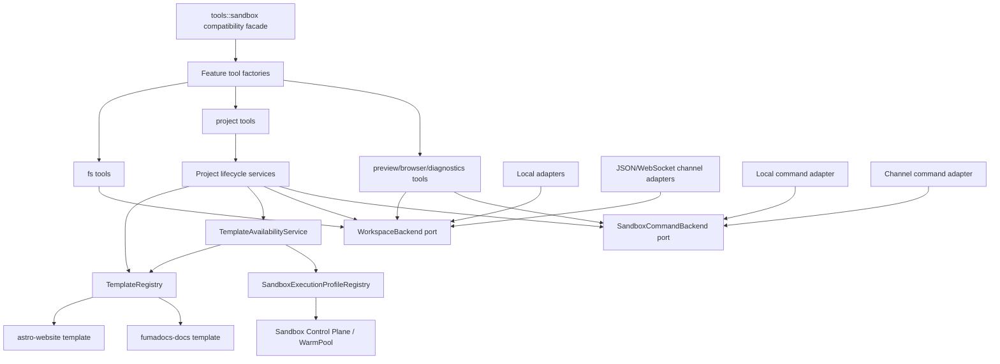

# Sandbox Tools 代码架构拆分与约束方案

日期：2026-07-11
状态：Accepted v3 / Implemented and verified（2026-07-12 实施快照）
适用范围：`services/runtime/src/tools/sandbox.rs`、`services/runtime/src/profiles/build.rs`、
`services/runtime/src/types.rs`、Sandbox Control Plane、`infra/agent-sandbox` 与相关测试

## 1. 结论

保留 `project.init` 由 Runtime 写入确定性 Astro/Fumadocs 骨架的产品与技术决策，但不再允许模板正文、Workspace 传输、通用文件工具、项目生命周期、Preview、Browser 和 Fidelity 逻辑继续集中在同一个文件中。

本次拆分采用以下原则：

1. `tools::sandbox` 保留为兼容门面，不做一次性公共 API 改名。
2. 先机械移动并保持行为等价，再引入新的模板抽象。
3. 模板是纯声明与纯渲染，不直接访问 RuntimeStore、网络、进程或本地文件系统。
4. 所有 Workspace 读写必须经过 `WorkspaceBackend`；所有命令执行必须经过 `SandboxCommandBackend`。
5. `project.init`、内部 template build 和真实 Agent Build 必须共用同一套模板注册表，禁止复制模板实现。
6. 通用 `fs.*` 工具不得包含 Astro、Fumadocs、Next.js 等框架专属判断。
7. 模板骨架只提供可构建结构，不提供演示业务内容、最终信息架构或最终视觉方案。

### 1.1 可引用的强制规则

以下规则使用稳定 ID，设计评审、Code Review 和架构门禁应直接引用对应 ID：

| Rule ID | 级别 | 约束 |
|---|---|---|
| `SBX-001` | MUST | `tools::sandbox` 只能是兼容 façade、factory 和 re-export，不承载 feature 实现。 |
| `PORT-001` | MUST | Workspace I/O 只经过 `WorkspaceBackend`，命令执行只经过 `SandboxCommandBackend`。 |
| `PORT-002` | MUST | 除具体 adapter 外，业务模块不得判断当前是 Local、JSON Channel 或 WebSocket Channel。 |
| `TPL-001` | MUST | 每个 `(template_id, template_version)` 只能对应一个 `TemplateSpec` 和一套不可变 template assets；同一 ID 可以保留多个兼容版本。 |
| `TPL-002` | MUST | Template 模块必须是纯声明/纯渲染，不得访问 RuntimeStore、网络、进程和具体 Workspace adapter。 |
| `TPL-003` | MUST | 新增模板不得要求修改通用 FS、Workspace adapter 或 Preview 核心逻辑。 |
| `TPL-004` | MUST | 模板和 framework 标识使用可校验的开放字符串类型；只有受控执行策略等安全边界才使用 enum。 |
| `CAP-001` | MUST | Runtime 可初始化模板集合只能来自 `TemplateAvailabilityService`，Brief、Design Profile、API 和 `project.init` 不得分别维护白名单。 |
| `EXT-001` | MUST | 新增内置模板的 Runtime 改动面只能是模板模块、模板 assets、单一 registry registration 和对应 contract tests；若需要新 Sandbox 执行环境，基础设施描述必须作为独立交付物。 |
| `PRJ-001` | MUST | Project Tool 只处理工具协议，生命周期逻辑必须委托 Project service。 |
| `FS-001` | MUST | 通用 `fs.*` 不得出现具体 framework/template 判断，项目约束统一经过 `ProjectMutationPolicy`。 |
| `STATE-001` | MUST | RuntimeStore/run snapshot 是 project state 权威来源，Workspace JSON 只是诊断副本。 |
| `TXN-001` | MUST | `project.init` 的 Workspace mutation 必须可提交、可回滚、可在进程重启后恢复，不允许 cleanup 后留下半成品。 |
| `INFRA-001` | MUST | 模板启用前必须绑定已部署且健康的 `SandboxExecutionProfile`；template ID 不得隐式等同于 WarmPool 名称。 |
| `DET-001` | MUST | 内置模板必须使用受控版本、完整 lockfile、template version 和 manifest hash。 |
| `ERR-001` | MUST | 拆分必须保持稳定的 error kind、关键 metadata 和 suggested action。 |
| `TEST-001` | MUST | Workspace 行为必须通过 Local、JSON Channel 和 WebSocket 三类 backend conformance tests。 |
| `CHANGE-001` | MUST | 机械移动、行为修改和依赖升级默认拆成不同 PR。 |
| `SIZE-001` | SHOULD | façade 不超过 200 行，普通生产模块不超过 800 行；例外需要评审说明。 |

规则例外必须同时包含：

- 被豁免的 Rule ID；
- 无法遵守的具体原因；
- 影响范围和风险；
- 移除例外的后续事项；
- 明确的 reviewer 同意。

“暂时方便”“只支持两个模板”或“测试已经通过”不能作为架构例外理由。

### 1.2 当前实施快照

本节只记录当前 checkout 的实施状态，不替代后文的最终完成定义：

- 已完成：原 10,269 行 `sandbox.rs` 已替换为 7 行兼容 façade；fs、style、shell、project、build/package、preview/fidelity、browser、diagnostics 已按 feature 拆分；
- 已完成：Workspace/Command ports 与 Local、JSON Channel、WebSocket Channel adapters 已分离，严格架构门禁下所有 sandbox 生产模块均不超过 800 行；
- 已完成：`legacy.rs` 已从过渡期约 2,800 行收敛到 225 行，共享 helper 已归入 `support/fs.rs`、`support/project.rs`、`support/package.rs`、`support/build.rs`、`support/preview.rs` 和 `support/style.rs`；
- 已完成：版本化 `TemplateRegistry`、真实 template assets、manifest hash、availability、mutation policy 与显式 Sandbox execution profile；
- 已完成：Brief、Design Profile、Build start、`project.init` 的内置模板可用性统一校验；
- 已完成：`TemplateOperations` 承担 structured page、MDX document、source contract 和 build overlay；`profiles/build.rs` 不再包含 `TemplateKind` 或 Astro/Fumadocs 双实现；
- 已完成：第三模板 synthetic contract 证明新增模板无需修改通用 FS、Workspace adapter、Preview 或 profile build 分派；
- 已完成：`project.init` journal/snapshot 支持 prepared 回滚与 committed 续提交；Local、JSON Channel 和真实 WebSocket Channel 均有恢复测试，Runtime 启动会扫描并恢复未完成事务；
- 已完成：工具顺序/schema 基线、严格架构门禁、remote workspace FS boundary、真实 Astro/Fumadocs build 回归和 `cargo test --all-targets`；
- 已完成：`ProjectInitTool` 仅保留工具协议、请求构造和错误映射，Workspace/journal/RuntimeStore 编排已委托独立 `ProjectInitializer`；
- 已完成：初始化定义 9 个 mutation checkpoint；Local、JSON Channel 和真实 WebSocket Channel 均逐点注入中断，并验证 prepared 回滚或 committed 续提交；
- 已完成：Kubernetes execution-profile readiness 校验 SandboxTemplate、期望镜像、WarmPool 引用和 `readyReplicas`，使用 15 秒 TTL 缓存；生产 Deployment 已显式启用；
- 已完成：真实 k3d Workspace lifecycle，覆盖 mTLS Channel、并行隔离、Astro/Fumadocs build/edit/promotion/release 与截图证据；
- 发布验证待办：真实 provider lifecycle 与远端 CI 运行结果；当前 k3d Public Runtime 使用确定性 fixture model。

第 17 节定义的代码、契约、本地门禁与真实 Kubernetes lifecycle 已完成。真实 provider 和远端 CI 属于
发布环境验证，不改变本次架构实现完成结论。Runtime 会在启动恢复后执行全量 ProjectRuntimeState
compatibility audit，缺失历史 spec、错误 manifest 或歧义 legacy identity 会阻止启动。

## 2. 改造前基线与当前差距

改造前 `services/runtime/src/tools/sandbox.rs` 为 10,269 行，并同时承担以下职责：

- Tool factory 和注册顺序；
- Workspace/Command ports；
- Local、JSON Channel、WebSocket Channel adapters；
- `fs.*`、chunk write、patch、read tracking；
- `shell.run`、package install、dependency restore；
- `project.init`、`project.write_page`、`project.inspect`、`project.build`；
- Astro/Fumadocs 模板源码、样式 token 和 source contract；
- Preview 生命周期与静态文件服务；
- Browser 状态、截图和 DOM 检查；
- Design Profile Fidelity 采集与比较；
- Diagnostics 和 Promotion Gate 辅助逻辑。

当前上述职责已迁入 feature 模块，`sandbox.rs` 已删除并由目录模块 façade 取代；共享 helper 也已完成归位。
`services/runtime/src/profiles/build.rs` 原有的 Astro/Fumadocs 双模板生成实现已删除，基础模板统一从
`TemplateRegistry` 物化，动态内容通过 `TemplateOperations::render_build_overlay` 扩展。

当前 Sandbox Control Plane 已通过 `TemplateSpec.sandbox_execution_profile` 和 profile registry 显式解析
WarmPool，不再按 template key 拼接名称；Astro/Fumadocs 仍各自绑定既有 SandboxTemplate/WarmPool。
production readiness 已接入实际 SandboxTemplate、WarmPool、image 与 `readyReplicas` 状态；生产 Deployment
显式启用 Kubernetes 模式并使用短 TTL 缓存。任一资源缺失、引用或镜像漂移、WarmPool 无 ready replica 时，
模板不会进入 enabled catalog。

改造前还存在一处能力声明漂移：`Brief::validate_for_runtime` 和 Design Profile 校验接受
`nextjs-website`、`docusaurus-docs`，但 `project.init` 实际只支持 `astro-website`、
`fumadocs-docs`。当前类型层已降为只校验 ID 语法，应用层统一通过 `TemplateAvailabilityService` 校验
注册和 enablement；当前生产配置还会通过 Kubernetes readiness 验证执行环境，避免把“已配置”误判为“可执行”。

这些改造前问题会导致三个直接后果，也是后续架构门禁持续防止回归的原因：

- 修改 Workspace Channel 时会连带影响 project、package、preview 测试；
- 升级一个模板时需要同时修改多个实现；
- 新增模板会继续扩大通用工具中的框架分支。

## 3. 目标架构



依赖只能从上向下：

```text
tool facade
  -> feature tools
    -> application services
      -> template domain / ports
        <- adapters implement ports
```

禁止出现以下反向依赖：

- Workspace adapter 依赖 project/template；
- template 依赖 tool、HTTP API、RuntimeStore 或具体 adapter；
- generic fs tool 依赖某个具体模板；
- `profiles/build.rs` 再维护独立模板文件集。
- template ID 通过命名约定直接推导 WarmPool、镜像或 SandboxTemplate。

## 4. 目标目录

第一阶段保持 `tools::sandbox` 模块路径：

```text
services/runtime/src/tools/
  sandbox/
    mod.rs                     # 兼容门面和 re-export，目标 <= 200 行
    factory.rs                 # sandbox_tools*，只负责组装
    ports.rs                   # WorkspaceBackend、SandboxCommandBackend、数据类型
    path.rs                    # workspace path 标准化与安全检查适配
    adapters/
      mod.rs
      local_workspace.rs
      local_command.rs
      channel_transport.rs
      channel_workspace.rs
      channel_command.rs
    fs/
      mod.rs                   # fs_tools factory
      read.rs
      list.rs
      search.rs
      write.rs
      patch.rs
      staged_write.rs
      policy.rs                # 通用路径权限，不出现框架名称
    package/
      mod.rs
      install.rs
      dependency_state.rs
    project/
      mod.rs                   # project_tools factory
      init.rs
      inspect.rs
      build.rs
      write_page.rs
      template_availability.rs # config + template catalog + execution profile readiness
      service.rs
      state.rs
      mutation_policy.rs
    preview/
      mod.rs
      publish.rs
      server.rs
      candidate.rs
      promotion.rs
    browser/
      mod.rs
      open.rs
      screenshot.rs
      inspect.rs
    diagnostics/
      mod.rs
      build_log.rs
      typescript.rs
    fidelity/
      mod.rs
      evaluate.rs
      computed_style.rs
      compare.rs
    support/
      input.rs
      errors.rs
      json.rs
      process_output.rs

services/runtime/src/templates/
  mod.rs
  id.rs                       # TemplateId，只负责格式、序列化和显示
  registry.rs                 # TemplateRegistry
  spec.rs                     # TemplateSpec、BuildSpec、RoutePolicy 等
  operations.rs               # 纯 renderer/validator 行为接口
  astro_website/
    mod.rs
    contract.rs
    files/
      package.json
      package-lock.json
      astro.config.mjs
      tsconfig.json
      src/pages/index.astro
      src/styles/tokens.css
      src/styles/global.css
      src/components/ui/Button.astro
  fumadocs_docs/
    mod.rs
    contract.rs
    files/
      package.json
      package-lock.json
      next.config.mjs
      source.config.ts
      app/...
      content/docs/index.mdx

services/runtime/src/sandbox_profiles/
  mod.rs
  id.rs                       # SandboxExecutionProfileId
  registry.rs                 # profile -> provision/runtime requirements

infra/agent-sandbox/execution-profiles/
  <profile_id>/
    sandbox-template.yaml
    sandbox-warm-pool.yaml
    image.lock.json
```

模板资产使用 `include_str!` / `include_bytes!` 编译进 Runtime。第一轮不引入运行时 YAML/JSON 模板解释器，避免把编译期错误变成运行时错误。

## 5. 核心抽象

### 5.1 TemplateId 与 FrameworkId

模板是预期持续增长的开放集合，不使用每新增一个模板就要修改的双值 enum。模板字符串统一封装为
可校验的 `TemplateId`：

```rust
#[derive(Clone, Debug, Eq, Hash, PartialEq, Serialize, Deserialize)]
#[serde(transparent)]
pub struct TemplateId(String);

impl TemplateId {
    pub fn parse(value: &str) -> Result<Self, InvalidTemplateId>;
    pub fn as_str(&self) -> &str;
}
```

`TemplateId::parse` 只校验稳定格式，例如小写 kebab-case、长度和保留前缀，不判断模板是否已安装。
“是否注册”由 `TemplateRegistry` 判断，“当前能否初始化”由 `TemplateAvailabilityService` 判断。

Framework 同样是可增长的诊断/能力标识，不作为通用 service 的分支依据：

```rust
#[derive(Clone, Debug, Eq, Hash, PartialEq, Serialize, Deserialize)]
#[serde(transparent)]
pub struct FrameworkId(String);
```

只有直接约束安全执行的封闭集合使用 enum，例如 `PackageManager`、`OutputKind`、
`TemplateWriteMode`。如果新模板需要新的执行能力，先独立扩展受控 capability，不允许模板提供任意 shell 字符串。

业务代码不得散落模板 ID 判断：

```rust
if template_id.as_str() == "fumadocs-docs" { ... }
```

允许的差异必须来自 `TemplateSpec` 的声明、capability 或 policy。模板自身内部可以实现专属 renderer，
但通用 service 不得按具体模板 ID 分支。

### 5.2 TemplateSpec

模板必须提供声明式契约：

```rust
pub struct TemplateSpec {
    pub id: TemplateId,
    pub template_version: TemplateVersion,
    pub manifest_sha256: ManifestHash,
    pub framework: FrameworkId,
    pub sandbox_execution_profile: SandboxExecutionProfileRef,
    pub package_manager: PackageManager,
    pub files: &'static [TemplateFile],
    pub build: BuildSpec,
    pub preview: PreviewSpec,
    pub style: StyleContractSpec,
    pub source_contract: SourceContractSpec,
    pub mutation_policy: MutationPolicySpec,
    pub capabilities: TemplateCapabilities,
    pub operations: &'static dyn TemplateOperations,
}
```

其中：

- `TemplateFile` 只描述相对路径、内容、写入策略和文件角色；
- `BuildSpec` 只描述受控 argv、超时和输出目录，不执行命令；
- `SourceContractSpec` 描述必需文件和结构校验；
- `MutationPolicySpec` 描述禁止路径和受保护文件；
- `TemplateCapabilities` 声明是否支持 structured page、MDX docs、static export 等能力。
- `sandbox_execution_profile` 只引用执行环境，不包含 Kubernetes client 或动态健康状态；
- lockfile 作为带 `FileRole::Lockfile` 的唯一 `TemplateFile` 存在，避免在 `files` 和独立字段中保存两份内容；
- `TemplateOperations` 只接收值对象并返回渲染/校验结果，不执行 I/O。

### 5.3 TemplateOperations

仅靠 capability 布尔值不能完成框架差异行为。每个模板必须提供纯函数式 operations，Project service 只按
operation 调用，不按 template ID 分支：

```rust
pub trait TemplateOperations: Send + Sync {
    fn render_page(&self, request: &RenderPageRequest)
        -> Result<Vec<RenderedFile>, TemplateOperationError>;
    fn render_document(&self, request: &RenderDocumentRequest)
        -> Result<Vec<RenderedFile>, TemplateOperationError>;
    fn validate_source(&self, source: &SourceSnapshot)
        -> Result<SourceContractReport, TemplateOperationError>;
}
```

不支持的 operation 必须与 `TemplateCapabilities` 一致并返回稳定的 `template.operation_unsupported`。
Registry 构造时执行 capability/operation 一致性校验。cleanup plan 默认由新旧 manifest 的 owned paths
声明式计算；只有确有通用模型无法表达的场景，才新增受控 operation。

### 5.4 TemplateRegistry 与 TemplateAvailabilityService

静态版本解析只能经过 registry；新项目初始化必须额外经过 availability service：

```rust
pub trait TemplateRegistry: Send + Sync {
    fn current(&self, id: &TemplateId) -> Result<Arc<TemplateSpec>, UnknownTemplate>;
    fn resolve_version(
        &self,
        id: &TemplateId,
        version: &TemplateVersion,
        manifest_sha256: &ManifestHash,
    ) -> Result<Arc<TemplateSpec>, IncompatibleTemplateVersion>;
    fn versions(&self, id: &TemplateId) -> Vec<TemplateVersion>;
}

#[async_trait]
pub trait TemplateAvailabilityService: Send + Sync {
    async fn resolve_for_init(
        &self,
        id: &TemplateId,
    ) -> Result<Arc<TemplateSpec>, TemplateAvailabilityError>;
    async fn enabled_templates(&self) -> Vec<TemplateDescriptor>;
}
```

Runtime 默认使用版本化的 `BuiltInTemplateRegistry`。内部结构按
`TemplateId -> BTreeMap<TemplateVersion, Arc<TemplateSpec>>` 保存，必须拒绝重复 `(id, version)`、
hash 冲突、无效 manifest、重复 owned path 和 capability/operation 冲突。

`TemplateAvailabilityService` 位于 Project application service，而不是纯 `templates` domain。
它是初始化能力的唯一真相源，组合静态 registry、部署 enablement 和
`SandboxExecutionProfileRegistry` 的 readiness。注册不代表启用。测试可以分别注入最小 template registry
和 execution-profile fixture，避免复制生产模板。

### 5.5 ProjectInitializer 与事务边界

`ProjectInitTool` 只负责输入、权限、进度与错误映射；真正初始化放在 service：

```rust
pub struct ProjectInitializer {
    workspace: Arc<dyn WorkspaceBackend>,
    templates: Arc<dyn TemplateRegistry>,
    availability: Arc<dyn TemplateAvailabilityService>,
    transactions: Arc<dyn WorkspaceMutationTransactionFactory>,
}

impl ProjectInitializer {
    pub async fn initialize(
        &self,
        ctx: &ToolContext,
        request: ProjectInitRequest,
    ) -> Result<ProjectInitOutcome, ProjectInitError>;
}
```

初始化顺序固定为：

1. 解析 `TemplateId` 并从 availability service `resolve_for_init` 已启用的 `TemplateSpec`；
2. 解析并验证 appRoot；
3. 读取现有 project state；
4. 计算旧模板到新模板的 cleanup plan；
5. 创建 operation journal，并对 cleanup/write 涉及的现有路径做 byte-preserving snapshot；
6. 将模板文件和 Design Profile 初始 token 写入 staging view；
7. 在 staging view 校验 manifest、style contract 和 source contract；
8. 提交 Workspace transaction；提交失败必须按 journal 补偿回滚；
9. 写 RuntimeStore authoritative project state；
10. 写 `state/project.json` 诊断副本并标记 journal completed；
11. 返回结构化结果。

任何步骤失败时，不得提前发布新的 authoritative project state，也不得留下部分 cleanup 或部分新模板文件。
`WorkspaceMutationTransaction` 不假设底层支持数据库式事务：Local backend 可以使用同文件系统 staging + rename；
JSON/WebSocket Channel 使用 snapshot + operation journal + 幂等补偿。Runtime 启动恢复必须扫描未完成 journal，
按 committed 标记决定继续完成 state publish 或恢复 snapshot。journal 和 snapshot 只有完成或恢复后才能清理。

### 5.6 ProjectMutationPolicy

当前 Fumadocs App Router 约束不能继续放在 `fs.write` 中。通用 FS 写工具改为调用：

```rust
pub trait ProjectMutationPolicy: Send + Sync {
    fn check_write(&self, ctx: &ToolContext, path: &Path) -> MutationDecision;
    fn check_delete(&self, ctx: &ToolContext, path: &Path) -> MutationDecision;
}
```

Policy 从当前 `ProjectRuntimeState.template_key` 和 `TemplateSpec.mutation_policy` 得出结果。`fs.*` 只理解 `Allow/Deny` 和结构化错误，不理解 Fumadocs、Next App Router 等概念。

### 5.7 能力发现与校验分层

模板校验分成两层，避免领域类型依赖运行时全局状态：

1. `types.rs` 只验证 `TemplateId` 格式，不硬编码支持列表；
2. Start Run、Brief confirm、Design Profile bind 和 `project.init` 在应用层调用同一 `TemplateAvailabilityService`；
3. API/Agent prompt 如需展示可选模板，读取 availability service 的 `enabled_templates()`，不得复制常量数组；
4. 已注册但未启用的模板返回 `template.disabled`；完全未知的模板返回 `template.unsupported`；
5. 错误 metadata 返回当前部署的 `enabledTemplates` 和 capability 摘要，便于 Agent 恢复。

初始化走 availability service 的 `resolve_for_init`；已有项目的 build/preview/recovery 直接走 registry 的
`resolve_version`。两者不得混用，
确保关闭新模板入口时不会破坏存量项目。

`recommendedTemplate` 继续使用字符串字段，避免数据迁移和公开 API 破坏；本次修改改变的是校验来源，
不是 wire format。

## 6. 模板内容约束

### 6.1 Scaffold 与业务内容边界

模板允许包含：

- 可构建所需配置；
- 根 layout、provider、source loader；
- token CSS；
- 最小占位路由；
- source contract 所需的最小 `index.mdx`；
- 无业务含义的 accessibility-safe 占位内容。

模板禁止包含：

- `runtime-flow.mdx` 一类产品演示章节；
- 固定的最终站点导航结构；
- 声称代表用户品牌的文案；
- 最终业务页面和最终视觉方案；
- 仅为 smoke test 服务的生产文件。

真实内容必须由 Build Agent 根据 Brief 写入。Smoke test 的附加页面只存在于测试 fixture 中。

### 6.2 依赖确定性

每个内置模板必须满足：

- 生产依赖使用精确版本，禁止 `latest`；
- 默认禁止 caret/tilde 范围；
- 提交完整、可由 `npm ci` 使用的 lockfile；
- `template_version` 与模板文件集变化同步递增；
- 记录 `manifest_sha256`，覆盖文件路径和内容；
- restore 模式优先 `npm ci`；
- 只有显式 dependency mutation 才使用 `npm install`；
- registry 重写策略必须在 package service 中统一处理，不能改写模板正文。

`templateVersion` 和 `styleContractVersion` 必须分离。例如：

```json
{
  "templateKey": "fumadocs-docs",
  "templateVersion": "fumadocs-docs@1",
  "templateManifestSha256": "...",
  "styleContractVersion": "runtime-style-contract@p3"
}
```

#### 6.2.1 ProjectRuntimeState 迁移

当前 `ProjectRuntimeState` 已有 `template_key` 和 `template_version`，但没有 manifest hash。版本化 registry
启用前必须新增：

```rust
pub template_manifest_sha256: Option<String>,
pub sandbox_execution_profile_id: Option<String>,
pub sandbox_execution_profile_version: Option<String>,
```

迁移分两阶段：

1. 先以 optional 字段兼容读取旧 JSONL/state snapshot，所有新 init 开始写入完整字段；
2. 对旧记录按 `(template_key, template_version)` 查找唯一历史 spec 并回填 hash/profile；若无法唯一匹配，
   返回 `template.legacy_state_ambiguous`，禁止静默选择当前版本；
3. 经过至少一个兼容发布周期且完成存量扫描后，再评估把字段改为必填；
4. manifest hash 表示内置模板定义，不是用户修改后的 Workspace 内容 hash，两者不得混用。

PR 3A 必须先完成该 reader/writer 兼容，PR 3C 才能切换到 `resolve_version`。

### 6.3 清理与覆盖策略

每个模板文件必须声明写入策略：

```rust
pub enum TemplateWriteMode {
    CreateOnly,
    ReplaceOnInit,
    PreserveIfPresent,
}
```

模板切换时使用显式 cleanup plan，禁止根据文件夹名称做无限制删除。删除范围必须满足：

- 只在 appRoot 内；
- 只删除旧模板 manifest 声明拥有的路径；
- 用户生成的非模板文件默认保留；
- cleanup plan 进入结构化日志，便于恢复和审计。

## 7. Workspace 与远端 Sandbox 约束

为兼容 Kubernetes Workspace Channel，必须执行以下硬约束：

1. 除 `LocalWorkspaceBackend`、本地进程 adapter 和明确标注的 runtime-host artifact 外，生产代码禁止直接调用 `std::fs`。
2. Project state 的权威来源是 RuntimeStore/run snapshot；`state/project.json` 只是 Workspace 内诊断副本。
3. 远端路径统一使用逻辑 `/workspace/...`；本地绝对路径只允许存在于 adapter 内部。
4. path normalization 必须在 Local、JSON Channel、WebSocket Channel 三种 backend 上跑同一套 conformance tests。
5. template、project service 和 fs tools 不得判断 backend 类型。
6. 任何 workspace 文件存在性检查必须调用 `WorkspaceBackend::path_kind`，不得使用 `Path::exists()`。
7. 任何 source snapshot copy/restore 必须调用 backend 的 byte-preserving API。
8. transaction journal 的 create/apply/commit/rollback/recover 必须在 Local、JSON Channel、WebSocket Channel
   上跑同一套故障注入测试，包括每个 mutation step 后进程中断。

### 7.1 SandboxExecutionProfile

模板骨架与沙箱执行环境是两个独立概念。多个模板可以共享一个 Node/browser profile；只有系统依赖、
Node major、预装工具或安全策略不同，才新增 execution profile。

```rust
pub struct SandboxExecutionProfile {
    pub id: SandboxExecutionProfileId,
    pub version: SandboxExecutionProfileVersion,
    pub sandbox_template_name: String,
    pub warm_pool_name: String,
    pub image_digest: String,
    pub node_major: u16,
    pub capabilities: SandboxCapabilities,
}
```

`SandboxExecutionProfileRef` 必须包含 `(id, version)`；profile version 一旦被 TemplateSpec 引用即不可变。
Profile registry 与 template registry 一样保留兼容版本，禁止原地替换同版本镜像或系统能力。
Readiness 通过有界 TTL snapshot 提供，避免每次 prompt/schema 构造都访问 Kubernetes；snapshot 过期或明确
unready 时对新 init fail closed，但不改变历史 spec/profile 的解析结果。

Runtime 不再通过 `format!("anydesign-{template_id}-pool")` 推导 WarmPool。Control Plane 只接收已经由
`SandboxExecutionProfileRegistry` 解析出的 profile。`TemplateAvailabilityService` 只有在以下条件全部成立时
才把模板列为 enabled：

- deployment config 启用了 template ID；
- `TemplateSpec.sandbox_execution_profile` 引用的 `(profile_id, profile_version)` 已注册；
- profile 的 SandboxTemplate、WarmPool 和 image digest 与期望一致；
- readiness probe 通过。

模板复用已有 profile 时无需修改基础设施；需要新 profile 时，镜像、锁定 digest、SandboxTemplate、WarmPool
和 K8s gate 必须作为独立 infra PR 先落地，Runtime template PR 后启用。

## 8. `profiles/build.rs` 收敛策略

`profiles/build.rs` 当前的内部 template build 是受控 developer/admin helper，不应保留独立模板实现。

目标方案：

- `profiles/build.rs` 保留请求编排、内部 API 所需的 Brief 构造和 promotion 逻辑；
- 初始化改为调用 `ProjectInitializer`；
- build 改为调用 `ProjectBuilder`；
- preview/candidate 改为调用现有共享 service；
- 删除 `write_astro_project`、`write_fumadocs_project` 和重复 renderer；
- 如果该内部 helper 已无持续价值，则在共享 service 接入后单独发起删除决策，不在本次机械拆分中顺手删除。

在完成收敛前，禁止新增第三条模板生成路径。

## 9. `project.write_page` 约束

当前 `project.write_page` 实际是 Astro renderer，但工具名称是通用名称。拆分时采用 capability 路由：

- `astro-website` 声明 `structured_page_write=true`；
- Fumadocs 第一阶段声明 `structured_page_write=false`、`mdx_document_write=true`；
- Tool 根据 capability 返回结构化 unsupported 错误；
- renderer 移入对应模板模块，project tool 不拼接 Astro 源码；
- 后续如需要 Docs 专用结构化写入，新增 `project.write_document`，不要继续给 `project.write_page` 增加框架分支。

## 10. 错误契约

拆分不得改变现有 Agent 可见错误类别。至少保留：

- `docs.routing_root_forbidden`；
- `docs.source_contract_invalid`；
- `path.nested_package_root`；
- `build.missing_dependency`；
- `dependency.install_failed`；
- `preview.static_output_missing`；
- fidelity 相关 error kind。

新增架构能力需要补充并稳定以下 error kind：

- `template.unsupported`；
- `template.disabled`；
- `template.execution_profile_unavailable`；
- `template.version_incompatible`；
- `template.legacy_state_ambiguous`；
- `project.init_transaction_failed`；
- `project.init_recovery_required`。

内部模块可以使用强类型错误，但 Tool 边界必须统一映射为 `ToolError`：

```text
domain error
  -> application error
    -> stable ToolError kind + metadata + suggestedAction
```

禁止以拆分为理由把结构化错误退化成普通字符串。

## 11. 测试结构

对应生产目录拆分测试，结束单个 5,000 行 `sandbox_tools.rs`：

```text
services/runtime/tests/
  sandbox_backend_contract.rs
  sandbox_channel_transport.rs
  fs_tools.rs
  staged_writes.rs
  package_tools.rs
  project_init.rs
  project_build.rs
  project_mutation_policy.rs
  preview_tools.rs
  browser_tools.rs
  fidelity_tools.rs
  template_contracts.rs
```

### 11.1 Backend conformance suite

同一组 contract cases 必须运行在：

- `LocalWorkspaceBackend`；
- `JsonWorkspaceChannelBackend<RecordingTransport>`；
- WebSocket workspace channel test server。

覆盖：

- `/workspace` 与本地 root 映射；
- symlink/canonical path；
- read/write/list/stat/rename/remove/copy；
- 不存在路径；
- `..`、外部绝对路径和 secret path；
- 二进制文件 snapshot。

### 11.2 Template contract suite

每个模板必须自动验证：

- 文件 inventory 与 manifest 完全一致；
- 连续两次 init 输出 hash 一致；
- manifest hash 与声明一致；
- lockfile 完整且 `npm ci` 可用；
- build command 成功；
- static output 目录符合声明；
- source contract 有效；
- style contract 的 token 都能在 token file 中找到；
- 不包含禁止的演示业务内容；
- Astro 与 Fumadocs 切换时 cleanup plan 正确；
- init 失败时 authoritative state 不更新。
- registry 中模板 ID 唯一且 descriptor 与 manifest 一致；
- Brief、Design Profile、Start Run 与 `project.init` 对同一模板给出一致的 supported/disabled 结论；
- 未知模板和已注册未启用模板返回不同的稳定 error kind。
- 同一 template ID 的当前版和所有仍被项目引用的历史版本可以同时 resolve，错误 hash 不得回退到当前版；
- TemplateSpec 声明的 execution profile 存在且满足所需 capability；
- capabilities 与 `TemplateOperations` 实际支持的 operation 一致；
- init 在每个 cleanup/write/commit 故障点都能恢复到旧 Workspace 或完成新状态，不允许半成品。

### 11.3 行为兼容测试

机械拆分期间，以下输出必须做 snapshot/semantic equality 对比：

- `sandbox_tools()` 工具名称与顺序；
- 每个工具 input schema；
- project state 字段；
- style contract；
- error kind 和关键 metadata；
- build argv；
- preview output candidates；
- Agent event 顺序。

## 12. 自动架构门禁

新增 `services/runtime/scripts/check-sandbox-architecture.sh`，由本地 gate 和 CI 调用。

最低检查项：

1. `tools/sandbox/mod.rs` 不超过 200 行；
2. 普通生产模块建议不超过 800 行，模板 asset 不计；
3. `tools/sandbox/fs` 中禁止出现 `astro`、`fumadocs`、`next.config`；
4. `templates` 中禁止出现 `std::fs`、`tokio::process`、`Command::new`、HTTP client；
5. `project` 和 `templates` 中禁止引用具体 Workspace adapter；
6. 除各模板 registration、模板模块和测试 fixture 外，禁止散落的具体模板 ID 字面量；
7. 禁止在 `profiles/build.rs` 新增 `write_*_project`；
8. 禁止生成不完整的手写 `package-lock.json`；
9. `cargo fmt --check`、`cargo check --tests`、相关 test targets 必须通过；
10. `git diff --check` 必须通过。
11. 禁止通过 template ID 字符串拼接 WarmPool/SandboxTemplate 名称；
12. 禁止 registry 只保存每个模板的最新版本；至少保留兼容策略要求的历史 spec；
13. `TemplateCapabilities` 与 `TemplateOperations` 必须通过一致性测试；
14. Project init transaction fault-injection suite 必须通过。

行数门禁用于阻止重新聚合，不用于要求把强相关的小函数机械拆散。超限必须在 PR 中说明并获得明确架构例外。

## 13. 分阶段迁移计划

### 13.0 当前批次状态

下表是当前 checkout 的事实状态；“代码完成”不等于“生产验证完成”。原 PR 编号继续作为提交拆分建议，
不表示当前工作树已经按这些边界形成独立提交。

| 批次 | 当前状态 | 已有证据 | 剩余工作 |
|---|---|---|---|
| PR 0：契约基线 | 完成 | tool schema/order baseline、error contract 回归 | 合并前持续运行 |
| PR 1-2：ports/adapters/通用工具 | 完成 | façade 7 行、全部 sandbox 生产模块 `< 800`、三类 backend 测试 | 无架构阻塞项 |
| PR 3A-3B：Registry/assets/operations | 完成 | version/hash contract、真实 build、第三模板 synthetic contract | 历史版本删除前仍需引用扫描 |
| PR 3C：Availability/profile | 基本完成 | 统一 availability、显式 profile mapping、Kubernetes readiness + TTL cache、部署 enablement | 真实集群验证；旧状态迁移演练 |
| PR 4：Project lifecycle | 完成 | `ProjectInitializer`、mutation policy、authoritative RuntimeStore、journal/startup recovery、三后端 9-step fault injection | 保持恢复矩阵门禁 |
| PR 5：profile build 收敛 | 完成 | shared assets + `render_build_overlay`；无 `TemplateKind` 分派 | 保持输出契约门禁 |
| PR 6：Preview/Browser 等拆分 | 完成 | feature 模块、size gate、真实 k3d Astro/Fumadocs lifecycle | 保持发布证据门禁 |
| PR 7：确定性加固 | 基本完成 | 精确依赖、lockfile、manifest hash、真实框架 build | 发布环境供应链与回滚演练 |

### PR 0：冻结绿色基线与行为契约

目标：不带架构移动，冻结当前已经恢复的绿色基线。

- 固化当前 Workspace Channel、路径安全和 Project lifecycle 行为；
- 记录当前验证基线：`cargo test --all-targets` 通过，`sandbox_tools` 90 passed、1 个真实 Fumadocs build smoke ignored；
- 记录工具列表、schema、模板文件 inventory 和 error contract 基线；
- 暂停向 `sandbox.rs` 增加新功能。

验收：当前行为有可重复的绿色基线。

### PR 1：提取 ports 与 adapters

纯机械移动：

- `WorkspaceBackend`、`SandboxCommandBackend` -> `ports.rs`；
- Local adapter -> `adapters/local_*`；
- Channel transport/backend -> `adapters/channel_*`；
- 保持 `tools::sandbox::*` re-export；
- 建立 backend conformance suite。

禁止在该 PR 修改模板、路径语义或错误文案。

### PR 2：提取通用工具

- 移动 `fs.*`、staged write、shell/package；
- 提取通用 path/input/error support；
- 保持工具 schema、名称和注册顺序；
- 把现有大测试按 feature 拆开，但不改变行为。

### PR 3A：建立版本化类型、Registry 和状态兼容层

- 新建 `services/runtime/src/templates`；
- 建立 `TemplateId`、`TemplateVersion`、`ManifestHash` 和版本化 Registry；
- 给 `ProjectRuntimeState` 增加 optional manifest hash/execution profile 字段及旧数据回填规则；
- 以 shadow mode 对比旧白名单与新 availability 结论，不切换生产行为；
- 建立 registry/version/state migration contract tests。

### PR 3B：模板 assets 与纯 operations 等价迁移

- 将 Astro/Fumadocs 字符串资产移动为真实模板文件；
- 使用 `include_str!` 嵌入；
- 引入 `TemplateOperations`，迁移 renderer/validator；
- 建立 manifest、hash、renderer 和真实 build contract tests；
- 保持 `project.init` 外部结果兼容；
- 删除不可达的旧 Astro-as-Docs 分支。

该 PR 仍由旧入口调用新 assets/operations，要求生成文件和 error contract 全等，不切换模板可用性语义。

### PR 3C：切换 TemplateAvailability 和 SandboxExecutionProfile

- 把 `types.rs` 的模板校验降为 ID 格式校验；
- Brief confirm、Design Profile bind、Start Run、API/Agent prompt 与 `project.init` 切换到 availability service；
- Control Plane 从 execution profile registry 获取 SandboxTemplate/WarmPool，不再按 template ID 推导；
- 为现有 Astro/Fumadocs 建立 profile mapping，第一阶段保留现有 SandboxTemplate/WarmPool 名称和镜像，不在本 PR 合并 pool；
- 通过 `RUNTIME_TEMPLATE_AVAILABILITY_V2` 切换，新旧判断双跑一个发布周期并记录差异；
- 差异归零后删除旧白名单。

### PR 4：提取 Project lifecycle services

- 移动 init/inspect/build/write-page；
- `ProjectInitTool` 委托 `ProjectInitializer`；
- 引入 `ProjectMutationPolicy`；
- 引入 Workspace mutation journal、snapshot、commit/rollback 和 startup recovery；
- 通过 `RUNTIME_PROJECT_INIT_V2` 切换新 initializer；关闭 flag 时继续走冻结的旧实现；
- 从通用 `fs.*` 删除 Fumadocs 硬编码；
- 使用 RuntimeStore/run snapshot 作为 project state 权威来源。

### PR 5：收敛第二套模板实现

- `profiles/build.rs` 接入共享 Project/Template services；
- 删除重复的 Astro/Fumadocs writer 和 renderer；
- 对 internal template build 与 Agent build 做输出契约对比；
- 确保 gated internal API 的鉴权和开关行为不变。

### PR 6：提取 Preview、Browser、Diagnostics、Fidelity

- 按目标目录移动剩余工具；
- 拆分 computed-style collector 与 comparator；
- `sandbox/mod.rs` 收敛为 factory/re-export 门面；
- 启用架构门禁。

### PR 7：模板确定性加固

- 替换依赖范围和 `latest`；
- 生成并提交完整 lockfile；
- restore 使用 `npm ci`；
- 分离 template/style contract version；
- 移除生产模板中的演示业务内容。

模板依赖升级仍保留在 PR 7；禁止提前夹入 PR 3A/3B/3C，以免把状态迁移、行为切换和供应链变化混在一起。

### 13.1 交付批次、依赖和风险

建议按三个 release train 交付，不同时打开多个高风险语义改造：

| 批次 | PR | 目标 | 主要风险 | 可独立回滚条件 |
|---|---|---|---|---|
| A：边界建立 | PR 0-2 | 冻结契约，拆 ports/adapters/fs | 机械移动遗漏 re-export 或工具顺序 | façade 保持原公共路径，snapshot 全等 |
| B：模板收敛 | PR 3A-5 | 版本化 Registry、Availability、事务 Project service、删除双实现 | 初始化输出、状态迁移、基础设施可用性或远端写入漂移 | 新旧实现短期双跑比对，availability/initializer 切换点可配置 |
| C：剩余解耦 | PR 6-7 | Preview/Browser/Fidelity 拆分及确定性加固 | 构建依赖升级与行为移动相互干扰 | 依赖升级独立提交，模板版本可回退 |

粗略投入按一名熟悉代码的资深 Rust 工程师估算为 20-35 个工程日；真实 Kubernetes、事务故障注入、真实框架构建和
review 等待会增加日历时间。不要用多人同时编辑 `sandbox.rs` 来压缩周期，优先让批次 A 建立稳定目录边界后再并行。

每个 PR 必须做到可单独合并、可单独回滚。禁止维护一个跨数周、同时做移动和语义修改的大分支。

## 14. 新模板标准接入流程

架构完成后，新增一个内置模板只能执行以下步骤：

1. 创建 `templates/<template_id>/` 模块和 assets；
2. 声明唯一 `TemplateSpec`，包括版本、manifest hash、capabilities、build/preview spec、
   source/style contract、mutation policy、owned paths、operations 和 execution profile；
3. 在 `BuiltInTemplateRegistry` 增加一条 registration；
4. 验证所选 execution profile 能力；如果不足，先独立交付新的 infra profile；
5. 默认以 disabled 状态随版本发布；
6. 运行通用 template contract suite 和真实 framework build；
7. 在测试/预发布环境启用，完成 Local 与 Kubernetes lifecycle 验证；
8. 通过部署配置逐步启用，不修改通用 Runtime 代码。

一个新模板 PR 如果需要修改以下模块，默认视为架构回归并阻止合并：

- `tools/sandbox/fs/*`；
- Workspace/Command adapters；
- Preview 核心服务；
- HTTP/Brief/Design Profile 中的模板白名单；
- `profiles/build.rs` 中的模板生成逻辑。

如果模板复用已有 execution profile，新增模板 PR 不应修改 Sandbox adapter 或 K8s manifests；如果需要新
execution profile，允许增加独立的 `infra/agent-sandbox/execution-profiles/<profile_id>`，但仍禁止修改通用 adapter。

允许修改 Project service 的唯一情况是新增了此前不存在的通用 capability；该 capability 必须先以独立 PR
完成领域建模、至少两个模板的适用性证明和向后兼容测试，不能夹带在单个模板 PR 中。

### 14.1 发布和回滚

- Registry registration 与 deployment enablement 分离；新模板默认关闭；
- enabled template 列表进入启动日志和版本诊断信息；
- enablement 必须同时检查 execution profile readiness，不能只看配置字符串；
- 关闭模板只阻止新的 init，不得让已有项目无法 build/preview；
- 已有项目按 `templateId + templateVersion + manifestSha256` 解析兼容 spec；
- 保留所有仍被 ProjectRuntimeState 引用版本的 read/build compatibility；删除旧 spec 前必须完成引用扫描和独立数据迁移；
- 被存量 ProjectRuntimeState 引用的 execution profile 版本不得删除；先迁移项目，再回收 WarmPool/镜像；
- 回滚时优先关闭 enablement，不回滚 Workspace 内容或直接删除用户文件。

### 14.2 接入完成定义

以未来 `nextjs-website` 为例，若接入需要改动通用 `fs.*`、adapter 或复制 build pipeline，则架构尚未完成。
合格的接入 diff 应主要集中在：

```text
templates/nextjs_website/**
templates/registry.rs        # one registration
tests/template_contracts.rs  # fixture/expectation only
```

如果复用现有 Node profile，以上就是主要 diff；如果需要新的系统能力，先出现一个独立 infra PR：

```text
infra/agent-sandbox/execution-profiles/<profile_id>/**
infra/agent-sandbox/images.lock.json
infra/agent-sandbox/*gate*.sh
```

## 15. 每个 PR 的强制验收

每个迁移 PR 都必须满足：

```text
cargo fmt --check
cargo check --tests
cargo test --test <本 PR 相关 targets>
git diff --check
```

涉及模板、project lifecycle 或 preview 的 PR 额外运行：

```text
bash services/runtime/scripts/smoke-fumadocs-docs-build.sh
bash services/runtime/scripts/run-runtime-harness-local-gates.sh  # 从仓库根目录运行
SANDBOX_ARCHITECTURE_STRICT=1 bash services/runtime/scripts/check-sandbox-architecture.sh
```

涉及 Workspace Channel 的 PR 额外运行：

```text
bash infra/agent-sandbox/run-k8s-e2e.sh
```

测试结果必须区分：

- compile/type check；
- unit/contract；
- real framework build；
- real Kubernetes workspace channel；
- real provider lifecycle。

不得用其中一类成功替代另一类。

## 16. Code Review Checklist

模板相关改动：

- 是否只修改一套 TemplateSpec/asset？
- 是否同步更新 template version 和 manifest hash？
- 是否仍为 scaffold，而不是业务内容？
- 是否使用精确依赖和完整 lockfile？
- 是否通过真实 framework build？
- 是否只增加一条 registry registration，而没有扩散模板白名单？
- 是否默认 disabled，并有明确启用和回滚策略？
- TemplateOperations 是否与 capability 声明一致？
- 当前版和所有仍被项目引用的历史版本是否能按 version/hash 精确解析？

Sandbox execution profile 相关改动：

- 模板是否优先复用已有 profile，而不是按 template ID 复制 WarmPool？
- profile 的镜像是否使用锁定 digest？
- enablement 是否验证 SandboxTemplate、WarmPool 和 readiness？
- 是否保持 template registry 与 Kubernetes adapter 解耦？

Workspace 相关改动：

- 是否全部经过 backend？
- 是否同时覆盖 Local/JSON/WebSocket？
- 是否避免 host absolute path 泄漏到远端？
- 是否保持 byte-level snapshot？

Project tool 相关改动：

- Tool 是否只承担协议边界？
- 业务逻辑是否在 service？
- framework 分支是否来自 TemplateSpec/capability？
- RuntimeStore state 是否先于 workspace hint 成为权威来源？
- error kind 和 Agent recovery metadata 是否兼容？
- init 任一步骤失败或 Runtime 重启后，是否能依据 journal 恢复而不留下半成品？

通用 FS 相关改动：

- 是否出现具体框架名？出现即拒绝；
- 是否绕过 ProjectMutationPolicy？
- 是否直接使用 `std::fs` 或 `Path::exists()`？
- 是否仍受 workspace、secret、nested root 和 runtime-owned path 限制？

## 17. 完成定义

只有同时满足以下条件，拆分才算完成：

- `tools/sandbox/mod.rs` 只保留稳定 façade/factory/re-export；
- 没有单一生产 Rust 模块继续承担多个 feature domain；
- Astro/Fumadocs 只有一套模板资产和一套注册入口；
- Registry 能解析当前版和所有仍被项目引用的历史版本，ProjectRuntimeState 持久化 manifest hash；
- `profiles/build.rs` 不再维护或生成独立的基础模板文件集；动态 Brief/project 覆盖必须通过共享 TemplateOperations 或显式 overlay contract；
- 通用 `fs.*` 不包含框架知识；
- Local 与 Kubernetes Workspace 使用同一 project/template service；
- 两个内置模板都通过 contract、真实 build 和生命周期测试；
- 新增第三个模板不需要修改通用 FS、Workspace adapter 或 Preview 核心逻辑；
- Brief、Design Profile、API 与 `project.init` 读取同一个 availability service；
- enabled catalog 同时受 deployment config 和 Sandbox execution profile readiness 约束；
- 新模板可以先注册后启用，关闭后已有项目仍可构建和预览；
- project.init 通过 Local/JSON/WebSocket transaction fault-injection 和重启恢复测试；
- structured page/document 行为通过 TemplateOperations 扩展，Project service 不按 template ID 分支；
- 架构门禁进入本地 gate 与 CI。

### 17.1 当前完成度审计

| 完成定义 | 状态 | 证据或缺口 |
|---|---|---|
| façade、feature 边界和模块尺寸 | 满足 | `sandbox/mod.rs` 7 行；严格 gate 下生产模块均 `< 800` |
| 单一模板资产/注册/overlay 实现 | 满足 | Astro/Fumadocs 统一经 Registry + TemplateOperations |
| manifest identity 与当前/历史解析 | 满足 | 启动恢复后全量扫描 RuntimeStore；缺失 spec、错误 hash、歧义 legacy identity 均 fail closed |
| 通用 FS 无 framework 知识 | 满足 | strict architecture gate + remote FS boundary |
| Local/Kubernetes 共用 service | 满足 | 共用代码路径，真实 k3d Workspace Channel 和 Public Runtime lifecycle 通过 |
| 两个内置模板 contract/真实 build/lifecycle | 满足 | contract、真实本地 build、k3d Astro/Fumadocs build/edit/promotion/release 通过 |
| 第三个模板无需修改 generic core | 满足 | synthetic third-template contract |
| 统一 availability | 满足 | Brief、Design Profile、API、Build start、`project.init` 共用服务 |
| deployment config + production readiness | 满足 | 生产 Deployment 显式启用 Kubernetes probe；template/image/pool/readyReplicas、TTL cache 和 fail-closed 均有测试 |
| 注册/启用分离和存量兼容 | 满足 | disabled 阻止新 init，但 Registry 仍按 version/hash 解析既有项目；contract test 已覆盖 |
| 三 backend transaction recovery | 满足 | Local/JSON/真实 WebSocket 对 9 个 mutation checkpoint 逐点覆盖 prepared rollback 与 committed replay |
| Project Tool 只处理协议 | 满足 | `ProjectInitTool` 委托 `ProjectInitializer`，不再直接编排 workspace、journal 或 RuntimeStore |
| operations 扩展且无 template-ID 分派 | 满足 | page/document/source/build overlay 由 TemplateOperations 提供 |
| 本地 gate 与 CI | 满足 | 本地 harness 与 `.github/workflows/runtime-sandbox-architecture.yml` 已接入；workflow 本地语法校验通过 |

所有架构完成定义均已有当前 checkout 证据。真实 provider 与远端 CI 的实际运行结果继续作为发布证据追踪，
不得反向弱化上述门禁或用 fixture 结果冒充真实 provider 结果。

### 17.2 本次验证记录（2026-07-11）

- `cargo fmt --all`：通过；
- `cargo test --all-targets -- --nocapture`：通过；需要真实 API key 或显式 k3d 开关的测试按声明 ignored/skipped；
- `astro_build_agent`：5/5，通过真实 Astro 与 Fumadocs build；
- `sandbox_tools`：90 passed、1 ignored；
- `sandbox_contract_baseline`：2/2；`template_registry`：10/10；
- startup compatibility audit：错误 manifest 与缺失历史 spec 会在恢复完成后阻止 Runtime 启动；
- `project_initializer` fault injection：Local、JSON Channel、真实 WebSocket Channel 各覆盖 9 个 mutation checkpoint；
- Kubernetes readiness unit tests：资源/镜像/引用/readyReplicas 与 TTL cache 通过；
- `SANDBOX_ARCHITECTURE_STRICT=1 bash services/runtime/scripts/check-sandbox-architecture.sh`：通过；
- `bash services/runtime/scripts/check-remote-workspace-fs-boundary.sh`：通过；
- `bash services/runtime/scripts/run-runtime-harness-local-gates.sh`：通过，包含真实 Fumadocs build smoke、shared package tests/typecheck 与 computed-style smoke；
- `ANYDESIGN_E2E_CLUSTER=zerondesign-fresh-201159 bash infra/agent-sandbox/run-k8s-e2e.sh`：通过；
- k3d Channel evidence：`services/runtime/target/e2e-evidence/k3d-channel-d0e735621a66.json`；
- Public Runtime evidence：`services/runtime/target/e2e-evidence/public-runtime-fixture-d0e735621a66.json`；
- CI workflow YAML 与 shell syntax：本地解析/语法检查通过；远端 workflow 未运行；
- `git diff --check`：通过。

## 18. 明确不在本次范围内

- 不新增 Next.js Website 或 Docusaurus Docs 模板；
- 不重做 Agent prompt 和 Brief 产品流程；
- 不改变公开 Runtime API；
- 不替换 Agent Sandbox controller；
- 不引入通用模板 DSL 或插件市场；
- 不借拆分顺手重写 Preview/Promotion 业务语义。

这些事项应在模块边界稳定后独立评估。
