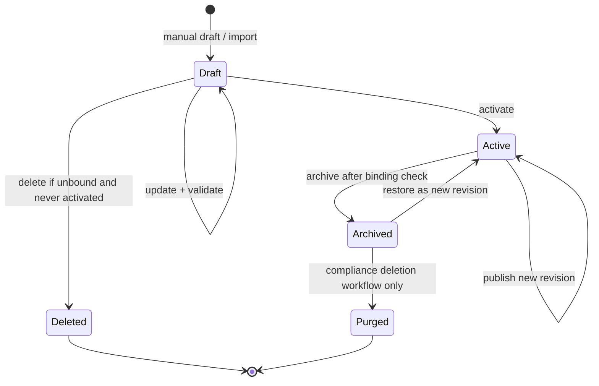

# Design Profile 产品与工程完整闭环规格

## 1. 文档结论

Design Profile 已经不是一个只有创建和读取能力的附属配置。当前 Runtime 已具备：

- 手动创建 Profile；
- 从不可变 DesignSourceArtifact 导入 Draft；
- Draft 更新、校验和激活；
- 单条、列表、版本历史、版本 Diff、Conversion Report 和 Fidelity Report 查询；
- Project 绑定和 Run 启动时的 Scope 解析；
- Run 级 Profile 版本/hash 快照；
- Build/Edit/Review 注入、冲突处理和发布前 Fidelity Gate；
- Active Profile 归档。

但当前能力停在“主流程可运行”，还没有达到“产品生命周期闭环”。关键缺口是：

1. Draft 无删除/废弃能力，会永久残留无效导入记录；
2. Project 绑定只能替换，不能显式解绑；
3. Archive 不检查或解除绑定，可能制造指向 Archived Profile 的悬空绑定；
4. Active/Archived Profile 没有明确恢复和再次发布语义；
5. Create、Read、Update、Archive、Bind 当前没有服务端 Principal/Scope 授权；
6. Mutation 缺少统一的 Idempotency Key、Expected Version 和 Audit Reason；
7. JSONL append-only Store 无法提供跨 Profile、Binding、Audit 的生产级事务一致性与数据删除保证；
8. 产品 UI、操作反馈、数据保留和项目删除级联策略尚未定义。

本规格的核心决策是：

```text
Design Profile 不追求对所有历史版本做物理 CRUD，
而是提供完整、可解释、可审计、可退出的资源生命周期。

Draft         = 可编辑、可删除的工作记录
Active        = 可绑定、可执行、不可硬删除的已发布契约
Archived      = 不可新绑定、不可新执行、保留历史审计的退出状态
Run Snapshot  = 正常生命周期内指向执行时 immutable revision；合规删除后仅保留安全 Tombstone/hash
```

因此闭环目标不是简单增加一个 `DELETE` 路由，而是打通：

```text
Source -> Draft -> Review -> Activate -> Bind -> Run -> Fidelity/Review
       -> Revise -> Re-activate/Rebind -> Archive -> Retain/Purge
```

## 2. 产品定位与边界

### 2.1 产品定位

沿用既有产品定义：

```text
DesignProfile = 可保存、可复用、可验证的产品设计上下文契约
```

它决定产品“如何表达”，包括品牌、视觉、Token、组件、内容、可访问性、技术边界和治理规则；Brief 仍然决定“生成什么”。

Design Profile 的产品价值不只在于保存 JSON，而在于保证以下链路可解释：

- 设计来源是什么；
- 转换过程中损失了什么；
- 哪一版 Profile 被激活；
- 哪个项目在什么时间绑定了哪一版；
- 每个 Run 实际使用了哪一版及其 hash；
- 生成结果是否满足 required rules；
- 谁修改、激活、绑定、覆盖、归档或删除了资源；
- 资源停止使用后如何退出和清理。

### 2.2 本期目标

- 补齐 Draft、Active、Archived、Binding 和 Source Artifact 的生命周期。
- 让所有 Mutation 具备授权、并发控制、幂等和审计。
- 保证 Archive、Unbind、Run Snapshot 和历史版本之间没有悬空状态。
- 提供产品 UI 所需的完整查询、动作和错误反馈。
- 定义项目删除、组织保留策略和合规删除边界。
- 保持现有 Design Profile V2、Capsule、Style Contract 和 Fidelity Gate 兼容。

### 2.3 非目标

- 不建设完整 Design System/Figma 管理平台。
- 不在本期实现 Profile 分支、合并和多人实时协作编辑。
- 不允许用户通过普通 API 删除已被 Run 使用的历史 revision。
- 不把 Run、Project 或 Design Profile 改造成 Kubernetes CRD。
- 不使用 Archive 冒充合规删除；两者是不同能力。

## 3. 当前能力与闭环差距

| 领域 | 当前能力 | 闭环判断 | 必须补齐 |
|---|---|---|---|
| Create | 手动创建；Source 导入 Draft | 已具备 | 创建幂等、Scope 授权、配额 |
| Read | Get/List/Versions/Diff/Reports | 基本具备 | 分页、稳定排序、权限过滤、引用信息 |
| Update | PUT 追加新 revision；V2/Draft 乐观锁 | 基本具备 | Mutation 统一 opaque ETag；禁止任意状态改写 |
| Delete | 无 DELETE；仅 Active archive | 未闭环 | Draft Delete、合规级联删除策略 |
| Activate | Draft -> Active revision | 已具备 | 权限、幂等、审计、唯一 Active 事务保证 |
| Archive | Active -> Archived revision | 部分具备 | 绑定检查、幂等、opaque ETag、审计 |
| Restore | 可被 PUT 间接改回 active | 语义不安全 | 独立 Restore/Re-activate 动作 |
| Binding | Project GET/POST 绑定或替换 | 部分具备 | Unbind、绑定版本、归档一致性、审计 |
| Run | 解析 Profile 并固化 id/version/hash | 已具备 | 授权上下文与绑定事件关联 |
| Source | Immutable artifact + integrity | 已具备 | 引用计数、保留/删除策略 |
| Security | Source/Import/Activate 部分 internal auth | 未闭环 | 全资源 Principal + Scope RBAC/ABAC |
| Persistence | 内存索引 + append-only JSONL | 可验证原型 | 事务 Store、Outbox、分页索引、删除能力 |
| Product UI | 尚无完整管理闭环证据 | 未闭环 | 列表、详情、编辑、激活、绑定、归档、删除 UX |

## 4. 目标领域模型

### 4.1 聚合边界

```text
DesignProfileAggregate
  profileId
  currentRevision
  lifecycleStatus
  scope
  revisions[]
  sourceRefs[]
  validation/conversion/fidelity reports[]

ProjectDesignProfileBinding
  projectId
  profileId
  revisionPolicy: pinned | latest_active
  acceptedProfileVersion
  bindingVersion
  boundAt / boundBy

ScopeDesignProfileDefault
  scopeType: workspace | organization
  scopeId
  profileId
  revisionPolicy: pinned | latest_active
  acceptedProfileVersion
  bindingVersion

RunDesignProfileSnapshot
  runId
  profileId
  version
  schemaVersion
  profileHash
  effectiveProfileHash
  sourceHash
  capsuleHash
```

边界规则：

- Profile revision 是 immutable snapshot；更新永远创建下一 revision。
- `currentRevision` 只是聚合当前指针，不改变旧 revision。
- Project Binding 和 Workspace/Organization Default 默认使用 `pinned` 并记录 `acceptedProfileVersion`；只有显式选择 `latest_active` 才在 StartRun 时跟随最新 Active revision。
- 已启动 Run 在正常生命周期内永不跟随 Profile 后续更新、归档或恢复；合规删除可以清除其 Profile plaintext，但不把它改指向其他 revision。
- Source Artifact 是独立不可变资源，Profile 只保存引用和 hash。
- Conversion/Fidelity Report 必须绑定明确的 profileId、version、surface、template 和 effective hash。

字段可变性必须在服务端强制执行：

| 字段 | 可变性 | 规则 |
|---|---|---|
| `profileId`、`createdAt` | immutable | 永不允许客户端修改 |
| owning `scope` | immutable | 跨 Scope 必须 Clone/Promote，创建新 Profile ID |
| `source.kind`、`sourceArtifactId`、origin hash | immutable | 重新导入产生新 Profile 或受控的新 source revision，不允许普通 PUT 换来源 |
| `schemaVersion` | migration-only | 只能由显式迁移器升级，普通 PUT 不接受 |
| `status` | lifecycle-only | 只能由 Activate/Archive/Restore/Delete 改变 |
| 设计规则 payload | revision mutable | PUT 校验后追加 revision，不覆盖历史 |
| `updatedAt`、hash | server-owned | 由 Runtime 计算 |

Profile 从 Project Scope 提升到 Workspace/Organization Scope 时必须执行显式 `Clone to Scope`：重新授权、重新校验 Source 可见性、创建新 ID，并写入来源 Profile ID。禁止用 PUT 改 Scope，以免破坏 Binding、权限和历史审计。

### 4.2 状态机



状态约束：

- Draft 不能绑定 Project，不能进入 Run Context。
- Active 才能绑定和被新 Run 使用。
- Archived 不能被新绑定或显式用于新 Run。
- Restore 必须创建新 Active revision，不得重写 Archived revision。
- Deleted 仅适用于从未激活、未绑定、未被引用的 Draft。
- Purged 不是普通用户动作，只能由项目/组织数据生命周期工作流执行。

### 4.3 Active 唯一性

原规格中的“同一 project 同一时间最多一个 active profile”应精确定义为：

- 一个 Project 最多有一条当前 Binding；
- Project Scope 可以存在多个 Active Profile，但只有一个可以被显式绑定；
- Workspace/Organization 可以存在多个 Active Profile，但 fallback 不再通过“唯一 Active Profile”隐式推断，而是通过显式 `ScopeDesignProfileDefault` 解析；
- 一个 Workspace/Organization 最多有一条 Default Binding；没有 Default 时继续向上解析或得到 no profile；
- Archive 当前存在 Project Binding 或 Workspace/Organization Default Binding 时必须返回 `409 profile_has_active_bindings`，不得隐式解除任何绑定；
- Scope Default 的 Replace/Delete 必须计算隐式 fallback 影响；若会改变任何 Project 的解析结果，返回影响摘要并要求高权限确认；
- UI 应提供“替换绑定后归档”和“先解绑再归档”两条显式操作，不提供隐式 force。

## 5. 完整用户旅程

### 5.1 手动创建

1. 用户选择 Scope 和 Surface。
2. 填写最小必填字段或从 Preset 创建 Draft。
3. 系统保存 Draft 并返回 validation issues。
4. 用户预览 Effective Profile、Token 支持和 Fidelity Capability。
5. 用户激活；系统生成新的 Active revision。
6. 用户选择立即绑定 Project 或暂不绑定。

### 5.2 从设计来源导入

1. 受信任 BFF 创建 immutable DesignSourceArtifact。
2. Runtime 校验 size、media type、server-side sha256 和 Scope。
3. Import 创建 Draft + Conversion Report，不同步调用模型。
4. UI 展示 mapped、unmapped、blocking issues 和原始来源完整性。
5. 用户修订 Draft，所有修改产生新 revision。
6. Activate 执行 strict schema、source、signature rules、template 和 token 校验。
7. 激活成功后才允许绑定 Project。

### 5.3 绑定和执行

1. 用户在 Project 中选择一个可见 Active Profile。
2. Bind API 在同一事务中替换旧 Binding 并写 Audit/Event。
3. StartRun 按 explicit profile/version -> project binding -> workspace default binding -> organization default binding -> no profile 解析。
4. Runtime 固化 profileId/version/hash/effectiveHash/sourceHash/capsuleHash。
5. Sandbox mutation 前执行 Conflict 和 Required Input Gate。
6. Build/Edit/Review 使用同一 Run Snapshot。
7. Publish 前执行 Fidelity Gate，结果写入报告和可审计事件。

### 5.4 更新和发布新版本

1. 用户更新已有 Draft，或者在 UI 中编辑当前 Active revision 的本地工作副本。
2. 保存要求 `If-Match` ETag，冲突返回最新 revision 和新 ETag；旧客户端兼容期仍可发送 `expectedVersion`。
3. Draft 必须通过 Activate 才产生 Active revision；Active Profile 的 PUT 在完整校验后直接追加下一 Active revision，不改变生命周期状态。
4. 已有 `pinned` Binding 继续使用 `acceptedProfileVersion`；UI 展示“有新版本可升级”，由有权限用户确认升级。
5. `latest_active` 只允许显式启用；新 Active revision 会影响所有跟随项目，发布前必须展示 affected-project count，写 rollout audit，并保留回退到上一版本的能力。
6. 已启动 Run 继续使用旧 snapshot，不发生热切换。

### 5.5 解绑、归档和删除

1. Project 可以显式 Unbind；之后按 Workspace/Organization Default Binding fallback 或无 Profile 运行，不再根据 Active Profile 数量猜测默认值。
2. Archive 前查询 Project Binding、Scope Default Binding 和历史 Run 引用；存在任何当前 Binding 时返回 409，要求先显式 Replace/Delete Binding。
3. Archive 成功后默认不出现在普通列表，但可通过 Archived 筛选查看。
4. Archived Profile 可 Restore；Restore 重新执行当前 Runtime 校验并创建新 revision。
5. Draft 只有在未激活、未绑定、未被其他资源引用时才能 Delete。
6. Profile 历史、Run Snapshot、Audit Log 不通过普通 Delete 删除。

## 6. API 闭环设计

### 6.1 资源查询

| Method | Path | 用途 |
|---|---|---|
| GET | `/design-profiles` | 按 Scope/status/sourceKind 分页查询 |
| GET | `/design-profiles/{id}` | 当前记录详情 |
| GET | `/design-profiles/{id}/versions` | revision 历史 |
| GET | `/design-profiles/{id}/diff` | revision Diff |
| GET | `/design-profiles/{id}/references` | Binding、Run、Source 引用摘要 |
| GET | `/design-profiles/{id}/conversion-report` | 当前转换报告 |
| GET | `/design-profiles/{id}/versions/{version}/conversion-report` | 历史转换报告 |
| GET | `/design-profiles/{id}/versions/{version}/fidelity-report` | 指定 surface/template 的能力报告 |
| GET | `/projects/{projectId}/design-profile` | 当前 Project Binding 和解析来源 |
| GET | `/workspaces/{workspaceId}/design-profile-default` | Workspace Default Binding |
| GET | `/organizations/{organizationId}/design-profile-default` | Organization Default Binding |

列表新增查询参数：

```text
scopeType=project|workspace|organization
scopeId=...
status=draft|active|archived
sourceKind=manual|imported|generated|brief
cursor=...
limit=1..100
sort=updatedAt:desc|name:asc
```

返回必须包含 `nextCursor`，禁止继续使用无上限全量 List 作为管理 UI 的长期合同。

`GET /design-profiles/{id}/references` 必须按调用者权限过滤并至少返回：

```ts
type DesignProfileReferences = {
  explicitBindings: Array<{ projectId: string; bindingVersion: number }>;
  scopeDefaultBindings: Array<{
    scopeType: "workspace" | "organization";
    scopeId: string;
    bindingVersion: number;
  }>;
  implicitAffectedProjects: Array<{
    projectId: string;
    currentResolutionSource: "workspace" | "organization";
    resolutionAfterArchive: "workspace" | "organization" | "none" | "ambiguous";
  }>;
  historicalRunReferenceCount: number;
  sourceArtifactRefs: Array<{ artifactId: string; profileVersion: number }>;
};
```

无权查看 Project 明细的调用者只能获得经过授权过滤或区间化的影响摘要，不得通过 References 枚举其他 Scope。

### 6.2 Mutation

| Method | Path | 语义 |
|---|---|---|
| POST | `/design-profiles` | 创建 manual Draft；外部调用不得直接创建 Active |
| PUT | `/design-profiles/{id}` | 更新 Draft/创建下一 revision，不允许直接状态迁移 |
| POST | `/design-profiles/{id}/activate` | Draft -> Active revision |
| POST | `/design-profiles/{id}/archive` | Active -> Archived revision |
| POST | `/design-profiles/{id}/restore` | Archived -> 新 Active revision |
| POST | `/design-profiles/{id}/clone` | Clone 到新 owning Scope，返回新 Draft/Profile ID |
| DELETE | `/design-profiles/{id}` | 仅删除满足条件的 Draft |
| POST | `/projects/{projectId}/design-profile` | Bind 或 Replace Binding |
| DELETE | `/projects/{projectId}/design-profile` | Unbind |
| POST | `/workspaces/{workspaceId}/design-profile-default` | 设置/替换 Workspace Default |
| DELETE | `/workspaces/{workspaceId}/design-profile-default` | 删除 Workspace Default |
| POST | `/organizations/{organizationId}/design-profile-default` | 设置/替换 Organization Default |
| DELETE | `/organizations/{organizationId}/design-profile-default` | 删除 Organization Default |

所有 Mutation 必须携带 `Idempotency-Key` 和结构化审计输入；针对已存在资源的 Mutation 还必须携带 opaque ETag：

```http
Idempotency-Key: <uuid>
Content-Type: application/json
```

并发前置条件按操作区分：

| 操作 | 并发条件 |
|---|---|
| 创建新 Profile | 不使用 `If-Match`；由 Idempotency Key 防重 |
| Update/Activate/Archive/Restore/Delete Draft | `If-Match: "<profile-etag>"` 必填 |
| 首次创建 Binding/Scope Default | `If-None-Match: *` |
| Replace/Upgrade/Unbind Binding | `If-Match: "<binding-etag>"` 必填 |
| Clone to Scope | `If-Match` 校验来源 Profile；新资源由 Idempotency Key 防重 |

Mutation body 必须携带结构化审计原因：

```ts
type MutationAuditInput = {
  auditReasonCode:
    | "user_requested"
    | "replace_profile"
    | "invalid_import"
    | "scope_migration"
    | "retention_policy"
    | "security_response";
  auditComment?: string; // <= 500 chars, treated as confidential, never used as metric label
};
```

不使用自由文本 Header 传递审计原因，避免内容进入代理 access log。兼容期可以继续接收 body 中的 `expectedVersion`，但它只表示旧 API 的 Profile revision。服务端返回对应 revision 的 ETag；`If-Match` 和 `expectedVersion` 同时存在且指向不同状态时返回 400。

版本口径固定为：

```text
profileVersion   = 用户可见的业务 revision
schemaVersion    = Profile 数据合同版本
aggregateEtag    = opaque 并发控制 token，不承诺为数字
bindingVersion   = Project Binding 独立的递增版本
```

Mutation 响应返回：

```ts
type DesignProfileMutationResponse = {
  designProfile: DesignProfileRecord;
  profileVersion: number;
  aggregateEtag: string;
  auditEventId: string;
  idempotencyKey: string;
};
```

为兼容现有 Runtime，直接创建 Active Profile 只能暂时保留在 trusted internal/migration surface，并且必须复用与 Activate 完全相同的 strict validation、授权和审计链。产品 UI 和新的 public BFF 一律使用 Draft -> Activate。

Binding/Default Mutation 统一使用：

```ts
type SetDesignProfileBindingRequest = MutationAuditInput & {
  designProfileId: string;
  acceptedProfileVersion: number;
  revisionPolicy?: "pinned" | "latest_active"; // default: pinned
};
```

`StartRunInputContext` 增加可选 `designProfileVersion`。显式传入 id+version 时使用该 Active revision；只传 id 时在事务中解析当时最新 Active revision并立即写入 Run Snapshot。Project/Scope Binding 则严格按各自 revision policy 解析。

Clone to Scope 请求必须携带目标 Scope，并始终创建新的 Draft 和 Profile ID：

```ts
type CloneDesignProfileRequest = MutationAuditInput & {
  targetScope:
    | { projectId: string }
    | { workspaceId: string }
    | { organizationId: string };
  name?: string;
};
```

Runtime 重新执行 Principal 授权和 Source Scope 校验；Source Artifact 无法在目标 Scope 合法复用时返回 blocking issue，不得复制一个失效引用。

### 6.3 Archive

```http
POST /design-profiles/{id}/archive
If-Match: "profile-etag-7"
Idempotency-Key: 8cf...
Content-Type: application/json

{
  "auditReasonCode": "replace_profile",
  "auditComment": "Replaced by corporate profile v2"
}
```

规则：

- Draft 调用返回 `409 invalid_profile_transition`；Draft 应使用 DELETE。
- 已 Archived 重复调用在相同 Idempotency Key 下返回原结果。
- 存在 Project Binding 或 Scope Default Binding 时返回 `409 profile_has_active_bindings`，并返回调用者有权查看的引用摘要；Archive 不自动解除绑定。
- Archive 创建下一 revision，并记录 actor、reason 和 requestId。
- Archive 不删除 Source、Reports、Run Snapshots 或旧 revisions。

### 6.4 Draft Delete

```http
DELETE /design-profiles/{id}
If-Match: "profile-etag-3"
Idempotency-Key: 9ac...
Content-Type: application/json

{
  "auditReasonCode": "invalid_import",
  "auditComment": "Invalid imported source"
}
```

允许条件：

- 当前状态为 Draft；
- 从未产生 Active revision；
- 没有 Project Binding；
- 没有 Run Snapshot；
- 没有被其他 Profile clone/derive 引用；
- Principal 具备当前 Scope 的 delete 权限。

删除策略：

- 写入最小 Tombstone：profileId、scope、deletedAt、deletedBy、reason、lastVersion；
- 删除 Draft candidate 和 conversion plaintext；
- Source Artifact 按引用计数和 retention policy 独立处理；
- Audit Log 保留，但不得包含已删除 Customer Content。

成功响应使用 `200` 返回 Tombstone 和 `auditEventId`，不使用无响应体的 `204`，便于 BFF/UI 确认异步 Source 清理状态：

```ts
type DeleteDesignProfileDraftResponse = {
  tombstone: {
    profileId: string;
    deletedAt: string;
    lastProfileVersion: number;
  };
  sourceCleanupStatus: "not_applicable" | "scheduled" | "retained_by_reference";
  auditEventId: string;
};
```

### 6.5 Unbind

```http
DELETE /projects/{projectId}/design-profile
If-Match: "<binding-etag>"
Idempotency-Key: 711...
Content-Type: application/json

{
  "auditReasonCode": "user_requested",
  "auditComment": "Project will inherit workspace default"
}
```

响应必须返回解绑后的解析结果：

```ts
type ProjectDesignProfileResolution = {
  projectId: string;
  binding: null;
  effectiveDesignProfile: DesignProfileSummary | null;
  resolutionSource: "workspace_default" | "organization_default" | "none";
};
```

这样 UI 可以明确告诉用户：解绑不是一定变成“无 Profile”，可能会继承上层默认值。

Unbind 必须在提交前计算事务后的 fallback。新模型只读取显式 Scope Default，不会因为多个 Active Profile 产生歧义；迁移兼容期如果旧数据尚未建立唯一 Default，则返回 `409 ambiguous_profile_fallback`，不得把 Project 留在下一次 StartRun 必然失败的状态。

Scope Default 的 Replace/Delete 必须先计算所有依赖该 Default 的 Project 在变更后的解析结果。首次请求如存在受影响 Project，返回 `409 profile_has_implicit_consumers` 和授权范围内的 impact summary；只有 Workspace/Organization Admin 在重新读取影响摘要后提交 `confirmImpactToken`，服务端确认 token 对应的 Binding Version 和影响集合未变化，才能执行。该动作仍不得修改任何已启动 Run Snapshot。

### 6.6 错误合同

保持现有 `{ error }` 向后兼容，并新增机器可判定字段：

```ts
type ErrorResponse = {
  error: string;
  code?:
    | "profile_not_found"
    | "profile_version_conflict"
    | "invalid_profile_transition"
    | "profile_has_active_bindings"
    | "profile_has_implicit_consumers"
    | "profile_has_historical_references"
    | "ambiguous_profile_fallback"
    | "profile_scope_forbidden"
    | "profile_validation_failed"
    | "profile_source_integrity_failed"
    | "idempotency_conflict";
  currentVersion?: number;
  validationIssues?: DesignProfileValidationIssue[];
  bindingRefs?: Array<{ projectId: string }>;
  requestId?: string;
};
```

## 7. 权限与 Scope 闭环

### 7.1 权限动作

```text
design_profile.view
design_profile.create
design_profile.edit
design_profile.activate
design_profile.bind
design_profile.archive
design_profile.restore
design_profile.delete_draft
design_profile.manage_source
design_profile.view_audit
```

推荐角色：

| 角色 | View | Edit Draft | Activate/Bind | Archive/Restore | Delete Draft | Source/Audit |
|---|---:|---:|---:|---:|---:|---:|
| Viewer | ✓ |  |  |  |  |  |
| Designer/Editor | ✓ | ✓ |  |  | 自己创建且未共享 | 受限 |
| Project Admin | ✓ | ✓ | ✓ | Project Scope | ✓ | Project Scope |
| Workspace Admin | ✓ | ✓ | ✓ | Workspace Scope | ✓ | Workspace Scope |
| Organization Admin | ✓ | ✓ | ✓ | Organization Scope | ✓ | Organization Scope |

### 7.2 服务端规则

- Runtime/BFF 从已认证 Principal 推导 Organization/Workspace/Project Scope，不信任 body 中的 owner 信息。
- Get/List 先做 Scope filter，再返回数据；不能先查询全量再由 UI 隐藏。
- Project Profile 只能引用当前 Project 可见的 Profile。
- Workspace/Organization Profile 向下可见必须依赖可验证的 Scope lineage。
- Source content、Conversion Report 和 Audit 采用比普通 Profile metadata 更高的权限。
- Profile ID、Artifact ID 和 Project ID 都不能作为授权凭证。
- 对调用者不可见或跨 Scope 的资源统一返回 404，避免资源枚举；资源已确认可见但调用者缺少具体动作权限时返回 403。两类拒绝都写安全 Audit，响应不得泄漏其他 Scope metadata。

原始 Design Profile MVP 把多租户权限列为非目标；后续 Runtime 产品 NFR 已明确要求所有资源携带 Organization、Project 和 Principal Scope。本文面向生产闭环，采用后者作为 GA 门槛；本地 E2E 可以使用显式测试 Principal，但不能把 `authorization: none` 带入生产配置。

## 8. 数据一致性与持久化

### 8.1 事务要求

以下操作必须是单事务或 Transactional Outbox：

- Activate revision + current pointer + audit event；
- Bind/Replace binding + audit event；
- Unbind + resolution event；
- Archive revision + binding precondition + audit event；
- Draft Delete + tombstone + source reference decrement；
- Restore revision + unique-active check + audit event。

### 8.2 Store 演进

当前 JSONL append-only Store 可以继续用于 local-e2e 和 fixture，但生产闭环要求引入 `DesignProfileRepository` 抽象及事务实现。

建议最小表/集合：

```text
design_profiles
design_profile_revisions
design_profile_bindings
design_source_artifacts
design_profile_reports
design_profile_idempotency_keys
design_profile_audit_events
outbox_events
```

必须具备：

- `(profile_id, version)` 唯一约束；
- 一个 Project 只有一条 current binding；
- cursor pagination 索引；
- Scope + status + updatedAt 索引；
- optimistic aggregate version；
- crash-safe idempotency record；
- tombstone 和 retention job；
- Audit/Event 与状态写入的一致性。

### 8.3 Source Artifact 删除

- 普通 Archive 不删除 Source Artifact。
- Draft Delete 仅在 source 引用计数归零且 retention policy 允许时安排异步删除。
- 已被 Active revision 或 Run Snapshot 引用的 Source 不允许普通删除。
- 项目/组织合规删除由独立 Data Lifecycle Job 执行：删除 source bytes 和 customer plaintext，可保留不含内容的最小审计元数据。
- 删除任务必须可重试、可审计，并输出 deleted/skipped/blocked 引用清单。

### 8.4 数据复制面与合规删除

“Run Snapshot 永久不随普通更新变化”只适用于正常产品生命周期，不高于 Project/Organization 合规删除。合规删除发生后，可以保留不含客户内容的最小 Tombstone 和 hash，但不得为了 replay 保留已要求删除的 Profile plaintext。

| 数据复制面 | 正常 Archive | Draft Delete | Project/Organization 合规删除 |
|---|---|---|---|
| Profile current/revisions | 保留 | 删除 Draft candidate，保留最小 Tombstone | 删除 payload；保留 profileId/version/hash/删除审计 |
| DesignSourceArtifact bytes | 保留 | 引用归零后按 retention 异步删除 | 删除 bytes、storage object 和缓存副本 |
| Conversion/Fidelity Report | 保留 | 删除 source-derived plaintext | 删除 plaintext/evidence；保留安全结果码和 hash |
| Run snapshot metadata | 保留 immutable 引用 | 不适用 | 保留 ID/version/hash；移除嵌入 payload 和敏感摘要 |
| `inputs/design-profile.json` / `design.md` | 历史 Workspace 按项目策略保留 | 不适用 | 从 Workspace、Checkpoint、Sandbox snapshot 中删除 |
| `state/context.md` / Conversation | 保留 | 不适用 | 重写或删除 Profile plaintext，只保留安全占位事件 |
| Preview/Artifact/E2E evidence | 按项目策略保留 | 不适用 | 删除包含客户设计内容的截图、页面和 evidence bundle |
| Event/Trace/Metric | 保留去敏事件 | 保留安全 Audit | 删除高敏 metadata；低基数安全事件按审计策略保留 |
| JSONL 回滚副本 | 只读迁移窗口内保留 | 同步 Tombstone | 到期销毁，不得成为删除绕过副本 |
| 数据库备份 | 按备份策略保留 | 记录 deletion ledger | 通过 deletion ledger 防止恢复后复活，并在最大期限内轮换销毁 |

每类数据必须在实现前登记：Owner、分类、主存储、缓存位置、默认保留期、最大删除 SLA、删除方式和恢复后的再删除机制。Data Lifecycle Job 必须以 deletion ledger 驱动，覆盖 Runtime DB、Object Storage、Workspace/Checkpoint、Artifact、Evidence 和 Backup，不得只删除 DesignSourceArtifact 主文件。

## 9. Audit、Event 与可观测性

### 9.1 权威 Audit Event

```text
design_profile.created
design_profile.imported
design_profile.updated
design_profile.activated
design_profile.activation_failed
design_profile.bound
design_profile.binding_replaced
design_profile.unbound
design_profile.scope_default_set
design_profile.scope_default_removed
design_profile.binding_version_upgraded
design_profile.archived
design_profile.restored
design_profile.draft_deleted
design_profile.source_deleted
design_profile.conflict_overridden
design_profile.fidelity_checked
```

每条事件至少包含：

```text
eventId, schemaVersion, timestamp
organizationId, workspaceId?, projectId?
profileId, profileVersion?, bindingVersion?
actorPrincipalId, actorType
action, result, safeReason
requestId, idempotencyKey
beforeHash?, afterHash?
```

禁止写入 source plaintext、完整 Profile JSON、token、Authorization Header 或高敏客户内容。

### 9.2 指标

- Draft 到 Activate 的转化率和 P50/P95 时间；
- activation validation failure count，按安全的 issue code 聚合；
- Active Profile 被绑定的 Project 数；
- version conflict 和 idempotency conflict rate；
- unresolved archived-binding count，目标必须恒为 0；
- Profile resolution failure rate；
- Fidelity required pass rate 和 repair count；
- orphan Draft、orphan Source 和 retention backlog。

## 10. 产品 UI 闭环

### 10.1 信息架构

```text
Design Profiles
  Active
  Drafts
  Archived

Profile Detail
  Overview
  Design rules
  Source & conversion
  Versions & diff
  Fidelity
  Project references
  Audit

Workspace / Organization Settings
  Design Profile Default
  Revision policy
  Affected projects
```

### 10.2 关键操作

- Create：Manual / Import Source / From Preset。
- Draft Edit：分区表单、validation issue 定位、离开保护。
- Activate：展示阻塞项、Scope、模板兼容和影响范围。
- Bind/Replace：默认 pin 当前 Active version；显式选择 auto-follow 时展示影响和回滚说明。
- Set Scope Default：Workspace/Organization Admin 显式设置默认 Profile 和接受版本，不通过 Active Profile 数量推断。
- Clone to Scope：显示目标 Scope、来源授权和 Source 可复用性，创建新 Draft 而不是移动原 Profile。
- Upgrade Binding：展示 Profile Diff 和 Fidelity Report，确认后更新 `acceptedProfileVersion`。
- Unbind：明确解绑后将继承哪个 Workspace/Organization Profile。
- Archive：存在 Project/Scope Default Binding 时禁止并引导先处理引用；Scope Default Replace/Delete 单独展示隐式影响并要求高权限确认。
- Restore：展示重新校验结果，确认后创建新 Active revision。
- Delete Draft：二次确认，展示将删除的 candidate/report/source 影响。

### 10.3 状态反馈

- Draft：`未激活，不能用于生成`。
- Active：`可被 Project 绑定；pinned 项目保持已接受版本，auto-follow 项目在新 Run 使用最新 revision`。
- Archived：`不再允许新绑定；历史 Run 保持可解释`。
- Version Conflict：提供 Reload、Compare、Copy My Changes，不静默覆盖。
- Fidelity Failure：展示 required rule、证据、修复建议和 capability gap。
- Permission Denied：说明缺少的动作权限，不暴露其他 Scope 数据。

## 11. 兼容与迁移

### 11.1 API 兼容

- 保留现有 POST/GET/PUT/Archive/Activate/Bind 路径。
- 新增 Restore、Draft DELETE、Unbind、References 和分页参数，属于 additive change。
- `POST /design-profiles` 从允许 public 直接 Active 收紧为 public 只创建 Draft，属于行为收紧而不是纯 additive change；必须通过新 contract version 或 BFF capability negotiation 发布，旧 trusted internal client 走受控兼容路径。
- `{ error }` 保留，新错误字段为 additive。
- `expectedVersion` 保留一个兼容周期并只表示 Profile revision，同时引入 opaque `If-Match` ETag。
- Route manifest、shared schemas、runtime client、mock BFF 和 freeze 文档必须同步更新。

### 11.2 数据迁移

1. 扫描当前 Profile、Draft 和 Project Binding JSONL。
2. 为每个聚合重建 ordered revisions 和 current pointer。
3. 标记所有 `binding -> archived profile` 为 migration blocker，不允许静默导入为正常绑定。
4. 为历史 Project Binding 创建 bindingVersion、`revisionPolicy=pinned`、`acceptedProfileVersion=迁移时当前 active version`、boundAt unknown 和 actor `legacy_migration`；禁止迁移时把历史项目静默变成 auto-follow。
5. 对每个 Workspace/Organization：恰好一个 Active 候选时生成 pinned Default Binding；多个候选时标记 migration blocker，必须由 Admin 显式选择；无候选时不创建 Default。
6. V1 缺失 schemaVersion 继续只在读取层归一化，不修改历史 bytes。
7. V1 source integrity 缺失继续使用 legacy-warning；V2 imported 保持 strict。
8. 写入数据库后做 id/version/hash/count 双向校验，再切读流量。
9. 保留 JSONL 只读回滚窗口，禁止双写无限期存在。

### 11.3 Feature Flags

```text
ENABLE_DESIGN_PROFILE_AUTHZ
ENABLE_DESIGN_PROFILE_TRANSACTIONAL_STORE
ENABLE_DESIGN_PROFILE_UNBIND
ENABLE_DESIGN_PROFILE_DRAFT_DELETE
ENABLE_DESIGN_PROFILE_RESTORE
```

每个 Flag 必须有 Owner、默认值、退出条件和删除日期；授权能力不可长期保持可关闭状态，生产 GA 前必须默认开启并移除绕过路径。

所有新增 Mutation 在 Transactional Store 和 Authz 对应 Flag 就绪前只能存在于 internal/dark launch surface，不得先以 `authorization: none` 暴露到生产 public router。

## 12. 实施计划

### Phase C0：合同冻结与回归基线

- 冻结本文状态机、错误码和权限动作。
- 增加现有 CRUD/Archive/Binding 的 characterization tests。
- 建立当前 JSONL 迁移 fixture。
- 修复主分支编译和既有测试阻塞。

退出条件：当前行为有可重复测试，新增闭环能力不会依赖猜测。

### Phase C1：事务与幂等基础

- 引入 `DesignProfileRepository` 抽象和事务数据库实现。
- 实现 opaque ETag、Binding Version、Idempotency Store 和 Transactional Outbox。
- 建立 Profile/Revision/Binding/Source/Report/Audit 的唯一约束与索引。
- 完成 JSONL -> DB 迁移 fixture、双向校验和回滚演练。
- 新能力保持 dark launch，不改变 public route 授权面。

退出条件：故障注入下不出现重复 revision、丢失 binding、状态无 event 或 event 无状态；迁移 hash/count 校验一致。

### Phase C2：权限闭环

- 引入 Principal + Scope 授权。
- 给所有 Profile/Binding/Report API 配置权限动作。
- Source、Report、Audit 采用更高权限。
- 增加跨 Project/Workspace/Organization 的负向测试。

退出条件：所有服务端 API 均不存在 `authorization: none` 的 Profile Mutation；越权矩阵 100% 通过。

### Phase C3：生命周期一致性

- Archive 增加 ETag、幂等以及 Project/Scope Default Binding precondition；Scope Default Replace/Delete 增加隐式 consumer impact gate。
- 新增 Project Unbind、References 和 Binding Upgrade。
- 新增 Workspace/Organization Default Binding，不再通过唯一 Active Profile 隐式推断 fallback。
- 新 Binding 默认 `pinned`；`latest_active` 必须显式选择并具备 rollout audit。
- 禁止普通 PUT 修改 status、scope、source origin 和 schemaVersion。
- 新增 Clone to Scope，始终创建新 Draft/Profile ID 并重新校验授权与 Source。
- 新增 Restore。
- 补齐结构化错误码与 Audit/Event。

退出条件：`unresolved archived-binding count = 0`；Archive/Bind/Unbind/StartRun 并发测试通过；跨 Scope 更新被拒绝。

### Phase C4：退出与数据生命周期

- 新增 Draft Delete + Tombstone。
- 实现 Source 引用计数和 retention job。
- 实现覆盖所有复制面的 Project/Organization 删除级联任务与 deletion ledger。
- 验证 Workspace/Checkpoint/Artifact/Evidence/Backup 删除传播。

退出条件：Draft 可安全删除；Active 历史不可被普通 API 破坏；删除任务可恢复、可审计，且备份恢复不会复活已删除客户内容。

### Phase C5：产品 UI

- 上线 Active/Draft/Archived 列表和详情 IA。
- 上线 Create/Import/Edit/Activate/Bind/Unbind/Archive/Restore/Delete Draft。
- 上线 Versions/Diff/Fidelity/References/Audit。
- 完成空状态、冲突、权限和删除反馈。

退出条件：设计师无需调用 Runtime API 即可完成完整生命周期，并能理解每个动作对新 Run 和历史 Run 的影响。

## 13. 测试与验收矩阵

### 13.1 生命周期

- manual Draft -> update -> activate -> bind -> run -> unbind -> archive；
- public create 不能直接产生 Active；trusted migration direct-active 必须复用 Activation 校验和审计；
- source artifact -> import -> blocking issue -> fix -> activate -> bind；
- Draft delete 成功，并按策略处理 conversion report/source；
- Active/Archived/已引用 Draft delete 返回正确 409；
- Archived restore 创建新 revision，不修改历史；
- PUT 不能绕过 Activate/Archive/Restore 状态机。
- PUT 不能修改 owning Scope、source origin 或 schemaVersion；Clone to Scope 创建新 Profile ID。
- Clone to Scope 重新执行权限和 Source Scope 校验，原 Profile/Binding/历史 Run 不受影响；

### 13.2 并发与幂等

- 两个携带相同旧 ETag 的并发更新只有一个成功；旧 `expectedVersion` 兼容用例保持相同行为；
- 相同 Idempotency Key 重放返回相同结果；
- 相同 Key 不同 payload 返回 `idempotency_conflict`；
- Archive 与 Bind 并发不能产生 archived binding；
- Unbind 与 StartRun 并发时，Run 只能获得事务前或事务后的完整解析结果。
- `pinned` Binding 在 Profile 发布新版本后保持 accepted version；`latest_active` 只影响显式 auto-follow 项目；
- Workspace/Organization Profile Archive 在仍是 Scope Default 时被拒绝；Scope Default Replace/Delete 返回隐式 fallback 影响，未确认时不得提交。

### 13.3 权限

- Project Editor 不能激活 Organization Profile；
- Project Admin 不能读取其他 Project 的 source/report/audit；
- Workspace Profile 只对有 lineage 的 Project 可见；
- List 不返回无权 Scope 的 count、cursor 或 metadata；
- ID 枚举不能区分不存在与不可见资源；
- Mutation Audit actor 与实际 Principal 一致。

### 13.4 运行一致性

- Profile 更新不改变已启动 Run snapshot；
- Archive 不影响历史 Run replay；
- 新 Run 不能显式使用 Archived Profile；
- Unbind 后正确解析 Workspace/Organization fallback；
- Workspace/Organization fallback 只使用显式 Default Binding；多个 Active Profile 不再制造隐式歧义；
- Required source/profile/capsule 未读取时 sandbox mutation 被阻止；
- Fidelity Report 与 revision/surface/template/effectiveHash 完全绑定。

### 13.5 数据生命周期

- Project 删除任务列出并处理所有 Profile、Source、Binding 和 Reports；
- 删除任务覆盖 Run/Workspace/Checkpoint/Conversation/Artifact/Evidence/Backup 等复制面；
- Audit 保留但不包含已删除 plaintext；
- retention job crash 后可以幂等恢复；
- orphan Source 最终被清理，仍被引用 Source 不会误删；
- 备份恢复后 Tombstone 和删除状态不会复活。

## 14. Definition of Done

只有同时满足以下条件，Design Profile 才能被称为“完整闭环”：

- [ ] Draft、Active、Archived 状态迁移只能通过显式领域动作完成。
- [ ] Public Create 只产生 Draft；所有 Active revision 都通过统一 Activation/Publish 校验链产生。
- [ ] Draft 可以安全 Delete；Active/历史 revision 不能被普通 API 硬删除。
- [ ] Project 可以 Bind、Replace 和 Unbind，并能解释解绑后的 fallback。
- [ ] Workspace/Organization Default 是显式、可版本化、可审计的 Binding，不依赖“唯一 Active Profile”推断。
- [ ] 新 Binding 默认 pinned 并记录 acceptedProfileVersion；auto-follow 需要显式启用、影响预览和回滚能力。
- [ ] Archive 不会产生指向 Archived Profile 的 Binding。
- [ ] Workspace/Organization Profile 在仍被 Scope Default 引用时不能 Archive；Scope Default Replace/Delete 会计算并治理隐式 fallback consumer 影响。
- [ ] Archived Profile 可以经重新校验 Restore 为新 revision。
- [ ] owning Scope、source origin、schemaVersion 不能通过普通 PUT 修改；跨 Scope 使用 Clone to Scope 创建新 Draft/Profile ID。
- [ ] 所有 Mutation 支持授权、Idempotency Key 和结构化 Audit Reason；已有资源 Mutation 使用 opaque ETag，首次 Binding 使用 `If-None-Match: *`，旧 `expectedVersion` 只作为限期兼容输入。
- [ ] 所有 Read 在服务端执行 Scope filter。
- [ ] Source、Conversion Report 和 Audit 具有更高访问权限。
- [ ] Profile/Binding/Audit/Event 的关键变更具备事务一致性或 Outbox 保证。
- [ ] List 支持分页、稳定排序和状态筛选。
- [ ] Run 固化 id/version/profileHash/effectiveHash/sourceHash/capsuleHash。
- [ ] 已启动和历史 Run 不受 Profile 更新、解绑、归档和恢复影响。
- [ ] Draft 删除、Source retention、Project/Organization 删除级联都有明确策略和审计。
- [ ] 合规删除覆盖 DB、Source、Run、Workspace、Checkpoint、Artifact、Evidence 和 Backup，并通过 deletion ledger 防止恢复后复活。
- [ ] 产品 UI 覆盖 Create/Import/Edit/Activate/Bind/Unbind/Archive/Restore/Delete Draft。
- [ ] 生命周期、并发、权限、迁移、故障恢复和数据删除测试全部通过。
- [ ] Runtime API Freeze、route manifest、Rust contracts、shared schemas、runtime client 和 BFF contracts 一致。
- [ ] 生产路由中不存在未授权的 Design Profile Mutation。

## 15. 签署门槛与 Ownership

| 领域 | Owner | 签署门槛 |
|---|---|---|
| 产品生命周期 | Product + Design | 状态、动作、错误反馈和 UI 流程无歧义 |
| Runtime Contract | Runtime | Route/schema/client/freeze 一致，兼容策略明确 |
| Store/迁移 | Platform/Data | 事务、迁移、回滚、删除任务通过故障演练 |
| 权限与数据生命周期 | Security/Platform | Scope 矩阵、Threat Model、删除审计通过 |
| Fidelity | Runtime + Design | 既有 Website/Docs fidelity regression 不退化 |
| BFF/UI | Product Engineering | 全旅程 E2E 和权限负向用例通过 |

最终 Go/No-Go 判断：

```text
当前状态：Conditional Go

可以按 C0 -> C5 顺序继续闭环建设；事务与幂等基础、权限必须先于新增 public Mutation，
且在 Archive/Binding 一致性、Unbind、Draft Delete 和全复制面数据删除
完成前，不应宣称 Design Profile 已完成生产级 CRUD 或生命周期闭环。
```
