# 通用工程模板、作品 Authoring Sandbox 与独立 Published Runtime 方案

## 1. 结论

产品目标不是只为作品提供临时 Preview，而是让每个作品拥有独立运行环境，并由用户明确控制是否
发布。发布后，平台为该作品维护独立的 Kubernetes workload、Service 和 Ingress，对外提供稳定服务。

本方案采用两个明确分离的运行平面：

```text
Project / Work
├── Authoring Sandbox
│   ├── AI 构建、编辑、调试和 Candidate Preview
│   ├── 可写 Workspace
│   ├── 每作品独占 active SandboxBinding/PVC/Service
│   └── 可以释放和重建，不直接作为正式线上环境
│
└── Published Runtime
    ├── 用户 Publish 后创建
    ├── Deployment（第一期）/ StatefulSet（后续受控能力）
    ├── 每作品独立 ClusterIP Service
    ├── 每作品独立 Ingress 和稳定 host
    ├── 只运行不可变 WorkRelease
    └── 用户 Unpublish 后停止外部访问
```

核心决策：

1. 当前一个 `project_id` 对应一个用户作品，本方案 v1/v3 使用 `Work identity = project_id`。
2. 不把可写 Authoring Sandbox 直接暴露为正式发布环境。
3. Publish 的产物是不可变 `WorkRelease`，不是“当前 Sandbox Pod”。
4. 当前 Astro/Fumadocs 都按静态应用发布，第一期只实现 `Deployment + Service + per-work Ingress`。
5. StatefulSet、SSR、WebSocket 和运行时数据库属于后续 capability，不进入第一期实现。
6. 新模板通过 ArtifactManifest、RuntimeManifest 和受控 RuntimeProfile 接入，发布核心不识别具体框架。
7. Candidate Preview 暂时保留现有 Runtime path proxy；Candidate Gateway/独立 preview domain 不作为
   Published Runtime 第一期的前置条件。
8. 每作品 Ingress 只对应长期 Published Work，不为每次 build/candidate 创建 Ingress。

### 1.1 是否满足产品预期

| 产品预期 | 本方案处置 |
|---|---|
| 每个作品独立运行环境 | Authoring 和 Published 两个隔离环境，均以 project/work 为 scope |
| Kubernetes Deployment/StatefulSet | 第一期 Deployment；StatefulSet 作为显式后续 capability |
| 每作品 Service | Published Runtime 创建独立 ClusterIP Service |
| 每作品 Ingress | Publish 时创建/启用，Unpublish 时删除/禁用 |
| 用户控制发布 | Publish/Update/Unpublish/Rollback 状态机和 API |
| 新模板可接入 | Manifest + RuntimeProfile，不修改 HTTP/Controller 核心 |
| 发布后稳定访问 | 稳定 work host 指向独立 Published Runtime |
| Sandbox 可释放 | 不影响 Published Runtime 和已发布版本 |

这里的“每作品独立运行环境”是隔离和生命周期语义，不等于所有作品永久保留一组常驻 Pod：

- Unpublished 且未在编辑：默认没有活跃 Published workload，Authoring Sandbox 也可释放；
- Unpublished 但正在编辑：只有该作品独立 Authoring Sandbox，无正式 Ingress；
- Published：拥有该作品独立 Published Deployment/Service/Ingress；
- Published 且继续编辑：Authoring Sandbox 与 Published Runtime 可以同时存在，但完全隔离；
- Unpublish：先移除 Ingress，再删除/缩容 Published workload，保留 Release 和稳定 host identity。

这样既满足每作品运行隔离，又避免未发布、长期不活跃作品持续占用集群资源。

### 1.2 为什么不能直接发布 Authoring Sandbox

Authoring Sandbox 包含可写 Workspace、Agent 工具、构建依赖、Workspace Channel 和调试能力。直接把
它挂到正式 Ingress 会产生以下问题：

- Edit/Repair 直接改变线上文件；
- Sandbox release、WarmPool 回收或 Pod replacement 导致线上中断；
- 正式环境包含 npm、编译器、浏览器和不必要的写权限；
- 无法做不可变版本、滚动升级和确定性回滚；
- Workspace Channel `3001` 与 Preview `4321` 同处 Sandbox 网络边界；
- Sandbox 的生命周期优化目标是构建效率，不是长期生产可用性。

正确链路：

```text
Authoring Sandbox
  -> Build
  -> Candidate gates
  -> Immutable WorkRelease
  -> Published Runtime rollout
  -> Per-work Service/Ingress
```

## 2. 范围控制

### 2.1 第一期必须交付

第一期只覆盖当前两类静态模板：

```text
astro-website
fumadocs-docs
```

交付内容：

- 通用 `artifact-manifest@1`；
- 通用 `runtime-manifest@1`；
- 静态 Release OCI image 打包；
- 每作品 Deployment；
- 每作品 ClusterIP Service；
- 每作品 Ingress 和稳定随机 host；
- Publish、Update、Unpublish、Rollback；
- readiness、外部探测、重启 reconcile；
- Sandbox 与 Published Runtime 网络隔离；
- synthetic third static template 扩展门禁。

### 2.2 第一期非目标

以下能力明确不进入第一期：

- StatefulSet 实现；
- SSR/动态 Node server；
- WebSocket 应用；
- 用户自带数据库；
- 每作品独立 Namespace；
- custom domain；
- 多 region；
- CDN；
- private published work 的交互式登录；
- 按请求自动 scale-to-zero；
- Candidate Preview 独立 wildcard domain；
- 用 Published Runtime 替换现有 Authoring Sandbox。

StatefulSet 虽然是目标能力，但只有模板声明稳定 identity/PVC 是运行必需，并通过独立安全与恢复评审
后才实现。当前 Astro/Fumadocs 不需要 StatefulSet。

### 2.3 为什么这样拆阶段

如果同时实现通用模板、Preview Gateway、Published Controller、OCI 打包、StatefulSet、动态应用和
custom domain，交付面会跨越 Runtime、Registry、Kubernetes、网络、安全、存储和产品状态机，无法
形成可评审的增量。

本方案将最短闭环固定为：

```text
Static Artifact
  -> Immutable Release Image
  -> Deployment
  -> Service
  -> Ingress
  -> Publish/Unpublish
```

先证明每作品独立发布，再扩展运行时类型。

## 3. 强制架构规则

| Rule ID | 级别 | 约束 |
|---|---|---|
| `WORK-001` | MUST | 当前 Work scope 等于 project；不同 project 不得共享 active Authoring 或 Published workload。 |
| `ENV-001` | MUST | Authoring Sandbox 与 Published Runtime 是不同 workload、ServiceAccount、NetworkPolicy 和生命周期。 |
| `REL-001` | MUST | Published Runtime 只能运行不可变 WorkRelease，不得直接挂载 Authoring Workspace。 |
| `REL-002` | MUST | Release 必须绑定 ArtifactManifest、RuntimeManifest、image digest、source snapshot 和创建 run。 |
| `PUB-001` | MUST | 用户 Publish/Unpublish 写 desired state；Kubernetes reconcile 由 Controller 异步完成。 |
| `PUB-002` | MUST | Initial Publish 在新 release Ready 前不得开放 Ingress；Update 必须保持旧 release 服务直到切换提交成功。 |
| `PUB-003` | MUST | Unpublish 先关闭外部 Ingress，再停止 workload；不得删除 Release 历史。 |
| `OP-001` | MUST | Publish/Update/Rollback/Unpublish 必须创建持久化 PublishOperation，并使用幂等键。 |
| `TXN-001` | MUST | Operation、desired state、desired generation 和 reconcile outbox 必须原子提交或使用可恢复 transaction。 |
| `ROLLOUT-001` | MUST | 第一期 Update/Rollback 使用 release-specific blue/green Deployment 和 Service selector 原子切换。 |
| `K8S-001` | MUST | 每个 Published Work 拥有独立 workload、Service、Ingress 和稳定 host。 |
| `K8S-002` | MUST | 第一期静态模板统一使用 Deployment；模板不能直接选择任意 Kubernetes kind。 |
| `K8S-003` | MUST | Published Pod 不包含 Workspace Channel、Agent 工具、构建器或 Sandbox 凭据。 |
| `TPL-001` | MUST | 模板通过 Manifest/RuntimeProfile 接入，发布核心不得按 Astro/Fumadocs 等 template ID 分派。 |
| `TPL-002` | MUST | 第一期开启条件是 `static_export=true` 和 `deliveryRuntime=static_web_v1`。 |
| `IMG-001` | MUST | Deployment 使用 OCI image digest，不使用可漂移 tag。 |
| `IMG-002` | MUST | Release image 由受信 ReleaseImageBuilder 生成；Agent shell 不拥有 registry push 权限。 |
| `IMG-003` | MUST | Controller apply 前必须验证 image digest、签名、provenance 和 scan policy。 |
| `PKG-001` | MUST | Release packaging 必须有持久化 PackagingRecord、确定性幂等键和 crash recovery。 |
| `GC-001` | MUST | desired/current/previous、非终态 operation、live Deployment 和 hold 引用的 Release/image 禁止 GC。 |
| `HOST-001` | MUST | Published host 使用随机不可逆 work slug，长期稳定且永不分配给其他 work。 |
| `META-001` | MUST | Artifact/Runtime manifest 和平台 health/release endpoint 使用保留路径，不得作为普通作品文件公开。 |
| `NET-001` | MUST | Published workload 默认禁止访问 Sandbox、Runtime internal API 和其他 work Service。 |
| `STATE-001` | MUST | RuntimeStore desired/current release 是产品状态权威；Kubernetes status 是 reconcile evidence。 |
| `REC-001` | MUST | Controller 重启后从 desired state 幂等恢复 Deployment/Service/Ingress，不依赖内存任务。 |
| `TEST-001` | MUST | 新模板接入必须通过 synthetic third-template 和完整 publish/unpublish lifecycle gate。 |

### 3.1 v4 Review 加固处置

| Review 发现 | v4 决策 |
|---|---|
| API 返回 operation ID 但没有持久化操作模型 | 新增 PublishOperation、checkpoint、desiredGeneration 和 reconcile outbox |
| Update rolling 期间可能混合新旧 Release | 固定 release-specific blue/green，正式 Service selector 是流量切换提交点 |
| Release image push/scan/sign crash 后无法确定恢复 | 新增 ReleasePackagingRecord 和内容寻址幂等键 |
| WorkRuntimeState 只有资源名称 | 增加 desiredGeneration、Kubernetes UID/resourceVersion、lastSuccessfulReleaseId |
| Registry GC 可能删除回滚/运行中镜像 | 定义 RuntimeStore + live Deployment 双重保护集合 |
| Manifest/health 路径可能与作品冲突 | 使用 `/.anydesign/*` 和 `/.well-known/anydesign/*` 保留路径 |
| 镜像签名只是“可验证” | 改为 Controller apply 前和 admission 双层强制验证 |
| Published domain 隔离不够具体 | 推荐独立 registrable domain；禁止产品 parent-domain cookie |
| API 鉴权/幂等不完整 | 冻结 permission、Idempotency-Key、If-Match/If-None-Match 和 operation query |

文档仍保持 `proposed`。阶段 0 必须验证 Operation/Packaging/blue-green 三项契约后，才可更新为
`Accepted v1 – Static Published Runtime`。

## 4. 目标架构

```mermaid
flowchart TD
    User["User / Product"] --> PublishApi["Publish API"]
    PublishApi --> Store["RuntimeStore desired publish state"]
    Store --> Controller["WorkRuntimeController"]

    Authoring["Project Authoring Sandbox"] --> Artifact["ArtifactManifest"]
    Artifact --> ReleaseBuilder["ReleaseImageBuilder"]
    ReleaseBuilder --> Registry["OCI Registry"]
    ReleaseBuilder --> Release["Immutable WorkRelease"]
    Release --> Store

    Controller --> Deployment["Per-work Deployment"]
    Controller --> Service["Per-work ClusterIP Service"]
    Controller --> Ingress["Per-work Ingress"]

    Deployment --> Image["Release image by digest"]
    Ingress --> Service
    Service --> Deployment

    Browser["Browser"] --> Ingress
```



依赖方向：

```text
HTTP Publish adapter
  -> PublishApplicationService
    -> WorkRelease/WorkRuntime desired state
      -> WorkRuntimeController
        -> KubernetesWorkloadPort
          <- Kubernetes adapter
```

禁止：

- HTTP handler 直接执行 `kubectl apply`；
- Template module 直接创建 Deployment/Ingress；
- Kubernetes adapter 反向决定产品 Published 状态；
- Published Pod 读取 Authoring PVC；
- 以 Sandbox Pod UID 作为正式发布版本；
- Ingress 指向 Authoring Sandbox Service。

## 5. 通用模板与 Release 契约

### 5.1 ArtifactManifest

模板构建后输出框架无关 manifest：

```json
{
  "schemaVersion": "artifact-manifest@1",
  "projectId": "project-id",
  "buildId": "build-id",
  "template": {
    "id": "astro-website",
    "version": "0.1.0"
  },
  "delivery": {
    "entrypoint": "index.html",
    "routingMode": "static",
    "fallback": null,
    "basePathMode": "host_root",
    "publicMounts": [
      {
        "publicPrefix": "assets/",
        "artifactPrefix": "assets/"
      }
    ]
  },
  "files": [
    {
      "path": "index.html",
      "bytes": 1024,
      "sha256": "...",
      "contentType": "text/html; charset=utf-8",
      "cachePolicy": "no_store"
    }
  ]
}
```

通用校验：

- 路径必须是安全相对路径；
- 文件 size/hash 与实际 bytes 一致；
- manifest canonical JSON 自身计算 SHA-256；
- public mounts 不得歧义或逃逸；
- Content-Type 必须通过 Runtime allowlist，不能完全信任模板声明；
- HTML 默认 no-store，带内容 hash 的静态资产允许 immutable；
- 第一期开启 Published Runtime 的 JS/CSS/字体等可缓存资产必须使用内容 hash 文件名；
- Runtime Resolver 不根据 template/framework ID 分派。

当前 `/_next`、`/_astro`、`/docs` 字符串 rewrite 仅作为历史 Artifact 兼容。新 Release 必须通过
host-root build 和 manifest mounts 工作，不得增加新的 framework-specific HTTP route。

平台 metadata 使用 image 内保留路径，但静态服务器不得向公网提供：

```text
/.anydesign/artifact-manifest.json
/.anydesign/runtime-manifest.json
/.anydesign/release-provenance.json
```

Artifact validator 必须拒绝用户文件占用 `/.anydesign/` 和 `/.well-known/anydesign/`。Manifest 中的
`projectId`、source snapshot、内部 URI 和构建信息不能因打包进 image 而变成公开静态文件。

### 5.2 RuntimeManifest

RuntimeManifest 描述运行要求，不暴露任意 Kubernetes YAML：

```json
{
  "schemaVersion": "runtime-manifest@1",
  "deliveryRuntime": "static_web_v1",
  "containerPort": 8080,
  "health": {
    "path": "/.well-known/anydesign/healthz",
    "initialDelaySeconds": 2,
    "timeoutSeconds": 2
  },
  "resources": {
    "cpuRequest": "25m",
    "memoryRequest": "32Mi",
    "cpuLimit": "250m",
    "memoryLimit": "128Mi"
  },
  "replicas": {
    "min": 1,
    "max": 1
  },
  "state": {
    "mode": "stateless"
  },
  "network": {
    "egressPolicy": "deny_by_default"
  }
}
```

模板只声明受控 capability；`RuntimeProfileRegistry` 把 capability 映射为平台批准的资源、镜像、安全
上下文和健康检查。模板不能直接注入 image、command、hostPath、privileged 或任意 annotation。

### 5.3 WorkRelease

```rust
pub struct WorkRelease {
    pub id: String,
    pub project_id: String,
    pub version_id: String,
    pub run_id: String,
    pub template_id: String,
    pub template_version: String,
    pub artifact_manifest_hash: String,
    pub runtime_manifest_hash: String,
    pub source_snapshot_uri: String,
    pub runtime_image_ref: String,
    pub runtime_image_digest: String,
    pub status: WorkReleaseStatus,
    pub created_at: DateTime<Utc>,
}
```

状态：

```text
Packaging
Packaged
Validated
Failed
GarbageCollectable
GarbageCollected
```

WorkRelease 一旦 Validated，其 manifest hash、image digest 和 source snapshot 不可修改。更新作品必须
创建新 Release。

### 5.4 ReleasePackagingRecord

```rust
pub struct ReleasePackagingRecord {
    pub id: String,
    pub idempotency_key: String,
    pub project_id: String,
    pub release_id: String,
    pub artifact_manifest_hash: String,
    pub runtime_manifest_hash: String,
    pub base_image_digest: String,
    pub packager_version: String,
    pub registry_repository: String,
    pub pushed_image_digest: Option<String>,
    pub sbom_digest: Option<String>,
    pub provenance_digest: Option<String>,
    pub signature_identity: Option<String>,
    pub scan_policy_version: String,
    pub status: ReleasePackagingStatus,
    pub attempts: u32,
    pub last_error: Option<String>,
    pub updated_at: DateTime<Utc>,
}
```

幂等键固定为：

```text
sha256(
  lengthPrefix(artifactManifestHash)
  + lengthPrefix(runtimeManifestHash)
  + lengthPrefix(baseImageDigest)
  + lengthPrefix(packagerVersion)
  + lengthPrefix(scanPolicyVersion)
)
```

`lengthPrefix(value)` 固定为 8-byte big-endian 字节长度加 UTF-8 bytes，避免可变长版本字符串产生
拼接歧义。Registry repository 不参与内容身份；但同一幂等键再次请求时，project/version/run、模板、
source snapshot、RuntimeProfile 和 repository 必须与首次绑定完全一致，否则返回 integrity conflict，
不得把既有 PackagingRecord 静默重绑到另一份 provenance 或 Registry。

状态：

```text
Prepared
Building
Pushed
Scanning
Signing
Validated
Failed
ReconcileRequired
```

恢复规则：

- 相同幂等键只允许一个 active packaging owner；
- Registry 已存在匹配 digest 时继续 scan/sign，不重复 push；
- tag 已存在但 digest 不同则失败，禁止覆盖；
- push 成功但 Store 未提交时通过 registry digest reconcile；
- scan/sign 未完成时 WorkRelease 不能进入 Validated；
- base image、packager 或 scan policy 变化会产生新的幂等键和 Release evidence；
- retry 不得生成语义不同但记录为同一 Release 的 image。

### 5.5 Release OCI image

第一期使用通用静态服务器 base image：

```text
trusted static-runtime base image
  + validated Artifact files
  + ArtifactManifest
  = immutable WorkRelease image
```

ReleaseImageBuilder 负责：

1. 从 ArtifactPublisher 读取已验证文件；
2. 再次校验 manifest 和实际 bytes；
3. 生成最小 OCI layer；
4. 使用固定静态服务器配置；
5. 生成 SBOM/provenance；
6. 扫描高危漏洞和 secret-like 内容；
7. 推送到受控 Registry；
8. 对 image/provenance 签名；
9. 持久化不可变 image digest 和 evidence。

Agent/Sandbox 只生成源码和 Artifact，不持有 Registry push credential。Release 打包失败时不能继续
Publish，也不能退化为直接暴露 Sandbox。

## 6. Authoring Sandbox

Authoring Sandbox 保留现有能力：

- project-scoped SandboxBinding；
- 独立 SandboxClaim/Pod/PVC/Service；
- Workspace Channel；
- Build/Edit/Repair/Review；
- Candidate Preview；
- screenshot、fidelity 和 promotion gates；
- 空闲后 release，下一次从 source snapshot 恢复。

当前 Candidate 访问继续使用现有：

```text
/previews/{lease_id}
```

本轮只要求 Candidate Artifact 也产生通用 ArtifactManifest，避免模板继续向 HTTP rewrite 添加分支。
独立 Preview Gateway 和 Candidate wildcard domain 可以后续实施，但不阻塞 Published Runtime。

Authoring 与 Published 网络隔离：

```text
Authoring namespace: anydesign-sandboxes
Published namespace: anydesign-works
Runtime namespace:   anydesign-runtime
```

Published workload 不得挂载 Authoring PVC，也不得访问 Workspace Channel `3001`。

## 7. Published Runtime 模型

### 7.1 WorkRuntimeState

```rust
pub struct WorkRuntimeState {
    pub project_id: String,
    pub desired_publication: PublicationDesiredState,
    pub desired_release_id: Option<String>,
    pub current_release_id: Option<String>,
    pub previous_release_id: Option<String>,
    pub last_successful_release_id: Option<String>,
    pub desired_generation: u64,
    pub host_slug: String,
    pub runtime_profile_id: String,
    pub current_deployment_name: Option<String>,
    pub previous_deployment_name: Option<String>,
    pub service_name: String,
    pub ingress_name: String,
    pub deployment_uid: Option<String>,
    pub deployment_resource_version: Option<String>,
    pub service_uid: Option<String>,
    pub service_resource_version: Option<String>,
    pub ingress_uid: Option<String>,
    pub ingress_resource_version: Option<String>,
    pub observed_generation: u64,
    pub status: WorkRuntimeStatus,
    pub last_error: Option<String>,
    pub updated_at: DateTime<Utc>,
}
```

Desired state：

```text
Unpublished
Published(release_id)
```

Observed status：

```text
Unpublished
Publishing
Published
Updating
Unpublishing
PublishFailed
UpdateFailed
ReconcileRequired
```

Packaging 属于 `WorkReleaseStatus`/`PublishOperationStatus`，不进入 WorkRuntimeStatus。三个状态域必须
分离，避免“镜像打包失败”被误判成“Kubernetes runtime 失败”。

Published host slug 在首次发布意图时生成，随机、不可逆、全生命周期不复用：

```text
w-<random-base32>.example-works.net
```

### 7.2 Deployment 与 StatefulSet

第一期只实现：

```text
RuntimeProfile = static-web-v1
Kubernetes kind = Deployment
replicas = 1
state = stateless
```

使用 Deployment 的原因：

- Astro/Fumadocs 都能静态导出；
- Release 已打包进不可变 image；
- 不需要稳定 Pod identity；
- 不需要每副本独立 PVC；
- release-specific blue/green update 和 rollback 更简单。

StatefulSet 只有满足以下全部条件才进入后续实现：

- 模板声明 `deliveryRuntime=stateful_web_v1`；
- 稳定 network identity 或 per-replica PVC 是必要运行契约；
- 数据备份、恢复、扩缩容和升级策略已定义；
- Stateful workload 不把 Authoring Workspace 当生产数据；
- 单独通过安全、容量和灾备评审。

模板不能直接传 `kind=StatefulSet` 绕过 RuntimeProfileRegistry。

### 7.3 Kubernetes 资源

每个 Published Work 创建：

```text
Deployment  work-<hash>-<release-short-id>  # release-specific，可同时保留 blue/green
Service     work-<hash>                     # stable，selector 决定 current release
Ingress     work-<hash>                     # stable
NetworkPolicy work-<hash>                   # stable
```

共享 namespace，使用严格标签隔离：

```yaml
anydesign.dev/project-hash: "..."
anydesign.dev/release-id: "release-..."
anydesign.dev/desired-generation: "..."
anydesign.dev/owner-record-id: "..."
anydesign.dev/runtime-profile: "static-web-v1"
app.kubernetes.io/managed-by: "anydesign-runtime-controller"
```

不默认为每个作品创建 Namespace，避免大量 Namespace、Quota、RoleBinding 和控制器对象；租户级隔离可
在未来按 organization namespace 设计。

### 7.4 Deployment 基线

```yaml
apiVersion: apps/v1
kind: Deployment
metadata:
  name: work-opaque-release-17
  namespace: anydesign-works
spec:
  replicas: 1
  selector:
    matchLabels:
      anydesign.dev/work: work-opaque
      anydesign.dev/release-id: release-17
  template:
    metadata:
      labels:
        anydesign.dev/work: work-opaque
        anydesign.dev/release-id: release-17
        anydesign.dev/desired-generation: "4"
    spec:
      automountServiceAccountToken: false
      containers:
        - name: work
          image: registry.example.com/works/work-opaque@sha256:...
          ports:
            - name: http
              containerPort: 8080
          readinessProbe:
            httpGet:
              path: /.well-known/anydesign/healthz
              port: http
          securityContext:
            allowPrivilegeEscalation: false
            readOnlyRootFilesystem: true
            runAsNonRoot: true
            capabilities:
              drop: ["ALL"]
```

生产还必须设置资源 requests/limits、seccomp、topology/availability 策略和镜像拉取策略。示例只展示
关键边界，不是完整部署清单。

### 7.5 Service 与 Ingress

Service：

```yaml
apiVersion: v1
kind: Service
metadata:
  name: work-opaque
  namespace: anydesign-works
spec:
  type: ClusterIP
  selector:
    anydesign.dev/work: work-opaque
    anydesign.dev/release-id: release-17
  ports:
    - name: http
      port: 80
      targetPort: http
```

Ingress：

```yaml
apiVersion: networking.k8s.io/v1
kind: Ingress
metadata:
  name: work-opaque
  namespace: anydesign-works
spec:
  ingressClassName: nginx
  tls:
    - hosts:
        - w-opaque.example-works.net
      secretName: anydesign-works-wildcard-tls
  rules:
    - host: w-opaque.example-works.net
      http:
        paths:
          - path: /
            pathType: Prefix
            backend:
              service:
                name: work-opaque
                port:
                  name: http
```

每作品 Ingress 在这里是合理的，因为它对应长期 Published Work，而不是每次 Candidate Build。第一期
可以共享 wildcard certificate，但每个 work 拥有独立 Ingress rule/resource 和稳定 host。

如果作品数量导致 Ingress 对象或 controller reload 成为瓶颈，再单独评估 shared Gateway/HTTPRoute；
不能提前用共享 Preview Gateway 模型替代明确的 Published Work 资源语义。

### 7.6 Blue/Green 流量切换

第一期 Update/Rollback 不修改同一个 Deployment 的 image。每个 WorkRelease 使用独立 Deployment，
稳定 Service selector 是唯一流量切换点：

```text
work-a-release-17 Deployment  labels: work=a, release=17
work-a-release-18 Deployment  labels: work=a, release=18

work-a Service selector:
  work=a
  release=17                 # current
```

更新到 release-18：

```text
1. 创建 work-a-release-18
2. 等待 Ready/Available
3. 创建 release-specific 临时 ClusterIP probe Service，并由受信 Release Prober 验证 release-18
4. CAS patch 正式 Service selector: release=18
5. 等待 EndpointSlice 只包含 release-18 Pod
6. 外部 host 验证 x-anydesign-release-id=release-18
7. currentReleaseId CAS
8. release-17 保留到回滚窗口结束
9. 删除临时 probe Service
```

Rollback 使用相同协议把 Service selector 切回仍然 Validated/Ready 的历史 release。Ingress 始终稳定，
不会在 Update 时删除。Service selector patch、desired/current state 和 probe evidence 必须进入
PublishOperation checkpoint，避免 Store 与真实流量指向不同 Release。

Kubernetes EndpointSlice 收敛不是跨请求的零时间原子事务。切换窗口内请求可能命中 blue 或 green，
因此：

- `currentReleaseId` 在 EndpointSlice 仅剩目标 release 且外部 probe 通过前保持旧值；
- HTML 必须 no-store；静态资产必须使用内容 hash 文件名；
- 切换窗口有明确 timeout/metric，超时立即切回 blue selector；
- 文档不宣称零毫秒无混合，只要求收敛后只能命中目标 release，且窗口内不进入 Published 新版本状态。

## 8. Publish 状态机与 API

### 8.1 PublishOperation

```rust
pub struct PublishOperation {
    pub id: String,
    pub idempotency_key: String,
    pub project_id: String,
    pub requested_version_id: Option<String>,
    pub release_id: Option<String>,
    pub expected_current_release_id: Option<String>,
    pub desired_generation: u64,
    pub kind: PublishOperationKind,
    pub status: PublishOperationStatus,
    pub checkpoint: PublishCheckpoint,
    pub last_error: Option<String>,
    pub created_at: DateTime<Utc>,
    pub updated_at: DateTime<Utc>,
}
```

Operation kind：

```text
Publish
Update
Rollback
Unpublish
```

状态/检查点：

```text
Requested
Packaging
ReleaseValidated
DesiredStateCommitted
Reconciling
WorkloadReady
TrafficSwitched
ExternalProbePassed
Completed

terminal/failure:
Failed
Cancelled
ReconcileRequired
```

以下内容必须在同一 RuntimeStore commit 中写入，或通过 append-only transaction+commit marker 实现：

```text
PublishOperation
WorkRuntimeState.desiredPublication
WorkRuntimeState.desiredReleaseId
WorkRuntimeState.desiredGeneration
reconcile outbox event
```

Outbox 投递失败只能导致幂等补发，不能丢失 desired state。相同 Idempotency-Key 和相同 body 返回同一
Operation；相同 key 不同 body 返回 409。

安全与并发约束进一步冻结为：

- Runtime 只持久化 `idempotencyKeyHash`，不保存客户端原始 Idempotency-Key；
- `requestHash` 使用长度前缀字段编码，绑定 project、kind、release、expected current release、
  expected generation 和 RuntimeProfile；
- 每个 mutation 必须携带 `expectedGeneration`，Update/Rollback 还必须携带
  `expectedCurrentReleaseId`；任一 CAS 不匹配都不创建新 generation；
- outbox 保存 `nextAttemptAt` 和 attempts，失败使用有界退避；Runtime 重启时，已 delivered 但
  `observedGeneration < desiredGeneration` 的非终态 Operation 必须重新入队；
- host slug 首次提交发布意图时使用随机熵生成并持久化，后续 generation 不得重新分配。

### 8.2 状态机

```text
Unpublished
  -> Packaging
  -> Publishing
  -> Published

Published
  -> Updating
  -> Published

Published
  -> Unpublishing
  -> Unpublished

failure:
  PublishFailed
  UpdateFailed
  ReconcileRequired
```

这里描述的是 WorkRuntime observed lifecycle。Packaging 失败记录在 WorkRelease/PackagingRecord，具体
请求失败记录在 PublishOperation；三类状态不得互相代替。

### 8.3 Publish

```text
1. 验证用户 project ownership 和 publish permission
2. 创建/复用幂等 PublishOperation
3. 校验目标 ProjectVersion 已 promoted
4. 校验 ArtifactManifest 和 source snapshot
5. 创建/恢复 ReleasePackagingRecord 和 WorkRelease(Packaging)
6. ReleaseImageBuilder 生成、扫描、签名并验证 OCI image digest
7. WorkRelease -> Validated
8. 原子提交 Operation + desiredPublication/release/generation + reconcile outbox
9. Controller 创建/更新 Deployment
10. 等待 Deployment Available 和 readiness
11. 创建/更新 Service
12. 从集群内探测 Service
13. 创建/启用 Ingress
14. 从集群外探测稳定 host
15. CAS currentReleaseId
16. Operation -> Completed，状态 -> Published
```

Ingress 必须在 workload 和 Service 探测通过后才启用。API 不同步等待完整 rollout，返回 operation ID。

### 8.4 Update

```text
1. 新 WorkRelease Validated
2. 原子提交 Update Operation + desiredReleaseId/generation + outbox
3. 创建 release-specific green Deployment
4. green Deployment Ready，并直接验证 release identity
5. CAS 切换稳定 Service selector 到 green release
6. 等待 EndpointSlice 只包含 green Pod，Ingress 始终保持稳定
7. 外部 host 探测新 release identity
8. currentReleaseId CAS，previous/lastSuccessfulReleaseId 保留
9. Operation -> Completed；旧 Deployment 进入回滚保留窗口
```

Runtime image 必须返回：

```text
x-anydesign-release-id
x-anydesign-project-hash
```

外部探测必须验证 release ID，不能只判断 HTTP 200。

### 8.5 Unpublish

```text
1. 创建/复用幂等 Unpublish Operation
2. 原子提交 desiredPublication=Unpublished、desiredGeneration 和 reconcile outbox
3. 状态 -> Unpublishing
4. 删除/禁用 Ingress
5. 验证外部 host 不再路由
6. 删除 Service 或移除 selector
7. Deployment scale to 0 或删除
8. 状态 -> Unpublished，Operation -> Completed
9. 保留 WorkRelease、Artifact、source snapshot 和 host identity
```

默认第一期删除 Deployment/Service/Ingress，重新发布时由 Controller 幂等重建。稳定 host 保留给原 work，
不得分配给其他作品。

### 8.6 Rollback

Rollback 是把某个历史 Validated WorkRelease 写成新的 desired release，然后执行与 Update 相同的
blue/green selector-switch 协议。
不允许直接修改 current pointer 而不更新 Kubernetes workload。

### 8.7 API

```text
POST /projects/{project_id}/publish
POST /projects/{project_id}/unpublish
POST /projects/{project_id}/rollback
GET  /projects/{project_id}/deployment-state
GET  /projects/{project_id}/releases
GET  /operations/{operation_id}
```

Publish request：

```json
{
  "versionId": "version-id"
}
```

返回 `202 Accepted`：

```json
{
  "operationId": "publish-op-id",
  "projectId": "project-id",
  "status": "packaging"
}
```

写请求必须携带：

```text
Idempotency-Key: required
If-Match: "<current-release-id>"    # update/rollback/unpublish
If-None-Match: *                    # initial publish
```

授权必须同时满足：

```text
authenticated Public Principal
project ownership/visibility policy
publish:write operation
version belongs to project
version status is promoted
```

相同 Idempotency-Key：

- body 相同：返回同一 Operation；
- body 不同：409；
- Operation 执行中：返回当前状态；
- Operation 已终态：返回原终态结果。

`If-Match`/`If-None-Match` 防止并发覆盖；缺失、同时出现或与当前状态不一致时请求失败。

## 9. WorkRuntimeController

Controller 是应用服务，不是 HTTP handler。职责：

- 读取 desired publication/release；
- 读取 WorkRelease 和 RuntimeProfile；
- 生成受控 Kubernetes desired resources；
- apply/patch Deployment、Service、Ingress、NetworkPolicy；
- watch rollout 和 readiness；
- 执行内部/外部探测；
- 写 observed status/evidence；
- 处理更新、回滚、取消发布和重启恢复。

建议接口：

```rust
#[async_trait]
pub trait WorkRuntimeBackend: Send + Sync {
    async fn apply_workload(&self, desired: &DesiredWorkload) -> Result<ObservedWorkload>;
    async fn apply_service(&self, desired: &DesiredService) -> Result<ObservedService>;
    async fn switch_service_release(
        &self,
        service_name: &str,
        expected_resource_version: &str,
        release_id: &str,
    ) -> Result<ObservedService>;
    async fn apply_ingress(&self, desired: &DesiredIngress) -> Result<ObservedIngress>;
    async fn delete_ingress(&self, name: &str) -> Result<()>;
    async fn delete_service(&self, name: &str) -> Result<()>;
    async fn delete_workload(&self, name: &str) -> Result<()>;
    async fn observe(&self, project_id: &str) -> Result<ObservedWorkRuntime>;
}
```

Application service 不依赖 Kubernetes Rust 类型；adapter 负责转换。生产 adapter 应使用 Kubernetes API，
本地/fixture 可以使用 deterministic fake。不得把长期 Controller 建立在请求内同步 `kubectl` 子进程上。

Production adapter 使用固定 server-side apply field manager。RuntimeStore 必须持久化资源 UID 和
resourceVersion；同名资源 UID 改变时进入 ReconcileRequired，不能把删除后重建或其他 controller 创建的
对象自动认作原资源。关键 selector、image、host、backend 和安全字段只允许 WorkRuntimeController 管理。

### 9.1 Reconcile 顺序

Initial Published desired state：

```text
validate release
  -> workload
  -> readiness
  -> service
  -> service probe
  -> ingress
  -> external probe
  -> mark Published
```

Update/Rollback desired state：

```text
validate release/signature
  -> create release-specific green workload
  -> green readiness and direct identity probe
  -> CAS switch stable Service selector
  -> EndpointSlice convergence
  -> external release identity probe through unchanged Ingress
  -> current release CAS
  -> retain previous workload for rollback window
```

Unpublished desired state：

```text
ingress delete
  -> external route closed
  -> service delete
  -> workload delete/scale zero
  -> mark Unpublished
```

### 9.2 启动恢复

Runtime 启动后扫描非稳定状态：

- 非终态 ReleasePackagingRecord；
- 非终态 PublishOperation；
- Publishing；
- Updating；
- Unpublishing；
- ReconcileRequired。

根据 desired state 和 Kubernetes observed state 幂等继续。禁止仅因 Kubernetes 存在 Deployment 就把
产品状态标记 Published；必须验证 image digest、release label、Service、Ingress、TLS 和外部探测。

### 9.3 Drift

检测并处理：

- Deployment image digest 漂移；
- selector/label 漂移；
- Service type 被改成 NodePort/LoadBalancer；
- Ingress host/backend 漂移；
- NetworkPolicy 缺失；
- work host 被其他资源占用；
- K8s resource 存在但 RuntimeStore 无 owner record。

默认策略为 fail closed：Ingress 漂移时先关闭外部路由，再 reconcile；不能默默接受人工修改成为新权威。
同名资源 UID 改变时，Controller 只能进入 `ReconcileRequired`。恢复必须由受权运维动作携带 RuntimeStore
中最后可信 UID 做 CAS 确认；确认后清除旧 identity、删除非受信替代对象并由 Controller 重建。禁止仅凭
“名称相同”自动接管新对象。

### 9.4 Release 与 Registry GC

以下引用组成保护集合，任一命中都禁止删除 WorkRelease、Artifact 或 image digest：

```text
WorkRuntimeState.desiredReleaseId
WorkRuntimeState.currentReleaseId
WorkRuntimeState.previousReleaseId
WorkRuntimeState.lastSuccessfulReleaseId
所有非终态 PublishOperation.releaseId
所有非终态 ReleasePackagingRecord.releaseId
所有 live Deployment image digest
回滚保留窗口内 Release
审计/合规 hold Release
```

GC 必须先扫描 RuntimeStore，再读取 Kubernetes live workload；两边任一不可用时 fail closed，不执行
Registry 删除。删除顺序固定为 workload reference cleared -> release garbage-collectable -> artifact/image
删除 -> tombstone/evidence 保留。不得只根据 tag age 清理。

## 10. 安全与网络

### 10.1 Published Pod

- `runAsNonRoot=true`；
- `readOnlyRootFilesystem=true`；
- drop ALL capabilities；
- seccomp RuntimeDefault；
- `automountServiceAccountToken=false`；
- 无 Registry push、Runtime admin、Workspace Channel 或 model secret；
- 无 Authoring PVC；
- 只监听声明端口；
- requests/limits 必填；
- Controller apply 前强制验证 image digest、签名、provenance subject 和 scan policy；
- 集群 admission policy 对允许 registry、digest pinning 和签名再做第二层校验；
- 平台 endpoint 固定为 `/.well-known/anydesign/healthz` 和
  `/.well-known/anydesign/release`，用户 Artifact 不得覆盖。

### 10.2 NetworkPolicy

Published namespace 默认 deny ingress/egress：

```text
Ingress Controller -> Published work Service port: allowed
Release Prober -> release-specific probe Service port: allowed
Published work -> DNS: only if runtime requires
Published work -> public internet: denied for static_web_v1
Published work -> Runtime/Sandbox/other work: denied
```

Release Prober 使用独立 ServiceAccount/Pod label，只能执行 GET/HEAD 健康和 release identity 探测，
不得获得 Publish、RuntimeStore 或 Kubernetes mutation 权限。Probe Service 永不创建 Ingress。
Prober image 必须来自平台批准仓库并使用 digest pin；临时 Pod 必须
`automountServiceAccountToken=false`、`restartPolicy=Never`，探测终态后删除 Pod 和 probe Service。
不得使用 Runtime Controller 的 Kubernetes API proxy 代替该网络身份，否则 NetworkPolicy 与最小权限
边界没有被真实验证。

Native ValidatingAdmissionPolicy 可以强制 controller ownership、digest pin、Pod security 和 trust evidence
字段存在，但不能把“存在 signature annotation”冒充为 Registry signature 的密码学验证。生产环境仍必须
通过批准的 image verification admission provider 验证签名主体与 image digest；该 provider 未安装或不可用时
Published workload fail closed。

Service 始终是 ClusterIP。禁止 NodePort、LoadBalancer、ExternalName 和 hostNetwork。

### 10.3 Ingress

- host 来自 RuntimeStore stable work identity；
- backend Service/name/port 由 Controller 生成，不接受用户输入；
- TLS 必须启用；
- wildcard certificate 可共享，secret 只在 works namespace 可读；
- response 添加 `nosniff`、合理 Referrer-Policy 和 HSTS；
- 不转发 Runtime/产品内部 cookie；
- published content 与产品主域使用独立 registrable domain；
- 产品不得向 works domain 设置 parent-domain cookie；
- Unpublish 后 host 返回 404/410，不 fallback 到其他 work。

第一期 `published=true` 表示公开访问。Private Published Work 需要独立认证入口，不能复用 PreviewLease
或通过隐藏 host 实现。

推荐域名隔离示例：

```text
Product: app.example.com
Works:   w-opaque.example-works.net
```

若业务必须使用 `*.works.example.com`，产品侧不得设置 `Domain=.example.com` 的 cookie，并需单独通过
SameSite、CSP、Service Worker 和跨 origin 安全评审。

## 11. 分阶段实施计划

### 阶段 0：冻结契约，不改变线上行为

交付：

- ArtifactManifest v1 schema；
- RuntimeManifest v1 schema；
- WorkRelease/ReleasePackagingRecord/PublishOperation/WorkRuntimeState；
- Publish API contract；
- blue/green Service selector switch contract；
- RuntimeProfile `static-web-v1`；
- 当前 Astro/Fumadocs build/artifact characterization；
- OCI Registry、ReleaseImageBuilder 和 Ingress/TLS 基础设施确认；
- synthetic third static template。

退出条件：契约和依赖得到评审，Operation transaction、Packaging recovery 和 blue/green switch 拥有
可执行 characterization/failure matrix，现有 Preview/Artifact 路由无变化。

### 阶段 1：通用 ArtifactManifest

交付：

- canonical serializer/validator；
- 实际文件 size/hash 校验；
- Content-Type allowlist；
- host-root build；
- Astro/Fumadocs/synthetic contract；
- 新 Artifact 不依赖 framework rewrite。

退出条件：新模板无需修改 HTTP ArtifactResolver。

### 阶段 2：WorkRelease 与 OCI 打包

交付：

- RuntimeManifest 和 RuntimeProfile；
- WorkRelease 和 ReleasePackagingRecord 持久化；
- trusted ReleaseImageBuilder；
- static runtime base image；
- registry digest/provenance/scan；
- 内容寻址幂等键、package/retry/sign/scan/GC/recovery。

退出条件：可以从 promoted ProjectVersion 得到独立可运行的 release image，尚不公开 Ingress。

### 阶段 3：每作品 Deployment + Service

交付：

- WorkRuntimeBackend；
- WorkRuntimeController；
- release-specific blue/green Deployment、stable Service 和 NetworkPolicy；
- Kubernetes UID/resourceVersion 和 server-side apply ownership；
- readiness 和 service probe；
- k3d 双作品隔离；
- Controller restart reconcile。

退出条件：两个作品使用不同 Deployment/Service/image digest，集群内可访问，外部尚不可访问。

### 阶段 4：Publish/Unpublish + per-work Ingress

交付：

- PublishOperation、Publish/Unpublish API 和 operation query；
- stable host allocation；
- per-work Ingress；
- wildcard TLS；
- external probe；
- Unpublish 关闭路由和资源；
- product UI 所需 deployment state。

退出条件：用户可明确发布/取消发布，外部访问状态与 desired/observed state 一致。

### 阶段 5：Update、Rollback、故障恢复

交付：

- blue/green update 和 Service selector CAS switch；
- release identity probe；
- rollback；
- crash matrix；
- drift reconcile；
- release/registry GC；
- 发布审计和运维 Runbook。

退出条件：失败更新保留上一个可用 Release，重启后能确定继续或回滚。

### 阶段 6：后续能力，独立立项

候选能力：

- StatefulSet runtime profile；
- dynamic SSR runtime；
- WebSocket；
- private published work auth；
- custom domain；
- HPA、多副本、PDB；
- organization namespace；
- CDN/Gateway API。

这些能力不属于第一期 Definition of Done。

## 12. 测试与验收

### 12.1 Manifest/Release

- Astro、Fumadocs、synthetic template 生成相同 schema；
- 文件在 manifest 生成后修改会失败；
- path traversal、mount 冲突、Content-Type 冲突失败；
- Release image 内容与 ArtifactManifest hash 一致；
- image digest、SBOM、provenance 和 scan evidence 完整；
- signature/provenance/scan policy 任一不匹配时 Controller 拒绝 apply；
- `/.anydesign/*` metadata 不可公网读取，用户文件不能占用保留路径；
- Agent 无法获得 registry push credential。

### 12.2 Workload 隔离

- 两个 project 创建不同 Deployment/Service/Ingress/host；
- 同一 project 的 blue/green release 使用不同 Deployment，稳定 Service 只选择 current release；
- A Service selector 不会选择 B Pod；
- A Ingress 不能路由到 B Service；
- Published Pod 无 Authoring PVC/secret/ServiceAccount token；
- Published Work 无法访问 Sandbox `3001/4321`；
- Published Work 无法访问其他 work Service；
- release A 不影响 B。

### 12.3 Publish 生命周期

- 未发布时无外部 Ingress；
- 相同 Idempotency-Key/body 返回同一 Operation，不同 body 返回 409；
- expected current release 不匹配时不创建新 desired generation；
- Publish 只在 workload/service probe 成功后启用 Ingress；
- 外部 probe 验证 release ID；
- Update 在 green Ready 前持续服务 blue release；
- Service selector 切换后 EndpointSlice 不再包含旧 release Pod；
- 外部 probe 在切换后只能观察到目标 release ID；
- Update 失败保留或恢复旧 release；
- Rollback 更新真实 workload，不只修改 Store pointer；
- Unpublish 先关闭 Ingress，再删除 Service/workload；
- Republish 使用原 work host 和新 release；
- host 永不分配给其他 project。

### 12.4 恢复与故障注入

- image push 前后 crash；
- PackagingRecord 在 Building/Pushed/Scanning/Signing 各点 crash；
- 相同 packaging 幂等键并发请求只有一个 active owner；
- WorkRelease Validated 后 crash；
- Operation/desired state/outbox 原子提交前后 crash；
- Deployment apply 后 crash；
- Pod Ready 前超时；
- Service apply 后 crash；
- Ingress apply 后、external probe 前 crash；
- currentReleaseId CAS 前 crash；
- Unpublish 每个步骤 crash；
- Controller restart；
- Deployment/Service/Ingress 人工漂移；
- 同名 Kubernetes resource UID 改变；
- Registry image 不可拉取；
- TLS secret 缺失或轮换；
- Registry GC 遇到 desired/current/previous/live Deployment 引用时拒绝删除。

### 12.5 完成门槛

- `cargo test --all-targets` 通过；
- Sandbox architecture 和 remote workspace gate 继续通过；
- Astro/Fumadocs/synthetic release contract 通过；
- 双 project k3d publish isolation 通过；
- 真实 Ingress/TLS/浏览器访问通过；
- Publish/Update/Rollback/Unpublish E2E 通过；
- PublishOperation/PackagingRecord crash and replay matrix 通过；
- blue/green 收敛后单一 release、切换窗口和 selector rollback gate 通过；
- Sandbox release 后 Published Work 继续 200；
- 无 Published Ingress 指向 Sandbox Service；
- 无 Published Pod 使用 mutable tag、Authoring PVC 或 Workspace Channel；
- 新模板接入 diff 不修改 HTTP/Controller/Kubernetes 核心分派。

## 13. 迁移与回滚

### 13.1 功能开关

```text
WORK_PUBLISH_ENABLED=false|true
WORK_PUBLISH_ALLOWLIST=<project ids>
WORK_RUNTIME_PROFILE=static-web-v1
WORKS_BASE_DOMAIN=example-works.net
WORK_RELEASE_REGISTRY=registry.example.com/works
```

### 13.2 灰度顺序

1. 只生成 ArtifactManifest；
2. 生成 WorkRelease image，但不创建 workload；
3. k3d/内部环境创建 Deployment+Service，无 Ingress；
4. allowlist 项目启用 per-work Ingress；
5. 开放 Publish UI/API；
6. 扩大项目范围；
7. 启用 Update/Rollback/Unpublish。

### 13.3 回滚

- Manifest 问题：停止新 package/publish，不破坏历史 Artifact；
- Registry/Builder 问题：保持现有 Published release，不暴露 Sandbox；
- Controller 问题：暂停 reconcile，保持 current workload；
- Ingress 问题：回滚 Ingress 配置或关闭新发布；
- 新 release 故障：Deployment 回滚 previous image digest；
- 全局功能关闭：禁止新 Publish，现有 Published Work 按运维决策保持或逐个 Unpublish。

回滚不能把正式 host 改指向 Authoring Sandbox。

## 14. Commit 计划

1. `docs(runtime): freeze work release and published runtime contracts`
2. `feat(runtime): add artifact manifest v1 validator`
3. `refactor(runtime): configure astro and fumadocs host-root artifacts`
4. `test(runtime): add synthetic static template contract`
5. `feat(runtime): add runtime manifest and static web profile`
6. `feat(runtime): persist immutable work release records`
7. `feat(runtime): persist release packaging records and idempotency keys`
8. `feat(runtime): package sign and scan static release OCI images by digest`
9. `test(runtime): verify packaging crash provenance integrity and recovery`
10. `feat(runtime): add publish operations desired generation and reconcile outbox`
11. `feat(runtime): add work runtime desired observed and kubernetes identities`
12. `feat(runtime): reconcile release-specific deployment and stable service`
13. `infra(runtime): add works namespace network policy controller rbac and admission`
14. `test(runtime): add k3d dual-work deployment isolation gate`
15. `feat(runtime): add publish unpublish and operation APIs`
16. `feat(runtime): reconcile per-work ingress and stable hosts`
17. `test(runtime): add ingress publish idempotency and unpublish lifecycle gate`
18. `feat(runtime): add blue green service switch and release rollback`
19. `test(runtime): add selector switch mixed-traffic and rollback gates`
20. `feat(runtime): protect live desired and rollback releases from registry gc`
21. `test(runtime): add publish packaging crash drift and restart matrix`
22. `ci(runtime): enforce release published workload and reserved-path gates`
23. `docs(runtime): record rollout evidence and phase-two boundaries`

必须分开：

- Manifest 机械接入与发布行为；
- Release image builder 与 Kubernetes controller；
- Deployment/Service 与 Ingress；
- Publish 与 Update/Rollback；
- 代码改造与 StatefulSet/动态应用扩展。

## 15. Definition of Done

第一期只有同时满足以下条件才算完成：

1. Astro、Fumadocs 和 synthetic static template 使用统一 ArtifactManifest/RuntimeManifest。
2. Promoted ProjectVersion 可以生成不可变 WorkRelease OCI image digest。
3. ReleasePackagingRecord 能从 build/push/scan/sign 任一 crash point 幂等恢复。
4. Controller apply 前强制验证 digest、签名、provenance 和 scan policy。
5. PublishOperation、desired state、generation 和 outbox 拥有可恢复的原子提交语义。
6. 每个 Published Work 拥有独立 release-specific Deployment、stable Service、Ingress、NetworkPolicy
   和稳定 host。
7. 用户可以 Publish、Update、Rollback 和 Unpublish，并查询 Operation 状态。
8. Initial Publish 未 Ready 时不开放 Ingress；Update 在 green Ready 前持续服务 blue。
9. Blue/green Service selector 切换和回滚验证真实 release identity；收敛后只有目标 release，切换窗口
   被度量、限时且可回退。
10. Published Runtime 不挂载 Authoring Workspace，不包含 Agent/Channel/build credentials。
11. Published Ingress 永不指向 Authoring Sandbox Service。
12. Unpublish 先关闭外部入口，再删除运行资源，并保留 Release 历史。
13. Controller 重启、Kubernetes UID drift 和各步骤 crash 均可幂等 reconcile。
14. desired/current/previous/operation/live workload 引用的 Release 和 image 不会被 GC。
15. 平台 metadata/health/release 保留路径不可被用户覆盖或公开读取。
16. Sandbox release 后 Published Work 继续可访问。
17. 新静态模板接入无需修改 HTTP、Publish Controller 或 Kubernetes kind 分派。
18. StatefulSet、动态应用、custom domain 等后续能力没有被冒充为第一期完成项。

仅实现独立 Sandbox + Preview，不算完成；仅创建 Deployment/Service 但没有用户 Publish/Unpublish 和
per-work Ingress，也不算完成；把 Authoring Sandbox 直接挂正式 Ingress 更不算完成。
