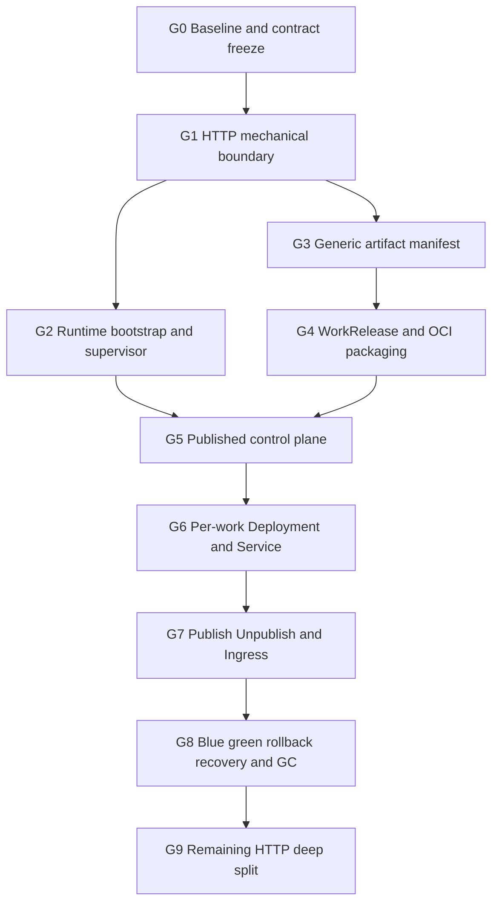

# Runtime 架构治理与作品独立发布主执行计划

## 1. 总目标

在保持现有 Runtime HTTP/SSE、Authoring Sandbox、Preview、Artifact 和 Design Profile 行为兼容的前提下，
完成两项连续目标：

1. 将 5,000 行级 `http_api.rs` 收敛为可扩展 HTTP inbound adapter，并建立 Bootstrap/Supervisor；
2. 为每个用户作品提供独立 Published Runtime，由用户控制 Publish/Update/Rollback/Unpublish，发布后
   使用独立 Deployment、Service、Ingress 和稳定 host。

最终链路：

```text
Authoring Sandbox
  -> Build / Candidate gates
  -> ArtifactManifest
  -> WorkRelease OCI image
  -> Per-release Deployment
  -> Stable per-work Service
  -> Per-work Ingress
  -> Published Work
```

本主计划是执行顺序的唯一入口。两份源方案继续作为详细设计依据，但实施时按本文件的 Wave、依赖和
停止条件推进，避免在两份长文档之间交叉选择。

## 2. 执行原则

1. 先建立 HTTP 和进程生命周期地基，再增加 Publish API 与 Controller。
2. 不等待整个 HTTP 深层重构完成才开始 Artifact/Release 工作。
3. 不向旧单体 `http_api.rs` 添加 Publish、Controller 或 Kubernetes 逻辑。
4. 每个 Wave 必须独立可编译、可回滚、可验收。
5. 机械移动、业务行为修改、持久化扩展、基础设施变更分开 commit/PR。
6. 当前 Astro/Fumadocs 只按 `static_web_v1` 发布；StatefulSet/SSR 后置。
7. Published Runtime 不能挂载 Authoring Workspace，也不能退化为直接公开 Sandbox。
8. 未满足当前 Wave 退出门槛时，不进入下一关键路径 Wave。
9. 所有新外部 API、状态机和持久化记录先冻结契约，再实现。
10. 真实 Ingress/Registry/Kubernetes 能力必须用真实环境证据签收，不能只用 mock。

## 3. 主关键路径



严格串行依赖：

```text
G0 -> G1 -> G2 -> G5 -> G6 -> G7 -> G8
          \-> G3 -> G4 -/
```

允许并行：

- G2 Bootstrap/Supervisor 与 G3 ArtifactManifest 在 G1 完成后可以并行；
- G4 Release packaging 可以和 HTTP 剩余无冲突测试拆分并行；
- 文档、schema、fixture 可以先行，但不能越过对应实现退出门槛；
- G9 HTTP Run/Profile 深层拆分不得与正在修改同一 route/module 的 G5–G8 并行。

## 4. Goal 总览

| Goal | 名称 | 主要结果 | 前置 | 关键路径 |
|---|---|---|---|---|
| G0 | Baseline 与契约冻结 | HTTP route/test baseline、工作树边界 | 无 | 是 |
| G1 | HTTP 机械边界 | `http_api/` contracts/routes/auth/error | G0 | 是 |
| G2 | Bootstrap 与 Supervisor | 明确启动恢复、后台任务 owner | G1 | 是 |
| G3 | 通用 ArtifactManifest | 新模板不依赖 framework HTTP rewrite | G1 | 是 |
| G4 | WorkRelease 与 OCI | 可恢复、签名的静态 Release image | G3 | 是 |
| G5 | 发布状态控制面 | Operation、desired state、outbox | G2+G4 | 是 |
| G6 | 独立 Deployment/Service | 集群内每作品独立运行 | G5 | 是 |
| G7 | Publish/Unpublish/Ingress | 用户控制对外发布 | G6 | 是 |
| G8 | Blue/Green 与恢复 | Update/Rollback/GC/drift | G7 | 是 |
| G9 | HTTP 剩余治理 | Run/Profile/Preview 深层拆分 | G8 或无冲突窗口 | 否 |

### 4.1 执行台账

每次只创建并执行一个关键路径 Goal；完成退出门槛、合并对应 PR 并补齐证据后，再将下一项改为
`in_progress`。G2 与 G3 只有在团队明确采用独立分支、独立 PR 和独立验收时才并行。

| Goal | 状态 | PR | 合并 commit | 验收证据 |
|---|---|---|---|---|
| G0 | complete | [PR-01](https://github.com/Carlosfengv/zeronDesign/pull/1) | `8f1527f` | `services/runtime/evidence/http-contract-baseline.md` |
| G1 | complete | [PR-02](https://github.com/Carlosfengv/zeronDesign/pull/2) | `eb5834e` | `services/runtime/evidence/http-api-split-g1.md` |
| G2 | complete | [PR-03](https://github.com/Carlosfengv/zeronDesign/pull/3) | `74fe6e5` | `services/runtime/evidence/runtime-bootstrap-supervisor-g2.md` |
| G3 | complete | [PR-04](https://github.com/Carlosfengv/zeronDesign/pull/4) | `788c1e8` | `services/runtime/evidence/artifact-manifest-g3.md` |
| G4 | complete | [PR-05](https://github.com/Carlosfengv/zeronDesign/pull/5) | `ca62ec1` | `services/runtime/evidence/work-release-packaging-g4.md` |
| G5 | complete | [PR-06](https://github.com/Carlosfengv/zeronDesign/pull/6) | `13f10f5` | `services/runtime/evidence/publication-control-plane-g5.md` |
| G6 | complete | [PR-07](https://github.com/Carlosfengv/zeronDesign/pull/7) | `aad4022` | `services/runtime/evidence/work-runtime-kubernetes-g6.md` |
| G7 | complete | [PR-08](https://github.com/Carlosfengv/zeronDesign/pull/8) | `c0bff9f` | `services/runtime/evidence/publish-ingress-g7.md` |
| G8 | complete | [PR-09](https://github.com/Carlosfengv/zeronDesign/pull/9) | `5e38242` | `services/runtime/evidence/blue-green-rollback-gc-g8.md` |
| G9 | in_progress | PR-10+ | 待填写 | `services/runtime/evidence/http-api-test-split-g9a.md`, `services/runtime/evidence/run-lifecycle-mutations-g9b1.md`, `services/runtime/evidence/run-lifecycle-start-g9b2.md`, `services/runtime/evidence/design-profile-pure-domain-g9c1.md`, `services/runtime/evidence/design-profile-service-g9c2.md`, `services/runtime/evidence/artifact-runtime-storage-boundary-g9d1.md`, `services/runtime/evidence/preview-authorization-boundary-g9d2.md`, `services/runtime/evidence/internal-release-evidence-boundary-g9d3.md` |

状态只使用：`pending`、`in_progress`、`blocked`、`complete`。不得仅因代码已写完就标记
`complete`；对应测试、架构门禁、真实环境证据和 PR 合并必须全部完成。

## 5. G0：Baseline 与契约冻结

### 5.1 Goal Objective

冻结当前 HTTP/SSE、测试数量、Sandbox 架构和工作区基线，确保后续移动与新能力有可比较证据。

### 5.2 工作范围

- 记录基线 commit、dirty state 和未跟踪文件；
- 建立机器可验证 HTTP route contract manifest；
- 修正 Cargo HTTP integration test discovery；
- 冻结 Public/Internal/Capture route、body limit、auth、feature flag、content type、cache、SSE；
- 冻结现有 Astro/Fumadocs Artifact/Preview 行为；
- 新增架构计划引用，不修改生产行为。

### 5.3 任务顺序

1. 记录 `git rev-parse HEAD` 和 `git status --short`。
2. 明确用户已有未跟踪文件，不纳入提交。
3. 建立 `services/runtime/contracts/http-routes.json`。
4. 增加 route contract test。
5. 将 `services/runtime/tests/http_api.rs` 变为可逐步拆分的 integration crate root。
6. 运行 `cargo test --test http_api -- --list`，记录测试数量基线。
7. 增加错误 status/body、SSE、auth、body limit characterization。
8. 更新 API freeze additive route 清单。

### 5.4 建议 commits

```text
test(runtime): freeze executable HTTP route contract manifest
test(runtime): establish Cargo-discovered HTTP test module harness
docs(runtime): record HTTP and runtime baseline evidence
```

### 5.5 验收门槛

- 所有当前 route 出现在 manifest；
- HTTP 测试列表不低于当前 70 个基线；
- 两个已验证浏览器根路由测试继续通过；
- 现有 HTTP/SSE error/status 无非预期变化；
- 没有生产逻辑移动；
- 未跟踪用户文档未被 stage。

### 5.6 停止条件

- 无法确定某个 route 的 auth/body limit/feature flag；
- 测试列表迁移后减少且无法解释；
- API freeze 文档与当前实现存在未决冲突。

### 5.7 可复制 Goal 文本

```text
目标：完成 Runtime HTTP baseline 与可执行契约冻结。不得修改生产行为。建立完整 route manifest、
Cargo 可发现的 HTTP test harness、错误/SSE/auth/body-limit characterization，并记录基线证据。
完成条件：manifest 覆盖全部路由，HTTP 测试数量不低于 70，现有契约测试全绿，用户未跟踪文件未纳入提交。
```

## 6. G1：HTTP 机械边界拆分

### 6.1 Goal Objective

把 `http_api.rs` 拆为按 bounded context 组织的目录模块，为 Publication API 提供清晰落点，不改变业务行为。

### 6.2 目标结构

```text
http_api/
  mod.rs
  error.rs
  contracts/
  routes/
    system.rs
    runs.rs
    run_events.rs
    design_sources.rs
    design_profiles.rs
    projects.rs
    previews.rs
    artifacts.rs
    internal.rs
    capture.rs
  auth/
```

预留但此 Goal 不实现：

```text
routes/publication.rs
contracts/publication.rs
```

### 6.3 任务顺序

1. `http_api.rs` 转为 `http_api/mod.rs`。
2. 移动 contracts，不改 Serde 属性。
3. 移动安全 error mapping，不冻结 infrastructure cause。
4. 移动 system routes 和测试。
5. 移动 run/SSE routes 和测试。
6. 移动 design source/profile routes 和测试。
7. 移动 project/preview/artifact/internal/capture routes和测试。
8. 使用 sub-router `merge` 组合。
9. 运行 route manifest drift 检查。
10. 增加 HTTP 模块规模与依赖门禁。

### 6.4 建议 commits

```text
refactor(runtime): split HTTP contracts and safe error mapping
refactor(runtime): split system routes with matching tests
refactor(runtime): split run and SSE routes with matching tests
refactor(runtime): split profile and project routes with matching tests
refactor(runtime): split preview artifact internal and capture routes
ci(runtime): enforce HTTP facade route and dependency gates
```

### 6.5 验收门槛

- 旧 `services/runtime/src/http_api.rs` 不再存在；
- `http_api/mod.rs` 过渡期不超过 500 行；
- route manifest、JSON、status、SSE 无差异；
- 所有 route family 有独立测试模块；
- 新 Publication route 不需要回到单体文件；
- 全量 Runtime 测试通过。

### 6.6 停止条件

- Router merge 导致 layer/body limit/auth 漂移；
- 为了移动代码必须修改 Store 状态机；
- 单个机械移动 commit 同时引入外部契约变化。

### 6.7 可复制 Goal 文本

```text
目标：行为等价地把 services/runtime/src/http_api.rs 拆为 http_api 目录模块。只允许机械移动和必要可见性调整，
不得改变路由、JSON、错误、SSE、Store 调用顺序和鉴权。每移动一个 route family 同步移动测试并运行 contract manifest gate。
完成条件：http_api.rs 删除，mod.rs <=500 行，全部 HTTP/Runtime 测试通过，route manifest 无漂移。
```

## 7. G2：Runtime Bootstrap 与 Supervisor

### 7.1 Goal Objective

统一生产/测试启动语义，并为后续 WorkRuntimeController、Packaging recovery 和 outbox reconcile 提供后台任务所有权。

### 7.2 工作范围

- `runtime/bootstrap.rs`；
- `runtime/supervisor.rs`；
- Channel/Project transaction/Artifact/Run 恢复顺序；
- background task registry；
- readiness/fatal failure/graceful shutdown；
- `TestRuntimeBuilder::fresh/recover`；
- 禁止 detached session/controller task。

### 7.3 任务顺序

1. 提取现有 `recover_startup_runs`。
2. 固化恢复顺序和 failure contract。
3. 引入 RuntimeSupervisor task ownership。
4. Session spawn 接入 Supervisor。
5. Capture Server 接入 Supervisor。
6. main.rs 只通过 Bootstrap 启动。
7. 测试显式选择 fresh/recovered。
8. 增加 duplicate task、listener failure、SIGTERM/shutdown 测试。

### 7.4 建议 commits

```text
refactor(runtime): introduce explicit runtime bootstrap
refactor(runtime): supervise session capture and background tasks
test(runtime): verify recovered startup and graceful shutdown semantics
```

### 7.5 验收门槛

- 生产不能绕过恢复直接监听；
- restart/reconcile 测试走 recovered builder；
- 同一 active run/task 不会注册两次；
- fatal task 影响 readiness；
- graceful shutdown 有 deadline 和证据；
- 后续 Controller 可以通过 Supervisor 注册。

### 7.6 可复制 Goal 文本

```text
目标：建立 RuntimeBootstrap 和 RuntimeSupervisor，统一启动恢复并拥有全部后台任务生命周期。
保持现有恢复顺序和对外行为。生产不得未恢复即监听，测试必须显式 fresh/recovered。
完成条件：session/capture tasks 有 owner，duplicate owner/fatal task/shutdown 测试通过，cargo test --all-targets 全绿。
```

## 8. G3：通用 ArtifactManifest

### 8.1 Goal Objective

让 Astro、Fumadocs 和未来静态模板输出统一、可验证、host-root 的 Artifact，不再向 HTTP 添加 framework rewrite。

### 8.2 工作范围

- `artifact-manifest@1` types/schema；
- canonical serializer/hash；
- path/mount/content-type validator；
- actual file size/hash；
- host-root template delivery；
- Astro/Fumadocs adapter；
- synthetic third template；
- 历史 rewrite 保留只读兼容。

### 8.3 任务顺序

1. 冻结 schema 和 reserved paths。
2. 实现 framework-neutral validator。
3. Candidate/Artifact 收集实际文件 hash。
4. Content-Type allowlist。
5. 扩展 TemplateSpec Delivery capability。
6. Astro host-root。
7. Fumadocs host-root。
8. synthetic third template。
9. 新 ArtifactResolver 使用 manifest mounts。
10. 门禁禁止通用层新增 `_framework` 路由。

### 8.4 建议 commits

```text
feat(runtime): add artifact manifest v1 validator
refactor(runtime): configure astro and fumadocs host-root artifacts
test(runtime): add synthetic static template contract
refactor(runtime): resolve new artifacts from manifest mounts
ci(runtime): block framework-specific artifact routing
```

### 8.5 验收门槛

- Astro/Fumadocs/synthetic 使用同一 schema；
- 修改 manifest 后文件会触发 integrity failure；
- 用户不能占用 `/.anydesign/*`/`/.well-known/anydesign/*`；
- 新 Artifact 不依赖 `_next/_astro/docs` rewrite；
- 新模板接入不修改 HTTP/ArtifactResolver 核心分派。

### 8.6 可复制 Goal 文本

```text
目标：实现 artifact-manifest@1 和 host-root 静态模板交付。Astro、Fumadocs、synthetic third template
必须共用同一 validator/resolver，实际 bytes 与 manifest hash 一致。保留历史 rewrite 只读兼容，禁止新增 framework-specific route。
完成条件：三模板 contract、integrity、reserved-path 和 ArtifactResolver gates 全绿。
```

## 9. G4：WorkRelease 与 OCI Packaging

### 9.1 Goal Objective

把 promoted ProjectVersion 打包为可独立运行、可签名验证、可恢复的静态 WorkRelease OCI image。

### 9.2 工作范围

- `runtime-manifest@1`；
- RuntimeProfile `static-web-v1`；
- WorkRelease；
- ReleasePackagingRecord；
- trusted ReleaseImageBuilder；
- static runtime base image；
- Registry push/digest；
- SBOM/provenance/sign/scan；
- packaging recovery/GC。

### 9.3 任务顺序

1. 冻结 RuntimeManifest/RuntimeProfile。
2. 实现 WorkRelease append/checkpoint。
3. 实现 PackagingRecord 和内容寻址幂等键。
4. 构建固定 static runtime base image。
5. ReleaseImageBuilder 组装最小 OCI layer。
6. 推送 Registry 并记录 digest。
7. 生成 SBOM/provenance/signature。
8. 执行 scan policy。
9. 实现 build/push/scan/sign crash recovery。
10. 实现未引用 packaging artifact GC。

### 9.4 建议 commits

```text
feat(runtime): add runtime manifest and static web profile
feat(runtime): persist immutable work release records
feat(runtime): persist release packaging records and idempotency keys
feat(runtime): package sign and scan static release OCI images
test(runtime): verify packaging crash provenance integrity and recovery
```

### 9.5 验收门槛

- 相同输入得到相同 packaging idempotency key；
- push 后 crash 可从 Registry digest 恢复；
- scan/sign 未完成不能 Validated；
- image 使用 digest，包含正确 Artifact；
- Agent/Sandbox 无 registry push credential；
- 未创建任何 Published Deployment/Ingress。

### 9.6 停止条件

- OCI Registry、签名、scan policy 或 builder trust boundary 未确定；
- 需要让 Agent/Sandbox 直接 push image；
- 相同 Release 可能绑定两个不同 image digest。

### 9.6.1 G4 外部工具链决策门

本地 G4 决策状态：`approved_for_local_acceptance`（2026-07-12）。该批准只覆盖下表的本地真实验收，
不等价于生产 Registry、KMS/Keyless、离线漏洞库或 admission policy 已获批准；生产决策仍是 G6/G7
前的独立停止门。

进入真实 image build/push 前必须形成一条已批准的 `ReleaseToolchainDecision`，至少冻结：

| 字段 | 本地真实验收建议 | 生产要求 |
|---|---|---|
| Registry | CNCF Distribution v3，仅绑定本机测试端口 | TLS、鉴权、不可变/删除策略和审计已配置的 Harbor/GHCR/企业 Registry |
| Builder | Runtime 控制的命名 Docker Buildx `docker-container` builder；BuildKit image digest pin | 独立受信 builder identity；Agent/Sandbox 不可访问 daemon 或 push credential |
| SBOM | Syft SPDX JSON，并记录 digest | 工具版本固定，SBOM 作为 OCI attestation/受保护 evidence 保存 |
| Scan | Trivy vuln+secret；Critical 或 secret finding 阻断，High 记录 | 经安全团队批准并版本化的 policy，离线 DB/例外和 EOL 策略明确 |
| Signing | Cosign 测试 key，仅用于本地验收 | KMS/Keyless identity、验证规则、Rekor/私有 transparency 策略明确 |
| Base image | 静态 runtime image 必须 digest pin | 允许仓库、更新责任、SBOM、provenance 和 admission policy 明确 |

任一目标环境的决策状态为 `pending` 时，只允许合并 RuntimeManifest、Release 状态机、可信 backend interface 和
mock failure matrix；不得把 mock evidence 标记为 G4 完成，也不得创建 Published workload。

### 9.7 可复制 Goal 文本

```text
目标：从 validated ArtifactManifest 构建不可变 static-web-v1 WorkRelease OCI image。
实现 PackagingRecord、内容寻址幂等、Registry digest、SBOM/provenance/sign/scan 和 crash recovery。
不得创建 Published workload，不得把 registry credential交给 Agent/Sandbox。
完成条件：package/push/scan/sign failure matrix 全绿，Validated Release 绑定唯一 digest。
```

## 10. G5：发布状态控制面

### 10.1 Goal Objective

建立持久化 PublishOperation、WorkRuntime desired/observed state 和 reconcile outbox，不创建公网 Ingress。

### 10.2 工作范围

- PublishOperation；
- desiredPublication/release/generation；
- WorkRuntimeState；
- Kubernetes resource identity fields；
- reconcile outbox；
- API contracts 和 operation query；
- Controller task 注册到 Supervisor。

### 10.3 任务顺序

1. 冻结 Operation/State schema。
2. 实现 Idempotency-Key body hash。
3. 原子写 Operation+desired state+outbox。
4. 实现 `/operations/{id}`。
5. 实现 deployment-state/releases read API。
6. WorkRuntimeController skeleton 注册 Supervisor。
7. outbox delivery/replay。
8. startup scan 非终态 Operation。

### 10.4 建议 commits

```text
feat(runtime): add publish operations desired generation and reconcile outbox
feat(runtime): add work runtime desired observed and kubernetes identities
feat(runtime): add publication operation and state query contracts
test(runtime): verify publication idempotency transaction and replay
```

### 10.5 验收门槛

- 相同 key/body 返回同一 Operation，不同 body 409；
- Operation/desired/generation/outbox 原子或有 commit marker；
- Runtime restart 会重放 outbox；
- Controller 有 Supervisor owner；
- 仍未创建 Published Ingress；
- Publish routes 位于独立 publication module，不进入 HTTP 单体。

### 10.6 可复制 Goal 文本

```text
目标：实现 Published Runtime 控制面状态，不创建 Kubernetes 公网资源。新增 PublishOperation、WorkRuntimeState、
desired generation、原子 outbox、operation query 和 Supervisor-owned Controller skeleton。
完成条件：幂等/并发/CAS/crash/replay tests 全绿，Publication route 位于独立 HTTP module。
```

## 11. G6：每作品 Deployment 与 Service

### 11.1 Goal Objective

在 Kubernetes 集群内为每个 desired Published Work 创建 release-specific Deployment、stable Service 和 NetworkPolicy，外部仍不可访问。

### 11.2 工作范围

- WorkRuntimeBackend port；
- production Kubernetes adapter；
- `anydesign-works` namespace；
- release-specific Deployment；
- stable Service selector；
- release probe Service；
- NetworkPolicy；
- UID/resourceVersion/server-side apply；
- readiness/internal identity probe；
- controller recovery/drift。

### 11.3 任务顺序

1. 建立 works namespace/RBAC/default deny。
2. 实现 desired Kubernetes resource builder。
3. apply release-specific Deployment by digest。
4. 验证 admission/signature/provenance。
5. 等待 Ready/Available。
6. 创建临时 probe Service。
7. Release Prober 验证 health/release ID。
8. 创建 stable Service selector。
9. 写 observed UID/resourceVersion/status。
10. 双作品并行隔离。
11. Controller restart/drift reconcile。

### 11.4 建议 commits

```text
feat(runtime): reconcile release-specific deployment and stable service
infra(runtime): add works namespace network policy controller rbac and admission
test(runtime): add k3d dual-work deployment isolation gate
test(runtime): verify kubernetes uid drift and controller restart
```

### 11.5 验收门槛

- 两个作品使用不同 Deployment/Service/image digest；
- Service selector 不跨作品；
- Published Pod 无 Authoring PVC/secret/token；
- Published Pod 不能访问 Runtime/Sandbox/其他 work；
- 集群内 probe 验证 release ID；
- 无 Ingress，外部不可访问；
- restart/drift 可恢复。

### 11.6 可复制 Goal 文本

```text
目标：为每个 desired Published Work 创建独立 release-specific Deployment、stable ClusterIP Service 和 NetworkPolicy，
不创建 Ingress。使用 image digest、强制签名/admission、UID/resourceVersion 和 server-side apply。
完成条件：双作品 k3d 隔离、readiness/release probe、restart/drift tests 全绿，外部仍不可访问。
```

## 12. G7：Publish/Unpublish 与 per-work Ingress

### 12.1 Goal Objective

让用户能够显式 Publish/Unpublish，Published 时创建每作品 Ingress 和稳定 host，Unpublish 时先关闭外部访问。

### 12.2 工作范围

- Publish/Unpublish write API；
- `publish:write` authorization；
- Idempotency-Key + If-Match/If-None-Match；
- stable random host identity；
- per-work Ingress；
- wildcard TLS；
- external release probe；
- Unpublish ordered teardown；
- product deployment state。

### 12.3 任务顺序

1. Initial Publish Operation。
2. 校验 promoted version/Validated Release。
3. Reconcile Deployment/Service Ready。
4. 分配永久 work host。
5. 创建 Ingress。
6. 外部 probe 验证 release ID。
7. current release CAS，Operation completed。
8. 实现 Unpublish desired state。
9. 删除 Ingress并验证 404/410。
10. 删除 Service/workload，保留 Release/host。
11. Republish 原 host。

### 12.4 建议 commits

```text
feat(runtime): add publish unpublish and operation APIs
feat(runtime): reconcile per-work ingress and stable hosts
test(runtime): add ingress publish idempotency and unpublish lifecycle gate
```

### 12.5 验收门槛

- 未 Publish 时没有 Ingress；
- workload/service 未 Ready 不创建/启用 Ingress；
- 外部 host 只返回目标 release ID；
- Unpublish 先关闭入口；
- host 不分配给其他作品；
- Sandbox release 后 Published Work 仍 200；
- Ingress 不指向 Sandbox Service。

### 12.6 可复制 Goal 文本

```text
目标：实现用户 Publish/Unpublish 和每作品 Ingress。Initial Publish 只在 Deployment/Service Ready 后开放稳定 host，
外部 probe 必须验证 release ID。Unpublish 先删除 Ingress并验证关闭，再删除 Service/workload，保留 Release 和 host。
完成条件：真实 Ingress/TLS/浏览器 E2E、幂等/CAS、Republish、Sandbox release independence 全绿。
```

## 13. G8：Blue/Green、Rollback、恢复与 GC

### 13.1 Goal Objective

实现 release-specific blue/green Update/Rollback、crash/drift recovery 和安全 Registry GC。

### 13.2 工作范围

- green Deployment；
- temporary probe Service；
- stable Service selector CAS；
- EndpointSlice convergence；
- bounded switch window；
- Rollback；
- previous release retention；
- Publish/Packaging crash matrix；
- Release/image GC protection set；
- operational evidence/runbook。

### 13.3 任务顺序

1. 创建 green release-specific Deployment。
2. probe green identity。
3. CAS switch stable Service selector。
4. 等待 EndpointSlice 只剩 green。
5. 外部 probe green release ID。
6. current/previous/lastSuccessful CAS。
7. 保留 blue 回滚窗口。
8. Rollback selector switch。
9. switch timeout 自动切回。
10. 实现全 crash matrix。
11. 实现 GC protection scan。
12. 增加 drift/fail-closed runbook。

### 13.4 建议 commits

```text
feat(runtime): add blue green service switch and release rollback
test(runtime): add selector switch convergence and rollback gates
feat(runtime): protect live desired and rollback releases from registry gc
test(runtime): add publish packaging crash drift and restart matrix
ci(runtime): enforce release published workload and reserved-path gates
```

### 13.5 验收门槛

- green 未 Ready 前持续服务 blue；
- 收敛后只命中 green；
- switch 窗口超时可回退；
- Rollback 更新真实流量和 Store；
- desired/current/previous/live/operation 引用不会被 GC；
- 每个 crash point 重启后有确定状态；
- 更新失败不破坏旧 Published Work。

### 13.6 可复制 Goal 文本

```text
目标：实现 Published Work 的 release-specific blue/green Update/Rollback、bounded Service selector switch、
crash/drift recovery 和 Registry GC protection。Green 未 Ready 前持续服务 Blue，收敛后只命中目标 Release。
完成条件：selector/EndpointSlice/external identity、rollback、crash matrix、GC protection 和旧版本可用性 gates 全绿。
```

## 14. G9：HTTP 剩余深层治理

### 14.1 Goal Objective

在 Published Runtime 主链路稳定后，完成 HTTP 方案剩余的 Run、Profile、Preview/Artifact 和测试收口。

### 14.2 工作范围

- RunLifecycle start/continue/cancel/permission；
- Design Profile import/validation/conflict；
- Authentication/Authorization 分层；
- ArtifactResolver/HTTP presenter；
- Preview/Release Evidence service；
- HTTP integration test final split；
- façade 300 行和模块 800 行门禁。

### 14.3 执行约束

- Publication routes/service 已稳定，不与 Publication 功能改动混在同一 commit；
- 优先较小 Cancel/Permission，再 Continue/Start；
- Profile parser/validator 先纯函数化；
- Artifact legacy rewrite 只在历史兼容层；
- 全部 HTTP test 仍由 Cargo 明确发现。

### 14.4 验收门槛

- `http_api/mod.rs <= 300`；
- handler 原则上 <=50 行；
- application service 不依赖 Axum；
- route 不直接 `std::fs`；
- 7,000 行 HTTP 测试正文已拆分；
- HTTP/SSE/Publication/Published Runtime 全量回归通过。

### 14.5 可复制 Goal 文本

```text
目标：完成 HTTP 架构方案剩余深层治理。在不改变 Publication 和现有 HTTP/SSE 契约的前提下，提取 RunLifecycle、
DesignProfile、Preview/Artifact/Auth services并完成测试收口。完成条件：mod.rs<=300、普通模块<=800、
application 无 Axum、route 无直接 fs、全量 Runtime/Published gates 全绿。
```

## 15. PR 与合并顺序

建议 PR 边界：

| PR | 内容 | 对应 Goal | 必须先合并 |
|---|---|---|---|
| PR-01 | HTTP contract manifest/test harness | G0 | 无 |
| PR-02 | 完整 HTTP mechanical split + gates | G1 | PR-01 |
| PR-03 | Bootstrap/Supervisor | G2 | PR-02 |
| PR-04 | ArtifactManifest + templates | G3 | PR-02 |
| PR-05 | WorkRelease/Packaging/OCI | G4 | PR-04 |
| PR-06 | Operation/desired state/outbox | G5 | PR-03+PR-05 |
| PR-07 | Deployment/Service/NetworkPolicy | G6 | PR-06 |
| PR-08 | Publish/Unpublish/Ingress | G7 | PR-07 |
| PR-09 | Blue/Green/Rollback/GC | G8 | PR-08 |
| PR-10+ | HTTP remaining deep split | G9 | PR-09 或无冲突窗口 |

合并原则：

- 每个 PR 在 main 上 rebase 后执行其完整 gate；
- 不把 PR-06 Publication state 提前合并到未拆分 HTTP 单体；
- PR-03 和 PR-04 可并行开发，但必须分别合并；
- PR-07 不包含 Ingress；
- PR-08 不包含 Update/Rollback；
- PR-09 不引入 StatefulSet/SSR。

## 16. 每个 PR 的统一验证命令

在 `services/runtime`：

```bash
cargo fmt --check
cargo clippy --all-targets --all-features -- -D warnings
cargo test --all-targets
```

在仓库根目录：

```bash
SANDBOX_ARCHITECTURE_STRICT=1 bash services/runtime/scripts/check-sandbox-architecture.sh
bash services/runtime/scripts/check-remote-workspace-fs-boundary.sh
```

涉及现有模板真实构建：

```bash
bash services/runtime/scripts/smoke-fumadocs-docs-build.sh
```

涉及 Kubernetes/Sandbox/Published Runtime 的 PR 还必须运行对应的 k3d gate。现有基础入口：

```bash
bash infra/agent-sandbox/run-k8s-e2e.sh
bash infra/agent-sandbox/run-runtime-recovery-gate.sh
```

新增 Published Runtime gate 应使用独立脚本，例如：

```text
infra/agent-sandbox/run-published-work-e2e.sh
```

脚本在实现前不存在，不能在完成证据中伪称已运行。

## 17. 统一证据要求

每个关键 Wave 证据至少记录：

```text
repositoryCommit
repositoryDirty
goal/PR/commit IDs
Rust test command and result
architecture gate result
template IDs/versions/manifest hashes
runtime base image digest
release image digest
Kubernetes context/cluster/namespace
Deployment/Service/Ingress names and UIDs
release ID and external URL
startedAt/completedAt
```

禁止：

- 用旧镜像或旧集群结果证明当前 commit；
- 用 mock HTTP 200 代替真实 release identity；
- 用 Sandbox Preview URL冒充 Published Runtime；
- dirty worktree evidence 冒充最终 release evidence；
- 缺失 image digest、resource UID 或 manifest hash。

## 18. 总体验收门槛

主目标只有满足以下条件才完成：

1. HTTP façade 已拆分，Publication 不在旧单体中。
2. RuntimeBootstrap/Supervisor 拥有 Controller 和恢复任务。
3. Astro/Fumadocs/synthetic template 使用通用 ArtifactManifest。
4. Promoted version 可生成签名、扫描、不可变 WorkRelease image digest。
5. PublishOperation 和 desired state 可从 crash/restart 恢复。
6. 每个 Published Work 拥有独立 Deployment、Service、Ingress、NetworkPolicy 和 host。
7. 用户可以 Publish、Unpublish、Update 和 Rollback。
8. Blue/green 更新失败时旧版本继续可用。
9. Authoring Sandbox release 不影响 Published Work。
10. Published workload 不访问 Authoring/Runtime/其他 work。
11. Registry GC 不删除任何有效引用 Release。
12. HTTP、Sandbox、Artifact、Published Runtime 和真实 Kubernetes gates 全绿。
13. StatefulSet/SSR/custom domain 等后续能力没有被冒充为本轮完成项。

## 19. 推荐启动方式

立即执行顺序：

```text
Start G0
  -> Complete and merge PR-01
Start G1
  -> Complete and merge PR-02
Start G2 and G3 in parallel
  -> Merge PR-03 and PR-04 independently
Start G4
  -> Merge PR-05
Start G5
  -> Merge PR-06
Start G6
  -> Merge PR-07
Start G7
  -> Merge PR-08
Start G8
  -> Merge PR-09
Start G9 in controlled follow-up PRs
```

第一个应创建的 Goal 是 G0，不是直接实现 Publish API，也不是一次性完成整个 HTTP 重构。
