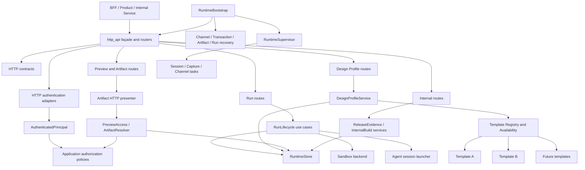

# Runtime HTTP API 架构拆分与约束方案

## 1. 文档结论

当前 `services/runtime/src/http_api.rs` 的产品行为基本符合预期，现有 Public Runtime API、
SSE、Design Profile、Preview、Artifact 和 Internal API 也已拥有较强的集成测试覆盖。
本轮优化不重写 HTTP 协议，也不改变 Phase A/Phase B 已冻结的外部契约。

需要解决的核心问题不是文件行数本身，而是 HTTP adapter 已经同时承担以下职责：

- Runtime 进程启动与恢复；
- Router 和 Axum 状态组装；
- Run 生命周期应用编排；
- Design Source 与 Design Profile 领域逻辑；
- Sandbox 申请、绑定、恢复和释放；
- Project Conversation 与 Runtime State 查询；
- Preview 代理、Artifact 文件服务和 HTML 路径重写；
- Public Principal、Candidate Lease 和 Internal Admin 鉴权；
- Internal Template Build、Promotion 和 Release Evidence；
- HTTP DTO、校验、错误映射和少量单元测试。

因此，本方案采用以下决策：

1. 保留 `anydesign_runtime::http_api` 作为兼容 façade，不做一次性公共模块改名。
2. 先拆路由、DTO 和错误映射，保持请求、响应、状态码和 SSE 完全等价。
3. 再把启动恢复、Run 生命周期、Design Profile、Release Evidence 等编排提取为应用服务。
4. HTTP handler 只负责协议解析、调用应用服务和响应映射，不直接承载业务状态机。
5. 新增模板不得要求修改 HTTP、通用 Preview、Artifact 或 Run 生命周期分派。
6. 生产启动和测试启动必须使用语义明确的 Bootstrap，不再保留容易误用的恢复/不恢复双入口。
7. 生产代码与对应的 7,000 行级 HTTP 集成测试必须同步拆分。
8. Run 多步骤编排必须定义持久化提交点、失败补偿、重试幂等和后台 Session 启动语义。
9. HTTP 认证只产生可信 Principal；Project/Preview/Artifact 授权必须由应用策略独立判定。
10. 路由契约必须由机器可验证的 manifest 固化，不能只比较 method/path 或依赖手工清单。
11. Runtime 后台任务必须由 Supervisor 持有并参与 readiness、故障传播和 graceful shutdown。

本方案完成后，HTTP API 将从“Runtime 应用层总控”收敛为真正的 inbound adapter。

### 1.1 可引用的强制规则

以下规则使用稳定 ID，架构评审、Code Review 和 CI 门禁应直接引用规则 ID：

| Rule ID | 级别 | 约束 |
|---|---|---|
| `HTTP-001` | MUST | `http_api` 只能承担 HTTP façade、Router composition、协议 DTO、认证入口和错误映射。 |
| `HTTP-002` | MUST | HTTP handler 不得实现跨多个 Store mutation 的业务状态机。 |
| `APP-001` | MUST | Run、Design Profile、Release、Startup Recovery 等跨资源流程必须由 application service 编排。 |
| `APP-002` | MUST | Application service 不得依赖 Axum 的 `State`、`Path`、`Query`、`HeaderMap`、`Json`、`Response` 或 `StatusCode`。 |
| `BOOT-001` | MUST | 生产启动必须在对外监听前完成 Channel、Project transaction、Artifact 和 interrupted Run 恢复。 |
| `BOOT-002` | MUST | 测试必须显式选择 `fresh` 或 `recovered` 启动语义，禁止使用含义模糊的通用 `router()`。 |
| `SUP-001` | MUST | Session、Capture Server、Channel 等后台任务必须由 RuntimeSupervisor 持有，禁止 detached task 成为唯一生命周期管理方式。 |
| `SUP-002` | MUST | Readiness、后台任务失败传播和 graceful shutdown 必须有明确契约和测试。 |
| `CONTRACT-001` | MUST | 拆分不得改变已冻结的 method、path、JSON 字段、camelCase 规则、状态码和 `{ error }` 错误外形。 |
| `CONTRACT-002` | MUST | Route manifest 必须覆盖 Router、method、path、body limit、auth、feature flag、query/header、content type、cache 和 streaming mode。 |
| `EVENT-001` | MUST | SSE event payload、event ID、Last-Event-ID replay、fan-out、终态结束和 keep-alive 语义必须保持不变。 |
| `AUTH-001` | MUST | HTTP authentication 只负责把凭据转换为 `AuthenticatedPrincipal`，不得在 adapter 中实现资源授权策略。 |
| `AUTH-002` | MUST | Project ownership、Preview/Artifact visibility 和 Candidate Lease capability 必须由 application authorization policy 判定。 |
| `AUTH-003` | MUST | Public Principal、Candidate Lease 和 Internal Admin 三类身份边界必须分离，lease ID 不能替代 principal。 |
| `STATE-001` | MUST | RuntimeStore 和持久化 transaction/outbox 是状态权威；HTTP 层不得维护第二份业务状态。 |
| `TXN-001` | MUST | 每个跨多次 Store mutation 的 use case 必须声明 durable commit point、失败状态和补偿动作。 |
| `IDEMP-001` | MUST | Startup recovery、Session launch、Sandbox release 和补偿操作必须可重复执行且结果幂等。 |
| `FS-HTTP-001` | MUST | HTTP route 不得直接读取 Workspace；Runtime-owned Artifact/Release Evidence 文件访问必须委托专用 service。 |
| `FS-HTTP-002` | MUST | Runtime-owned 文件访问必须通过 Artifact/Evidence port 进入 adapter，禁止仅把 `std::fs` 从 route 平移到 application service。 |
| `TEMPLATE-HTTP-001` | MUST | HTTP、Run service 和 Preview 核心不得出现 Astro、Fumadocs 或其他具体模板分支。 |
| `TEMPLATE-HTTP-002` | MUST | 新模板只通过 Template Registry、Availability 和 Execution Profile 进入系统，HTTP 仅传递开放的 template ID。 |
| `ARTIFACT-001` | MUST | 新模板资产只能使用 project-scoped Artifact URL 或 manifest-driven public mount，禁止继续增加 framework-specific 全局路由。 |
| `ERROR-001` | MUST | Domain/Application error 到 HTTP 的映射必须集中管理并保持稳定，handler 不得临时拼装新的协议错误形状。 |
| `ERROR-002` | MUST | Validation/Conflict 等稳定客户端错误可冻结文本；Infrastructure error 只冻结安全外形和状态码，内部原因只进入结构化日志。 |
| `CHANGE-001` | MUST | 机械移动、业务行为修改、依赖升级和外部契约修改默认拆成独立 commit/PR。 |
| `TEST-001` | MUST | 每次拆分必须先有 characterization test，移动后原测试与新模块测试同时通过。 |
| `SIZE-001` | SHOULD | HTTP façade 不超过 300 行，单个 route/application 模块不超过 800 行；例外必须评审。 |
| `DEP-001` | SHOULD | Route 可以依赖 contract、auth 和 application service；application service 不得反向依赖 route。 |

规则例外必须写明：

- 被豁免的 Rule ID；
- 无法遵守的具体原因；
- 影响的 route、状态和数据；
- 回滚方式；
- 移除例外的后续事项；
- reviewer 的明确同意。

“只是机械拆分”“当前测试已通过”或“目前只有两个模板”不能作为长期例外理由。

### 1.2 v2 架构加固处置

本版已针对二次架构评审的实施阻断项作出明确决策：

| Review 发现 | v2 处置 |
|---|---|
| `tests/http/*.rs` 可能不被 Cargo 发现 | 保留 `tests/http_api.rs` 作为 crate root，显式声明 `tests/http/mod.rs`，CI 比对 `--list` |
| Run 编排只有调用顺序，没有失败语义 | 增加 durable checkpoint、补偿、幂等和 failure-injection matrix |
| Authentication 与 Authorization 混杂 | HTTP 只产生 `AuthenticatedPrincipal`，资源授权进入 application policy |
| Route inventory 只比较 method/path | 增加包含 middleware/auth/content/cache/streaming 的机器可验证 manifest |
| `run_lifecycle.rs` 可能成为新单体 | 改为 start/continue/cancel/permission use-case 目录 |
| Artifact service 混入 HTTP 表现 | 拆为 resolver、manifest mounts 和 HTTP presenter |
| `/_next/*` 阻碍未来模板扩展 | 定义 legacy adapter，新模板只能使用 project-scoped URL 或 manifest-driven mount |
| Bootstrap 不拥有后台任务 | 增加 RuntimeSupervisor、readiness、fatal failure 和 graceful shutdown 契约 |
| 冻结所有错误文本可能固化信息泄露 | 只冻结稳定客户端错误；Infrastructure cause 进入结构化日志 |

文档仍保持 `proposed`，只有阶段 0 的 executable contract/test baseline 得到验证并由 reviewer
确认后，才可更新为 `Accepted v2`。

## 2. 当前基线与问题边界

截至 2026-07-12，当前 checkout 的基线为：

| 项目 | 当前值 |
|---|---:|
| `services/runtime/src/http_api.rs` | 5,018 行 |
| 主 Router route registration | 38 条 |
| Capture Router route registration | 3 条 |
| 顶层函数/类型 | 约 175 个 |
| 直接 Store 使用 | 约 52 处 |
| `services/runtime/tests/http_api.rs` | 7,265 行 |
| HTTP integration tests | 70 个 |

主要职责区间：

| 区间 | 职责 |
|---|---|
| 95–181 | 启动恢复、兼容审计、Artifact reconciliation/GC |
| 193–310 | Public、Internal、Preview、Artifact、Capture Router |
| 865–1780 | Design Source/Profile API 与版本生命周期 |
| 1793–3030 | Start/Continue/Cancel/Permission/SSE |
| 3030–3349 | Project state、Preview 和 Artifact serving |
| 3350–3992 | Internal API、Release Evidence、Principal/Auth |
| 3993–4566 | Profile parse、validation、diff、conflict、preflight |
| 4578–4868 | 请求校验和 HTTP error mapping |

### 2.1 产品正确性与模块质量必须分开判断

当前没有证据表明“文件很大”本身已经造成用户可见的功能错误。冻结 API 的核心行为有测试保护，
生产 `main.rs` 也会在开始服务前调用启动恢复。

但模块质量已经不达标：

- HTTP 变更、Profile 变更、Sandbox 变更和 Release 变更会触碰同一文件；
- application rule 与 HTTP status mapping 交错，难以独立测试；
- `router()`、`recovered_router()` 和生产手工 bootstrap 存在三种启动方式；
- 安全敏感的 Preview/Artifact 路径与普通 CRUD route 共享巨大审查面；
- 测试文件按历史追加，无法直接反映 bounded context；
- 新 API 继续接入时，默认落点仍会是同一个文件。

### 2.2 与模板扩展的关系

当前 `internal_template_build` 已经通过 Template Registry 和通用 build service 工作，
未重新引入 Astro/Fumadocs 双分支，这是正确方向。

后续接入第三个及更多模板时，允许的 Runtime 改动面应保持为：

```text
template module
template immutable assets
registry registration
availability/execution-profile configuration
template contract and lifecycle tests
```

以下变化一律视为架构回归：

- 在 HTTP handler 中按 template ID 分支；
- 在 Run service 中按 framework 分支；
- 为新模板新增专用 Preview route；
- 为新模板复制一套 Internal Build endpoint；
- 在 Artifact serving 中判断 Astro、Fumadocs、Next.js 或 Docusaurus；
- 在 DTO 层维护独立的模板白名单。

## 3. 目标与非目标

### 3.1 本轮目标

1. 将 HTTP façade 控制在 300 行以内。
2. 将 route 按 bounded context 拆分，单模块原则上不超过 800 行。
3. 将 Run 生命周期从 Axum handler 提取为可独立调用和测试的应用服务。
4. 将 Design Profile import/activation/conflict/preflight 归入 `profiles` 边界。
5. 将进程恢复归入独立 Bootstrap，并让测试显式选择启动模式。
6. 将 Preview Principal、Internal Admin 和 Candidate Lease 鉴权分开。
7. 将 Artifact/Release Evidence 的文件读取迁入专用 service。
8. 保持现有 HTTP/SSE 契约和持久化数据完全兼容。
9. 拆分 HTTP 测试并增加依赖方向、模块规模和模板扩展门禁。

### 3.2 非目标

本轮不做以下事项：

- 不修改 Public Runtime API 路径和字段命名；
- 不把 REST API 改为 gRPC、GraphQL 或其他协议；
- 不更换 Axum；
- 不重做 RuntimeStore；
- 不重新设计 AgentRun 状态机；
- 不调整 Design Profile 产品语义；
- 不新增模板；
- 不借拆分顺便升级 Rust/Axum/Serde 依赖；
- 不改变 Artifact URL、Preview URL 或 SSE 消费方式；
- 不以大规模 trait 抽象替代清晰的模块边界。

## 4. 目标架构



依赖方向固定为：

```text
main/bootstrap
  -> http façade
    -> routes/contracts/auth/error
      -> application services
        -> domain modules and ports
          <- infrastructure adapters implement ports
```

禁止以下反向依赖：

- application service 依赖 Axum route；
- Profile service 依赖 HTTP DTO；
- Template module 依赖 HTTP 或 RuntimeStore；
- Store 向 route 返回 `StatusCode`；
- Startup recovery 通过 HTTP Router 间接执行；
- Artifact resolver/presenter 依赖某个具体模板。

## 5. 目标目录

保持 `pub mod http_api` 和调用方模块路径兼容：

```text
services/runtime/src/
  http_api/
    mod.rs                         # façade、AppState、router composition，<= 300 行
    error.rs                       # ApiError、IntoResponse、稳定错误映射
    contracts/
      mod.rs
      system.rs                    # health/version
      runs.rs                      # start/continue/cancel/permission
      design_sources.rs
      design_profiles.rs
      projects.rs
      previews.rs
      internal.rs
    routes/
      mod.rs
      system.rs
      runs.rs
      run_events.rs
      design_sources.rs
      design_profiles.rs
      projects.rs
      previews.rs
      artifacts.rs
      internal.rs
      capture.rs
    auth/
      mod.rs
      public_principal.rs
      candidate_preview.rs
      internal_admin.rs

  runtime/
    mod.rs
    bootstrap.rs                   # 启动恢复顺序和 RecoveredRuntime
    supervisor.rs                  # task ownership、readiness、shutdown

  run_lifecycle/
    mod.rs                         # façade 和共享 application types
    start.rs                       # StartRun use case
    continue_run.rs                # ContinueRun use case
    cancel.rs                      # CancelRun use case
    permission.rs                  # Permission decision use case
    validation.rs
    sandbox_binding.rs
    session_launcher.rs            # port，不直接 detached spawn
    error.rs

  profiles/
    service.rs                     # Profile CRUD/version/activation use cases
    import.rs                      # source parsing/conversion
    validation.rs                  # activation/prebuild validation
    conflict.rs                    # Build/Edit conflict classification

  preview/
    authorization.rs               # principal/project/lease policy
    artifact_resolver.rs           # immutable bytes/metadata，不含 HTTP headers
    artifact_mounts.rs             # manifest-driven public mounts

  project/
    release_evidence.rs

  ports/
    artifact_store.rs
    runtime_evidence_store.rs

  adapters/
    file_artifact_store.rs
    file_runtime_evidence_store.rs
```

如果拆分后某个模块仍超过 800 行，应继续按 use case 拆分，而不是建立 `legacy.rs` 长期容器。

## 6. 核心边界设计

### 6.1 HTTP façade

`http_api/mod.rs` 只允许包含：

- `AppState` 或等价依赖容器；
- Public Router 组合；
- Capture Router 组合；
- route module merge/nest；
- 为兼容调用方保留的 re-export。

建议使用子 Router 组合：

```rust
pub fn router_with_state(state: AppState) -> Router {
    Router::new()
        .merge(routes::system::router())
        .merge(routes::runs::router())
        .merge(routes::run_events::router())
        .merge(routes::design_sources::router())
        .merge(routes::design_profiles::router())
        .merge(routes::projects::router())
        .merge(routes::previews::router())
        .merge(routes::artifacts::router())
        .merge(routes::internal::router())
        .with_state(state)
}
```

第一阶段继续使用一个 `AppState`，避免在机械拆分时同时引入复杂依赖注入框架。
应用服务稳定后，由唯一 composition root 组装 service、port 和 adapter；禁止 route 在请求期间
自行创建 Store、Sandbox backend、Principal verifier 或 Session launcher。文档不要求引入通用 DI
框架，但必须明确依赖实例的 owner、共享方式和关闭顺序。

### 6.2 Application service 返回值

Application service 返回领域结果和领域错误，不返回 Axum 类型：

```rust
pub enum RunLifecycleError {
    InvalidRequest { field: String, message: String },
    NotFound { resource: &'static str, id: String },
    Conflict { kind: String, message: String },
    Unauthorized { message: String },
    Infrastructure(anyhow::Error),
}

pub struct StartRunOutcome {
    pub run_id: String,
    pub status: StartRunStatus,
}
```

`http_api/error.rs` 负责唯一的 HTTP 映射：

```text
InvalidRequest -> 400
Unauthorized   -> 401/403，按现有契约固定
NotFound       -> 404
Conflict       -> 409
Infrastructure -> 500
```

本轮不能因为引入 typed error 而改变现有状态码或错误文本。

这里的“错误文本不变”只适用于当前已经被客户端消费的 validation、not-found 和 conflict 文本。
Infrastructure error 不得把 `anyhow` cause、宿主机路径、Pod/Service 地址、上游响应、token 或
内部存储信息直接返回客户端。此类错误只冻结 `{ "error": string }` 外形、HTTP 状态码和稳定的
安全摘要；完整 cause 使用 request ID/run ID 关联到结构化日志。

### 6.3 RunLifecycleService

Run service 负责：

- Start request 的业务校验；
- Project access 与 lifecycle 校验；
- parent/child/repair Run 创建；
- Design Profile context/preflight 调用；
- Sandbox claim、wait、bind、exclusive acquire；
- Edit source snapshot restore；
- Conversation、Audit、Event 和 Run 状态转换；
- Continue/Cancel/Permission decision；
- 启动 Agent session 的明确 command port。

Run service 不负责：

- JSON/camelCase；
- Header 和 Path 提取；
- HTTP status；
- SSE 编码；
- 某个模板的初始化或构建实现。

为避免把 5,000 行从 HTTP 搬到另一个单体，Run 生命周期必须按 use case 分模块：

```text
start_run
continue_run
cancel_run
resolve_permission
```

共享校验和状态转换放入同一领域边界内的小模块，不建立一个超大 `service.rs`。

#### 6.3.1 Durable commit、补偿与幂等

Run use case 不能只保存“调用顺序”，还必须为每个外部副作用声明 durable state 和恢复策略。
`start_run` 的最低失败矩阵如下；实施前应以当前代码路径补齐所有错误分支：

| 失败点 | 已持久化状态 | 必须执行的补偿/终态 | 重试与恢复语义 |
|---|---|---|---|
| Project/Profile preflight | 无新 Run | 直接返回稳定错误 | 可安全重试同一请求 |
| Run create 后 Profile attach | Run 已创建 | Run 标记 cancelled/blocked，并记录原因 | 补偿幂等，不复用半配置 Run |
| Fidelity configure/audit | Run+Profile snapshot | 写入明确失败状态，不得静默继续 | Bootstrap 不得启动该 Run |
| Sandbox claim/wait | Run 已创建，可能已有 binding | release binding，Run 标记 cancelled | release 可重复执行 |
| Sandbox bind/exclusive acquire | Run+binding 已写入 | 释放或保留为 recoverable 必须二选一并持久化 | 不能形成永久占用 |
| Edit workspace restore | Run+binding 已存在 | 释放 binding，Run 标记 cancelled/blocked | 恢复操作可重入且不产生双份源码 |
| Session registration | Run 已到达可启动的 durable checkpoint | 保持现有可恢复的 queued/interrupted 状态或等价持久化标记 | Bootstrap 可再次注册同一 run ID |
| Session task 启动后崩溃 | Run 可能 running | Supervisor 记录退出并进入 recovery policy | 同一 run ID 同时最多一个 owner |

必须进一步满足：

1. “可启动”checkpoint 先持久化，Session task 后启动；优先复用现有状态/字段，不在本方案内擅自新增状态枚举。
2. Session launcher 使用 run ID 作为幂等键，拒绝重复 active owner。
3. 补偿操作本身失败时必须记录可恢复状态，不能只写日志后丢失。
4. Conversation、Audit、Event 与 Run 状态的权威顺序必须写成测试断言。
5. 本轮不强制新增数据库事务，但不得用内存标志模拟 durable commit。
6. 如果现有 Store 无法表示必要失败状态，应停止本阶段并单独设计持久化 migration。

### 6.4 Startup Bootstrap

当前启动恢复顺序必须被保存：

1. Channel reconcile；
2. Project init transaction recovery；
3. persisted template compatibility audit；
4. Artifact promotion reconciliation；
5. Artifact garbage collection；
6. interrupted Run recovery；
7. resumed Run session spawn；
8. 对外监听。

建议 API：

```rust
pub struct RuntimeBootstrap;

impl RuntimeBootstrap {
    pub async fn recover(state: RuntimeState) -> anyhow::Result<RecoveredRuntime>;
}
```

`RecoveredRuntime` 是生产 Router 的唯一输入。若为了迁移暂时保留 `router_with_state`，
必须明确标注为 test/compatibility API，并在最终阶段移除或改名。

`RuntimeBootstrap::recover` 返回成功只表示 durable reconciliation 已完成且所有需要恢复的
Session 已注册到 Supervisor；不要求 Agent 已完成第一次模型调用。对外 readiness 至少要求：

- compatibility audit 成功；
- Project transaction 和 Artifact reconciliation 成功；
- resumed Run 已注册且没有重复 owner；
- Public 和 Capture listener 可以绑定；
- Supervisor 未观察到 fatal background task failure。

#### 6.4.1 RuntimeSupervisor

`RuntimeSupervisor` 必须持有并管理：

- resumed/new Agent Session task；
- Capture Server task；
- 需要常驻的 Channel manager/reconcile task；
- fatal task failure channel；
- cancellation token 或等价 shutdown signal；
- graceful shutdown deadline。

约束：

1. `spawn_session` 不再产生无人持有的 detached task。
2. 主 HTTP Server 启动失败时，已经启动的后台任务必须被取消并等待退出。
3. Capture Server 意外退出必须影响 readiness，并按配置触发 Runtime shutdown 或 fail closed。
4. SIGTERM 时先停止接收新 Run，再停止/中断 Session，最后关闭 listener 和 Channel。
5. 超过 shutdown deadline 的任务可以 abort，但必须记录 run/task identity。
6. Supervisor 重复注册同一 active run ID 必须返回 conflict，而不是启动第二个 Session。

测试 builder 必须显式表达：

```rust
TestRuntimeBuilder::new().fresh().build().await
TestRuntimeBuilder::new().with_existing_store(path).recover().await
```

Fresh builder 不运行恢复，只适用于明确不验证 restart 语义的测试；任何名称或断言包含
restart、recovery、resume、reconcile 的测试必须使用 recovered builder。

### 6.5 Design Profile 边界

Profile 逻辑分为四类：

| 模块 | 职责 |
|---|---|
| `profiles/service.rs` | CRUD、version、bind、archive、activate |
| `profiles/import.rs` | immutable source 解析、token 提取、conversion report |
| `profiles/validation.rs` | schema、integrity、template capability、prebuild validation |
| `profiles/conflict.rs` | Build template conflict、Edit forbidden keyword/claim conflict |

纯函数优先写成不依赖 Store 的输入/输出转换，使其可以通过表格测试和 property test 验证。

Design Profile 与模板交互只能依赖 Registry/Availability 提供的 capability，不得持有具体模板枚举。

### 6.6 Authentication 与 Authorization

认证和授权是两个不同边界：

```text
Header / Bearer token / internal token
  -> HTTP authentication adapter
    -> AuthenticatedPrincipal
      -> application authorization policy
        -> authorized resource request
```

建议稳定的应用输入：

```rust
pub struct AuthenticatedPrincipal {
    pub principal_id: String,
    pub workspace_id: Option<String>,
    pub organization_id: Option<String>,
    pub operations: BTreeSet<String>,
    pub authentication_kind: AuthenticationKind,
}
```

边界规则：

1. HTTP adapter 可以读取 `HeaderMap`、解析 bearer token、校验签名和有效期。
2. Application policy 只能接收 `AuthenticatedPrincipal`，不得接收 header 或原始 token。
3. Project ownership/visibility、workspace/organization scope、operation 和 lease capability 必须全部满足。
4. Candidate lease、version ID、Artifact path 和 internal feature flag 都不能被提升为 principal。
5. Internal Admin 产生单独的 service principal，不得伪装成普通 Public Principal。
6. Authorization deny 必须 fail closed，并记录不包含 token 的审计信息。

最低授权矩阵：

| 资源 | Authentication | Authorization |
|---|---|---|
| Public current preview | Public Principal | project visibility/ownership + preview read operation |
| Candidate preview | Public Principal | project ownership + run association + active lease + manifest hash |
| Versioned Artifact | Public Principal | project/version ownership + artifact read operation |
| Design Source trusted route | Internal Service Principal | internal operation + configured admin trust |
| Internal build/promote/release | Internal Service Principal | endpoint feature flag + required internal operation |

### 6.7 Preview 与 Artifact 访问

必须分离三类检查：

```text
Public principal authentication
  -> project ownership/visibility authorization
    -> preview lease/version/artifact capability validation
```

`lease_id`、`version_id` 和 Artifact path 都不是用户身份。

Candidate proxy 在收到已授权请求后负责：

- lease 状态；
- project/run/binding 关联；
- manifest hash；
- upstream 地址；
- path/header 过滤；
- upstream request/response 安全过滤。

`ArtifactResolver` 负责：

- current/version lookup；
- project/version 归属；
- safe relative path；
- index fallback；
- Next export `_next` 资源映射；
- Artifact manifest public mount 解析。

`http_api/routes/artifacts.rs` 或同层 presenter 负责：

- content type；
- cache header；
- HTML base/path rewriting；
- Axum `Response`。

这里的 Next export 是现有 Artifact 格式的兼容入口，不是模板分派。现有 `/_next/*` 在本轮继续
保留为 legacy compatibility route，但未来不得继续新增 `/_astro/*`、`/_docusaurus/*` 等
framework-specific 全局路由。新模板必须使用 project-scoped Artifact URL，或在 Artifact manifest
声明 public mounts，由通用 resolver 和 HTML presenter 完成映射；实现中不得根据 template ID 开关。

Runtime-owned Artifact 和 screenshot evidence 的文件读取必须经过 `ArtifactStore` /
`RuntimeEvidenceStore` port。File adapter 可以使用 `std::fs`，Application service 不得直接使用。

### 6.8 Internal API

Internal Router 可以共享 Internal Admin auth layer，但不同 use case 不应继续共享一个 handler 模块：

```text
template build
project access upsert
release evidence
sandbox release
preview promotion
```

Internal Template Build 应委托现有通用 Template Build service。Release Evidence 应由
`project::release_evidence` 读取 Store、事件和 Runtime-owned screenshot evidence，route 只做鉴权与输出。

## 7. 分阶段实施方案

### 阶段 0：契约特征化

目标：在移动代码前明确“不得变化”的行为。

交付：

- 新增机器可验证的 `services/runtime/contracts/http-routes.json`；
- 从 Router contract descriptor 生成或验证 manifest，禁止 CI 仅依赖手工清单；
- 对 Public/Internal/Capture route 的完整契约做快照测试；
- Request/Response JSON golden tests；
- 错误状态码和 `{ error }` 快照；
- SSE event ID、replay、live fan-out、terminal close 测试；
- Authorization matrix；
- Fresh startup 与 recovered startup 的独立测试；
- 更新 `2026-07-08-runtime-api-freeze.md` 的 additive routes 清单。

Route manifest 的最低字段：

```json
{
  "router": "public|capture",
  "method": "GET|POST|PUT",
  "path": "/runs/{run_id}",
  "requestBodyLimitBytes": null,
  "authentication": "none|public_principal|internal_service",
  "authorization": "operation-or-policy-id",
  "featureFlag": null,
  "query": [],
  "requiredHeaders": [],
  "requestContentType": "application/json",
  "responseContentType": "application/json|text/html|text/event-stream|binary",
  "successStatuses": [200],
  "errorShape": "error-response-v1",
  "cachePolicy": "none|immutable|revalidate",
  "streamingMode": "none|sse"
}
```

实现可以使用声明式 route descriptor 同时生成 Router 和 manifest，也可以让测试校验静态 manifest
与实际 Router；但不能维护两份没有自动一致性检查的列表。Body limit、route-specific layer、feature
flag 和 auth policy 是契约的一部分，method/path 相同不代表 route 等价。

同时先建立 Cargo 可发现的测试 harness：

```text
services/runtime/tests/http_api.rs       # integration test crate root
services/runtime/tests/http/
  mod.rs
  support/mod.rs
  contract_manifest.rs
  ...                                   # 后续按 bounded context 迁移
```

`http_api.rs` 必须通过 `mod http;` 或显式 `#[path]` 声明子模块。禁止假设 Cargo 会自动发现
`tests/http/*.rs`。

退出条件：

- 所有现有 route 都出现在 inventory；
- manifest 覆盖 body limit、auth、feature flag、content type、cache 和 streaming mode；
- 关键错误路径有明确状态码；
- 当前行为的 contract tests 全绿；
- `cargo test --test http_api -- --list` 能列出拆分后的所有测试；
- 此阶段不移动生产逻辑。

### 阶段 1：机械拆分 HTTP

目标：把单文件拆成目录模块，不改变业务行为。

顺序：

1. `http_api.rs` 转为 `http_api/mod.rs`；
2. 移动 contracts；
3. 移动 error helpers；
4. 移动 system/run/profile/project/preview/internal routes；
5. 使用 `merge` 组合 Router；
6. 移动 inline unit tests 到对应模块；
7. 每移动一个 route family，同 commit 移动其 integration test 子模块。

约束：

- 不修改函数签名之外的逻辑；
- 不修改 Store 调用顺序；
- 不引入新的 trait；
- 不修改稳定 validation/conflict error text；Infrastructure error 只校验安全摘要，不冻结内部 cause；
- 每一个 route family 独立 commit；
- 每个 commit 均可编译并通过对应测试。

退出条件：

- `http_api/mod.rs` 不超过 500 行的过渡门槛；
- 每个 route family 已有独立模块；
- 路由、JSON、错误和 SSE contract 无差异。

### 阶段 2：统一 Startup Bootstrap

目标：消除 `router()`、`recovered_router()` 和生产手工恢复三种语义。

交付：

- `runtime/bootstrap.rs`；
- 明确的 `RuntimeBootstrap::recover`；
- `RuntimeSupervisor` 及 session/capture/channel task ownership；
- `main.rs` 只通过 Bootstrap 得到 recovered state/router；
- `TestRuntimeBuilder` fresh/recovered 模式；
- transaction、Artifact、interrupted Run 恢复测试迁入 `startup_recovery.rs`。

退出条件：

- 生产无法在未恢复状态下意外开始监听；
- restart-safe 测试实际经过完整恢复流程；
- 恢复顺序和失败策略保持不变；
- duplicate session registration、fatal task、listener startup failure 和 graceful shutdown 测试通过。

### 阶段 3：提取 Run 生命周期

目标：让 Run route 成为薄 adapter。

拆分次序：

1. Cancel；
2. Permission decision；
3. Continue；
4. Start；
5. Session launcher port；
6. Sandbox binding/provision helper；
7. Edit workspace restore helper。

从较小 use case 开始，可以先稳定 error/outcome 形状，再迁移最大的 `start_run`。

退出条件：

- 每个 Run handler 原则上不超过 50 行；
- Application service 不导入 Axum；
- Store mutation 和 event 顺序不变；
- 每个外部副作用都有 durable state、补偿动作和幂等键；
- failure injection 覆盖 Profile、Sandbox claim/bind、Edit restore 和 Session registration；
- cancellation cleanup、permission resume、continue interrupt、Design Profile blocking 状态测试全绿；
- SSE 模块只读取和编码事件，不参与 Run mutation。

### 阶段 4：提取 Design Profile 子系统

目标：将 Profile 领域逻辑从 HTTP 和 Run handler 中移出。

拆分次序：

1. source parser 和 conversion report 纯函数；
2. candidate validation；
3. diff 和 component role normalization；
4. CRUD/version/archive/activate service；
5. Build preflight；
6. Edit conflict classifier；
7. Run service 通过 Profile service 获取结果。

退出条件：

- `routes/design_profiles.rs` 只处理 HTTP；
- parser/validation 不依赖 RuntimeStore 或 Axum；
- Profile service 只依赖开放 Template Registry/Capability；
- import、activation、stale version、integrity 和 template conflict 测试全绿。

### 阶段 5：隔离 Preview、Artifact、Internal 与鉴权

目标：缩小安全敏感代码的审查范围。

交付：

- 三类 auth 模块；
- `AuthenticatedPrincipal` 与 application authorization policy；
- `PreviewAccessService`；
- `ArtifactResolver` 与 HTTP presenter；
- `ArtifactStore` / `RuntimeEvidenceStore` ports 和 file adapters；
- legacy `/_next/*` compatibility adapter 与 manifest-driven public mounts；
- `ReleaseEvidenceService`；
- Internal route family；
- Runtime-owned filesystem allowlist 收敛到 service/adapter。

退出条件：

- route 不直接调用 `std::fs`；
- application service 不直接调用 `std::fs`，Runtime-owned 文件经 port/adapter；
- authorization policy 不接收 `HeaderMap` 或原始 token；
- cross-project version、expired lease、manifest mismatch、missing principal 全部 fail closed；
- Sandbox 释放后 promoted Artifact 仍可访问；
- Candidate Preview 不因拆分变成 bearer URL；
- synthetic third template 不需要新增全局 asset route。

### 阶段 6：完成测试收口并启用门禁

目标：完成前序阶段随 route family 迁移的测试收口，删除旧正文并防止回归为单体。

最终测试目录采用一个 Cargo integration test crate 加子模块：

```text
services/runtime/tests/http/
  mod.rs
  system.rs
  runs_start.rs
  runs_continue_cancel.rs
  permissions.rs
  run_events.rs
  design_sources.rs
  design_profiles.rs
  projects.rs
  previews.rs
  artifacts.rs
  internal.rs
  startup_recovery.rs
  support/mod.rs
```

顶层 `services/runtime/tests/http_api.rs` 保留为很薄的 crate root，只负责声明上述模块；它本身不再
承载测试正文。若未来选择多个 integration test crate，必须单独记录决策，并解决 fixture、环境变量锁
和测试进程隔离问题。

需要新增的 CI 门禁：

- HTTP façade 和生产模块行数；
- application module 禁止导入 `axum`；
- route 禁止直接使用 `std::fs`；
- generic HTTP/Run/Preview 模块禁止具体 template/framework ID；
- route inventory drift；
- shared TypeScript schema 与 Rust JSON contract 对齐；
- HTTP 测试文件单文件规模；
- `cargo test --all-targets`。

退出条件：

- 原 7,265 行测试正文从 crate root 移除；
- 公共 test fixture 没有复制到每个文件；
- `cargo test --test http_api -- --list` 的测试数量不低于迁移前基线，并与 manifest/gate 记录一致；
- CI 中所有架构门禁启用；
- `http_api/mod.rs` 达到最终 300 行目标。

## 8. 必须保持的行为不变量

### 8.1 HTTP 契约

1. Method 和 path 不变。
2. JSON field 名称和 optional/default 语义不变。
3. `ErrorResponse` 保持 `{ "error": string }`。
4. 现有 400/401/403/404/409/500 选择不变。
5. Internal API 默认关闭和 authorization 行为不变。
6. Design Source body limit、SHA-256 和 immutable 语义不变。

### 8.2 Run 状态机

1. StartRun 创建的 parent/child/repair 关系不变。
2. Design Profile blocking 状态和 conversation evidence 不变。
3. Brief confirmation 的 Continue 语义不变。
4. Running Run 的 Continue 只排队 interrupt，不重入 session。
5. Terminal Run 不可被 Continue/Cancel/Permission 重新打开。
6. Sandbox exclusive binding、失败清理和 Edit restore 顺序不变。

### 8.3 SSE

1. Event ID 保持 `{run_id}/{sequence}`。
2. Last-Event-ID 之后只返回未消费事件。
3. Replay 与 live fan-out 之间不得重复或丢失事件。
4. `run.completed` 后结束 stream。
5. Store append 失败不得广播未持久化事件。

### 8.4 Preview 与 Artifact

1. `current` 只返回 promoted version。
2. version lookup 必须校验 project ownership。
3. candidate lease 必须校验 identity、状态和 manifest hash。
4. Artifact path 必须保持 traversal-safe。
5. Next export route/assets 继续可访问。
6. promoted Artifact 不依赖正在运行的 Sandbox。

### 8.5 启动恢复

1. 未完成 Project transaction 必须先恢复。
2. persisted template incompatibility 必须 fail startup。
3. Artifact promotion reconciliation 必须先于服务监听。
4. 可恢复 Run 必须使用持久化 sequence 继续发事件。
5. GC 不得删除 current promoted Artifact。

## 9. 测试策略

| 层级 | 测试内容 | 是否使用 Axum |
|---|---|---|
| Domain unit | Profile parser、diff、validation、conflict | 否 |
| Application unit | Run 状态转换、错误、Store 调用顺序 | 否 |
| Failure injection | StartRun 每个持久化/外部副作用断点、补偿幂等 | 否 |
| Route contract | method/path、JSON、status、headers | 是 |
| SSE integration | replay、fan-out、terminal、append failure | 是 |
| Startup integration | transaction/artifact/run recovery | 否，最终可启动 Router |
| Supervisor integration | duplicate owner、task failure、readiness、shutdown | 否，最终管理 Server task |
| Security integration | principal、lease、cross-project、internal token | 是 |
| Cargo discovery | `--list` 测试清单与迁移基线 | 是 |
| Runtime lifecycle | Build/Edit/Preview/Promote/Release | 是 |

测试迁移遵循以下规则：

1. 先复制/移动测试，再移动实现。
2. 不用 mock 掉需要证明的持久化、SSE 顺序和安全边界。
3. 纯 parser/validation 从大型 HTTP 测试下沉为快速单测。
4. Test fixture 统一放在 `tests/http/support`，不在各文件复制 AppState 构造。
5. 真实 provider 和重型 Kubernetes gate 继续按现有发布策略运行，不混入普通模块拆分 commit。

## 10. Commit 与 Review 划分

建议按以下 commit 序列实施，每个 commit 都应保持可构建且测试可被 Cargo 实际发现：

1. `test(runtime): freeze executable HTTP route contract manifest`
2. `test(runtime): establish Cargo-discovered HTTP test module harness`
3. `refactor(runtime): split HTTP contracts and safe error mapping`
4. `refactor(runtime): split system routes with matching tests`
5. `refactor(runtime): split run and SSE routes with matching tests`
6. `refactor(runtime): split profile project preview and internal routes with matching tests`
7. `refactor(runtime): introduce runtime bootstrap and supervisor`
8. `refactor(runtime): extract cancel lifecycle service`
9. `refactor(runtime): extract permission lifecycle service`
10. `refactor(runtime): extract continue lifecycle service`
11. `refactor(runtime): extract start lifecycle service and compensation policy`
12. `refactor(runtime): extract design profile import and validation`
13. `refactor(runtime): extract profile lifecycle and conflict services`
14. `refactor(runtime): separate authentication and authorization policies`
15. `refactor(runtime): isolate artifact resolver presenter and release evidence ports`
16. `test(runtime): remove legacy HTTP test body and verify test inventory`
17. `ci(runtime): enforce HTTP architecture contract and dependency gates`
18. `docs(runtime): record HTTP split implementation evidence`

不得把以上所有内容压缩成一个无法评审的大 commit。尤其以下内容必须分开：

- 机械移动与行为修改；
- typed error 引入与错误文本变更；
- Bootstrap 重构与恢复状态机修改；
- 测试文件移动与测试语义变化；
- 架构拆分与依赖升级。

## 11. 风险、控制与回滚

| 风险 | 可能影响 | 控制方式 | 回滚单位 |
|---|---|---|---|
| Router merge 漏 route/layer | 404、body limit 或 auth 丢失 | route inventory + route contract snapshot | 单 route-family commit |
| DTO 移动改变 Serde 行为 | BFF 解析失败 | JSON golden + shared schema test | contracts commit |
| Error typed 化改变状态码 | 客户端错误分支失效 | status/error matrix | error commit |
| Run service 改变 mutation 顺序 | 状态漂移、重复 session | application sequence tests + lifecycle integration | 单 use-case commit |
| 多步骤失败没有 durable 补偿 | orphan Run/Binding、重复 Session | failure injection matrix + idempotent compensation tests | start lifecycle commit |
| Bootstrap 改变恢复顺序 | 脏 transaction 或漏恢复 | crash/restart tests | bootstrap commit |
| Background task 失去 owner | task 泄漏、假 readiness、无法优雅退出 | RuntimeSupervisor ownership/shutdown tests | supervisor commit |
| SSE 拆分造成事件缝隙 | 重复或丢事件 | replay/fan-out race tests | run-events commit |
| Auth 拆分产生绕过 | candidate/artifact 越权 | fail-closed matrix | auth/preview commit |
| Authentication 与 authorization 仍耦合 | Header/token 渗透应用层、策略旁路 | Principal input type + policy tests + dependency gate | auth policy commit |
| 测试子目录未被 Cargo 发现 | CI 假绿 | `cargo test --test http_api -- --list` inventory gate | test harness commit |
| 新模板要求新增全局 asset route | HTTP 核心继续按 framework 扩张 | manifest-driven mounts + synthetic template test | artifact resolver commit |
| Profile service 改变 hash | 历史 Profile 不兼容 | historical fixture/hash tests | profile commit |

回滚原则：

- 每个阶段以模块或 use case 为最小回滚单位；
- 保持 Store schema 不变，因此代码回滚不需要数据回滚；
- 若某阶段必须修改持久化格式，应退出本方案并单独设计 migration；
- 不允许通过临时放宽鉴权、忽略恢复错误或跳过 contract test 来完成拆分。

## 12. 架构门禁设计

建议新增 `services/runtime/scripts/check-http-api-architecture.sh`，至少检查：

```text
HTTP façade <= 300 lines
HTTP production module <= 800 lines
HTTP integration test module <= 1200 lines
application services contain no `use axum` or `axum::`
route modules contain no direct `std::fs` / `tokio::fs`
generic HTTP/Run/Preview modules contain no concrete template IDs
legacy `services/runtime/src/http_api.rs` does not reappear
router inventory matches frozen baseline
route manifest contains required middleware/auth/content fields
Cargo test inventory contains every migrated HTTP test
```

具体模板 ID 扫描至少覆盖当前和常见扩展标识：

```text
astro-website
fumadocs-docs
nextjs-website
docusaurus-docs
```

扫描不是业务真相，只是防止通用层出现硬编码。模板合法性仍由 Registry 和 Availability 决定。
依赖门禁除文本扫描外，还必须检查 application 模块的 `use`、fully-qualified path 和 re-export；
application public API 的 compile fixture 必须证明输入/输出类型不包含 Axum 类型。若同 crate 的静态检查
长期无法可靠执行，应把 application boundary 提升为独立 crate，而不是接受可绕过的门禁。

行数只作为报警线。Review 还应报告每个 application 模块的直接依赖数、public symbol 数和跨 Store
mutation 数；超过既定基线时需要说明，避免把 799 行文件当作架构成功。

## 13. 验收门槛

### 13.1 代码结构

- [ ] `services/runtime/src/http_api.rs` 已被目录 façade 替代。
- [ ] `http_api/mod.rs` 不超过 300 行。
- [ ] 普通 HTTP/application 生产模块不超过 800 行。
- [ ] Run/Profile/Release/Startup application service 不依赖 Axum。
- [ ] Route 不直接读 Workspace 或 Runtime-owned evidence 文件。
- [ ] Runtime-owned 文件访问经过 Artifact/Evidence port 和 adapter。
- [ ] 通用 HTTP/Run/Preview 模块不存在具体模板分支。
- [ ] Run lifecycle 已按 start/continue/cancel/permission 分模块，而不是单一 service 文件。

### 13.2 契约

- [ ] route inventory 无差异。
- [ ] 机器可验证 manifest 覆盖 Router、body limit、auth、feature flag、content type、cache 和 streaming mode。
- [ ] Public/Internal JSON golden 无差异。
- [ ] status/error matrix 无差异。
- [ ] SSE replay/live/terminal 行为无差异。
- [ ] Design Source limit/hash/immutability 无差异。
- [ ] Shared TypeScript schemas 可解析所有 Runtime 响应和事件。

### 13.3 生命周期

- [ ] Start/Continue/Cancel/Permission 全部通过 application service。
- [ ] StartRun failure-injection matrix 的补偿和幂等测试全部通过。
- [ ] Fresh 与 recovered startup 测试语义明确。
- [ ] Project transaction、Artifact 和 interrupted Run 恢复通过。
- [ ] Build/Edit/Preview/Promote/Release 生命周期回归通过。
- [ ] Local 与 Kubernetes 后端关键契约均通过。
- [ ] RuntimeSupervisor 持有后台任务，readiness/fatal failure/graceful shutdown 测试通过。

### 13.4 安全

- [ ] Public principal、candidate lease、internal admin 分层完成。
- [ ] HTTP authentication 只输出 `AuthenticatedPrincipal`，authorization policy 不依赖 Header/Token。
- [ ] cross-project preview/version/artifact 请求 fail closed。
- [ ] invalid/expired lease fail closed。
- [ ] Internal API disabled-by-default 和 token 校验不变。
- [ ] path traversal、header forwarding 和 manifest mismatch 测试通过。
- [ ] Infrastructure error 不泄露路径、Pod/Service 地址、token 或上游内部响应。

### 13.5 工程门禁

- [ ] HTTP 架构检查进入 CI。
- [ ] 7,265 行 HTTP 测试单体已拆除。
- [ ] `cargo test --test http_api -- --list` 数量不低于 70 个迁移前基线，并由 CI 比对。
- [ ] `cargo fmt --check` 通过。
- [ ] `cargo clippy --all-targets --all-features -- -D warnings` 通过。
- [ ] `cargo test --all-targets` 通过。
- [ ] 远端 Workspace FS boundary gate 继续通过。
- [ ] Sandbox architecture gate 继续通过。

## 14. Definition of Done

只有同时满足以下条件，才可宣布本方案完成：

1. HTTP façade 已收敛为 Router composition 和兼容 re-export。
2. Run、Profile、Startup、Preview/Artifact/Release 的应用边界已落地。
3. Run 多步骤失败拥有 durable 状态、幂等补偿和 failure-injection 证据。
4. 生产和测试启动不再使用语义模糊的恢复/不恢复 Router 入口。
5. RuntimeSupervisor 管理后台任务、readiness 和 graceful shutdown。
6. 冻结 HTTP/SSE 契约没有非预期变化，且由完整 manifest 自动验证。
7. Authentication 与 Authorization 已分层，安全检查继续 fail closed。
8. 新增 synthetic third template 不需要修改 HTTP、Run、Preview 或 Artifact 核心，也不新增全局 asset route。
9. Cargo 可发现全部拆分测试，生产模块和测试模块门禁已进入 CI。
10. 全量 Runtime 测试及现有 Sandbox/Remote Workspace 门禁全部通过。
11. 实施证据、例外和剩余发布验证已回写本文档。

完成机械拆分但仍由 route 编排 Store、Sandbox 和事件状态机，不算完成；
仅把 5,018 行移动到新的 `legacy.rs` 或单个 `service.rs`，也不算完成。
