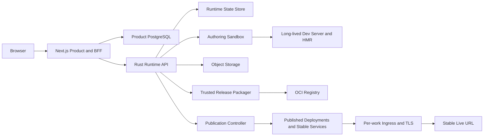

# zeronDesign 快速生成、实时预览、编辑与持久化发布实施方案

## 1. 文档目的

本方案把当前 zeronDesign Runtime 产品化为类似 v0.dev / Lovable 的完整工作流：

```text
输入 Prompt / Markdown / 附件
  -> 快速生成可见页面
  -> 左侧对话持续修改
  -> 右侧实时预览
  -> 形成可追溯版本
  -> 一键发布
  -> 获得稳定 Live URL
  -> 下一次发布保持 URL 不变并更新内容
  -> 必要时回滚到历史 Release
```

本文不是重新设计 Runtime。当前仓库已经完成 Authoring Sandbox、不可变 Artifact、WorkRelease、
Published Runtime、稳定 Host、Blue/Green、Rollback 和恢复能力。本方案只补齐产品闭环和交互速度。

## 2. 最终判断与交付目标

### 2.1 判断

当前状态为 **Conditional Go**：

- Runtime 与发布基础设施可以复用，架构方向正确；
- 产品前端、BFF、Release 创建编排和 HMR 编辑预览仍需实现；
- 当前文件型持久化适合单实例和本地/内网部署，公网 SaaS 需要 PostgreSQL、对象存储与多副本一致性；
- 在权限收口、真实域名/TLS、Registry 和生产证据完成前，不得把现有能力标记为公网生产可用。

### 2.2 MVP 必须交付的用户结果

1. 用户创建项目并提交 Prompt、Markdown 或附件。
2. 系统生成 Brief，用户确认后进入工作台。
3. 工作台左侧显示对话、执行状态和错误，右侧显示预览。
4. 生成和编辑过程中，右侧通过 Dev Preview 快速刷新。
5. 每次成功 Build 形成不可变 `ProjectVersion`，失败时继续显示上一成功版本。
6. 用户点击发布后，系统自动完成 Release packaging 和 Publish，不要求用户理解 `releaseId`。
7. 首次发布返回唯一稳定 Live URL。
8. 后续发布在同一 Live URL 上原子切换到新 Release。
9. 发布失败时线上旧版本不受影响。
10. 用户可以查看版本历史、发布历史并回滚。

### 2.3 MVP 明确不做

- Figma 画布级可视化编辑器；
- 多人同时编辑同一个项目；
- SSR、Server Actions、用户自定义后端和数据库；
- 自定义域名自助接入；
- 插件市场、计费和公开模板市场；
- 任意 Dockerfile 或用户自定义运行镜像；
- 让浏览器直接访问 Sandbox Service；
- 让 Agent/Sandbox 获得 Registry push credential。

MVP 发布范围保持 `static_web_v1`，覆盖 `next-app` 和 Fumadocs Docs。

## 3. 当前能力基线

| 能力 | 当前实现 | 产品化判断 |
|---|---|---|
| Brief-first | Runtime 已有 Brief、确认和 Build/Edit phase | 直接复用 |
| 生成与编辑 | Agent loop、工具、Sandbox、源码快照恢复 | 直接复用 |
| 事件流 | HTTP + SSE，支持重连与事件重放 | BFF 代理后复用 |
| Candidate Preview | Preview Lease + Runtime Proxy | 作为受保护草稿预览基础 |
| 不可变版本 | `ProjectVersion`、ArtifactManifest、source snapshot | 直接复用 |
| 当前预览 | `/preview/{projectId}/current` 和 Artifact current pointer | 直接复用 |
| WorkRelease | 内容寻址、OCI、scan/sign/evidence | 直接复用 |
| 独立发布 | 每 Release Deployment、稳定 Service、Ingress | 直接复用 |
| 固定 Live URL | 永久 `hostSlug` + `WORKS_BASE_DOMAIN` | 直接复用 |
| 安全更新 | Blue/Green、EndpointSlice 收敛、外部 identity probe | 直接复用 |
| 回滚恢复 | Rollback、失败切回、controller restart replay | 直接复用 |
| 产品前端 | 仓库无 `apps/web` | 新建 |
| Release 创建 API | Store/Packager 已有，缺产品 HTTP 编排入口 | 新增 |
| 快速编辑预览 | 当前 `preview.publish` 需要完整 build + screenshot | 新增 Dev Preview |
| Publication shared client | `packages/shared` 尚未覆盖 Publish API | 新增 |
| SaaS 持久化 | Publication/Release/Artifact 仍以文件和 journal 为主 | 分阶段替换 |

## 4. 核心产品决策

### D1. “快速预览”和“可信版本”必须分层

编辑过程追求低延迟；可分享版本和正式发布追求确定性。两者不得使用同一成功标准。

```text
Draft Dev Preview
  - 长驻 Dev Server
  - HMR / 增量编译
  - 允许短暂编译错误
  - 不改变 current ProjectVersion
  - 不可直接发布

Promoted Preview
  - 完整 production build
  - ArtifactManifest 校验
  - Browser screenshot / fidelity / review gate
  - 形成不可变 ProjectVersion
  - 更新 authoring current pointer

Published Work
  - Validated WorkRelease
  - 独立 Deployment / Service / Ingress
  - 稳定 Live URL
  - Blue/Green Update / Rollback
```

### D2. Live URL 是稳定别名，不是版本 ID

对用户暴露两类地址：

| 地址 | 示例 | 语义 |
|---|---|---|
| Live URL | `https://w-ab12.works.example.com` | 始终指向当前已发布 Release，更新后地址不变 |
| Version Review URL | `/api/projects/p1/versions/v7/preview/...` | 固定指向某个不可变 ProjectVersion，仅项目成员可访问 |

MVP 不要求每个历史 Release 有独立公网域名。若后续需要公开版本归档，可增加：

```text
https://release-ab12--w-ab12.works.example.com
```

该能力必须配套保留策略、独立路由和成本上限，不进入首个 MVP。

### D3. 产品只操作 ProjectVersion，BFF 隐藏 Release 细节

用户点击“发布当前版本”时只提交 `versionId`。BFF/Runtime 编排负责：

```text
ProjectVersion
  -> ReleasePackaging
  -> Validated WorkRelease
  -> PublishOperation
  -> Published
```

UI 不要求用户手动复制 `releaseId`、`expectedGeneration` 或 ETag。

### D4. Runtime 继续拥有执行和发布真相

- Runtime：Run、Conversation、ProjectVersion、Artifact、Release、Publication、Sandbox 状态真相；
- Product DB：用户、组织、项目列表、产品权限、展示元数据、通知和审计索引；
- Kubernetes：Sandbox 和 Published workload 的基础设施状态；
- Object Storage：源码快照、不可变 Artifact、截图和证据 bytes；
- OCI Registry：Validated WorkRelease 镜像。

BFF 不得重新实现 preview promotion、release validation 或 publish state machine。

### D5. 浏览器只访问 BFF 和 Published Host

浏览器不得直接访问 Runtime 内部地址或 Sandbox Service。所有 Authoring Preview 请求：

```text
Browser
  -> BFF /api/projects/{projectId}/draft-preview/{path}
  -> signed short-lived principal
  -> Runtime Preview Proxy
  -> Sandbox Dev Server / static candidate
```

Published Host 只路由到独立 Published Runtime，不连接 Authoring Workspace。

## 5. 目标架构



### 5.1 三条独立链路

#### Authoring 链路

```text
Chat -> Run -> Sandbox source mutation -> Dev Server/HMR -> Draft Preview
```

#### Version 链路

```text
Draft source -> Production Build -> Manifest -> Screenshot/Gates
             -> immutable ProjectVersion -> promoted authoring preview
```

#### Publication 链路

```text
ProjectVersion -> WorkRelease -> PublishOperation
               -> release-specific Deployment -> stable Service -> Live URL
```

三条链路通过 `projectId`、`versionId`、`releaseId` 显式关联，不允许把 Draft Preview URL 当成正式发布地址。

## 6. 用户流程与状态设计

### 6.1 创建与首次生成

1. 用户创建项目，选择 Website 或 Docs。
2. 上传 Markdown/附件或输入 Prompt。
3. BFF 创建 ContentSource 并启动 Brief Run。
4. SSE 显示解析和 Brief 生成状态。
5. 用户确认结构化 Brief。
6. Runtime 获取 Warm Sandbox，初始化模板和依赖。
7. Agent 写入源码；Dev Preview 首次 Ready 后立即在右侧显示。
8. Agent 完成生产 Build、截图和 Gate。
9. `preview.updated` 到达后，UI 把当前版本切为 Promoted Preview。

### 6.2 对话编辑

1. 用户输入“把 Hero 改成深色、按钮文案改为开始使用”。
2. UI 乐观追加用户消息，项目进入 `editing`。
3. Runtime 以当前 `ProjectVersion.sourceSnapshotUri` 恢复工作区。
4. Dev Server 继续运行或恢复后重新 Ready。
5. Agent 小步修改源码；每次文件 commit 增加 `sourceRevision`。
6. HMR 刷新右侧 Draft Preview。
7. Agent 完成 production build 和 Gate 后生成新 `ProjectVersion`。
8. `preview.updated` 原子切换 Promoted Preview。
9. 如果失败，保留上一 Promoted Preview，并在左侧显示可操作错误。

### 6.3 首次发布

1. 用户点击“发布”。
2. BFF 读取当前 Promoted `versionId`。
3. 创建 ReleasePackaging，显示 `packaging` 进度。
4. Runtime 完成 build/push/SBOM/scan/sign/validate。
5. BFF 使用 `If-None-Match: *` 创建 PublishOperation。
6. Controller 创建 Deployment、Service、Ingress，并执行内外部 identity probe。
7. Operation `completed` 后返回 Live URL。
8. UI 显示“已发布”、Live URL、发布时间和 Release ID。

### 6.4 更新发布

1. 用户编辑并得到新 Promoted ProjectVersion。
2. UI 显示“有未发布更改”。
3. 用户点击“更新发布”。
4. 系统创建新的 Validated WorkRelease。
5. BFF 从 deployment-state 获取 ETag/currentReleaseId/generation。
6. 使用 `If-Match` 提交 Update。
7. Green Ready 和外部探测成功后，同一个 Live URL 切换到新内容。
8. 失败时 UI 显示失败，线上继续服务旧 Release。

### 6.5 回滚与下线

- 回滚：用户从 Release History 选择历史 Release，确认后创建 RollbackOperation；
- 下线：先移除外部 Ingress，再删除 Service/workload，保留 host 与 Release history；
- 重新发布：复用原 `hostSlug`，不生成新 Live URL。

## 7. 前端信息架构

### 7.1 页面

```text
/projects
/projects/new
/projects/{projectId}/brief
/projects/{projectId}/workspace
/projects/{projectId}/versions
/projects/{projectId}/deployments
/projects/{projectId}/settings
```

### 7.2 Workspace 布局

```text
+----------------------+--------------------------------------+
| Chat / Activity      | Preview                              |
|                      |                                      |
| user prompt          | Draft | Promoted                     |
| agent progress       |                                      |
| tool status          | iframe                               |
| build errors         |                                      |
| review findings      |                                      |
|                      |                                      |
+----------------------+--------------------------------------+
| composer             | version | viewport | refresh | open |
+----------------------+--------------------------------------+
```

### 7.3 顶部状态

| 状态 | UI 文案 | Preview 行为 |
|---|---|---|
| `idle` | 已保存 | 显示当前 Promoted |
| `generating` | 正在生成 | Draft Ready 后切到 Draft |
| `editing` | 正在修改 | HMR 持续刷新 Draft |
| `building` | 正在验证版本 | 继续显示可用 Draft 或上一 Promoted |
| `build_failed` | 构建失败 | 保留上一 Promoted，可查看错误 |
| `promoted` | 新版本已就绪 | 切换新 Promoted |
| `unpublished_changes` | 有未发布更改 | Live URL 保持旧 Release |
| `packaging` | 正在准备发布 | Live URL 保持旧 Release |
| `publishing` | 正在切换线上版本 | Live URL 保持旧 Release |
| `published` | 已发布 | 显示 Live URL |
| `publish_failed` | 发布失败 | Live URL 保持旧 Release |

### 7.4 Preview 原则

1. Draft 和 Promoted 必须有明确标签，禁止让用户误认为 Draft 已发布。
2. `preview.candidate` 不直接改变 Promoted 状态。
3. `preview.updated` 是 Promoted iframe 的唯一切换信号。
4. iframe 切换使用新 iframe 预加载，Ready 后替换旧 iframe，避免白屏。
5. 编辑失败时始终保留最后成功版本。
6. Preview 请求使用项目级短期 Token，不把 Runtime principal 暴露给页面脚本。

## 8. Runtime API 补齐方案

### 8.1 必须新增：Create Release

```http
POST /projects/{projectId}/versions/{versionId}/releases
Idempotency-Key: <uuid>
Content-Type: application/json

{
  "runtimeProfileId": "static-web-v1"
}
```

响应：

```json
{
  "release": {
    "id": "release-...",
    "projectId": "project-...",
    "versionId": "version-...",
    "status": "packaging"
  },
  "packaging": {
    "id": "packaging-...",
    "projectId": "project-...",
    "releaseId": "release-...",
    "status": "prepared"
  }
}
```

约束：

- Version 必须属于 Project；
- Version 必须为 `promoted`；
- ArtifactManifest 和 source snapshot 必须存在且 hash 一致；
- 相同 Project/Version/Profile/manifest 输入幂等返回同一 Release；
- Agent/Sandbox 不接触 Registry credential；
- Release 未 `validated` 前不能作为 Publish target。

### 8.2 必须新增：Packaging 查询

```http
GET /release-packagings/{packagingId}
```

返回状态：

```text
prepared
building
pushed
scanning
signing
validated
failed
reconcile_required
```

响应必须包含可展示的阶段、重试次数、最后错误、releaseId，不能返回敏感签名私钥或 Registry credential。

### 8.3 建议新增：Packaging 事件

优先沿用 SSE，而不是让前端每秒轮询：

```text
release.packaging_started
release.image_built
release.image_pushed
release.scan_completed
release.signature_completed
release.validated
release.failed
```

如果首版不增加新 SSE surface，BFF 可用有上限的 1 秒退避轮询，最长 10 分钟，并在页面离开后停止。

### 8.4 必须新增：固定 Version Artifact 路由

当前只有 Artifact `current` 路由。增加：

```http
GET /artifacts/{projectId}/versions/{versionId}
GET /artifacts/{projectId}/versions/{versionId}/
GET /artifacts/{projectId}/versions/{versionId}/{*artifactPath}
```

该路由必须：

- 验证项目访问权限；
- 只读取不可变版本目录；
- 校验 ArtifactManifest hash；
- 返回 `Cache-Control: private, immutable`；
- 不通过 Referer 推断项目授权；
- 不允许路径逃逸。

### 8.5 必须新增：Dev Preview Session

Dev Preview 不应作为模型自由组合的 Shell 命令，而应由 Runtime application service 管理。

```http
POST /projects/{projectId}/dev-preview
GET  /projects/{projectId}/dev-preview
DELETE /projects/{projectId}/dev-preview
```

核心模型：

```text
DevPreviewSession
- id
- projectId
- sandboxBindingId
- sourceRevision
- status: starting | ready | compiling | error | stopped | expired
- internalPort
- proxyLeaseId
- framework
- startedAt
- lastActivityAt
- expiresAt
- lastError
```

事件：

```text
dev_preview.starting
dev_preview.ready
dev_preview.compiling
dev_preview.updated
dev_preview.error
dev_preview.stopped
```

### 8.6 Shared Contract

所有新增请求、响应和事件先进入：

```text
packages/shared/src/schemas.ts
packages/shared/src/events.ts
packages/shared/src/runtime-client.ts
```

禁止 `apps/web` 手写 Runtime payload 类型。

Publication client 至少补齐：

```text
createRelease(projectId, versionId, request, idempotencyKey)
getReleasePackaging(packagingId)
publishWork(projectId, request, headers)
rollbackWork(projectId, request, headers)
unpublishWork(projectId, request, headers)
getDeploymentState(projectId)
getWorkReleases(projectId)
getPublicationOperation(operationId)
getVersionArtifactUrl(projectId, versionId)
```

## 9. 快速预览技术方案

### 9.1 Sandbox 生命周期

```text
Acquire warm sandbox
  -> restore/init project
  -> dependency restore
  -> start framework dev server once
  -> keep alive while project is active
  -> apply source mutations transactionally
  -> HMR refresh
  -> idle expiry
```

建议默认：

- 活跃会话 idle TTL：30 分钟；
- 页面仍打开且有心跳时续租；
- Project 同时只允许一个 writable Authoring Session；
- 新 Edit Run 复用 ready session；
- session 丢失时从当前 Version source snapshot 恢复；
- 依赖变化后允许一次受控重启 Dev Server；
- Production build 不复用 Dev Server 输出。

### 9.2 模板启动命令由 Template Registry 决定

禁止让模型提供任意 dev command。模板声明：

```text
TemplateRuntimeCapabilities
- devCommand: exec array
- devPort
- readinessPath
- installCommand
- buildCommand
- outputPath
- supportsHmr
- supportsStaticRelease
```

示例：

```text
next-app
  devCommand = ["npm", "run", "dev", "--", "--host", "0.0.0.0"]
  devPort = 4321

fumadocs-docs
  devCommand = ["npm", "run", "dev", "--", "--hostname", "0.0.0.0"]
  devPort = 3000
```

实际值必须来自当前锁定模板 manifest，不允许前端或模型覆盖。

### 9.3 Source Revision

每次 workspace transaction commit 后增加单调递增 `sourceRevision`：

```text
mutation prepared
  -> files committed
  -> sourceRevision N+1
  -> dev_preview.compiling
  -> dev_preview.updated(N+1)
```

UI 只接受不小于当前 revision 的 ready/update 事件，避免旧编译结果覆盖新修改。

### 9.4 Preview 错误处理

| 错误 | Runtime 行为 | UI 行为 |
|---|---|---|
| 语法错误 | Dev session 保持，返回 structured diagnostic | 显示错误 overlay，保留上一可见画面 |
| Dev Server 崩溃 | 最多自动重启 2 次 | 显示恢复中 |
| 依赖缺失 | 通过受控 ensure_dependencies 修复 | 显示安装阶段 |
| Sandbox 丢失 | 从 current source snapshot 恢复新 Sandbox | 显示重新连接 |
| HMR 超时 | fallback 全量 iframe reload | 不改变 Promoted Version |
| Production build 失败 | 不 promotion | 显示 Build 日志，Live URL 不变 |

### 9.5 性能目标

| 指标 | MVP 目标 | 统计口径 |
|---|---:|---|
| Warm Sandbox acquire P95 | <= 2 秒 | claim 到 channel ready |
| 首次 Draft 可见 P50 | <= 15 秒 | Brief confirmed 到 iframe ready |
| 文本/CSS 修改刷新 P50 | <= 1 秒 | source commit 到 iframe ready |
| 结构修改刷新 P95 | <= 5 秒 | source commit 到 iframe ready |
| Production build + promotion P95 | <= 45 秒 | build start 到 preview.updated |
| 首次 Publish P95 | <= 120 秒 | click 到 Live URL 200 |
| Update traffic switch P95 | <= 45 秒 | validated release 到 external probe success |

上线前必须通过真实模板、真实 Sandbox、真实浏览器测量，不能用单元测试耗时替代。

## 10. Product BFF 与数据库

### 10.1 建议目录

```text
apps/web/
  app/
    api/projects/
    projects/[projectId]/brief/
    projects/[projectId]/workspace/
    projects/[projectId]/versions/
    projects/[projectId]/deployments/
  components/workspace/
  lib/auth/
  lib/db/
  lib/runtime/
  lib/sse/
packages/shared/
```

### 10.2 Product DB 最小表

```text
users
organizations
organization_members
projects
project_members
content_sources
project_runtime_bindings
deployment_bookmarks
notifications
product_audit_records
```

不要在 Product DB 复制完整 AgentEvent、ConversationItem、ProjectVersion、Release 或 Publication 状态；
这些由 Runtime 持有。Product DB 只保存稳定外键、查询索引和展示元数据。

### 10.3 项目字段

```text
projects
- id
- organization_id
- name
- kind: website | docs
- template_key
- runtime_project_id
- status
- created_by
- created_at
- updated_at
```

### 10.4 BFF 发布编排伪代码

```text
publish(projectId, versionId):
  authorize(projectId, publish:write)
  version = runtime.getVersion(projectId, versionId)
  assert version.status == promoted

  packaging = runtime.createRelease(projectId, versionId, idempotencyKey)
  wait until packaging.validated or failed

  state = runtime.getDeploymentState(projectId) or initial
  if state.currentReleaseId is null:
    runtime.publish(releaseId, If-None-Match: *, expectedGeneration)
  else:
    runtime.publish(
      releaseId,
      If-Match: state.etag,
      expectedCurrentReleaseId: state.currentReleaseId,
      expectedGeneration: state.desiredGeneration
    )

  wait operation terminal
  return deploymentState.publicUrl
```

所有等待都必须可取消 UI 订阅，但后端 Operation 继续执行并可在刷新页面后恢复显示。

## 11. 持久化演进

### 11.1 第一阶段：保持当前 Store，完成产品闭环

内网 MVP 可继续使用现有 journal/checkpoint 和持久卷，但必须：

- Runtime 单写实例；
- Store 目录挂载持久卷；
- 每日备份；
- 明确磁盘容量告警；
- Runtime Pod 重建后执行恢复 Gate；
- Artifact 和 source snapshot 不使用临时容器层。

### 11.2 第二阶段：SaaS Store Adapter

保持 domain/store 接口，替换基础设施实现：

```text
PostgreSQL
  runs / events / conversations / versions
  release / packaging / publication / outbox
  compare-and-swap generation

S3-compatible Object Storage
  source snapshots
  immutable artifacts
  screenshots
  SBOM / provenance / scan evidence

OCI Registry
  WorkRelease images by digest
```

迁移要求：

- 双读校验期；
- 内容 hash 一致；
- journal 导入工具可重入；
- currentVersion/currentRelease CAS 不丢失；
- outbox 未完成事件可恢复；
- 迁移前后相同 version/release URL 语义不变。

### 11.3 保留策略

MVP 默认建议：

- ProjectVersion：最近 50 个或 90 天，取更大保护范围；
- Published current/previous/lastSuccessful：永久保护，直到项目删除；
- Release rollback window：至少 30 天；
- Failed packaging：7 天后可清理；
- Screenshots：跟随 ProjectVersion；
- 审计记录：至少 180 天；
- 法务保留/审计 hold 优先于自动 GC。

删除必须先生成保护引用快照，不能只按时间删除 Registry image。

## 12. 权限与安全门槛

### 12.1 当前上线阻断项

现有 route contract 中部分 Run、Conversation、Preview metadata 和 Artifact current 路由仍标记为无授权。
公网产品上线前必须完成项目级授权收口。

至少覆盖：

```text
POST /runs
POST /runs/{runId}/continue
POST /runs/{runId}/cancel
GET  /runs/{runId}/events
GET  /projects/{projectId}/conversation
GET  /projects/{projectId}/runtime-state
GET  /preview/{projectId}/*
GET  /artifacts/{projectId}/*
POST /projects/{projectId}/versions/{versionId}/releases
Publication 全部路由
```

### 12.2 权限模型

```text
project:read
project:edit
project:delete
preview:read
release:create
publish:write
publish:rollback
publish:unpublish
audit:read
```

### 12.3 Token 规则

- Browser session 只到 BFF；
- BFF 使用短期签名 principal 调 Runtime；
- Token 绑定 principal、project、operation、expiry；
- BFF 删除客户端伪造的内部 header 后重新写入；
- SSE 重连 Token 不得写入 URL query；
- Preview iframe 使用 HttpOnly/SameSite cookie 或一次性 exchange，不把长期 token 放进 HTML；
- Runtime 日志禁止记录完整 Authorization、principal token、Registry credential。

### 12.4 Published Work 隔离

- 不挂载 Authoring PVC；
- 不注入 Runtime、Sandbox 或 Registry credential；
- 默认拒绝访问 Runtime namespace 和其他 Work；
- 只运行 digest-pinned、scan/sign 已通过的镜像；
- Ingress 只指向 stable per-work Service；
- 每个 HTML 响应携带可验证 Release ID；
- 更新窗口 HTML `no-store`，静态 hash asset 可长缓存。

## 13. 可观测性与运营

### 13.1 必须记录的关联 ID

```text
requestId
principalId
projectId
runId
sandboxBindingId
devPreviewSessionId
versionId
packagingId
releaseId
publishOperationId
desiredGeneration
```

### 13.2 核心指标

```text
sandbox_acquire_duration_seconds
dev_preview_first_ready_duration_seconds
dev_preview_refresh_duration_seconds
dev_preview_restart_total
run_time_to_first_tool_seconds
run_time_to_promoted_version_seconds
production_build_duration_seconds
release_packaging_duration_seconds
release_packaging_failure_total
publication_operation_duration_seconds
publication_switch_rollback_total
published_external_probe_failure_total
live_url_availability
```

### 13.3 告警

- Publication Operation 超过 5 分钟非终态；
- Stable Service selector 与 Store currentReleaseId 漂移；
- 外部 probe 连续失败；
- Release packaging reconcile_required 堆积；
- Sandbox WarmPool 可用容量低于阈值；
- Dev Preview crash/restart 比例突增；
- Object Storage/Registry hash 不一致；
- Runtime Store 磁盘超过 70%/85%。

### 13.4 运维动作

必须提供：

- 按 Operation ID 查询全过程；
- 重放可恢复 Operation；
- 冻结项目写入；
- 手动回滚但仍走 Runtime state machine；
- 导出 Project/Version/Release 证据；
- 安全下线 Live URL；
- 校验 DNS、TLS、Ingress、Service、Deployment 与 Store identity。

禁止把手工修改 Service selector 当作正常回滚流程。

## 14. 分阶段实施计划

### Wave P0：契约与安全地基

目标：前端开工前冻结缺失契约，并关闭明显越权面。

#### 工作项

1. 新增 Create Release 和 Packaging Query 契约。
2. 新增 Version Artifact 固定路由契约。
3. Publication/Release/Version schemas 加入 `packages/shared`。
4. Runtime client 补齐发布能力。
5. Run/Conversation/Preview/Artifact 路由统一项目授权。
6. 更新 HTTP route manifest 和 mock BFF tests。
7. 定义 DevPreviewSession schema 和事件，不实现 HMR。

#### 退出门槛

- shared tests/typecheck 全绿；
- Rust HTTP tests 全绿；
- 无产品 API 手写重复类型；
- 未授权用户无法读取他人 Conversation、SSE、Preview 或 Artifact；
- Create Release 对错误 Project/Version、非 promoted version、hash drift fail closed；
- 当前 Publish/Update/Rollback 行为不回归。

### Wave P1：Product Shell 与稳定预览

目标：先用现有 Promoted Preview 做出可用产品闭环，不等待 HMR。

#### 工作项

1. 创建 `apps/web`、认证、Product DB 和项目列表。
2. 实现项目创建、ContentSource、Brief review/confirm。
3. 实现左 Chat、SSE、Conversation replay。
4. 实现右侧 Promoted Preview、rebuilding 状态和 version badge。
5. 实现 Edit message 和 source snapshot restore 流程。
6. 实现版本历史和固定 Version Review URL。
7. 建立前端 E2E fixture 和 Runtime mock contract。

#### 退出门槛

- 用户可从空项目完成生成、预览、编辑和刷新恢复；
- SSE 断线重连不重复消息；
- 构建失败不替换上一成功 Preview；
- Project A 无法读取 Project B 数据；
- Website 与 Docs 各有一次真实 provider E2E；
- 浏览器可见页面证据完整，不以 `/health` 代替。

### Wave P2：一键发布闭环

目标：用户只选择 Version，即可得到并维护稳定 Live URL。

#### 工作项

1. 实现 ReleasePackaging application service 和后台任务 owner。
2. BFF 实现一键 Release + Publish 编排。
3. 实现发布状态、Live URL、Release history UI。
4. 实现 Update、Rollback、Unpublish。
5. 配置真实 Registry、base image digest、scan/sign policy。
6. 配置 `WORKS_BASE_DOMAIN`、wildcard DNS/TLS、Ingress。
7. 页面刷新后可恢复进行中的 Packaging/Publication Operation。

#### 退出门槛

- 首次 Publish 返回 HTTPS Live URL；
- Update 后 URL 不变且内容切换到目标 Release；
- 失败 Update 继续服务旧 Release；
- Rollback 改变真实外部流量和 Store current；
- Unpublish 外部不可达，Republish 复用原 Host；
- Sandbox 释放后 Live URL 仍可用；
- Website 和 Docs 都通过真实公网同构环境 Gate。

### Wave P3：Dev Preview / HMR

目标：把编辑刷新从完整 build 缩短为秒级。

#### 工作项

1. Template Registry 增加 dev capabilities。
2. Runtime 增加 DevPreviewSession service/controller。
3. Sandbox 启动长驻 Dev Server。
4. Workspace transaction 产生 sourceRevision。
5. BFF 增加受保护 Draft Preview proxy。
6. 前端增加 Draft/Promoted 切换和错误 overlay。
7. 实现 session TTL、heartbeat、crash restart 和 snapshot recovery。
8. WarmPool 按模板预热依赖。

#### 退出门槛

- CSS/文本编辑 P50 <= 1 秒；
- 结构修改 P95 <= 5 秒；
- Dev Server crash 可自动恢复且不丢源码；
- Draft 永远不能直接成为 Published target；
- Production Build/Gate 仍是 promotion 必经路径；
- `next-app`/Fumadocs HMR 与完整 Build 结果通过一致性测试。

### Wave P4：SaaS 持久化与多副本

目标：从单写 Runtime + PVC 升级为可横向扩展的生产服务。

#### 工作项

1. PostgreSQL Store adapters。
2. S3-compatible Artifact/Snapshot/Evidence adapters。
3. Outbox/lease/operation 多副本并发控制。
4. 数据迁移与双读 hash 校验工具。
5. 备份、恢复、容量和 retention jobs。
6. Runtime 多副本、滚动升级和故障注入。

#### 退出门槛

- 任一 Runtime Pod 删除不丢 Run、Version、Release 或 Operation；
- 两个 Runtime 副本不能并发提交同一 generation；
- Object Storage bytes 与 manifest hash 一致；
- 备份恢复后 Stable URL 仍指向正确 Release；
- 进行中的 Publish 在控制器重启后确定性恢复；
- RPO/RTO 达到产品批准目标。

## 15. 建议 PR/Commit 拆分

```text
PR-01 docs: freeze rapid authoring and product publication contracts
PR-02 feat(shared): add release packaging and publication client schemas
PR-03 feat(runtime): add promoted version to validated release API
PR-04 fix(runtime): authorize run conversation preview and artifact surfaces
PR-05 feat(runtime): add immutable version artifact routes
PR-06 feat(web): add product db auth and project shell
PR-07 feat(web): add brief generation and confirmation flow
PR-08 feat(web): add chat sse and promoted preview workspace
PR-09 feat(web): add edit version history and review links
PR-10 feat(web): add one click release and publish orchestration
PR-11 feat(web): add deployment history rollback and unpublish
PR-12 feat(runtime): add template dev preview capabilities
PR-13 feat(runtime): add supervised dev preview sessions
PR-14 feat(web): add draft preview hmr and diagnostics
PR-15 perf(runtime): add warm template dependency pools and latency gates
PR-16 feat(storage): add postgres runtime state adapters
PR-17 feat(storage): add object artifact and snapshot adapters
PR-18 test(runtime): add multi replica recovery and persistence gates
```

每个 PR 必须单独可回滚；不得把安全授权、前端功能和 Store 迁移混在一个提交中。

## 16. 测试矩阵

### 16.1 Contract

- TypeScript Zod 与 Rust serde 字段一致；
- HTTP route manifest 覆盖新增路由；
- BFF 只导入 `packages/shared` 类型；
- SSE 新事件可解析、可忽略未知 metadata；
- Idempotency-Key、If-Match、If-None-Match 行为冻结。

### 16.2 Generation/Edit

- Website Prompt -> Brief -> Build -> Version；
- Docs Markdown -> Brief -> Build -> Version；
- Edit 从正确 baseVersion 恢复；
- 并发 Edit 的 stale baseVersion 冲突；
- Sandbox 丢失后从 source snapshot 恢复；
- Build 失败不修改 currentVersion。

### 16.3 Dev Preview

- 初始 Ready；
- CSS/文本 HMR；
- 多文件 transaction 只暴露 commit 后状态；
- 语法错误和修复；
- Dev Server crash/restart；
- session expiry/reacquire；
- 旧 sourceRevision 事件不覆盖新 revision；
- BFF prefix 下 HTML/JS/CSS/font/image 正常加载。

### 16.4 Version/Artifact

- current pointer CAS；
- fixed version URL 永远返回相同 bytes；
- manifest hash drift 返回 conflict；
- reserved path 和 traversal 阻断；
- Sandbox release 后 Artifact 仍可读取；
- Project 权限隔离。

### 16.5 Release/Publication

- 相同 Version 创建 Release 幂等；
- scan/sign 未完成不能发布；
- 首次 Publish；
- Update 同 Host；
- Green 未 Ready 保持 Blue；
- EndpointSlice 混流阻断；
- external probe 失败切回；
- Rollback；
- Unpublish/Republish 原 Host；
- controller/runtime restart recovery；
- GC 不删除 desired/current/previous/lastSuccessful。

### 16.6 Browser E2E

- 创建项目到首次可见 Preview；
- 对话编辑并观察右侧更新；
- 刷新页面恢复 Conversation/Version/Operation；
- 发布后新标签页打开 Live URL；
- 再次编辑和 Update 后原 Live URL 内容改变；
- 回滚后原 Live URL 返回历史内容；
- 无权限用户收到 403/404，不泄露项目存在性。

## 17. 上线门槛

### 17.1 Internal Alpha

- P0、P1 完成；
- 真实 Website/Docs generation/edit E2E；
- 项目级授权全覆盖；
- 单实例 Runtime + PVC 有备份；
- 可接受完整 build 驱动 Preview；
- 不开放公网 Published Host。

### 17.2 Internal Beta

- P2 完成；
- 真实 TLS Live URL；
- Publish/Update/Rollback/Unpublish Gate 全绿；
- 发布失败不影响旧版本；
- Release/Operation UI 可恢复；
- 已有值班 Runbook 和告警。

### 17.3 Public/Production Candidate

- P3 完成并达到预览延迟 SLO；
- P4 或经架构评审批准的等价 HA Store；
- DNS/TLS/Registry/KMS/scan/admission 正式策略批准；
- 备份恢复、滚动升级、故障注入通过；
- 配额、滥用防护、审计、数据删除和 retention 完整；
- 真实候选 commit、干净工作树、镜像 digest 和 live pod imageID 证据一致。

## 18. 资源与排期建议

以下为 1 个小型跨职能团队的工程估算，不是承诺日期：

| Wave | 建议投入 | 预估 |
|---|---|---:|
| P0 契约与安全 | 1 Runtime + 1 Web | 1–2 周 |
| P1 Product Shell | 2 Web + 1 Runtime + 0.5 Design/QA | 3–4 周 |
| P2 发布闭环 | 1 Web + 1 Runtime + 1 Platform | 2–3 周 |
| P3 HMR 快速预览 | 1 Web + 2 Runtime/Platform | 3–4 周 |
| P4 SaaS 持久化 | 2 Runtime/Platform + 1 SRE | 4–6 周 |

最快可演示路径是 P0 + P1；第一个完整可发布产品是 P0 + P1 + P2；接近 v0/Lovable 交互体感需要再完成 P3。

不建议为了演示提前跳过 P0 授权和 Release 编排，也不建议让 P4 阻塞内网 Alpha。

## 19. 风险与停止条件

| 风险 | 影响 | 处理 |
|---|---|---|
| 把 Dev Preview 当正式版本 | 用户看到未验证内容 | Draft/Promoted/Published 三层强状态 |
| 完整 build 太慢 | 编辑体验差 | P3 HMR；P1 先保证可靠闭环 |
| Release 创建仍靠脚本 | 发布按钮无法产品化 | P0 新增 Create Release API |
| BFF 复制 Runtime 状态机 | 状态漂移 | Runtime 单一真相，BFF 只编排 |
| 无授权 Artifact/Events | 数据泄露 | P0 全路由项目授权 |
| 文件 Store 多副本写 | 数据损坏 | P4 前保持单写；上线前迁移 |
| Registry/scan/sign 不稳定 | 发布长时间卡住 | Operation 可恢复、超时和告警 |
| 旧 Release 无限保留 | 资源成本上升 | 明确保留窗口和保护集合 |
| WarmPool 容量不足 | 首屏变慢 | 模板级容量指标和自动扩缩 |
| 自定义域名过早进入 MVP | DNS/TLS/安全复杂度激增 | MVP 只使用平台稳定域名 |

遇到以下任一条件必须停止进入 Public Candidate：

1. Preview/Artifact/Conversation 存在跨项目访问；
2. 发布失败会改变 currentReleaseId 或中断旧 Live URL；
3. Validated Release 不能唯一绑定 image digest；
4. Runtime 重启后 Operation 无法恢复或进入歧义状态；
5. Store/Registry/Object bytes 与 manifest hash 不一致；
6. 浏览器必须直连 Sandbox 才能预览；
7. Agent/Sandbox 获得 Registry push credential；
8. 线上镜像 digest 与候选 commit/evidence 不一致。

## 20. 最终验收场景

使用一个 Website 和一个 Docs 项目完成以下真实环境验收：

```text
1. 创建项目
2. 输入真实 Prompt/Markdown
3. 确认 Brief
4. 首次 Draft Preview 可见
5. 形成 promoted Version A
6. 对话修改标题、颜色和结构
7. Draft Preview 快速刷新
8. 形成 promoted Version B
9. 发布 Version B，获得 Live URL L
10. 释放 Authoring Sandbox，L 仍返回 200
11. 再次编辑形成 Version C
12. Update 到 Release C，L 不变且内容更新
13. 注入 Green probe 失败，L 继续服务 Release C
14. 发布 Version D 成功
15. Rollback 到 Release C，L 不变且内容恢复
16. Runtime/Controller 重启，L 和 Store 状态一致
17. Unpublish 后 L 关闭
18. Republish 后复用 L
```

验收证据必须包含：

- repository commit 和 dirty state；
- Runtime/Sandbox/Published image digest；
- Run SSE；
- source snapshot 和 ArtifactManifest hash；
- versionId/releaseId/operationId；
- Browser screenshots；
- Live URL HTTP/TLS/release identity；
- Update/Rollback 前后内容差异；
- Sandbox release 后 Live URL 可用性；
- Controller restart recovery 结果。

## 21. 推荐执行顺序

立即执行顺序：

```text
P0-1  冻结 Create Release / Packaging / Version Artifact 契约
P0-2  补 packages/shared publication client
P0-3  实现 Create Release application service + HTTP route
P0-4  收口 Run/Conversation/Preview/Artifact 项目授权
P1-1  创建 apps/web + Product DB + auth
P1-2  Brief flow
P1-3  Chat/SSE + Promoted Preview workspace
P1-4  Edit + Version History
P2-1  一键 Release/Publish BFF 编排
P2-2  Deployment/Release History + Rollback/Unpublish
P2-3  真实 DNS/TLS/Registry E2E
P3    Dev Preview/HMR
P4    PostgreSQL/Object Storage/多副本
```

第一项实现工作应是 **P0 契约冻结与 Create Release API**。它是前端发布按钮与现有 Runtime 发布底座之间唯一缺失的关键桥梁。
