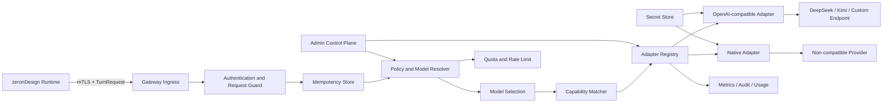

# Provider Gateway 实施方案

## 0. 执行摘要

### 0.1 结论

当前仓库已经具备 Provider Gateway 的**调用端和协议雏形**，但没有可投入生产的独立 Gateway 服务：

| 能力 | 当前状态 | 本方案目标 |
|---|---|---|
| Runtime `ModelClient` 抽象 | 已实现 | 保留，Runtime 继续只依赖统一模型接口 |
| `POST /v1/agent/turn` Gateway client | 已实现并有契约测试 | 升级为带身份、幂等、受治理动态路由和标准错误的版本化协议 |
| OpenAI-compatible Provider client | 已实现，支持 DeepSeek、Kimi Global、Kimi China | 迁移到独立 Gateway，作为内置 adapter |
| streaming / tool-call 归一化 | Runtime 内已有实现 | 下沉到 Gateway；第一阶段可对 Runtime 返回聚合结果 |
| fixture model gateway | 已实现并用于 RC | 仅保留为测试 adapter，不得作为真实 Provider 服务 |
| 自定义模型资源 | 尚无运行时注册机制 | 通过版本化 `ModelResource` + `SecretRef` 配置接入，无需改 Runtime |
| 非 OpenAI-compatible Provider | 尚无标准扩展点 | 通过 `ProviderAdapter` SPI 接入 |
| 凭证托管、路由、配额、审计、熔断 | 未形成独立服务 | 由生产 Gateway 统一承担 |

本方案的总体判断为 **Conditional Go**：

- 可以立即实施 Gateway MVP，并复用现有 Runtime 中已经验证的 Provider 协议与解析逻辑。
- 不允许直接把 `fixture-model-gateway` 替换名称后用于生产。
- 在 mTLS/service identity、密钥隔离、请求幂等、模型资源/能力校验、错误脱敏和真实 Provider E2E 未关闭前，不得把生产 Runtime 切换到新 Gateway。

### 0.2 核心交付结果

完成本方案后，业务调用链保持稳定：

```text
Client / BFF
    │  POST /runs, POST /runs/{id}/continue
    ▼
zeronDesign Runtime
    │  requested model resource / capability needs + Run/turn context + normalized tools
    │  mTLS / service identity
    ▼
Provider Gateway
    ├─ model-resource and selection resolver
    ├─ per-turn execution snapshot
    ├─ idempotency / quota / audit / metrics
    ├─ OpenAI-compatible adapter
    ├─ DeepSeek adapter configuration
    ├─ Kimi adapter configuration
    └─ native ProviderAdapter extensions
           │
           ▼
    Approved Provider endpoints
```

Runtime 的 `/runs`、SSE、Build/Edit/Repair、DCP、preview 和 artifact URL 语义不改变。Gateway 只替换模型访问和治理边界，不拥有 Run 生命周期、工具执行、工作区、preview promotion 或作品发布；它也不是作品或 artifact 资源。

## 1. 现状与问题

### 1.1 可以复用的现有实现

`services/runtime/src/model_gateway.rs` 已经提供：

1. `ModelClient` 统一接口；
2. `ModelRequest`，包含 Run、turn、模型、phase、agent profile、system prompt、messages、tools 与 deferred tools；
3. `HttpModelGatewayClient`，调用 `{MODEL_GATEWAY_URL}/v1/agent/turn`；
4. `OpenAiCompatibleModelClient`，支持 Bearer token、同步或 streaming 响应、tool-call 参数拼装与大小限制；
5. DeepSeek、Kimi Global、Kimi China 的直接 Provider 配置；
6. transport retry、timeout、tool input parse failure 和工具名映射测试。

`infra/agent-sandbox/runtime/fixture-model-gateway.js` 实现了相同 HTTP 入口，但其输出完全由 project/phase/turn 的固定规则生成，不访问真实模型。它适合契约测试、故障注入和 RC，可作为 Gateway 的 `fixture` adapter 继续保留。

### 1.2 当前不能称为生产 Gateway 的原因

现有 `HttpModelGatewayClient` 与 fixture Gateway 缺少以下生产边界：

- Runtime 到 Gateway 没有独立的 mTLS 或 service token 契约；
- 请求只有 `runId`，缺少显式 project/organization scope、模型资源选择和执行快照；
- Runtime 直接提交物理 `model`，Gateway 没有受治理的模型资源、选择策略和 capability selection；
- 没有版本化模型资源 registry、自定义模型资源配置或 native adapter SPI；
- 没有 Gateway 级幂等，网络重试可能造成重复计费；
- 没有 per-project quota、并发 bulkhead、Provider circuit breaker 和受控模型切换；
- 非成功响应会回显上游 body，不符合凭证和敏感内容最小披露要求；
- 没有统一 token usage、provider request id、模型资源 revision 和模型切换审计；
- Gateway URL 和 Provider endpoint 缺少 SSRF/egress allowlist 管理边界；
- fixture 服务无凭证、无 Provider adapter、无生产持久化和高可用设计。

### 1.3 需要解决的扩展性问题

如果继续在 Runtime 的 `ModelProvider` enum 中为每个 Provider 增加分支，会造成：

- 每增加一个 Provider 都要修改、构建和发布 Runtime；
- Provider 凭证进入 Runtime Pod，扩大泄露面；
- 不同 Provider 的 retry、限流、错误和 usage 逻辑分散；
- 运行中的 Run 可能因配置热更新而切换 Provider/model；
- 无法安全支持企业私有 OpenAI-compatible endpoint；
- 无法形成统一的配额、账单、审计和停用机制。

因此，模型接入必须从 Runtime 枚举迁移为 Gateway 的版本化 `ModelResource` registry + adapter 模型。

## 2. 目标与非目标

### 2.1 目标

1. Runtime 通过一个内部 Gateway 访问所有模型 Provider。
2. 支持 DeepSeek、Kimi 以及任意经过批准的 OpenAI-compatible Provider。
3. 支持通过代码 adapter 扩展非 OpenAI-compatible Provider。
4. Provider 凭证只存在于 Gateway 的 secret boundary，不进入 Runtime、Run、事件或 evidence。
5. 每次模型调用动态选择经过批准且能力匹配的模型资源，并保存实际使用资源的不可变 execution snapshot。
6. 同一 turn 在重试、Runtime 重启或网络抖动时保持幂等，避免重复上游调用和重复计费。
7. 统一 tool call、text、finish reason、usage、错误和 streaming 语义。
8. 提供 project/organization 级 allowlist、token 配额、限流、审计和 token usage 指标。
9. Provider 故障时 fail closed 或按显式模型选择策略切换；每次切换必须进入 execution snapshot 与审计。
10. 不改变外部 `/runs`、SSE、作品生成和 artifact URL 契约。

### 2.2 非目标

- Gateway 不执行 Runtime tools。
- Gateway 不读取或写入 sandbox workspace。
- Gateway 不决定 preview promotion、DCP gate、Review finding 或 release publish。
- Gateway 不向最终用户暴露公网接口。
- Gateway MVP 不提供模型训练、向量数据库或通用 Prompt 管理平台。
- Gateway 不接受普通 Run 请求动态提供任意 Provider base URL、API key 或自定义 header。
- Gateway 不把完整 Prompt/response 默认写入日志或长期数据库。

## 3. 架构与职责边界

### 3.1 组件



### 3.2 Runtime 职责

- 生成完整 system prompt、messages、tools 和 deferred tools；
- 提供可信的 project/run/turn/phase/agent profile 上下文；
- 为每一 turn 生成稳定 request id 和 idempotency key，并可请求指定的 `modelResourceId`；
- 执行 Gateway 返回的 tool calls；
- 保留工具权限、DCP read gate、sandbox、preview 和 Run 状态机；
- 将每次实际调用的 model execution snapshot 最小摘要写入 Run/evidence；
- 对 Gateway timeout、retryable error、quota error 做稳定状态映射。

### 3.3 Gateway 职责

- 认证 Runtime service identity；
- 验证请求大小、schema、scope、deadline 和 tool capability；
- 将指定模型资源或能力需求解析为经过批准的 Provider/model；
- 在每次 turn 动态选择模型资源，并写入不可变 execution snapshot；
- 解析 `ModelResource` 和 `SecretRef`；
- 执行上游请求、retry、rate limit、circuit breaker 和显式模型切换；
- 归一化 Provider response、tool calls、usage 和错误；
- 维护幂等结果和有限期 turn attempt；
- 输出低敏审计、token usage 与健康指标；
- 拒绝未批准 endpoint、能力不满足或凭证失效的 Provider。

### 3.4 Admin Control Plane 职责

Admin API 与 turn data plane 必须分离授权。Admin 能力包括：

- 创建/更新/禁用 `ModelResource`；
- 校验 endpoint 与 SecretRef；
- 创建模型选择策略；
- 设置 project/organization allowlist、quota 与模型切换策略；
- 进行不含用户 Prompt 的连接 readiness probe；
- 查看 capability、健康状态和版本差异；
- 回滚到历史模型资源/模型选择策略 revision。

普通 Runtime identity 不得调用 Admin API。

## 4. 固定架构决策

| 决策 | 固定结论 | 原因 |
|---|---|---|
| Gateway 位置 | 集群内部独立服务，不直接暴露公网 | 缩小 Provider 凭证和 Prompt 攻击面 |
| Runtime 请求模型 | 提交受治理的 `modelResourceId` 或能力需求，不提交任意 endpoint/key | 支持按需求切换，同时防止绕过治理和 SSRF |
| Provider 扩展 | OpenAI-compatible 配置优先，native adapter 作为第二路径 | 大部分 Provider 无需重新开发协议层，同时保留非兼容扩展能力 |
| 模型选择生命周期 | 每个 turn 动态解析模型资源 | Build/Edit/Repair 可按需求切换模型；执行快照保留可追溯性 |
| turn 幂等 | `(runId, turn, idempotencyKey, requestHash)` 唯一 | 防止重试重复计费和响应分叉 |
| 自动切换 | 必须由模型选择策略显式允许并进入审计 | 防止未授权的 Provider/model 切换 |
| Provider 凭证 | SecretRef，只由 Gateway 解析 | Runtime 和配置记录不接触原始 key |
| 日志 | 默认只记录 hash、大小、枚举和 provider metadata | 避免 Prompt、tool input 和响应内容泄露 |
| 协议迁移 | 新协议兼容现有 `/v1/agent/turn`；Runtime 可灰度切换 | 降低对主功能通路的迁移风险 |
| streaming | MVP 可聚合 Provider stream；后续增加 Gateway SSE | 先保持现有 Runtime client 稳定，再升级实时性 |

## 5. Data Plane 协议

### 5.1 Endpoint

```http
POST /v1/agent/turn
Content-Type: application/json
Authorization: Bearer <short-lived-runtime-service-token>
Idempotency-Key: <stable-turn-key>
X-Request-ID: <uuid-or-stable-id>
```

生产优先使用 mTLS；Bearer service token 用于工作负载身份暂未落地的过渡阶段。若同时启用，两者必须绑定到同一个 Runtime workload identity。

### 5.2 TurnRequest

推荐使用 envelope，不再从 system prompt 解析 project identity：

```json
{
  "schemaVersion": "provider-gateway-turn-request@1",
  "requestId": "req-01J...",
  "idempotencyKey": "run-123:turn-4:request-v1",
  "deadlineAt": "2026-07-16T12:01:30Z",
  "scope": {
    "organizationId": "org-1",
    "workspaceId": "workspace-1",
    "projectId": "project-1",
    "runId": "run-123",
    "turn": 4,
    "phase": "build",
    "agentProfile": "website-builder"
  },
  "routing": {
    "modelResourceId": null,
    "requiredCapabilities": {
      "toolCalls": true,
      "strictToolSchema": true,
      "streaming": false,
      "vision": false
    }
  },
  "input": {
    "systemPrompt": "<runtime-generated-prompt>",
    "messages": [],
    "tools": [],
    "deferredTools": []
  }
}
```

约束：

- `requestId` 用于端到端关联；同一执行尝试唯一。
- `idempotencyKey` 在同一 Run/turn 重试时不变。
- `deadlineAt` 必须小于 Gateway 上限，Gateway 不接受无限等待。
- `scope.runId + turn` 必须与 service token 的调用权限一致。
- Gateway 必须先按 scope 解析当前激活的模型选择策略；`modelResourceId` 可由 Runtime/产品选择器指定，但必须出现在该策略的 `directSelection.allowedModelResourceIds` 中。
- `modelResourceId` 为空时，Gateway 才按当前 scope、能力需求与策略的 `candidates` 动态选择。
- 指定的 `modelResourceId` 仍须通过启用状态、配额和 capability 校验，不能由请求覆盖 endpoint、header 或 secret。
- `requiredCapabilities` 由 Runtime 根据当前 tool/prompt 真实需求生成，不由客户端填写。
- `input` 受最大 body、message、tool 数量和 tool schema 大小限制。

### 5.3 向后兼容

迁移阶段 Gateway 同时接受现有未包装 `ModelRequest`，但必须满足：

- 仅在受控 legacy Runtime service identity 上启用；
- Gateway 为 legacy 请求生成 request id；
- legacy 请求不能使用多租户路由和自定义 Provider；
- 每次接受 legacy 请求产生 `provider_gateway_legacy_request_total`；
- Batch C 完成后默认关闭，最终删除。

### 5.4 TurnResponse

```json
{
  "schemaVersion": "provider-gateway-turn-response@1",
  "requestId": "req-01J...",
  "type": "tool_calls",
  "toolCalls": [
    {
      "id": "call-1",
      "name": "fs.read",
      "input": { "path": "inputs/design-profile.json" }
    }
  ],
  "text": null,
  "finishReason": "tool_calls",
  "modelExecution": {
    "id": "model-execution-1",
    "modelResourceId": "deepseek-design-balanced",
    "modelResourceRevision": 3,
    "providerId": "deepseek-primary",
    "physicalModel": "deepseek-chat",
    "selectionPolicyId": "website-generation-default",
    "selectionPolicyRevision": 7,
    "capabilitySnapshotHash": "<sha256>",
    "selectionReason": "explicit_resource",
    "automaticSwitch": {
      "used": false,
      "reason": null,
      "fromModelResourceId": null
    }
  },
  "usage": {
    "inputTokens": 1200,
    "outputTokens": 180,
    "cachedInputTokens": 0
  },
  "provider": {
    "requestId": "provider-request-id",
    "attemptCount": 1
  }
}
```

Runtime 的行为只依赖 `type/toolCalls/text/finishReason`。`modelExecution` 是完整的低敏 execution snapshot 摘要；Runtime 必须将其原样写入 diagnostics/evidence，Provider、usage 和 snapshot 均不得改变工具权限裁决。

### 5.5 标准错误

非成功响应不得回显原始 Provider body：

```json
{
  "schemaVersion": "provider-gateway-error@1",
  "requestId": "req-01J...",
  "error": {
    "code": "provider_rate_limited",
    "message": "Selected provider is temporarily rate limited",
    "retryable": true,
    "retryAfterMs": 2500,
    "providerRequestId": "provider-request-id"
  }
}
```

稳定错误码：

| HTTP | code | retryable | 说明 |
|---|---|---|---|
| 400 | `invalid_turn_request` | false | schema、大小、deadline 或 tool 定义无效 |
| 401 | `runtime_authentication_failed` | false | Runtime service identity 无效 |
| 403 | `model_resource_not_allowed` | false | scope 无权使用指定模型资源 |
| 409 | `idempotency_conflict` | false | 同 key 的 request hash 不同 |
| 422 | `provider_capability_mismatch` | false | 没有满足 required capabilities 的模型资源 |
| 429 | `gateway_quota_exceeded` | conditional | 项目/组织 Gateway quota |
| 429 | `provider_rate_limited` | true | Provider 429，已完成受控 retry |
| 502 | `provider_response_invalid` | conditional | Provider response 无法规范化或 tool call 无效 |
| 503 | `gateway_overloaded` | true | Gateway 的模型资源队列已满；必须给出 `retryAfterMs` |
| 503 | `gateway_storage_unavailable` | true | 持久化幂等或执行快照状态暂不可用，Gateway 不调用或不确认上游结果 |
| 503 | `provider_unavailable` | true | circuit open 或 Provider 5xx/transport failure |
| 504 | `provider_timeout` | true | 超过 turn deadline |

日志只能保存 error code、状态码、上游 request id、原始 body 的 SHA-256 和受限字节数，不保存原始 body。

### 5.6 Streaming

MVP 保留当前同步 endpoint：Gateway 可以消费 Provider streaming，但在完整归一化后一次性返回 Runtime，确保现有 AgentLoop 不改动。

后续新增：

```http
POST /v1/agent/turn:stream
Accept: text/event-stream
```

稳定事件类型：

- `model.selected`
- `text.delta`
- `tool_call.started`
- `tool_call.arguments_delta`
- `usage.updated`
- `turn.completed`
- `turn.error`

Gateway 必须先完整校验 tool arguments，再发出 `turn.completed`。Runtime 不得在仅收到 partial tool call 时执行工具。

## 6. 模型资源与 Provider 扩展

### 6.1 两条扩展路径

#### 路径 A：配置型 OpenAI-compatible Provider

适用于接口兼容 `/chat/completions` 或可通过有限映射兼容的 Provider。新增模型时只提交经过评审的 `ModelResource` 和 `SecretRef`，不修改 Runtime，也通常不修改 Gateway 代码。

#### 路径 B：代码型 Native Adapter

适用于消息、tool calling、streaming、认证或 usage 协议与 OpenAI 不兼容的 Provider。新增 adapter 必须实现统一 SPI、契约测试和 capability 声明。

### 6.2 ModelResource

```yaml
schemaVersion: model-resource@1
id: custom-design-balanced-v3
displayName: Custom Design Balanced v3
kind: openai_compatible
enabled: true
revision: 4
endpoint:
  baseUrl: https://provider.example.com/v1
  chatCompletionsPath: /chat/completions
  networkPolicyClass: approved-public-provider
auth:
  type: bearer
  secretRef: provider-secrets/custom-provider-1
physicalModel: provider-model-v3
capabilities:
  toolCalls: true
  strictToolSchema: true
  streaming: true
  vision: false
  parallelToolCalls: true
  maxContextTokens: 128000
  maxOutputTokens: 8192
defaults:
  requestTimeoutMs: 180000
  maxAttempts: 3
  temperature: 0.2
  extraHeaders:
    x-client-name: zerondesign-provider-gateway
responseMapping:
  usage: openai
  toolCalls: openai
```

安全约束：

- 资源由 Provider admin 写入；Run 请求只能引用 `modelResourceId`，不能覆盖 `baseUrl`、认证或 header。
- 必须为 HTTPS；禁止 URL userinfo、query token 和 fragment。
- DNS/IP 必须通过 egress allowlist；禁止 loopback、link-local、metadata endpoint 和集群管理网段。
- `extraHeaders` 禁止 authorization、cookie、host、forwarded 和签名类 header。
- `secretRef` 只保存引用，不在 API response、日志或审计中展开。
- 资源更新产生新 revision；后续 turn 动态解析当前启用 revision，每次实际调用都会记录使用的 revision。
- API Key 只在 secret backend 中保存；`auth.secretRef` 是对密钥的引用，绝不保存或返回明文 key。

有权限的模型资源管理员可在创建或轮换时，通过专用 Admin 写接口提交一次性 `apiKey` 凭证。Gateway 必须在同一请求内将其写入 secret backend、生成 `secretRef` 后立即丢弃原值；请求体不得进入 access log、trace、审计或持久化的 `ModelResource`。普通用户 API、Runtime data plane 和对话输入均不能提交 API Key。

### 6.3 ProviderAdapter SPI

推荐 Gateway 使用 Rust，以最大化复用现有解析、streaming、tool input validation 和测试。核心接口：

```rust
#[async_trait]
pub trait ProviderAdapter: Send + Sync {
    fn kind(&self) -> &'static str;

    fn validate_model_resource(
        &self,
        resource: &ModelResource,
    ) -> Result<ValidatedModelResource, ProviderConfigError>;

    fn capabilities(
        &self,
        resource: &ValidatedModelResource,
    ) -> Result<ProviderCapabilities, ProviderConfigError>;

    async fn execute_turn(
        &self,
        context: ProviderTurnContext,
        request: NormalizedTurnRequest,
    ) -> Result<NormalizedTurnResponse, ProviderError>;

    async fn readiness(
        &self,
        context: ProviderReadinessContext,
    ) -> Result<ProviderReadiness, ProviderError>;
}
```

SPI 规则：

- adapter 只能读取 Gateway 注入的 SecretMaterial，不能自行查询任意 secret；
- adapter 必须返回标准 ProviderError，不允许把原始 body 直接向上传递；
- adapter 必须声明 capability，不能在运行时静默降级 strict tools/streaming；
- adapter 不得选择模型资源或跨 Provider 切换；选择由 Gateway 的模型选择器统一执行；
- adapter 必须接受 deadline/cancellation；
- adapter 必须输出 provider request id、usage 和 finish reason；
- native adapter 必须进入编译期 registry，不支持运行时加载任意动态库。

### 6.4 Capability 模型

```json
{
  "toolCalls": true,
  "strictToolSchema": true,
  "streaming": true,
  "parallelToolCalls": true,
  "vision": false,
  "reasoning": false,
  "systemRole": true,
  "maxContextTokens": 128000,
  "maxOutputTokens": 8192,
  "maxToolCount": 128,
  "maxToolSchemaBytes": 1048576
}
```

Gateway 在发起 Provider 请求前做 capability matching。required capability 缺失时返回 `provider_capability_mismatch`，不得尝试删除 tools、降低 strict schema 或截断 system prompt 来制造成功。

### 6.5 内置 Provider

首批内置：

| provider kind | 接入方式 | 说明 |
|---|---|---|
| `openai_compatible` | 通用配置 adapter | 自定义 Provider 默认入口 |
| `deepseek` | 基于 OpenAI-compatible adapter 的受控 preset | 固定默认 endpoint 和已验证模型能力 |
| `kimi_global` | 基于 OpenAI-compatible adapter 的受控 preset | 海外 endpoint |
| `kimi_cn` | 基于 OpenAI-compatible adapter 的受控 preset | 中国 endpoint |
| `fixture` | 仅测试环境 adapter | 禁止生产模型选择策略引用 |

Provider preset 仍应生成普通 `ModelResource`，不在选择器中写特殊分支。

### 6.6 新增 Provider 的标准操作流程

#### 配置型 OpenAI-compatible Provider

新增一个兼容 Provider 时，固定按以下顺序执行：

1. Provider owner 提交 endpoint、模型清单、官方协议依据、数据区域和使用范围；
2. Security/Platform 在 secret backend 创建 credential，得到 SecretRef；
3. 创建 disabled 状态的 `ModelResource` revision；
4. 运行离线 schema、HTTPS、DNS/IP、redirect、header 和 capability 校验；
5. 使用不含用户数据的最小 readiness request 验证认证、模型和 usage response；
6. 运行通用 OpenAI-compatible contract suite，包括 text、tool calls、streaming、429、5xx、timeout 和 malformed response；
7. 创建仅允许测试 project 使用该资源的模型选择策略；
8. 执行真实 Brief/Build/Edit、artifact 和 secret scan；
9. CAS 启用资源，再逐步扩大模型资源 allowlist。

这条路径不得修改 Runtime，也不得在通用 adapter 中增加 `if provider_id == ...` 分支。Provider 差异只能通过受白名单约束的资源字段表达；无法表达时转为 native adapter 评审。

#### Native Adapter Provider

新增非兼容 Provider 时：

1. 新建实现 `ProviderAdapter` 的独立 module；
2. 提交 Provider 官方协议和 capability mapping；
3. 使用录制后脱敏的 golden fixtures 覆盖 request/response/stream/error；
4. 通过通用 adapter contract suite；
5. 通过 secret、SSRF、redirect、错误脱敏、超限 payload 和 cancellation 测试；
6. 在编译期 adapter registry 中注册 kind；
7. 创建 disabled `ModelResource` 和测试 project 模型选择策略；
8. 执行与配置型 Provider 相同的真实生命周期和灰度流程。

Native adapter 合并不自动启用任何模型资源。代码可用、resource enabled 和模型选择策略 active 是三个独立门禁。

#### 扩展验收清单

每个 Provider 的交付包至少包含：

- `ModelResource` 与 revision；
- capability snapshot 及 hash；
- SecretRef 和 rotation 负责人，不含 secret value；
- endpoint/network policy class；
- resource id → physical model mapping；
- contract suite 结果；
- readiness 结果；
- 测试 project 模型选择策略；
- 真实 Build/Edit/artifact evidence；
- token usage/quota 配置；
- disable/rollback runbook。

## 7. 动态模型选择与执行快照

### 7.1 模型选择策略

产品或 Runtime 可在每次 turn 指定一个 `modelResourceId`。未指定时，Gateway 按 scope、phase、agent profile、required capabilities、配额和健康状态，从当前启用的模型资源中动态选择。模型资源可以在 Build、Edit、Review、Repair 之间切换，也可在同一 Run 的不同 turn 间切换。

自动选择策略是版本化配置，但不会绑定到 Run：

```yaml
schemaVersion: model-selection-policy@1
id: website-generation-default
revision: 7
  scope:
    organizationIds: [org-1]
    workspaceIds: [workspace-1]
    projectIds: []
  appliesTo:
    phases: [build, edit, repair]
    agentProfiles: []
candidates:
  - modelResourceId: deepseek-design-balanced
    priority: 10
    weight: 100
  - modelResourceId: custom-design-balanced-v3
    priority: 20
    weight: 100
automaticSwitch:
  enabled: true
  allowedReasons:
    - provider_unavailable
    - provider_rate_limited
  maxModelSwitchesPerTurn: 1
directSelection:
  allowedModelResourceIds:
    - deepseek-design-balanced
    - custom-design-balanced-v3
limits:
  maxConcurrentTurns: 20
  dailyInputTokens: 5000000
```

### 7.2 动态解析顺序

每次调用固定按以下顺序解析。当前 scope 命中的 `ModelSelectionPolicy` 同时是自动选择策略和显式资源授权清单；不得仅凭知道资源 ID 就跳过该策略。

1. 验证 Runtime identity 和 scope，并解析当前激活的模型选择策略；
2. 若请求指定 `modelResourceId`，确认其存在于策略的 `directSelection.allowedModelResourceIds`；否则使用策略的 `candidates`；
3. 过滤 disabled、credential unavailable、circuit open 的模型资源；
4. 过滤 capability 不满足的资源；
5. 检查 project/organization quota 和并发 bulkhead；
6. 按 priority/weight 选择一个资源，或在显式指定资源有效时直接使用；
7. 调用 Provider 前创建 `ModelExecutionSnapshot` 与 `TurnAttempt`；
8. 在 TurnResponse 中返回完整低敏 snapshot 摘要，并进入审计。

资源更新、禁用或策略更新只影响尚未发起的调用；不会改写已经记录的 snapshot。模型选择失败时返回稳定错误，不能用未批准资源兜底。

### 7.3 ModelExecutionSnapshot

```json
{
  "schemaVersion": "model-execution-snapshot@1",
  "id": "model-execution-1",
  "requestId": "req-01J...",
  "organizationId": "org-1",
  "projectId": "project-1",
  "runId": "run-123",
  "turn": 4,
  "modelResourceId": "deepseek-design-balanced",
  "modelResourceRevision": 3,
  "physicalModel": "deepseek-chat",
  "selectionPolicyId": "website-generation-default",
  "selectionPolicyRevision": 7,
  "capabilitySnapshotHash": "<sha256>",
  "selectionReason": "explicit_resource",
  "providerRequestId": "provider-request-id",
  "providerAttemptCount": 1,
  "automaticSwitch": {
    "used": false,
    "reason": null,
    "fromModelResourceId": null
  },
  "createdAt": "2026-07-16T12:00:00Z"
}
```

此快照是一次调用的事实记录，不是 Run 级绑定：Build、Edit、Review、Repair 不继承模型选择；各自的每个 turn 可按当前需求选择模型。Gateway 将完整低敏快照摘要随 TurnResponse 返回；Runtime evidence 必须展示实际资源、revision、是否显式选择或自动选择，以及发生自动切换的原因。

### 7.4 Retry 与自动切换边界

- 同 Provider transport retry：连接失败、连接重置、明确 timeout、429、允许的 5xx；使用指数退避、jitter 和 `Retry-After`。
- 不 retry：认证失败、请求 schema 错误、capability mismatch、内容策略拒绝、tool response 无法安全恢复。
- retry 必须受 `deadlineAt` 和 max attempts 双重限制。
- 同一 idempotency key 命中完成结果时直接返回，不再次请求 Provider。
- Gateway 已向 Runtime 发出任何 response body 后不得切换 Provider。
- Provider 已返回可解析的 tool calls 后不得因附带文本错误切换 Provider。
- 跨 Provider 自动切换必须在模型选择策略允许的 reason 内，并记录前后模型资源、attempt 和原因。

## 8. 幂等、状态与存储

### 8.1 必要实体

| 实体 | 持久化 | 说明 |
|---|---|---|
| `ModelResource` | 是，版本化 | Provider/model、能力与 SecretRef；不包含原始 secret |
| `ModelSelectionPolicy` | 是，版本化 | scope、候选资源与自动切换规则 |
| `ModelExecutionSnapshot` | 是，追加式 | 每次调用实际使用的资源/revision/capability/选择原因 |
| `TurnIdempotencyRecord` | 是，TTL | request hash、关联的 execution snapshot、状态、最终 response hash/加密结果 |
| `TurnAttempt` | 是，TTL/审计摘要 | 模型资源、延迟、状态、usage、request id |
| `QuotaCounter` | 是 | project/org token、并发 |
| `ProviderHealthState` | 是或共享缓存 | 以 `modelResourceId + revision` 隔离的 circuit breaker 与 readiness |
| `AuditEvent` | 是，追加式 | 资源、选择、自动切换、secret rotation 和调用结论 |

### 8.2 幂等状态机

```text
reserved → upstream_in_progress → completed
                         └──────→ failed_retryable
                         └──────→ failed_terminal
```

规则：

- 首次请求以唯一约束预留 `(run_id, turn, idempotency_key)`；
- 首次请求在预留后解析一次模型资源并关联 execution snapshot；
- 同 key + 同 request hash：等待进行中结果或返回已有结果，绝不重新解析模型资源；
- 同 key + 不同 hash：`409 idempotency_conflict`；
- Gateway crash 后 `upstream_in_progress` 不得直接重发，必须结合 Provider idempotency 能力或人工/超时恢复策略；
- 无 Provider idempotency 支持时，恢复策略默认 fail closed，避免重复计费和不同响应；
- 完成响应可以加密短期保存，审计长期只保留 hash 与元数据。

### 8.3 存储选择

开发/单节点可使用 SQLite；生产使用独立 PostgreSQL，并满足：

- 幂等、execution snapshot、资源 revision、策略 revision、quota、并发 lease、health、audit 和 encrypted secret 分表保存，不使用单行全量 JSON 状态；
- execution snapshot 和 idempotency 唯一约束；
- 多副本事务一致性；
- audit append-only 表；
- turn response 使用独立主密钥加密并保留 24 小时 replay TTL；过期后删除响应正文且禁止重新发起可能重复计费的 Provider 请求；
- quota 原子计数；Redis 仅作为后续高频 limiter，不保存权威用量。

不得只使用 Pod 内存保存 execution snapshot 或幂等状态。

## 9. 安全与隐私

### 9.1 Workload 身份

- Gateway data plane 只允许 Runtime service account 调用；
- 生产使用 mTLS/SPIFFE 或等价 workload identity；
- 过渡 token 必须短时、受 audience/issuer 约束并通过文件挂载；
- Gateway 验证调用 identity，但仍校验请求 scope 和 policy；
- Admin identity 与 Runtime identity 完全分离。

### 9.2 Secret 管理

- 当前生产实现支持 PostgreSQL encrypted secret backend：API key 使用独立挂载的 Gateway 主密钥加密后保存，主密钥不得进入 PostgreSQL；后续可替换为 Vault、云 Secret Manager 或等价 KMS backend；
- `ModelResource` 只引用 `secretRef`；
- Gateway 读取 secret 时记录 secret version，不记录 value；
- 支持双版本 rotation window 和 readiness 验证；
- 禁止 key 出现在 environment dump、CLI、Run event、Gateway response、evidence 和日志；
- 仅有权限的模型资源 Admin 写接口可接受一次性 API Key 并立即写入 secret backend；普通用户 API、Runtime data plane 和对话输入提交的 key 一律拒绝。

### 9.3 网络安全

- Gateway egress 默认 deny；按 `ModelResource` 的 network policy class 放行；
- endpoint 只允许 HTTPS，证书校验不得关闭；
- 禁止 redirect 到未批准 host；
- DNS 解析结果不得落入 loopback、link-local、RFC1918 管理网段或 metadata IP，除非资源明确使用批准的私有网络类；
- Provider host、resolved IP、TLS peer summary 进入低敏审计；
- Runtime Pod 不再拥有访问公共 Provider endpoint 的 egress 权限。

### 9.4 数据最小化

默认日志字段：

- request/run/project 的受控 ID；
- model resource/provider/physical model/revision/selection reason；
- prompt/messages/tools 的字节数和 SHA-256；
- status/error code/latency/token usage；
- provider request id；
- 自动切换/retry/circuit 结果。

默认禁止：

- system prompt、message、tool input 原文；
- Provider 原始响应 body；
- API key、Authorization、Cookie、签名；
- 用户上传内容和生成作品源码。

诊断采样只能在显式授权下启用，必须加密、限定 project、短 TTL，并产生审计事件。

### 9.5 输入/输出保护

- 限制 HTTP body、system prompt、message 数、单 message、tool 数和 schema 大小；
- 验证 JSON 深度和字符串长度，防止解析资源耗尽；
- tool name 必须来自 Runtime 提交的 registry；
- Provider 返回未知 tool、重复 id、非法 JSON 或超限 arguments 时 fail closed；
- Provider 内容不能修改模型资源、Provider endpoint、SecretRef 或 Gateway 选择策略；
- 任何 raw provider error 先脱敏、分类，再映射为稳定错误。

## 10. 配额、可靠性与降级

### 10.1 配额层级

支持：

- organization daily/monthly token；
- project daily token；
- model resource allowlist；
- per-provider 并发；
- per-project 并发；
- 单 turn input/output 上限；
- Run 最大 turn 数由 Runtime 保持权威，Gateway 可做防御性上限。

### 10.2 Circuit breaker

每个 `modelResourceId + modelResourceRevision` 独立维护 circuit breaker 和 readiness，避免不同 API Key、配额或默认参数的资源相互影响：

- sliding-window failure rate；
- consecutive transport failures；
- 429 saturation；
- open / half-open / closed；
- half-open 探针并发上限；
- 手工 disable 优先于自动恢复。

Provider 业务内容拒绝、用户输入错误和 capability mismatch 不计入服务健康失败率。

可额外维护只读的 `providerId + physicalModel + endpoint revision` 上游观测指标，但它不得直接打开或关闭任一模型资源的 circuit。

### 10.3 Bulkhead 与 backpressure

- 每个 `modelResourceId + modelResourceRevision` 使用独立 semaphore/queue；可另设不改变资源隔离语义的 Provider 总体 egress 上限；
- project 维度并发限制；
- queue wait 计入 deadline；
- queue 满返回 retryable `gateway_overloaded`，不无限堆积；
- streaming 连接使用独立连接池和并发预算；
- Gateway Pod 无状态扩容，但幂等、quota 和 execution snapshot 使用共享存储。

### 10.4 Shutdown 与恢复

- readiness 先失败，停止接收新 turn；
- 已接收 turn 在 shutdown deadline 内完成或写入可恢复状态；
- 不在没有幂等证据时重发 uncertain upstream attempt；
- Runtime 将 `provider_unavailable/timeout` 映射为可恢复 Run 状态，不伪装完成；
- Gateway 重启后 execution snapshot、idempotency 和 quota 不丢失。

## 11. 可观测性与审计

### 11.1 Metrics

低基数指标：

```text
provider_gateway_turn_total{provider,model_alias,phase,status}
provider_gateway_turn_duration_seconds{provider,model_alias,phase}
provider_gateway_upstream_attempt_total{provider,reason,status}
provider_gateway_retry_total{provider,reason}
provider_gateway_model_switch_total{from_model_resource,to_model_resource,reason}
provider_gateway_circuit_state{model_resource}
provider_gateway_queue_depth{model_resource}
provider_gateway_quota_rejection_total{scope_type,reason}
provider_gateway_input_tokens_total{provider,model_alias}
provider_gateway_output_tokens_total{provider,model_alias}
provider_gateway_idempotency_hit_total{state}
provider_gateway_legacy_request_total
provider_gateway_invalid_tool_response_total{provider,reason}
```

不得将 projectId、runId、requestId 作为 metrics label；它们只进入受控日志/trace。

### 11.2 Trace

统一关联：

```text
client request id
  → Runtime run id / turn
  → Gateway request id / model execution snapshot
  → Provider request id / attempt
```

Trace span 只记录 hash、大小、Provider metadata、状态和耗时，不记录 Prompt 或 tool arguments。

### 11.3 AuditEvent

必须审计：

- ModelResource create/update/enable/disable；
- SecretRef version rotation/readiness；
- model selection policy create/update/rollback；
- model execution snapshot 创建与自动切换；
- model switch；
- quota override；
- 真实 Provider readiness probe；
- debug payload capture 开启/关闭；
- admin authorization deny。

Turn 正常调用只记录摘要事件，避免审计存储成为 Prompt 副本。

## 12. Admin API

Admin API 建议使用 `/internal/provider-gateway/admin/v1` 前缀，并由独立身份保护：

| Method | Path | 用途 |
|---|---|---|
| `POST` | `/model-resources` | 创建模型资源 revision；API key 仅接受为一次性写入的 secret backend 引用流程，不回传明文 |
| `GET` | `/model-resources` | 列表，不返回 secret |
| `GET` | `/model-resources/{id}` | 查看当前/指定 revision |
| `POST` | `/model-resources/{id}/validate` | schema、DNS、TLS、capability 静态校验 |
| `POST` | `/model-resources/{id}/readiness` | 受控真实连接探针 |
| `POST` | `/model-resources/{id}/enable` | CAS 启用 |
| `POST` | `/model-resources/{id}/disable` | CAS 禁用 |
| `POST` | `/model-selection-policies` | 创建模型选择策略 revision |
| `GET` | `/model-selection-policies/{id}` | 查看 policy/revision |
| `POST` | `/model-selection-policies/{id}/activate` | CAS 激活 revision |
| `GET` | `/model-executions?runId={runId}` | 审计指定 Run 的逐 turn 执行快照 |
| `GET` | `/audit-events?eventType=&subjectId=&beforeId=&limit=` | 分页查询低敏审计事件；不返回 credential、endpoint 或 Prompt |
| `POST` | `/configuration/reconcile` | 受控读取 GitOps 配置，按差异创建 resource/policy revision 并刷新后续动态选择 |

所有写操作要求：

- `Idempotency-Key`；
- `If-Match` 或 `expectedRevision`；
- operator identity；
- reason/change reference；
- 审计记录；
- secret 字段拒绝回传。

MVP 可以先使用受控 YAML + GitOps，不强制实现全部 Admin HTTP API；但数据模型和 CAS revision 必须从第一版保留。

## 13. 建议代码布局

```text
services/provider-gateway/
  Cargo.toml
  src/
    main.rs
    config.rs
    http/
      data_plane.rs
      admin.rs
      health.rs
    auth/
      workload_identity.rs
      admin_identity.rs
    contracts/
      turn.rs
      error.rs
      model_resource.rs
      model_selection_policy.rs
    routing/
      resolver.rs
      execution_snapshot.rs
      capability.rs
      automatic_switch.rs
    adapters/
      mod.rs
      openai_compatible.rs
      deepseek.rs
      kimi.rs
      fixture.rs
    secrets/
      mod.rs
      kubernetes.rs
      vault.rs
    reliability/
      idempotency.rs
      retry.rs
      circuit_breaker.rs
      quota.rs
    storage/
      mod.rs
      sqlite.rs
      postgres.rs
    telemetry/
      audit.rs
      metrics.rs
      trace.rs
  tests/
    contract.rs
    openai_compatible.rs
    routing.rs
    idempotency.rs
    security.rs
    real_provider.rs

services/provider-gateway-contracts/
  schemas/
    turn-request.schema.json
    turn-response.schema.json
    error.schema.json
    model-resource.schema.json
    model-selection-policy.schema.json

infra/provider-gateway/
  deployment.yaml
  service.yaml
  network-policy.yaml
  service-account.yaml
  rbac.yaml
  pdb.yaml
  hpa.yaml
```

### 13.1 复用与迁移原则

- 将现有 OpenAI request/stream/tool-call normalization 提取到 Gateway adapter；
- Runtime 保留 `ModelClient` 和 `HttpModelGatewayClient`；
- Runtime direct DeepSeek/Kimi client 在迁移期作为 break-glass/测试能力保留；
- 生产切换完成后，Runtime Pod 移除 Provider API key 和 Provider egress；
- fixture gateway 迁移为 `fixture` adapter 或独立测试二进制；
- 共享 JSON Schema 由 Gateway 和 Runtime 双边契约测试，不在两端手写不一致类型。

## 14. 部署设计

### 14.1 Kubernetes 组件

- `provider-gateway` Deployment，至少 2 replicas；
- ClusterIP Service，仅 Runtime namespace/network policy 可访问；
- 独立 ServiceAccount；
- Provider secret 只授权 Gateway ServiceAccount；
- PodDisruptionBudget；
- HPA 基于并发、队列和 CPU；
- NetworkPolicy：Runtime → Gateway，Gateway → approved Provider/DNS/secret backend/database；
- PostgreSQL 使用 Gateway 独立受控部署；Redis 仅在高频 limiter 需要时引入；
- `/health/live` 只证明进程；`/health/ready` 校验 storage、policy snapshot 和至少一个必需模型资源可用。

### 14.2 Runtime 配置

```yaml
env:
  - name: MODEL_PROVIDER
    value: internal_gateway
  - name: MODEL_GATEWAY_URL
    value: http://provider-gateway.provider-system.svc.cluster.local:9000
  - name: MODEL_GATEWAY_AUTH_TOKEN_FILE
    value: /var/run/secrets/provider-gateway/token
  - name: MODEL_REQUEST_TIMEOUT_SECONDS
    value: "210"
```

生产中 Runtime 不再配置 `DEEPSEEK_API_KEY`、`KIMI_API_KEY` 或 Provider base URL。

### 14.3 Gateway 配置

```yaml
env:
  - name: PROVIDER_GATEWAY_LISTEN
    value: 0.0.0.0:9000
  - name: PROVIDER_GATEWAY_DATABASE_URL
    valueFrom:
      secretKeyRef:
        name: provider-gateway-postgres
        key: url
  - name: PROVIDER_GATEWAY_CONFIG_FILE
    value: /etc/provider-gateway/model-resources.json
  - name: PROVIDER_GATEWAY_RUNTIME_TOKEN_FILE
    value: /var/run/secrets/provider-gateway-runtime-auth/token
  - name: PROVIDER_GATEWAY_ADMIN_TOKEN_FILE
    value: /var/run/secrets/provider-gateway-admin-auth/token
  - name: PROVIDER_GATEWAY_ENCRYPTION_KEY_FILE
    value: /var/run/secrets/provider-gateway-encryption/key
  - name: PROVIDER_GATEWAY_PROMPT_LOGGING
    value: disabled
```

Provider key 通过 SecretRef backend 读取，不为每个 Provider增加 Gateway env 变量。

Runtime 到 Gateway 的 mTLS 由现有 service-mesh/SPIFFE PKI 在 sidecar
边界实施；Gateway 仍验证 Runtime bearer scope，二者缺一不可。

### 14.4 作品生成链路不变

Gateway 上线后，真实作品仍通过：

1. `POST /runs` 创建 Build；
2. Runtime 经 Gateway 调用真实 Provider；
3. Runtime 执行 tool calls、构建、验证并 promotion；
4. `GET /preview/{projectId}/current` 获取 version；
5. `/artifacts/{projectId}/current/` 或固定 version URL 获取作品；
6. Edit 仍通过新的 `POST /runs` + `baseVersionId` + `/continue` 完成。

Gateway 不生成作品 URL，也不代替 Runtime artifact service。

## 15. 实施批次

### Batch A：协议与安全基线

交付：

- 独立 `provider-gateway-contracts`；
- versioned TurnRequest/TurnResponse/Error；
- Runtime gateway auth 配置；
- request id、idempotency key、deadline、显式 scope；
- 错误正文脱敏；
- legacy ModelRequest compatibility；
- 双边 contract tests。

退出门禁：

- 现有 fixture lifecycle 不回归；
- Runtime 与 Gateway schema drift 测试 fail closed；
- 无 auth、错误 audience、超限 body、未知 tool 返回稳定错误；
- 日志/错误中无 Prompt、token、Provider body。

### Batch B：Gateway MVP 与 DeepSeek

交付：

- 独立 Gateway service；
- OpenAI-compatible adapter；
- DeepSeek preset；
- SecretRef；
- `ModelResource`、每次调用的 execution snapshot；
- turn idempotency；
- retry、timeout、基础 circuit breaker；
- metrics/audit；
- Kubernetes Deployment/Service/NetworkPolicy。

退出门禁：

- API Build/Edit 通过 Gateway 使用经批准 DeepSeek；
- 生成 artifact 可访问；
- 重试相同 turn 只发生一次上游计费调用；
- Runtime Pod 无 Provider key；
- Gateway 之外 Pod 无 Provider egress；
- Gateway restart 后 execution snapshot/idempotency 不丢失。

### Batch C：自定义 OpenAI-compatible 模型资源

交付：

- `ModelResource` schema/revision；
- custom base URL、SecretRef、physical model、capability；
- endpoint SSRF/redirect/TLS 校验；
- GitOps model resource config；
- validation/readiness command；
- Kimi Global/Kimi China 迁移为 model resource preset。

退出门禁：

- 新增 mock compatible Provider 不修改 Runtime/Gateway adapter 代码；
- 资源更新只影响后续动态选择；已有 execution snapshot 保持不变；
- 未批准 host、private metadata IP、header override、无效 capability fail closed；
- secret rotation 不中断已允许的 rotation window。

### Batch D：动态选择、配额与受控模型切换

交付：

- `ModelSelectionPolicy`；
- org/workspace/project policy；
- token quota；
- weighted priority；
- Provider/model bulkhead；
- circuit breaker；
- 显式自动切换；
- selection/switch audit。

退出门禁：

- capability mismatch 不发上游请求；
- 配额和并发拒绝稳定；
- circuit open 不继续冲击 Provider；
- 自动切换仅在允许 reason 发生；
- 模型选择策略热更新只影响后续调用；
- 每次调用的 evidence 能还原全部 model execution snapshot。

### Batch E：Native Adapter 与 Streaming

交付：

- `ProviderAdapter` SPI；
- 至少一个非 OpenAI-compatible fake/native adapter 证明扩展性；
- Gateway SSE；
- partial tool-call buffer/validation；
- cancellation/backpressure；
- streaming usage。

退出门禁：

- adapter contract suite 可复用；
- partial/invalid/oversized tool arguments 不执行；
- Runtime disconnect 能取消上游或进入明确 uncertain 状态；
- stream completed 语义与同步结果一致。

### Batch F：生产切换

交付：

- 正式分支 clean image；
- 双副本 Gateway、PDB/HPA；
- 真实 Provider readiness；
- project allowlist canary；
- dashboard/alert/runbook；
- Runtime direct Provider egress/key 移除；
- rollback 到 direct client 或旧 Gateway revision 的受控方案。

退出门禁：

- 单项目真实 Build/Edit/Repair 与 artifact link；
- Gateway Pod restart、节点迁移、Provider 429/5xx/timeout 演练；
- secret rotation；
- quota/circuit/model-switch 告警；
- 审计和 token usage 对账；
- 精确 rollback 演练。

## 16. 测试方案

### 16.1 Unit

- `ModelResource` validation；
- capability matching；
- dynamic model selection；
- request/response normalization；
- tool name/arguments mapping；
- retry classifier；
- error redaction；
- quota calculation；
- model execution snapshot hash；
- SSRF/DNS/IP validation。

### 16.2 Contract

- Runtime client ↔ Gateway schema；
- legacy request compatibility；
- OpenAI-compatible sync/stream response；
- tool calls、text、empty choices、malformed JSON；
- usage/finish reason/provider request id；
- `modelExecution` 完整摘要：snapshot id、selection reason、automatic switch reason；
- stable error codes；
- unknown additive response fields；
- body/tool/schema size limits。

### 16.3 Integration

- fake Provider 正常、429、5xx、timeout、disconnect；
- duplicate idempotency 只调用一次上游；
- 同 key 不同 hash 返回 409；
- Gateway restart 后保留 execution snapshot，并复用幂等结果；
- secret rotation；
- circuit open/half-open；
- quota/bulkhead；
- queue 满返回带 `retryAfterMs` 的 `gateway_overloaded`；
- custom compatible Provider 无代码接入；
- model selection policy revision/rollback；
- 显式选择仅允许当前策略 `directSelection` 中的模型资源；
- automatic switch allow/deny。

### 16.4 Runtime E2E

- Brief → Build → preview.updated → artifact；
- Edit 使用可重新选择的模型资源并生成新 version；
- Repair 使用可重新选择的模型资源并关闭 required finding；
- Provider Gateway error 映射为可恢复/终止 Run 状态；
- Gateway execution snapshot 进入 Runtime diagnostics/evidence，但不包含 secret；
- SSE event order 不因 Gateway 迁移变化；
- artifact URL 和 project authorization 不回归。

### 16.5 Real Provider Gate

真实门禁必须显式提供：

- 经轮换且未暴露的 Provider credential；
- `RUNTIME_PROVIDER_APPROVAL_ID` 或组织审批引用；
- model resource/provider/physical model/resource revision/selection policy revision；
- Runtime/Gateway image digest；
- Build/Edit/Repair run id；
- token usage/provider request id；
- artifact URL、HTTP 状态、content/computed-style；
- secret scan；
- terminal tool failure count。

审批引用是审计元数据，不是 API key，也不进入普通 TurnRequest。

### 16.6 Security/Chaos/Load

- 无身份、错误身份、scope 越权；
- 已知但不在当前 `directSelection` allowlist 的 `modelResourceId`；
- arbitrary endpoint/header/secret injection；
- DNS rebinding、redirect、metadata endpoint；
- oversized prompt/tool schema/JSON depth；
- malformed streaming chunks；
- Gateway/DB/Redis/Provider 中断；
- Pod kill、节点 drain、滚动升级；
- 并发和队列饱和；
- metrics label cardinality；
- 日志、trace、evidence secret/raw prompt scan。

## 17. 发布与回滚

### 17.1 灰度顺序

1. fixture adapter 回归；
2. Gateway + DeepSeek 在隔离项目执行真实 Provider gate；
3. Runtime 以 project allowlist 选择 Gateway，其余保持 direct client；
4. 观察成功率、P95/P99、429/5xx、tool parse、token usage 和 idempotency；
5. 扩大 allowlist；
6. 所有生产项目迁移后移除 Runtime Provider secret/egress；
7. direct client 保留一个版本作为受控 rollback，再进入删除流程。

不得将同一真实 Prompt 同时 shadow 到两个 Provider，以免重复计费、隐私扩大和产生不可控内容副本。迁移期 shadow 只允许复制请求元数据和 hash。

### 17.2 回滚

优先级：

1. 停止新项目进入 Gateway allowlist；
2. 激活上一模型选择策略 revision；
3. 禁用故障 `ModelResource` revision；
4. 对未开始上游调用的 turn 按允许策略选择其他模型资源；
5. Gateway 服务故障时，将允许的项目切回已验证 direct client 配置；
6. 保留所有 execution snapshot/idempotency/audit，不删除失败证据。

已经产生 uncertain upstream attempt 的 turn 不得自动在 direct client 重放。

## 18. Definition of Done

### 18.1 Functional Go

- Runtime 只通过 Gateway 完成真实 Brief/Build/Edit/Repair；
- 支持至少 DeepSeek 和一个配置型自定义 OpenAI-compatible Provider；
- 新增自定义 compatible Provider 不修改 Runtime；
- Build/Edit 生成不同 immutable version；
- current 和固定 version artifact URL 可访问；
- tool calling、DCP required reads、preview promotion 无回归；
- Runtime/Gateway 均不泄露 Provider key。

### 18.2 Production Go

- mTLS/workload identity；
- Provider secret 只授权 Gateway；
- Provider egress 只授权 Gateway；
- model resource、execution snapshot、幂等、quota 使用共享持久化；
- 两副本、PDB、HPA、readiness；
- timeout/retry/circuit/bulkhead/model-switch 演练；
- project/org policy 与 token usage 指标；
- admin CAS 和审计；
- real Provider Build/Edit/Repair gate；
- secret rotation 和 rollback 演练；
- 运行手册、dashboard、alert 完整。

### 18.3 明确 No-Go 条件

任一条件成立即 No-Go：

- 生产仍使用 fixture gateway；
- Runtime Pod 仍持有生产 Provider key，同时 Gateway 也持有；
- Run 请求可以指定任意 base URL/header/key；
- 模型资源/选择策略变更没有记录 execution snapshot，导致无法还原实际调用模型；
- retry 可以重复产生上游调用且无审计；
- Provider 原始错误/Prompt/tool input 进入普通日志；
- capability mismatch 被静默降级；
- 自动切换没有显式模型选择策略和审计；
- Gateway 只有单副本或幂等状态仅在内存；
- 未完成真实 API Build/Edit/artifact 验证。

## 19. 已冻结的实施决策

- Gateway 使用独立 PostgreSQL 持久化；Redis 只做未来高频 limiter，不保存权威状态；
- 沿用现有 mTLS/PKI（服务网格/SPIFFE 身份），Gateway bearer scope validation 保留为第二道授权；
- 首版 GitOps 管理 model resource/selection policy，同时保留受审计的 Admin API；
- 只记录和限制 token 用量，不维护价格、币种、成本计算或成本配额；
- token quota 首版按 project 的 UTC 日输入 token 统计和重置；
- 禁止 debug payload capture；
- Runtime direct client 保留一个稳定发布周期后删除生产 secret 和 egress。

## 20. 最终实施建议

建议先交付 Batch A + B + C：它们已经能够满足“通过 API Key 注册模型资源，通过真实 API 创建/修改作品，并支持自定义 Provider”的核心目标。Batch D 提供动态模型选择和规模化治理，Batch E 提供非兼容 Provider 和更完整 streaming，Batch F 才是生产切换。

短期不应继续扩展 Runtime 的 `ModelProvider` enum。每个可用模型优先表示为 `ModelResource`；只有协议确实不兼容时才新增 `ProviderAdapter`。这样 Runtime 的生成、修改和作品链接 API 保持稳定，模型资源、密钥、配额和选择策略可以在 Gateway 内独立演进。
