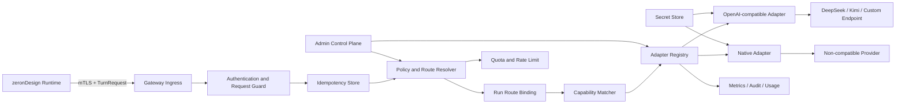

# Provider Gateway 实施方案

## 0. 执行摘要

### 0.1 结论

当前仓库已经具备 Provider Gateway 的**调用端和协议雏形**，但没有可投入生产的独立 Gateway 服务：

| 能力 | 当前状态 | 本方案目标 |
|---|---|---|
| Runtime `ModelClient` 抽象 | 已实现 | 保留，Runtime 继续只依赖统一模型接口 |
| `POST /v1/agent/turn` Gateway client | 已实现并有契约测试 | 升级为带身份、幂等、路由绑定和标准错误的版本化协议 |
| OpenAI-compatible Provider client | 已实现，支持 DeepSeek、Kimi Global、Kimi China | 迁移到独立 Gateway，作为内置 adapter |
| streaming / tool-call 归一化 | Runtime 内已有实现 | 下沉到 Gateway；第一阶段可对 Runtime 返回聚合结果 |
| fixture model gateway | 已实现并用于 RC | 仅保留为测试 adapter，不得作为真实 Provider 服务 |
| 自定义 OpenAI-compatible Provider | 尚无运行时注册机制 | 通过版本化 `ProviderDefinition` 配置接入，无需改 Runtime |
| 非 OpenAI-compatible Provider | 尚无标准扩展点 | 通过 `ProviderAdapter` SPI 接入 |
| 凭证托管、路由、配额、审计、熔断 | 未形成独立服务 | 由生产 Gateway 统一承担 |

本方案的总体判断为 **Conditional Go**：

- 可以立即实施 Gateway MVP，并复用现有 Runtime 中已经验证的 Provider 协议与解析逻辑。
- 不允许直接把 `fixture-model-gateway` 替换名称后用于生产。
- 在 mTLS/service identity、密钥隔离、请求幂等、路由冻结、Provider 能力校验、错误脱敏和真实 Provider E2E 未关闭前，不得把生产 Runtime 切换到新 Gateway。

### 0.2 核心交付结果

完成本方案后，业务调用链保持稳定：

```text
Client / BFF
    │  POST /runs, POST /runs/{id}/continue
    ▼
zeronDesign Runtime
    │  logical model + Run/turn context + normalized tools
    │  mTLS / service identity
    ▼
Provider Gateway
    ├─ policy and route resolver
    ├─ immutable run route binding
    ├─ idempotency / quota / audit / metrics
    ├─ OpenAI-compatible adapter
    ├─ DeepSeek adapter configuration
    ├─ Kimi adapter configuration
    └─ native ProviderAdapter extensions
           │
           ▼
    Approved Provider endpoints
```

Runtime 的 `/runs`、SSE、Build/Edit/Repair、DCP、preview 和 artifact URL 语义不改变。Gateway 只替换模型访问和治理边界，不拥有 Run 生命周期、工具执行、工作区、preview promotion 或作品发布。

## 1. 现状与问题

### 1.1 可以复用的现有实现

`services/runtime/src/model_gateway.rs` 已经提供：

1. `ModelClient` 统一接口；
2. `ModelRequest`，包含 Run、turn、模型、phase、agent profile、system prompt、messages、tools 与 deferred tools；
3. `HttpModelGatewayClient`，调用 `{MODEL_GATEWAY_URL}/v1/agent/turn`；
4. `OpenAiCompatibleModelClient`，支持 Bearer token、同步或 streaming 响应、tool-call 参数拼装与大小限制；
5. DeepSeek、Kimi Global、Kimi China 的直接 Provider 配置；
6. transport retry、timeout、tool input parse failure 和工具名映射测试。

`infra/agent-sandbox/runtime/fixture-model-gateway.js` 实现了相同 HTTP 入口，但其输出完全由 project/phase/turn 的固定规则生成，不访问真实模型。它适合契约测试、故障注入和 RC，可作为 Gateway 的 `fixture` adapter 继续保留。

### 1.2 当前不能称为生产 Gateway 的原因

现有 `HttpModelGatewayClient` 与 fixture Gateway 缺少以下生产边界：

- Runtime 到 Gateway 没有独立的 mTLS 或 service token 契约；
- 请求只有 `runId`，缺少显式 project/organization scope 和不可变 route binding；
- Runtime 直接提交物理 `model`，Gateway 没有逻辑模型、Provider policy 和 capability selection；
- 没有版本化 Provider registry、自定义 Provider 配置或 native adapter SPI；
- 没有 Gateway 级幂等，网络重试可能造成重复计费；
- 没有 per-project quota、并发 bulkhead、Provider circuit breaker 和受控 fallback；
- 非成功响应会回显上游 body，不符合凭证和敏感内容最小披露要求；
- 没有统一 usage/cost、provider request id、route revision 和 fallback audit；
- Gateway URL 和 Provider endpoint 缺少 SSRF/egress allowlist 管理边界；
- fixture 服务无凭证、无 Provider adapter、无生产持久化和高可用设计。

### 1.3 需要解决的扩展性问题

如果继续在 Runtime 的 `ModelProvider` enum 中为每个 Provider 增加分支，会造成：

- 每增加一个 Provider 都要修改、构建和发布 Runtime；
- Provider 凭证进入 Runtime Pod，扩大泄露面；
- 不同 Provider 的 retry、限流、错误和 usage 逻辑分散；
- 运行中的 Run 可能因配置热更新而切换 Provider/model；
- 无法安全支持企业私有 OpenAI-compatible endpoint；
- 无法形成统一的配额、账单、审计和停用机制。

因此，Provider 扩展必须从 Runtime 枚举迁移为 Gateway 的版本化 registry + adapter 模型。

## 2. 目标与非目标

### 2.1 目标

1. Runtime 通过一个内部 Gateway 访问所有模型 Provider。
2. 支持 DeepSeek、Kimi 以及任意经过批准的 OpenAI-compatible Provider。
3. 支持通过代码 adapter 扩展非 OpenAI-compatible Provider。
4. Provider 凭证只存在于 Gateway 的 secret boundary，不进入 Runtime、Run、事件或 evidence。
5. 每个 Run 冻结 Provider、物理模型、Provider definition revision、route policy revision 和 capability snapshot。
6. 同一 turn 在重试、Runtime 重启或网络抖动时保持幂等，避免重复上游调用和重复计费。
7. 统一 tool call、text、finish reason、usage、错误和 streaming 语义。
8. 提供 project/organization 级 allowlist、配额、限流、审计和成本指标。
9. Provider 故障时 fail closed 或按显式 policy fallback，不允许隐式换模型。
10. 不改变外部 `/runs`、SSE、作品生成和 artifact URL 契约。

### 2.2 非目标

- Gateway 不执行 Runtime tools。
- Gateway 不读取或写入 sandbox workspace。
- Gateway 不决定 preview promotion、DCP gate、Review finding 或 release publish。
- Gateway 不向最终用户暴露公网接口。
- Gateway MVP 不提供模型训练、向量数据库或通用 Prompt 管理平台。
- Gateway 不接受普通 Run 请求动态提供任意 Provider base URL、API key 或自定义 header。
- Gateway 不把完整 Prompt/response 默认写入日志或长期数据库。

## 3. 架构与职责边界

### 3.1 组件



### 3.2 Runtime 职责

- 生成完整 system prompt、messages、tools 和 deferred tools；
- 提供可信的 project/run/turn/phase/agent profile 上下文；
- 为每一 turn 生成稳定 request id 和 idempotency key；
- 执行 Gateway 返回的 tool calls；
- 保留工具权限、DCP read gate、sandbox、preview 和 Run 状态机；
- 将冻结的 route binding 最小摘要写入 Run/evidence；
- 对 Gateway timeout、retryable error、quota error 做稳定状态映射。

### 3.3 Gateway 职责

- 认证 Runtime service identity；
- 验证请求大小、schema、scope、deadline 和 tool capability；
- 将逻辑模型解析为经过批准的 Provider/model；
- 创建或复用不可变 Run route binding；
- 解析 ProviderDefinition 和 SecretRef；
- 执行上游请求、retry、rate limit、circuit breaker 和显式 fallback；
- 归一化 Provider response、tool calls、usage 和错误；
- 维护幂等结果和有限期 turn attempt；
- 输出低敏审计、成本与健康指标；
- 拒绝未批准 endpoint、能力不满足或凭证失效的 Provider。

### 3.4 Admin Control Plane 职责

Admin API 与 turn data plane 必须分离授权。Admin 能力包括：

- 创建/更新/禁用 ProviderDefinition；
- 校验 endpoint 与 SecretRef；
- 创建逻辑模型和 route policy；
- 设置 project/organization allowlist、quota 与 fallback policy；
- 进行不含用户 Prompt 的连接 readiness probe；
- 查看 capability、健康状态和版本差异；
- 回滚到历史 Provider/route revision。

普通 Runtime identity 不得调用 Admin API。

## 4. 固定架构决策

| 决策 | 固定结论 | 原因 |
|---|---|---|
| Gateway 位置 | 集群内部独立服务，不直接暴露公网 | 缩小 Provider 凭证和 Prompt 攻击面 |
| Runtime 请求模型 | 提交逻辑模型，不提交任意 endpoint/key | 防止绕过治理和 SSRF |
| Provider 扩展 | OpenAI-compatible 配置优先，native adapter 作为第二路径 | 大部分 Provider 无需重新开发协议层，同时保留非兼容扩展能力 |
| 路由生命周期 | 按 Run 冻结 route binding | 避免 Build/Edit/Repair 中途因热更新漂移 |
| turn 幂等 | `(runId, turn, idempotencyKey, requestHash)` 唯一 | 防止重试重复计费和响应分叉 |
| fallback | 必须由 route policy 显式允许并进入审计 | 不允许静默更换 Provider/model |
| Provider 凭证 | SecretRef，只由 Gateway 解析 | Runtime 和配置记录不接触原始 key |
| 日志 | 默认只记录 hash、大小、枚举和 provider metadata | 避免 Prompt、tool input 和响应内容泄露 |
| 协议迁移 | 新协议兼容现有 `/v1/agent/turn`；Runtime 可灰度切换 | 降低对主功能通路的迁移风险 |
| streaming | MVP 可聚合 Provider stream；后续增加 Gateway SSE | 先保持现有 Runtime client 稳定，再升级实时性 |

## 5. Data Plane 协议

### 5.1 Endpoint

```http
POST /v1/agent/turn
Content-Type: application/json
Authorization: Bearer <short-lived-runtime-service-token>
Idempotency-Key: <stable-turn-key>
X-Request-ID: <uuid-or-stable-id>
```

生产优先使用 mTLS；Bearer service token 用于工作负载身份暂未落地的过渡阶段。若同时启用，两者必须绑定到同一个 Runtime workload identity。

### 5.2 TurnRequest

推荐使用 envelope，不再从 system prompt 解析 project identity：

```json
{
  "schemaVersion": "provider-gateway-turn-request@1",
  "requestId": "req-01J...",
  "idempotencyKey": "run-123:turn-4:request-v1",
  "deadlineAt": "2026-07-16T12:01:30Z",
  "scope": {
    "organizationId": "org-1",
    "workspaceId": "workspace-1",
    "projectId": "project-1",
    "runId": "run-123",
    "turn": 4,
    "phase": "build",
    "agentProfile": "website-builder"
  },
  "routing": {
    "logicalModel": "design-agent-balanced",
    "routeBindingId": null,
    "requiredCapabilities": {
      "toolCalls": true,
      "strictToolSchema": true,
      "streaming": false,
      "vision": false
    }
  },
  "input": {
    "systemPrompt": "<runtime-generated-prompt>",
    "messages": [],
    "tools": [],
    "deferredTools": []
  }
}
```

约束：

- `requestId` 用于端到端关联；同一执行尝试唯一。
- `idempotencyKey` 在同一 Run/turn 重试时不变。
- `deadlineAt` 必须小于 Gateway 上限，Gateway 不接受无限等待。
- `scope.runId + turn` 必须与 service token 的调用权限一致。
- `routeBindingId` 首次为空；Gateway 返回后 Runtime 必须在后续 turn 携带。
- `requiredCapabilities` 由 Runtime 根据当前 tool/prompt 真实需求生成，不由客户端填写。
- `input` 受最大 body、message、tool 数量和 tool schema 大小限制。

### 5.3 向后兼容

迁移阶段 Gateway 同时接受现有未包装 `ModelRequest`，但必须满足：

- 仅在受控 legacy Runtime service identity 上启用；
- Gateway 为 legacy 请求生成 request id；
- legacy 请求不能使用多租户路由和自定义 Provider；
- 每次接受 legacy 请求产生 `provider_gateway_legacy_request_total`；
- Batch C 完成后默认关闭，最终删除。

### 5.4 TurnResponse

```json
{
  "schemaVersion": "provider-gateway-turn-response@1",
  "requestId": "req-01J...",
  "type": "tool_calls",
  "toolCalls": [
    {
      "id": "call-1",
      "name": "fs.read",
      "input": { "path": "inputs/design-profile.json" }
    }
  ],
  "text": null,
  "finishReason": "tool_calls",
  "routeBinding": {
    "id": "route-binding-1",
    "providerId": "deepseek-primary",
    "providerDefinitionRevision": 3,
    "physicalModel": "deepseek-chat",
    "routePolicyId": "design-agent-balanced",
    "routePolicyRevision": 7,
    "capabilitySnapshotHash": "<sha256>"
  },
  "usage": {
    "inputTokens": 1200,
    "outputTokens": 180,
    "cachedInputTokens": 0,
    "estimatedCostMicros": 1900,
    "currency": "USD"
  },
  "provider": {
    "requestId": "provider-request-id",
    "attemptCount": 1,
    "fallbackUsed": false
  }
}
```

Runtime 的行为只依赖 `type/toolCalls/text/finishReason`。Provider、usage 和 binding 用于状态、成本和审计，不得改变工具权限裁决。

### 5.5 标准错误

非成功响应不得回显原始 Provider body：

```json
{
  "schemaVersion": "provider-gateway-error@1",
  "requestId": "req-01J...",
  "error": {
    "code": "provider_rate_limited",
    "message": "Selected provider is temporarily rate limited",
    "retryable": true,
    "retryAfterMs": 2500,
    "providerRequestId": "provider-request-id"
  }
}
```

稳定错误码：

| HTTP | code | retryable | 说明 |
|---|---|---|---|
| 400 | `invalid_turn_request` | false | schema、大小、deadline 或 tool 定义无效 |
| 401 | `runtime_authentication_failed` | false | Runtime service identity 无效 |
| 403 | `route_not_allowed` | false | scope 无权使用逻辑模型/Provider |
| 409 | `idempotency_conflict` | false | 同 key 的 request hash 不同 |
| 422 | `provider_capability_mismatch` | false | 没有满足 required capabilities 的 route |
| 429 | `gateway_quota_exceeded` | conditional | 项目/组织 Gateway quota |
| 429 | `provider_rate_limited` | true | Provider 429，已完成受控 retry |
| 502 | `provider_response_invalid` | conditional | Provider response 无法规范化或 tool call 无效 |
| 503 | `provider_unavailable` | true | circuit open 或 Provider 5xx/transport failure |
| 504 | `provider_timeout` | true | 超过 turn deadline |

日志只能保存 error code、状态码、上游 request id、原始 body 的 SHA-256 和受限字节数，不保存原始 body。

### 5.6 Streaming

MVP 保留当前同步 endpoint：Gateway 可以消费 Provider streaming，但在完整归一化后一次性返回 Runtime，确保现有 AgentLoop 不改动。

后续新增：

```http
POST /v1/agent/turn:stream
Accept: text/event-stream
```

稳定事件类型：

- `route.bound`
- `text.delta`
- `tool_call.started`
- `tool_call.arguments_delta`
- `usage.updated`
- `turn.completed`
- `turn.error`

Gateway 必须先完整校验 tool arguments，再发出 `turn.completed`。Runtime 不得在仅收到 partial tool call 时执行工具。

## 6. Provider 扩展模型

### 6.1 两条扩展路径

#### 路径 A：配置型 OpenAI-compatible Provider

适用于接口兼容 `/chat/completions` 或可通过有限映射兼容的 Provider。新增 Provider 时只提交经过评审的 ProviderDefinition 和 SecretRef，不修改 Runtime，也通常不修改 Gateway 代码。

#### 路径 B：代码型 Native Adapter

适用于消息、tool calling、streaming、认证或 usage 协议与 OpenAI 不兼容的 Provider。新增 adapter 必须实现统一 SPI、契约测试和 capability 声明。

### 6.2 ProviderDefinition

```yaml
schemaVersion: provider-definition@1
id: custom-openai-compatible-1
displayName: Custom Provider 1
kind: openai_compatible
enabled: true
revision: 4
endpoint:
  baseUrl: https://provider.example.com/v1
  chatCompletionsPath: /chat/completions
  networkPolicyClass: approved-public-provider
auth:
  type: bearer
  secretRef: provider-secrets/custom-provider-1
models:
  design-balanced:
    physicalModel: provider-model-v3
    capabilities:
      toolCalls: true
      strictToolSchema: true
      streaming: true
      vision: false
      parallelToolCalls: true
      maxContextTokens: 128000
      maxOutputTokens: 8192
defaults:
  requestTimeoutMs: 180000
  maxAttempts: 3
  temperature: 0.2
  extraHeaders:
    x-client-name: zerondesign-provider-gateway
responseMapping:
  usage: openai
  toolCalls: openai
```

安全约束：

- `baseUrl` 只能由 Provider admin 写入，Run 请求不能覆盖。
- 必须为 HTTPS；禁止 URL userinfo、query token 和 fragment。
- DNS/IP 必须通过 egress allowlist；禁止 loopback、link-local、metadata endpoint 和集群管理网段。
- `extraHeaders` 禁止 authorization、cookie、host、forwarded 和签名类 header。
- `secretRef` 只保存引用，不在 API response、日志或审计中展开。
- definition 更新产生新 revision；已有 Run 继续使用冻结 revision。

### 6.3 ProviderAdapter SPI

推荐 Gateway 使用 Rust，以最大化复用现有解析、streaming、tool input validation 和测试。核心接口：

```rust
#[async_trait]
pub trait ProviderAdapter: Send + Sync {
    fn kind(&self) -> &'static str;

    fn validate_definition(
        &self,
        definition: &ProviderDefinition,
    ) -> Result<ValidatedProviderDefinition, ProviderConfigError>;

    fn capabilities(
        &self,
        definition: &ValidatedProviderDefinition,
        physical_model: &str,
    ) -> Result<ProviderCapabilities, ProviderConfigError>;

    async fn execute_turn(
        &self,
        context: ProviderTurnContext,
        request: NormalizedTurnRequest,
    ) -> Result<NormalizedTurnResponse, ProviderError>;

    async fn readiness(
        &self,
        context: ProviderReadinessContext,
    ) -> Result<ProviderReadiness, ProviderError>;
}
```

SPI 规则：

- adapter 只能读取 Gateway 注入的 SecretMaterial，不能自行查询任意 secret；
- adapter 必须返回标准 ProviderError，不允许把原始 body 直接向上传递；
- adapter 必须声明 capability，不能在运行时静默降级 strict tools/streaming；
- adapter 不得修改路由或跨 Provider fallback；
- adapter 必须接受 deadline/cancellation；
- adapter 必须输出 provider request id、usage 和 finish reason；
- native adapter 必须进入编译期 registry，不支持运行时加载任意动态库。

### 6.4 Capability 模型

```json
{
  "toolCalls": true,
  "strictToolSchema": true,
  "streaming": true,
  "parallelToolCalls": true,
  "vision": false,
  "reasoning": false,
  "systemRole": true,
  "maxContextTokens": 128000,
  "maxOutputTokens": 8192,
  "maxToolCount": 128,
  "maxToolSchemaBytes": 1048576
}
```

Gateway 在发起 Provider 请求前做 capability matching。required capability 缺失时返回 `provider_capability_mismatch`，不得尝试删除 tools、降低 strict schema 或截断 system prompt 来制造成功。

### 6.5 内置 Provider

首批内置：

| provider kind | 接入方式 | 说明 |
|---|---|---|
| `openai_compatible` | 通用配置 adapter | 自定义 Provider 默认入口 |
| `deepseek` | 基于 OpenAI-compatible adapter 的受控 preset | 固定默认 endpoint 和已验证模型能力 |
| `kimi_global` | 基于 OpenAI-compatible adapter 的受控 preset | 海外 endpoint |
| `kimi_cn` | 基于 OpenAI-compatible adapter 的受控 preset | 中国 endpoint |
| `fixture` | 仅测试环境 adapter | 禁止生产 policy 引用 |

Provider preset 仍应生成普通 ProviderDefinition，不在路由器中写特殊分支。

### 6.6 新增 Provider 的标准操作流程

#### 配置型 OpenAI-compatible Provider

新增一个兼容 Provider 时，固定按以下顺序执行：

1. Provider owner 提交 endpoint、模型清单、官方协议依据、数据区域和使用范围；
2. Security/Platform 在 secret backend 创建 credential，得到 SecretRef；
3. 创建 disabled 状态的 ProviderDefinition revision；
4. 运行离线 schema、HTTPS、DNS/IP、redirect、header 和 capability 校验；
5. 使用不含用户数据的最小 readiness request 验证认证、模型和 usage response；
6. 运行通用 OpenAI-compatible contract suite，包括 text、tool calls、streaming、429、5xx、timeout 和 malformed response；
7. 创建仅允许测试 project 的 route policy revision；
8. 执行真实 Brief/Build/Edit、artifact 和 secret scan；
9. CAS 启用 definition，再逐步扩大 route allowlist。

这条路径不得修改 Runtime，也不得在通用 adapter 中增加 `if provider_id == ...` 分支。Provider 差异只能通过受白名单约束的 definition 字段表达；无法表达时转为 native adapter 评审。

#### Native Adapter Provider

新增非兼容 Provider 时：

1. 新建实现 `ProviderAdapter` 的独立 module；
2. 提交 Provider 官方协议和 capability mapping；
3. 使用录制后脱敏的 golden fixtures 覆盖 request/response/stream/error；
4. 通过通用 adapter contract suite；
5. 通过 secret、SSRF、redirect、错误脱敏、超限 payload 和 cancellation 测试；
6. 在编译期 adapter registry 中注册 kind；
7. 创建 disabled ProviderDefinition 和测试 project route；
8. 执行与配置型 Provider 相同的真实生命周期和灰度流程。

Native adapter 合并不自动启用任何 Provider。代码可用、definition enabled 和 route policy active 是三个独立门禁。

#### 扩展验收清单

每个 Provider 的交付包至少包含：

- ProviderDefinition 与 revision；
- capability snapshot 及 hash；
- SecretRef 和 rotation 负责人，不含 secret value；
- endpoint/network policy class；
- model alias → physical model mapping；
- contract suite 结果；
- readiness 结果；
- 测试 project route revision；
- 真实 Build/Edit/artifact evidence；
- quota/cost catalog；
- disable/rollback runbook。

## 7. 路由、绑定与 fallback

### 7.1 LogicalModelRoute

客户端和 Runtime 使用逻辑模型，例如：

- `design-agent-fast`
- `design-agent-balanced`
- `design-agent-quality`
- `review-agent-quality`

路由定义：

```yaml
schemaVersion: provider-route-policy@1
id: design-agent-balanced
revision: 7
scope:
  organizationIds: [org-1]
  projectIds: []
candidates:
  - providerId: deepseek-primary
    modelAlias: design-balanced
    priority: 10
    weight: 100
  - providerId: custom-provider-1
    modelAlias: design-balanced
    priority: 20
    weight: 100
fallback:
  enabled: true
  allowedReasons:
    - provider_unavailable
    - provider_rate_limited
  maxProviderSwitchesPerTurn: 1
limits:
  maxConcurrentTurns: 20
  dailyInputTokens: 5000000
  dailyEstimatedCostMicros: 100000000
```

### 7.2 Route resolution

顺序固定为：

1. 验证 Runtime identity 和 scope；
2. 读取逻辑模型对应的 route policy revision；
3. 应用 organization/workspace/project allowlist；
4. 过滤 disabled、credential unavailable、circuit open 的 Provider；
5. 过滤 capability 不满足的模型；
6. 检查 project/organization quota 和并发 bulkhead；
7. 若 Run 已有 binding，精确复用；
8. 首次 turn 按 priority/weight 选择并写入 binding；
9. 返回 binding 给 Runtime 并进入审计。

### 7.3 Run route binding

```json
{
  "schemaVersion": "provider-route-binding@1",
  "id": "route-binding-1",
  "organizationId": "org-1",
  "projectId": "project-1",
  "runId": "run-123",
  "logicalModel": "design-agent-balanced",
  "providerId": "deepseek-primary",
  "providerDefinitionRevision": 3,
  "physicalModel": "deepseek-chat",
  "routePolicyId": "design-agent-balanced",
  "routePolicyRevision": 7,
  "capabilitySnapshotHash": "<sha256>",
  "createdAt": "2026-07-16T12:00:00Z"
}
```

Provider definition 后续更新或禁用不重写历史 binding。紧急停用可以阻止新 turn，并返回稳定错误；是否允许迁移到 fallback 必须由 policy 显式决定并产生新的 binding generation，不能静默覆盖原记录。

Build、Edit、Review、Repair 是不同 Run，因此增加 lineage 规则：

- Build 首次创建自己的 route binding；
- Edit 默认继承 `baseVersionId` 创建 Run 的 binding；
- Review/Repair 默认继承 `parentRunId` 或 finding lineage 对应的 binding；
- 继承只复制冻结 identity，不复用父 Run 的 turn/idempotency 状态；
- 父 binding 已紧急禁用或 capability 不满足时，不得静默选择新 Provider；Gateway 返回需要 route migration 的稳定错误；
- 只有 policy 明确允许且 Runtime 记录 migration reason 时，才创建新的 binding generation；
- evidence 必须能同时展示父 binding、子 binding、是否继承以及 migration reason。

这样既保证每个 Run 自身不可漂移，也保证真实作品的 Build→Edit→Repair Provider lineage 可审计。

### 7.4 Retry 与 fallback 边界

- 同 Provider transport retry：连接失败、连接重置、明确 timeout、429、允许的 5xx；使用指数退避、jitter 和 `Retry-After`。
- 不 retry：认证失败、请求 schema 错误、capability mismatch、内容策略拒绝、tool response 无法安全恢复。
- retry 必须受 `deadlineAt` 和 max attempts 双重限制。
- 同一 idempotency key 命中完成结果时直接返回，不再次请求 Provider。
- Gateway 已向 Runtime 发出任何 response body 后不得切换 Provider。
- Provider 已返回可解析的 tool calls 后不得因附带文本错误切换 Provider。
- cross-provider fallback 必须在 route policy 允许的 reason 内，并记录前后 Provider、attempt 和原因。

## 8. 幂等、状态与存储

### 8.1 必要实体

| 实体 | 持久化 | 说明 |
|---|---|---|
| `ProviderDefinition` | 是，版本化 | 不包含原始 secret |
| `ProviderRoutePolicy` | 是，版本化 | 逻辑模型、scope、候选和 fallback |
| `RunRouteBinding` | 是，不可变 generation | 冻结 Run 的 Provider/model/capability |
| `TurnIdempotencyRecord` | 是，TTL | request hash、状态、最终 response hash/加密结果 |
| `TurnAttempt` | 是，TTL/审计摘要 | Provider、延迟、状态、usage、request id |
| `QuotaCounter` | 是 | project/org token、cost、并发 |
| `ProviderHealthState` | 是或共享缓存 | circuit breaker 与 readiness |
| `AuditEvent` | 是，追加式 | 配置、路由、fallback、secret rotation 和调用结论 |

### 8.2 幂等状态机

```text
reserved → upstream_in_progress → completed
                         └──────→ failed_retryable
                         └──────→ failed_terminal
```

规则：

- 首次请求以唯一约束预留 `(run_id, turn, idempotency_key)`；
- 同 key + 同 request hash：等待进行中结果或返回已有结果；
- 同 key + 不同 hash：`409 idempotency_conflict`；
- Gateway crash 后 `upstream_in_progress` 不得直接重发，必须结合 Provider idempotency 能力或人工/超时恢复策略；
- 无 Provider idempotency 支持时，恢复策略默认 fail closed，避免重复计费和不同响应；
- 完成响应可以加密短期保存，审计长期只保留 hash 与元数据。

### 8.3 存储选择

开发/单节点可使用 SQLite；生产推荐 PostgreSQL，并满足：

- route binding 和 idempotency 唯一约束；
- 多副本事务一致性；
- audit append-only 表；
- turn payload/response TTL 清理；
- quota 原子计数或与 Redis/专用 limiter 协同。

不得只使用 Pod 内存保存 route binding 或幂等状态。

## 9. 安全与隐私

### 9.1 Workload 身份

- Gateway data plane 只允许 Runtime service account 调用；
- 生产使用 mTLS/SPIFFE 或等价 workload identity；
- 过渡 token 必须短时、受 audience/issuer 约束并通过文件挂载；
- Gateway 验证调用 identity，但仍校验请求 scope 和 policy；
- Admin identity 与 Runtime identity 完全分离。

### 9.2 Secret 管理

- API key 存储在 Kubernetes Secret、Vault 或云 Secret Manager；
- ProviderDefinition 只引用 `secretRef`；
- Gateway 读取 secret 时记录 secret version，不记录 value；
- 支持双版本 rotation window 和 readiness 验证；
- 禁止 key 出现在 environment dump、CLI、Run event、Gateway response、evidence 和日志；
- 用户通过对话或普通 API 提交的 key 一律拒绝。

### 9.3 网络安全

- Gateway egress 默认 deny；按 ProviderDefinition 的 network policy class 放行；
- endpoint 只允许 HTTPS，证书校验不得关闭；
- 禁止 redirect 到未批准 host；
- DNS 解析结果不得落入 loopback、link-local、RFC1918 管理网段或 metadata IP，除非 definition 明确使用批准的私有网络类；
- Provider host、resolved IP、TLS peer summary 进入低敏审计；
- Runtime Pod 不再拥有访问公共 Provider endpoint 的 egress 权限。

### 9.4 数据最小化

默认日志字段：

- request/run/project 的受控 ID；
- Provider/model/binding/revision；
- prompt/messages/tools 的字节数和 SHA-256；
- status/error code/latency/usage/cost；
- provider request id；
- fallback/retry/circuit 结果。

默认禁止：

- system prompt、message、tool input 原文；
- Provider 原始响应 body；
- API key、Authorization、Cookie、签名；
- 用户上传内容和生成作品源码。

诊断采样只能在显式授权下启用，必须加密、限定 project、短 TTL，并产生审计事件。

### 9.5 输入/输出保护

- 限制 HTTP body、system prompt、message 数、单 message、tool 数和 schema 大小；
- 验证 JSON 深度和字符串长度，防止解析资源耗尽；
- tool name 必须来自 Runtime 提交的 registry；
- Provider 返回未知 tool、重复 id、非法 JSON 或超限 arguments 时 fail closed；
- Provider 内容不能修改 route、Provider endpoint、SecretRef 或 Gateway policy；
- 任何 raw provider error 先脱敏、分类，再映射为稳定错误。

## 10. 配额、可靠性与降级

### 10.1 配额层级

支持：

- organization daily/monthly token 与 cost；
- project daily token/cost；
- logical model allowlist；
- per-provider 并发；
- per-project 并发；
- 单 turn input/output 上限；
- Run 最大 turn 数由 Runtime 保持权威，Gateway 可做防御性上限。

### 10.2 Circuit breaker

每个 `providerId + physicalModel + endpoint revision` 独立维护：

- sliding-window failure rate；
- consecutive transport failures；
- 429 saturation；
- open / half-open / closed；
- half-open 探针并发上限；
- 手工 disable 优先于自动恢复。

Provider 业务内容拒绝、用户输入错误和 capability mismatch 不计入服务健康失败率。

### 10.3 Bulkhead 与 backpressure

- Provider 维度独立 semaphore/queue；
- project 维度并发限制；
- queue wait 计入 deadline；
- queue 满返回 retryable `gateway_overloaded`，不无限堆积；
- streaming 连接使用独立连接池和并发预算；
- Gateway Pod 无状态扩容，但幂等、quota 和 binding 使用共享存储。

### 10.4 Shutdown 与恢复

- readiness 先失败，停止接收新 turn；
- 已接收 turn 在 shutdown deadline 内完成或写入可恢复状态；
- 不在没有幂等证据时重发 uncertain upstream attempt；
- Runtime 将 `provider_unavailable/timeout` 映射为可恢复 Run 状态，不伪装完成；
- Gateway 重启后 route binding、idempotency 和 quota 不丢失。

## 11. 可观测性与审计

### 11.1 Metrics

低基数指标：

```text
provider_gateway_turn_total{provider,model_alias,phase,status}
provider_gateway_turn_duration_seconds{provider,model_alias,phase}
provider_gateway_upstream_attempt_total{provider,reason,status}
provider_gateway_retry_total{provider,reason}
provider_gateway_fallback_total{from_provider,to_provider,reason}
provider_gateway_circuit_state{provider,model_alias}
provider_gateway_queue_depth{provider}
provider_gateway_quota_rejection_total{scope_type,reason}
provider_gateway_input_tokens_total{provider,model_alias}
provider_gateway_output_tokens_total{provider,model_alias}
provider_gateway_estimated_cost_micros_total{provider,model_alias,currency}
provider_gateway_idempotency_hit_total{state}
provider_gateway_legacy_request_total
provider_gateway_invalid_tool_response_total{provider,reason}
```

不得将 projectId、runId、requestId 作为 metrics label；它们只进入受控日志/trace。

### 11.2 Trace

统一关联：

```text
client request id
  → Runtime run id / turn
  → Gateway request id / route binding id
  → Provider request id / attempt
```

Trace span 只记录 hash、大小、Provider metadata、状态和耗时，不记录 Prompt 或 tool arguments。

### 11.3 AuditEvent

必须审计：

- ProviderDefinition create/update/enable/disable；
- SecretRef version rotation/readiness；
- route policy create/update/rollback；
- Run route binding 创建/紧急迁移；
- fallback；
- quota override；
- 真实 Provider readiness probe；
- debug payload capture 开启/关闭；
- admin authorization deny。

Turn 正常调用只记录摘要事件，避免审计存储成为 Prompt 副本。

## 12. Admin API

Admin API 建议使用 `/internal/provider-gateway/admin/v1` 前缀，并由独立身份保护：

| Method | Path | 用途 |
|---|---|---|
| `POST` | `/provider-definitions` | 创建 definition revision |
| `GET` | `/provider-definitions` | 列表，不返回 secret |
| `GET` | `/provider-definitions/{id}` | 查看当前/指定 revision |
| `POST` | `/provider-definitions/{id}/validate` | schema、DNS、TLS、capability 静态校验 |
| `POST` | `/provider-definitions/{id}/readiness` | 受控真实连接探针 |
| `POST` | `/provider-definitions/{id}/enable` | CAS 启用 |
| `POST` | `/provider-definitions/{id}/disable` | CAS 禁用 |
| `POST` | `/route-policies` | 创建 route policy revision |
| `GET` | `/route-policies/{id}` | 查看 policy/revision |
| `POST` | `/route-policies/{id}/activate` | CAS 激活 revision |
| `GET` | `/run-route-bindings/{runId}` | 审计指定 Run binding |

所有写操作要求：

- `Idempotency-Key`；
- `If-Match` 或 `expectedRevision`；
- operator identity；
- reason/change reference；
- 审计记录；
- secret 字段拒绝回传。

MVP 可以先使用受控 YAML + GitOps，不强制实现全部 Admin HTTP API；但数据模型和 CAS revision 必须从第一版保留。

## 13. 建议代码布局

```text
services/provider-gateway/
  Cargo.toml
  src/
    main.rs
    config.rs
    http/
      data_plane.rs
      admin.rs
      health.rs
    auth/
      workload_identity.rs
      admin_identity.rs
    contracts/
      turn.rs
      error.rs
      provider_definition.rs
      route_policy.rs
    routing/
      resolver.rs
      binding.rs
      capability.rs
      fallback.rs
    adapters/
      mod.rs
      openai_compatible.rs
      deepseek.rs
      kimi.rs
      fixture.rs
    secrets/
      mod.rs
      kubernetes.rs
      vault.rs
    reliability/
      idempotency.rs
      retry.rs
      circuit_breaker.rs
      quota.rs
    storage/
      mod.rs
      sqlite.rs
      postgres.rs
    telemetry/
      audit.rs
      metrics.rs
      trace.rs
  tests/
    contract.rs
    openai_compatible.rs
    routing.rs
    idempotency.rs
    security.rs
    real_provider.rs

services/provider-gateway-contracts/
  schemas/
    turn-request.schema.json
    turn-response.schema.json
    error.schema.json
    provider-definition.schema.json
    route-policy.schema.json

infra/provider-gateway/
  deployment.yaml
  service.yaml
  network-policy.yaml
  service-account.yaml
  rbac.yaml
  pdb.yaml
  hpa.yaml
```

### 13.1 复用与迁移原则

- 将现有 OpenAI request/stream/tool-call normalization 提取到 Gateway adapter；
- Runtime 保留 `ModelClient` 和 `HttpModelGatewayClient`；
- Runtime direct DeepSeek/Kimi client 在迁移期作为 break-glass/测试能力保留；
- 生产切换完成后，Runtime Pod 移除 Provider API key 和 Provider egress；
- fixture gateway 迁移为 `fixture` adapter 或独立测试二进制；
- 共享 JSON Schema 由 Gateway 和 Runtime 双边契约测试，不在两端手写不一致类型。

## 14. 部署设计

### 14.1 Kubernetes 组件

- `provider-gateway` Deployment，至少 2 replicas；
- ClusterIP Service，仅 Runtime namespace/network policy 可访问；
- 独立 ServiceAccount；
- Provider secret 只授权 Gateway ServiceAccount；
- PodDisruptionBudget；
- HPA 基于并发、队列和 CPU；
- NetworkPolicy：Runtime → Gateway，Gateway → approved Provider/DNS/secret backend/database；
- PostgreSQL/Redis 使用现有托管服务或独立受控部署；
- `/health/live` 只证明进程；`/health/ready` 校验 storage、policy snapshot 和至少一个必需 route 可用。

### 14.2 Runtime 配置

```yaml
env:
  - name: MODEL_PROVIDER
    value: internal_gateway
  - name: MODEL_GATEWAY_URL
    value: http://provider-gateway.provider-system.svc.cluster.local:9000
  - name: MODEL_GATEWAY_AUTH_TOKEN_FILE
    value: /var/run/secrets/provider-gateway/token
  - name: MODEL_REQUEST_TIMEOUT_SECONDS
    value: "210"
```

生产中 Runtime 不再配置 `DEEPSEEK_API_KEY`、`KIMI_API_KEY` 或 Provider base URL。

### 14.3 Gateway 配置

```yaml
env:
  - name: PROVIDER_GATEWAY_LISTEN
    value: 0.0.0.0:9000
  - name: PROVIDER_GATEWAY_DATABASE_URL_FILE
    value: /var/run/secrets/database/url
  - name: PROVIDER_GATEWAY_AUTH_MODE
    value: mtls
  - name: PROVIDER_GATEWAY_PROVIDER_CONFIG_DIR
    value: /etc/provider-gateway/providers
  - name: PROVIDER_GATEWAY_ROUTE_CONFIG_DIR
    value: /etc/provider-gateway/routes
  - name: PROVIDER_GATEWAY_PROMPT_LOGGING
    value: disabled
```

Provider key 通过 SecretRef backend 读取，不为每个 Provider增加 Gateway env 变量。

### 14.4 作品生成链路不变

Gateway 上线后，真实作品仍通过：

1. `POST /runs` 创建 Build；
2. Runtime 经 Gateway 调用真实 Provider；
3. Runtime 执行 tool calls、构建、验证并 promotion；
4. `GET /preview/{projectId}/current` 获取 version；
5. `/artifacts/{projectId}/current/` 或固定 version URL 获取作品；
6. Edit 仍通过新的 `POST /runs` + `baseVersionId` + `/continue` 完成。

Gateway 不生成作品 URL，也不代替 Runtime artifact service。

## 15. 实施批次

### Batch A：协议与安全基线

交付：

- 独立 `provider-gateway-contracts`；
- versioned TurnRequest/TurnResponse/Error；
- Runtime gateway auth 配置；
- request id、idempotency key、deadline、显式 scope；
- 错误正文脱敏；
- legacy ModelRequest compatibility；
- 双边 contract tests。

退出门禁：

- 现有 fixture lifecycle 不回归；
- Runtime 与 Gateway schema drift 测试 fail closed；
- 无 auth、错误 audience、超限 body、未知 tool 返回稳定错误；
- 日志/错误中无 Prompt、token、Provider body。

### Batch B：Gateway MVP 与 DeepSeek

交付：

- 独立 Gateway service；
- OpenAI-compatible adapter；
- DeepSeek preset；
- SecretRef；
- Run route binding；
- turn idempotency；
- retry、timeout、基础 circuit breaker；
- metrics/audit；
- Kubernetes Deployment/Service/NetworkPolicy。

退出门禁：

- API Build/Edit 通过 Gateway 使用经批准 DeepSeek；
- 生成 artifact 可访问；
- 重试相同 turn 只发生一次上游计费调用；
- Runtime Pod 无 Provider key；
- Gateway 之外 Pod 无 Provider egress；
- Gateway restart 后 binding/idempotency 不丢失。

### Batch C：自定义 OpenAI-compatible Provider

交付：

- ProviderDefinition schema/revision；
- custom base URL、SecretRef、model alias、capability；
- endpoint SSRF/redirect/TLS 校验；
- GitOps provider config；
- validation/readiness command；
- Kimi Global/Kimi China 迁移为 definition preset。

退出门禁：

- 新增 mock compatible Provider 不修改 Runtime/Gateway adapter 代码；
- definition 更新不影响已有 Run binding；
- 未批准 host、private metadata IP、header override、无效 capability fail closed；
- secret rotation 不中断已允许的 rotation window。

### Batch D：路由、配额与受控 fallback

交付：

- LogicalModelRoute；
- org/workspace/project policy；
- quota/cost；
- weighted priority；
- Provider/model bulkhead；
- circuit breaker；
- 显式 fallback；
- routing/fallback audit。

退出门禁：

- capability mismatch 不发上游请求；
- 配额和并发拒绝稳定；
- circuit open 不继续冲击 Provider；
- fallback 仅在允许 reason 发生；
- 同 Run 正常 turn 不因 policy 热更新漂移；
- fallback 后 evidence 能还原全部 route generation。

### Batch E：Native Adapter 与 Streaming

交付：

- `ProviderAdapter` SPI；
- 至少一个非 OpenAI-compatible fake/native adapter 证明扩展性；
- Gateway SSE；
- partial tool-call buffer/validation；
- cancellation/backpressure；
- streaming usage。

退出门禁：

- adapter contract suite 可复用；
- partial/invalid/oversized tool arguments 不执行；
- Runtime disconnect 能取消上游或进入明确 uncertain 状态；
- stream completed 语义与同步结果一致。

### Batch F：生产切换

交付：

- 正式分支 clean image；
- 双副本 Gateway、PDB/HPA；
- 真实 Provider readiness；
- project allowlist canary；
- dashboard/alert/runbook；
- Runtime direct Provider egress/key 移除；
- rollback 到 direct client 或旧 Gateway revision 的受控方案。

退出门禁：

- 单项目真实 Build/Edit/Repair 与 artifact link；
- Gateway Pod restart、节点迁移、Provider 429/5xx/timeout 演练；
- secret rotation；
- quota/circuit/fallback 告警；
- 审计和 cost 对账；
- 精确 rollback 演练。

## 16. 测试方案

### 16.1 Unit

- ProviderDefinition validation；
- capability matching；
- logical route resolution；
- request/response normalization；
- tool name/arguments mapping；
- retry classifier；
- error redaction；
- quota calculation；
- route binding hash；
- cost calculation；
- SSRF/DNS/IP validation。

### 16.2 Contract

- Runtime client ↔ Gateway schema；
- legacy request compatibility；
- OpenAI-compatible sync/stream response；
- tool calls、text、empty choices、malformed JSON；
- usage/finish reason/provider request id；
- stable error codes；
- unknown additive response fields；
- body/tool/schema size limits。

### 16.3 Integration

- fake Provider 正常、429、5xx、timeout、disconnect；
- duplicate idempotency 只调用一次上游；
- 同 key 不同 hash 返回 409；
- Gateway restart 后复用 binding/result；
- secret rotation；
- circuit open/half-open；
- quota/bulkhead；
- custom compatible Provider 无代码接入；
- route policy revision/rollback；
- fallback allow/deny。

### 16.4 Runtime E2E

- Brief → Build → preview.updated → artifact；
- Edit 继承 base version 并生成新 version；
- Repair 继承 DCP 并关闭 required finding；
- Provider Gateway error 映射为可恢复/终止 Run 状态；
- Gateway binding 进入 Runtime diagnostics/evidence，但不包含 secret；
- SSE event order 不因 Gateway 迁移变化；
- artifact URL 和 project authorization 不回归。

### 16.5 Real Provider Gate

真实门禁必须显式提供：

- 经轮换且未暴露的 Provider credential；
- `RUNTIME_PROVIDER_APPROVAL_ID` 或组织审批引用；
- provider/model/definition revision/route revision；
- Runtime/Gateway image digest；
- Build/Edit/Repair run id；
- usage/cost/provider request id；
- artifact URL、HTTP 状态、content/computed-style；
- secret scan；
- terminal tool failure count。

审批引用是审计元数据，不是 API key，也不进入普通 TurnRequest。

### 16.6 Security/Chaos/Load

- 无身份、错误身份、scope 越权；
- arbitrary endpoint/header/secret injection；
- DNS rebinding、redirect、metadata endpoint；
- oversized prompt/tool schema/JSON depth；
- malformed streaming chunks；
- Gateway/DB/Redis/Provider 中断；
- Pod kill、节点 drain、滚动升级；
- 并发和队列饱和；
- metrics label cardinality；
- 日志、trace、evidence secret/raw prompt scan。

## 17. 发布与回滚

### 17.1 灰度顺序

1. fixture adapter 回归；
2. Gateway + DeepSeek 在隔离项目执行真实 Provider gate；
3. Runtime 以 project allowlist 选择 Gateway，其余保持 direct client；
4. 观察成功率、P95/P99、429/5xx、tool parse、cost 和 idempotency；
5. 扩大 allowlist；
6. 所有生产项目迁移后移除 Runtime Provider secret/egress；
7. direct client 保留一个版本作为受控 rollback，再进入删除流程。

不得将同一真实 Prompt 同时 shadow 到两个 Provider，以免重复计费、隐私扩大和产生不可控内容副本。迁移期 shadow 只允许复制请求元数据和 hash。

### 17.2 回滚

优先级：

1. 停止新项目进入 Gateway allowlist；
2. 激活上一 route policy revision；
3. 禁用故障 ProviderDefinition revision；
4. 对未开始上游调用的 turn 切换允许的 fallback；
5. Gateway 服务故障时，将允许的项目切回已验证 direct client 配置；
6. 保留所有 binding/idempotency/audit，不删除失败证据。

已经产生 uncertain upstream attempt 的 turn 不得自动在 direct client 重放。

## 18. Definition of Done

### 18.1 Functional Go

- Runtime 只通过 Gateway 完成真实 Brief/Build/Edit/Repair；
- 支持至少 DeepSeek 和一个配置型自定义 OpenAI-compatible Provider；
- 新增自定义 compatible Provider 不修改 Runtime；
- Build/Edit 生成不同 immutable version；
- current 和固定 version artifact URL 可访问；
- tool calling、DCP required reads、preview promotion 无回归；
- Runtime/Gateway 均不泄露 Provider key。

### 18.2 Production Go

- mTLS/workload identity；
- Provider secret 只授权 Gateway；
- Provider egress 只授权 Gateway；
- route binding、幂等、quota 使用共享持久化；
- 两副本、PDB、HPA、readiness；
- timeout/retry/circuit/bulkhead/fallback 演练；
- project/org policy 与成本指标；
- admin CAS 和审计；
- real Provider Build/Edit/Repair gate；
- secret rotation 和 rollback 演练；
- 运行手册、dashboard、alert 完整。

### 18.3 明确 No-Go 条件

任一条件成立即 No-Go：

- 生产仍使用 fixture gateway；
- Runtime Pod 仍持有生产 Provider key，同时 Gateway 也持有；
- Run 请求可以指定任意 base URL/header/key；
- route policy 更新会修改运行中 Run 的 binding；
- retry 可以重复产生上游调用且无审计；
- Provider 原始错误/Prompt/tool input 进入普通日志；
- capability mismatch 被静默降级；
- fallback 没有显式 policy 和审计；
- Gateway 只有单副本或幂等状态仅在内存；
- 未完成真实 API Build/Edit/artifact 验证。

## 19. 需要在开工前确认的少量决策

以下问题不改变总体架构，但应在 Batch A 评审中冻结：

1. 生产共享存储使用现有 PostgreSQL，还是为 Gateway 独立实例；
2. quota counter 使用 PostgreSQL 还是 Redis；
3. workload identity 使用现有 PKI/mTLS，还是 SPIFFE/SPIRE；
4. ProviderDefinition 初期只走 GitOps，还是同时实现 Admin API；
5. cost catalog 的维护来源与币种换算策略；
6. debug payload capture 是否允许，以及审批人与最大 TTL；
7. Runtime direct client 作为 rollback 保留几个版本。

推荐默认值：PostgreSQL 持久化、Redis 只做高频 limiter；沿用现有 mTLS 能力；首版 GitOps 管理 definition/policy；禁止 debug payload capture；direct client 保留一个稳定发布周期后删除生产 secret 和 egress。

## 20. 最终实施建议

建议先交付 Batch A + B + C：它们已经能够满足“通过真实 API 创建/修改作品，并支持自定义 Provider”的核心目标。Batch D 提供规模化治理，Batch E 提供非兼容 Provider 和更完整 streaming，Batch F 才是生产切换。

短期不应继续扩展 Runtime 的 `ModelProvider` enum。所有新 Provider 优先表示为 ProviderDefinition；只有协议确实不兼容时才新增 `ProviderAdapter`。这样 Runtime 的生成、修改和作品链接 API 保持稳定，Provider 数量、模型、密钥、配额和路由可以在 Gateway 内独立演进。
