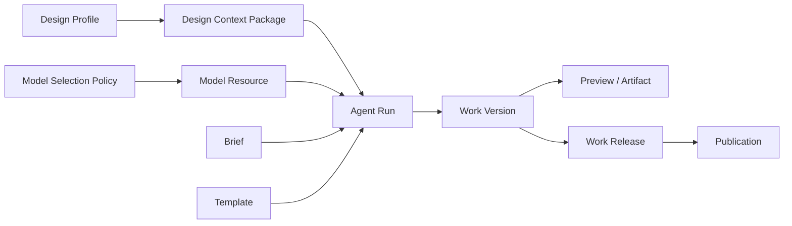

# zeronDesign 资源模型与产品化整理方案

> 日期：2026-07-18<br>
> 状态：资源模型决策稿（已按 Review 修订）<br>
> 适用范围：Web 产品层、Runtime、Provider Gateway<br>
> 目的：统一“作品、Design Profile、AI Provider”等核心资源的定义、所有权、产品入口与演进优先级。
> 配套实施计划：`2026-07-18-design-profile-productization-implementation-plan.md`
> 平台前置计划：`2026-07-18-namespace-workspace-greenfield-implementation-plan.md`
> 视觉 React Runtime 计划：`2026-07-19-visual-react-runtime-capability-implementation-plan.md`

> 实施状态（2026-07-18，第二批）：Workspace/Project 核心契约、Design Profile project/platform scope 与授权、项目绑定入口、Workspace 注册与 Project 注册 saga、按 Namespace 路由的 Sandbox/Publication，以及 Provider Gateway 租户键已落地。全新 k3d 已通过双 Workspace 双向隔离门禁，并分别完成 Website/Docs 的 Build、Preview、Edit、Artifact 与 Release 生命周期。生产 PostgreSQL/对象存储、完整 Design Profile 管理 UI、双 Workspace 并发 Build、Runtime 重启恢复和真实 Published Work k3d 门禁仍待后续批次。

## 1. 背景

zeronDesign 当前已经具备作品生成、Design Profile、模型接入、版本预览和发布等多套能力，但这些能力分散在 Web、Runtime 与 Provider Gateway 三个系统中，产品术语和资源边界尚未完全统一。

目前最容易识别的三类资源是：

1. Design Profile；
2. 作品；
3. AI Provider。

这三者并不处于同一层级：

- 作品是面向用户的核心业务聚合；
- Design Profile 是可复用、可版本化的设计资产；
- AI Provider 是模型调用基础设施，内部还需要拆分为模型资源和选择策略；
- Template、Run、Version、Artifact、Release 等是支撑作品生命周期的平台资源。

因此，本方案不把所有对象平铺成同等级菜单，而是先明确资源分类，再决定哪些资源应当成为用户可见的一等产品对象。

## 2. 核心结论

zeronDesign 的目标资源模型应当分为四个资源域：

| 资源域 | 核心资源 | 主要用户 | 产品定位 |
| --- | --- | --- | --- |
| 作品域 | Work、Brief、Run、Version、Release | 普通用户、设计者 | 核心业务 |
| 设计资产域 | Design Profile、Design Source、Fidelity Report | 设计者、品牌管理员 | 可复用设计资产 |
| 模型资源域 | Model Resource、Model Selection Policy | 平台管理员、运维 | AI 基础设施 |
| 平台资源域 | Template、Sandbox、Artifact、Audit | 平台管理员、研发 | 内部执行能力 |

当前产品化程度判断：

- 作品域：已经产品化，是当前 Web 的主体；
- Design Profile：后端和 Runtime 能力较完整，但缺少完整的 Web 管理入口；
- AI Provider：基础设施能力较完整，但仍停留在内部 Admin API；
- Template 与运行时资源：适合作为平台资源，不应全部暴露给普通用户。

已确认的 Design Profile 权限模型：

- 用户可以在项目内创建、导入、编辑、激活、归档和绑定 Design Profile；
- 用户创建的 Design Profile 是项目私有资源，只能在所属项目内发现和使用；
- 平台管理员可以创建和管理平台级 Design Profile；
- 已激活的平台级 Design Profile 对所有项目可见，但普通用户不能修改；
- 项目可以绑定本项目的已激活 Profile，或任一已激活的平台 Profile；
- MVP 不引入 workspace-scoped 或 organization-scoped Profile；Workspace 本身仍由 Kubernetes Namespace 表示；
- Profile 不因“全局可见”而自动应用，项目必须显式绑定。

已确认的租户模型：

- Kubernetes Namespace 就是 Workspace 的唯一身份；
- 不再引入 Organization 层级；
- 一个 Project 只能属于一个 Namespace/Workspace；
- 平台 Profile 是跨 Namespace 的平台资源；
- 项目 Profile 同时受 Namespace 和 Project 两层校验，但产品作用域仍表现为“项目私有”；
- 第一阶段使用一个中央 Runtime Deployment，`replicas: 1`，管理多个 Workspace Namespace；
- “单 Runtime 副本”只表示一个 Runtime Pod，不限制 Project、Run、Sandbox 或已发布作品的数量；
- 首期 Sandbox 在所属 Workspace Namespace 中按任务创建和回收，不为每个 Workspace 保留常驻 warm pool；通过镜像预拉取和缓存优化冷启动。

Design Profile 产品化的首要用户是需要在同一项目中稳定复用设计规范的项目成员；平台管理员负责提供跨项目可复用的官方 Profile。首期成功指标为：

- 已绑定 Profile 的 Build Run 能 100% 冻结并记录正确 Profile 版本与有效哈希；
- 跨项目读取项目私有 Profile 的授权测试 100% 拒绝；
- 平台 Profile 对所有合法项目可见，但普通用户修改请求 100% 拒绝；
- Profile 更新不会改变任何历史 Run 或历史版本；
- 用户可以在一个连续产品流程中完成创建/导入、激活、绑定和首次 Build。

## 3. 设计原则

### 3.1 用户语言优先

中文界面统一使用“作品”。现有代码、数据库和 API 继续使用 `Project`，本阶段不进行 `/api/projects` 到 `/api/works` 的迁移，也不增加第二套资源 ID。

建议约定：

- Project / 作品：用户创建和持续编辑的业务聚合；
- Work Version：一次成功生成或编辑形成的不可变版本；
- Artifact：某个版本生成的文件集合；
- Release：可发布的版本包；
- Publication：某个 Release 的线上部署状态。

### 3.2 资源所有权唯一

每类资源只允许一个系统作为事实来源：

- Web 产品层负责用户目录和轻量业务索引；
- Runtime 负责生成过程、作品版本、设计上下文和执行产物；
- Provider Gateway 负责模型资源、凭证、选择策略和模型执行审计。

其他系统可以保存引用和缓存，但不应复制完整状态并形成第二事实来源。

### 3.3 绑定与快照分离

作品可以绑定当前 Design Profile，模型可以通过选择策略匹配作品，但每次 Run 必须冻结实际使用的资源版本：

- Design Profile ID、版本和有效哈希；
- Template ID、版本和 manifest hash；
- Model Resource ID 和 revision；
- Model Selection Policy ID 和 revision；
- Brief 或基础 Work Version。

这能保证历史 Run 可解释、可审计、可复现。

### 3.4 普通用户资源与管理资源分离

普通用户主要操作作品和 Design Profile。AI Provider、选择策略、配额、凭证、熔断和审计应位于管理员区域，避免把基础设施复杂度直接暴露到创作流程中。

## 4. 资源全景与关系



关系约束：

1. 一个 Work 可以有多个 Brief、Run、Version 和 Release；
2. 一个 Work 同时只能有一个当前成功版本，但可以保留多个历史版本；
3. 一个 Work 可以绑定一个当前 Design Profile，也可以在某次 Run 中显式覆盖；
4. Design Profile 必须版本化，Run 只能引用冻结版本，不能引用可变的“最新版”；
5. Model Selection Policy 根据 workspace namespace、project、phase 和 agent profile 选择 Model Resource；organization 维度不参与产品匹配；
6. Work 不应永久绑定物理模型，除非产品明确提供项目级模型偏好；
7. Release 必须来自已成功生成且具备完整 Artifact Manifest 的 Work Version。

## 5. 作品域

### 5.1 Work

Work 是用户侧最重要的资源，也是其他业务资源的聚合根。

建议字段：

| 字段 | 含义 |
| --- | --- |
| id | 产品层作品 ID |
| runtimeProjectId | Runtime 使用的项目 ID；当前与产品层 id 相同 |
| ownerId | 所有者 |
| workspaceId | 所属 Kubernetes Namespace，必填且创建后不可直接修改 |
| name | 作品名称 |
| kind | website 或 docs |
| status | draft、active、archived 等业务状态 |
| currentVersionId | 当前成功版本 |
| designProfileBinding | 当前绑定的 Design Profile 引用，可选 |
| createdAt / updatedAt | 创建与更新时间 |

当前 Web 数据库和产品 API 继续使用 `projects`。中文 UI 使用“作品”，但不为文案统一引入 API 兼容层、ID 映射或数据迁移。

### 5.2 Brief

Brief 是需求确认资源，不只是对话消息。其内容包括：

- 作品类型；
- 目标受众；
- 内容层级；
- 页面结构；
- 视觉方向；
- 推荐模板；
- 假设与缺失信息。

Brief 状态包括：

- draft；
- confirmed；
- superseded。

Build Run 必须引用一个已确认 Brief，Edit Run 则应从基础 Work Version 继承其 Brief 上下文。

### 5.3 Agent Run

Run 表示一次可审计的 Agent 执行，支持：

- brief；
- build；
- edit；
- repair；
- review；
- export。

Run 应关联：

- Work；
- 父 Run，可选；
- Brief 或基础 Work Version；
- Design Profile 冻结身份；
- Template 冻结身份；
- Model Resource 执行快照；
- Conversation、Event、Permission、Checkpoint；
- 输出 Work Version 或失败原因。

Run 是过程资源，不应代替作品本身成为用户目录的一级对象。

### 5.4 Work Version 与 Artifact

每次成功 Build、Edit 或 Repair 生成一个不可变 Work Version。

Work Version 包括：

- 来源快照；
- Preview URL；
- Screenshot；
- 状态；
- 创建它的 Run；
- Artifact Manifest；
- 创建和晋升时间。

Artifact 是 Work Version 的文件交付物。应避免在产品文案中把 Artifact 直接称为“作品”。

### 5.5 Review Finding

Review Finding 是作品版本的质量问题记录，至少包含：

- severity；
- category；
- summary；
- evidence；
- repairable；
- status。

它可以触发 Repair Run，并在修复完成后关联新的 Work Version。

### 5.6 Work Release 与 Publication

Work Release 表示一个经过打包、扫描、签名和验证的发布候选。

Publication 表示线上状态，包括：

- publish；
- rollback；
- unpublish；
- 当前 release；
- generation；
- operation 状态与错误。

建议在 UI 上明确区分：

- “作品版本”：创作历史；
- “发布版本”：可部署包；
- “线上版本”：当前对外提供服务的 Release。

## 6. Design Profile 域

### 6.1 Design Source Artifact

Design Source Artifact 是导入 Design Profile 的原始设计文档，目前支持 Markdown 和纯文本。

它应保留：

- scope；
- 文件名和媒体类型；
- 内容大小；
- SHA-256；
- 原始内容；
- 创建时间。

原始内容与解析结果必须分开保存，确保转换过程可追溯。

### 6.2 Design Profile

Design Profile 是结构化设计标准，建议继续保持以下组成：

- product；
- brand；
- visual；
- tokens；
- runtimeTokenMapping；
- extendedTokenMapping；
- components；
- websiteContext；
- content；
- accessibility；
- technical；
- governance；
- signatureRules；
- overrides。

Design Profile 只支持两种目标作用域：

| 作用域 | 创建者 | 可见范围 | 可修改者 | 可绑定项目 |
| --- | --- | --- | --- | --- |
| project | 具有项目写权限的用户 | 所属项目 | 所属项目中具有写权限的用户 | 仅所属项目 |
| platform | 平台管理员 | 所有项目 | 平台管理员 | 所有项目 |

目标 scope 表达应避免使用特殊 organization ID 模拟平台范围，建议采用明确的互斥结构：

```json
{ "projectId": "project-1" }
```

或：

```json
{ "platform": true }
```

当前 Schema 只支持 project、workspace、organization，因此平台作用域需要同步扩展 Shared Schema 和 Runtime 校验。由于所有环境均为全新部署，新 Schema 直接收敛为 project 或 platform，不保留 workspace-scoped、organization-scoped Profile 的兼容写入路径。这里不影响 Namespace 作为 Workspace 租户边界。

生命周期：

```text
Design Source
  -> Import
  -> Design Profile Draft
  -> Validation / Conversion Report
  -> Activate
  -> Active Version
  -> Update / New Version
  -> Archive
```

### 6.3 Effective Design Profile

运行时不能只使用基础 Profile。它必须根据 surface 和 template 合并 override，形成 Effective Design Profile。

有效身份至少包含：

- designProfileId；
- version；
- surface；
- template；
- baseProfileHash；
- surfaceOverrideHash；
- templateOverrideHash；
- effectiveProfileHash。

### 6.4 Design Context Package

Design Context Package 是 Design Profile 面向某次 Run 的冻结执行包。它负责把设计规范转换为 Agent 必须读取和遵守的上下文，并记录：

- Profile 冻结身份；
- Template 与 surface；
- Required Reads；
- Style Contract；
- Verification Policy；
- Artifact Manifest；
- Fidelity 结果。

Design Context Package 属于 Run，不应随着 Design Profile 后续更新而改变。

Profile 解析优先级固定为：

1. Run 显式指定且对项目可见的 Profile；
2. 项目当前绑定的 Profile；
3. 未绑定时不自动选择任何平台 Profile。

平台 Profile 的“所有项目可见”不等于“默认应用”，避免平台管理员创建资源后静默改变现有项目。

### 6.5 Profile Token Sync

当作品已经生成，而绑定的 Design Profile 又发生变化时，应通过显式 Token Sync 更新作品。

同步必须采用三方 Diff：

- base：作品最初使用的 Profile token；
- current：作品当前实际 token；
- target：目标 Profile token。

对冲突项要求用户选择：

- keep_current；
- apply_target。

同步成功后创建新的 Edit Run 和 Work Version，不应直接修改历史版本。

## 7. AI Provider 域

### 7.1 Model Resource

Model Resource 是可调用模型的逻辑资源，不等同于 Provider 厂商名称。

它包含：

- displayName；
- Provider 类型；
- endpoint；
- credential reference；
- physicalModel；
- capabilities；
- timeout、retry、temperature、concurrency defaults；
- enabled；
- revision。

例如 `deepseek-v4-pro` 是一个 Model Resource，DeepSeek 是其 Provider，`deepseek-v4-pro` 是物理模型名。

### 7.2 Model Selection Policy

Model Selection Policy 决定 Run 应使用哪个 Model Resource。

匹配维度：

- workspace，即 Kubernetes Namespace；
- project/work；
- phase；
- agent profile。

所有环境均为全新部署，因此 Runtime、Shared 和 Provider Gateway 产品契约直接移除 organizationId，不保留空值或兼容分支。

策略内容：

- candidates；
- priority 与 weight；
- direct selection allowlist；
- automatic switch；
- max concurrent turns；
- daily input token limit。

### 7.3 Model Execution Snapshot

每个实际模型 Turn 应记录低敏感度执行快照：

- Model Resource ID 与 revision；
- Policy ID 与 revision；
- Provider 和物理模型；
- token usage；
- retry 和 switch 情况；
- Provider request ID；
- 状态与耗时。

Prompt、API key、endpoint 等敏感信息不应进入普通日志、指标或错误响应。

### 7.4 模型选择的产品策略

建议分三层：

1. 默认模式：普通用户不选择模型，由 Selection Policy 自动匹配；
2. 高级模式：允许用户从策略批准的 Model Resource 中选择；
3. 管理员模式：创建资源、配置凭证、编辑策略、查看执行与审计。

Work 不应直接保存物理模型和凭证。即使提供“作品默认模型”，也只能保存逻辑 Model Resource ID，并仍受 Selection Policy 授权。

## 8. Template 与平台资源

### 8.1 Template

当前已经实现的内置模板族包括：

- `next-app`：Next.js App Router + React + TypeScript，用于普通网站和前端应用；
- `fumadocs-docs`：用于文档站。

其中：

- P0 只支持受控前端交互与静态导出，不包含 Server Actions、Route Handlers、用户数据库、
  认证、后端 API 或运行时 Secret；
- `next-app` 是普通 React 创作的唯一默认网站模板，不保留旧网站模板兼容路径。

Template 定义：

- framework；
- 模板文件；
- build 与 preview 方式；
- Style Contract；
- Artifact Delivery；
- 可用组件角色；
- Design Profile capability；
- Sandbox execution profile；
- mutation policy。

Template 应版本化，并在 Run 和 Work Version 中冻结其版本和 manifest hash。

普通用户只需要在创建作品或确认 Brief 时选择模板；完整模板注册表和 capability 信息属于管理员/研发界面。

### 8.2 其他平台资源

以下资源应保留，但不建议成为普通用户一级菜单：

- Sandbox Binding；
- Preview Lease；
- Channel Lease；
- Checkpoint；
- Pending Permission；
- Audit Record；
- Runtime Outbox Event；
- Artifact Publish Record；
- Provider Circuit State；
- Quota Usage；
- Concurrency Lease；
- Encrypted Secret。

它们主要用于运行时可靠性、恢复、审计和运维。

## 9. 系统所有权与存储边界

| 系统 | 事实来源 | 可以保存的引用或缓存 | 当前主要存储 |
| --- | --- | --- | --- |
| Web | Work 目录、用户所有权、Run/Version 书签、发布任务恢复信息 | Runtime ID、最新 Run ID、Version ID | SQLite |
| Runtime | Run、Brief、Conversation、Work Version、Design Profile、Artifact、Release、Publication | Web owner 与 workspace namespace identity | 内存 + 文件日志/工件目录 |
| Provider Gateway | Model Resource、Selection Policy、Execution、Quota、Circuit、Secret、Audit | Runtime project/run scope | SQLite 或 PostgreSQL |

目标要求：

1. Web 不复制完整 Design Profile 和 Work Version；
2. Runtime 不保存 Provider API key；
3. Gateway 不保存 Work 内容和 Prompt；
4. 跨系统操作必须使用稳定 ID、revision、hash 和 idempotency key；
5. 生产环境需要明确 SQLite 与文件日志的替换或高可用策略。

Design Profile 产品化的存储门槛：

- 单 Runtime 副本的 MVP 可以继续使用现有文件日志，但必须明确为非高可用模式；这里的“副本”是 Runtime Deployment 的 Pod 数量，不是作品数量、Sandbox 数量或发布副本数量；
- 多用户生产或多 Runtime 副本部署前，必须迁移到支持唯一约束、并发版本控制、分页查询和备份恢复的持久化存储；
- Web 只能保存 Profile ID、绑定状态等引用，不复制 Profile 内容；
- Profile 列表和详情始终以 Runtime 为事实来源。

中央 Runtime `replicas: 1` 可以并发处理多个 Project 和 Run，并在不同 Workspace Namespace 创建 Sandbox、PVC、Preview 与发布资源。其限制是 Runtime Pod 重启期间控制面短暂不可用、无法零停机滚动升级、缺少控制面高可用和水平扩展能力。

## 10. 当前产品入口与缺口

### 10.1 已经产品化

Web 当前已经覆盖：

- 创建和选择作品；
- 生成、确认 Brief；
- Build；
- Edit；
- Run 事件流；
- Preview；
- Work Version 列表；
- 发布、回滚、下线；
- Design Context 诊断；
- Profile Token Sync。

### 10.2 Design Profile 缺口

Runtime 已经提供较完整 API，但 Web 缺少：

- Design Profile 列表；
- 新建和编辑；
- Design Source 上传；
- 从设计文档导入；
- Draft 校验；
- Conversion Report；
- 激活和归档；
- 版本历史和 Diff；
- Fidelity Report；
- 绑定或解绑 Work。

在补 UI 前还必须补齐 Runtime 授权。当前 Design Profile CRUD、列表和项目绑定不能仅信任请求中的 `projectId`、`scope` 或查询参数。所有操作必须从已认证 principal 和项目访问记录计算可见范围，并拒绝跨项目访问。

### 10.3 AI Provider 缺口

Provider Gateway 已经提供 Admin API，但 Web 缺少：

- Model Resource 列表和详情；
- 健康状态和 Readiness；
- 启用/停用；
- Selection Policy 列表与版本；
- 执行记录；
- 配额与熔断状态；
- 审计事件；
- 配置 Reconcile 状态。

### 10.4 契约缺口

Rust Runtime 已支持 `inputContext.modelResourceId`，但 Shared TypeScript `StartRunRequestSchema` 尚未声明该字段，Web 的 Brief、Build、Edit 请求也没有传递模型选择。

结果是：

- Runtime 底层支持显式模型资源；
- Shared Client 无法可靠传递；
- Web 当前只能使用 Gateway 自动选择策略。

需要先决定产品策略，再补齐 Shared Schema、BFF 请求和 UI。

## 11. 目标信息架构

### 11.1 普通用户区

```text
作品
├── 全部作品
├── 最近编辑
└── 已发布
```

项目私有 Profile 只能在所属项目看到，因此普通用户区不增加跨项目的 Design Profile 一级导航。

### 11.2 作品详情

```text
作品详情
├── 创作
│   ├── 对话与 Brief
│   └── Preview
├── 版本
├── Design Profile
│   ├── 当前绑定
│   ├── 本项目 Profiles
│   └── 平台 Profile 库
├── 质量检查
└── 发布
```

### 11.3 管理员区

```text
AI Providers
├── Model Resources
├── Selection Policies
├── Executions
├── Health / Quota
└── Audit Events

平台资源
├── Platform Design Profiles
├── Templates
├── Runtime Profiles
└── Sandbox 状态
```

平台管理员在独立入口管理平台 Profile。项目用户只在项目上下文中浏览平台 Profile，并通过显式绑定使用它们。

## 12. 分阶段实施建议

### P0：Namespace Workspace 边界

目标：把 Kubernetes Namespace 固定为唯一租户/Workspace 身份。

具体实施以 `2026-07-18-namespace-workspace-greenfield-implementation-plan.md` 为准；本节只保留资源模型约束。

任务：

1. Project 创建时必须绑定一个 Workspace Namespace；
2. Runtime 从认证后的 ProjectAccessRecord 解析 namespace，不信任请求 Body 或 Query 中的 workspaceId；
3. 移除产品流程对 organizationId 的依赖；
4. Sandbox、PVC、Preview 和发布资源按 Workspace Namespace 创建；
5. 中央 Runtime ServiceAccount 只获得已注册 Workspace Namespace 中所需的最小 RBAC；
6. Namespace 名称变更必须走显式迁移，不能直接更新字段；
7. Provider Policy 的 workspaceId 使用 namespace 名称。

验收标准：

- 修改请求中的 workspaceId 不能跨 Namespace 访问或创建资源；
- 每个 K8s 资源都能通过 namespace + projectId 追溯到 Project；
- 产品 API 不需要 organizationId；
- 新增 Workspace Namespace 时必须显式注册 RBAC，Runtime 不拥有无边界 cluster-admin 权限。

### P0：Design Profile 权限与作用域

目标：先建立不能被 UI 绕过的服务端授权边界。

任务：

1. 将 Profile scope 收敛为 project 或 platform；
2. 为平台 Profile 增加明确的 Schema 表达，不使用特殊 ID 模拟；
3. 为 List、Get、Create、Update、Activate、Archive、Import、Bind 增加 principal 授权；
4. 项目用户只能创建和修改本项目 Profile；
5. 平台管理员只能通过管理员身份创建和修改平台 Profile；
6. 项目列表返回“本项目 Profile + 已激活平台 Profile”；
7. 对不可见的 Profile 返回 404，避免泄漏跨项目资源是否存在。

验收标准：

- 用户无法通过修改 projectId、scope 或 profileId 访问其他项目 Profile；
- 普通用户无法修改平台 Profile；
- 平台 Profile 不会自动绑定或静默改变项目；
- 每次写操作都有 principal、scope、结果和原因的审计记录。

### P0：持久化边界确认

目标：避免把文件存储误当作多用户生产存储。

任务：

1. 第一阶段明确采用中央 Runtime Deployment `replicas: 1`；
2. 标记 Runtime 单副本限制，并验证重启恢复；
3. 多副本生产先完成 Design Profile 持久化迁移；
4. 定义版本冲突、唯一 active Profile、分页、备份和恢复；
5. 定义 Profile 与 Design Source 的归档和保留策略。

验收标准：

- 部署模式与存储能力匹配；
- 服务重启后 Profile、版本、绑定和源文件保持一致；
- 并发更新不会静默覆盖；
- 归档不会破坏历史 Run 的冻结 Design Context。

### P0：Design Profile 最小产品闭环

目标：完成一个项目内可用的端到端流程，而不是一次铺开全部管理能力。

首个闭环：

```text
项目 Design Profile 页
  -> 创建或导入项目 Profile
  -> 查看校验与转换报告
  -> 激活
  -> 绑定到项目
  -> Build 自动继承
  -> 查看 Fidelity 结果
  -> Profile 更新后执行 Token Sync
```

验收标准：

- 用户无需直接调用 Runtime API 即可完成上述流程；
- Build Run 自动继承项目绑定的 Profile；
- Profile 更新不会改变历史 Run 或历史 Work Version；
- 项目用户可以浏览和绑定平台 Profile，但不能编辑；
- 冲突同步必须经过显式确认。

### P1：Design Profile 增强

范围：

- 版本历史和 Diff；
- 完整 Fidelity Report；
- 归档与恢复体验；
- Profile 使用情况；
- 更完整的空状态、错误状态和批量操作；
- 生产持久化与一致性巡检。

### P1：AI Provider 只读管理台

目标：先提供可观测性，不改变现有 GitOps 与 Admin API 的控制模型。

范围：

1. Model Resource 列表和详情；
2. enabled、revision、capabilities；
3. Readiness 和 circuit 状态；
4. Selection Policy 列表；
5. Model Execution 和 token usage；
6. Audit Event；
7. 配置 Reconcile 状态。

Provider 写管理台暂不进入已承诺范围。只有在明确“GitOps 为主、数据库为主或混合模式”后，才能决定创建资源、轮换 Secret、修改 Policy 和 Reconcile 的交互方式。

验收标准：

- 管理员能定位一次 Run 实际使用的模型及策略；
- 普通用户不能访问 Admin 数据；
- Secret、secretRef、endpoint 和 Prompt 不通过管理台泄露；
- 只读管理台不改变 Gateway 配置状态。

## 13. 建议的产品 API 视图

不要求立即修改底层 Runtime 路由，但建议 Web BFF 对外提供稳定的产品资源视图：

```text
GET    /api/projects
POST   /api/projects
GET    /api/projects/{projectId}
GET    /api/projects/{projectId}/versions
GET    /api/projects/{projectId}/releases
GET    /api/projects/{projectId}/publication

GET    /api/projects/{projectId}/design-profiles
POST   /api/projects/{projectId}/design-profiles
POST   /api/projects/{projectId}/design-profile-sources
POST   /api/projects/{projectId}/design-profile-imports
GET    /api/projects/{projectId}/design-profiles/{profileId}
PUT    /api/projects/{projectId}/design-profiles/{profileId}
POST   /api/projects/{projectId}/design-profiles/{profileId}/activate
POST   /api/projects/{projectId}/design-profiles/{profileId}/archive
PUT    /api/projects/{projectId}/design-profile-binding

GET    /api/admin/design-profiles
POST   /api/admin/design-profiles
GET    /api/admin/model-resources
GET    /api/admin/model-resources/{resourceId}
GET    /api/admin/model-selection-policies
GET    /api/admin/model-executions
GET    /api/admin/provider-audit-events
```

所有普通用户 Design Profile API 都带 `projectId`，由 BFF 先验证项目成员关系，再由 Runtime 独立验证 principal 和资源 scope。平台 Profile 写操作只能经过管理员 BFF。

## 14. 需要确认的产品决策

以下决策已经锁定：

1. 中文 UI 使用“作品”，代码和 API 保持 `Project`；
2. 用户 Profile 为项目私有，平台管理员 Profile 对所有项目可见；
3. 一个项目同时绑定一个当前 Profile；
4. 平台 Profile 必须由项目显式绑定，不自动应用；
5. AI Provider 第一阶段只做管理员只读视图；
6. Kubernetes Namespace 是唯一 Workspace 层级，不引入 Organization；
7. 当前不新增 Workspace 级 Profile，用户 Profile 仍为 Project 私有；
8. 第一阶段采用一个中央 Runtime Deployment，`replicas: 1`，管理多个 Workspace Namespace。

进入对应阶段前仍需确认：

1. Docs 是否与 Website 使用同一套 Profile 编辑字段和 Fidelity 体验；
2. 普通用户是否可以选择 Model Resource，还是始终由管理员 Policy 决定；
3. Template 是否允许用户自定义，还是仅由平台内置；
4. Project 删除后，Version、Artifact、Release、Publication、Profile 和 Audit 的保留策略；
5. Provider 最终采用 GitOps 为主、数据库为主还是混合管理模式；
6. Provider、Runtime 与 Shared Contract 移除 organizationId 后的 Schema 版本命名。

## 15. 当前仓库中的实际声明资源

根据 2026-07-18 的仓库静态扫描和已确认部署前提：

- 未发现已提交的 Work/Product SQLite、Runtime JSONL 或 Provider 数据库实例；
- 声明了一个本地 Model Resource：`deepseek-v4-pro`；
- 声明了一个默认 Policy：`local-deepseek-v4-pro-default`；
- Policy 覆盖 brief、build、edit、repair；
- 自动模型切换关闭；
- 内置 `next-app` 和 `fumadocs-docs` 模板族；`next-app` 已注册到 Template Registry。
- 当前没有需要保留的 Kubernetes、数据库、Profile、Project 或 k3d 环境；所有部署从新 Schema 和新 Namespace 模型开始。

因此，本文描述的是代码与配置中的资源能力，不代表某个正在运行环境中的实际资源数量。

## 16. 代码依据

- Web 产品资源索引：`apps/web/lib/db.ts`
- Web 当前产品界面：`apps/web/components/project-shell.tsx`
- Shared Runtime 契约：`packages/shared/src/api-types.ts`
- Runtime 领域类型：`services/runtime/src/types.rs`
- Runtime 资源存储：`services/runtime/src/conversation.rs`
- Design Profile API：`services/runtime/src/http_api/routes/design_profiles.rs`
- Design Source API：`services/runtime/src/http_api/routes/design_sources.rs`
- Work Release：`services/runtime/src/release/model.rs`
- Publication：`services/runtime/src/publication/model.rs`
- Template Registry：`services/runtime/src/templates/registry.rs`
- Model Resource 与 Policy：`services/provider-gateway/src/lib.rs`
- Provider Gateway 存储迁移：`services/provider-gateway/migrations/0001_postgres_shared_state.sql`
- 当前 DeepSeek 声明配置：`infra/provider-gateway/model-resources.deepseek-v4-pro.json`

## 17. 最终定位

zeronDesign 不应被描述为“一个项目生成器加几个配置页面”，而应被描述为：

> 一个以作品为核心、以 Design Profile 保证设计一致性、以 AI Provider 策略提供模型能力、并支持版本化生成与可靠发布的设计生产平台。

围绕这个定位：

- 作品是核心产品资源；
- Design Profile 是核心差异化资产；
- AI Provider 是可治理的模型基础设施；
- Template、Run、Artifact、Release 是支撑可重复生产的执行资源。
- 当前产品优先形成视觉优先的 React 前端创作闭环；Lovable 式全栈能力在该闭环稳定后以
  独立 Epic 评审和实施。
