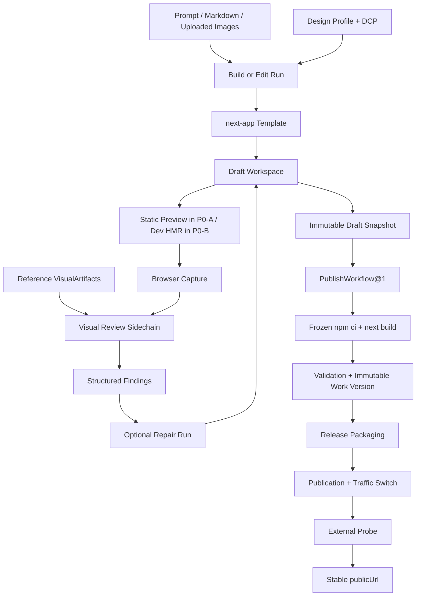

# 视觉优先 React Runtime 可落地实施方案

## 1. 文档结论

本方案把现有 Website/Docs 生成 Runtime 扩展为视觉优先的 React 前端创作 Runtime，使用户能够：

```text
自然语言 / Markdown / 视觉参考
-> 确认 Brief、Design Profile 与模板
-> 生成受控的 next-app React 项目
-> 预览并持续修改
-> 由视觉模型查看真实截图并给出审查结果
-> 每次成功生成或编辑形成可恢复 Draft Snapshot
-> 点击发布后从冻结 Snapshot 形成不可变 Work Version
-> 获得真实、稳定的 publicUrl
```

工程评审结论为：

- 不把全部能力作为一个单一 P0 发布门槛；
- 按 P0-A、P0-B、P1 三个可独立验收的交付切片实施；
- P0-A 先证明 React、视觉输入、视觉审查和真实发布的垂直闭环；
- P0-B 再加入 HMR、元素定位、影响确认和版本恢复；
- Component Registry 与 Asset Generate 放入 P1；
- Lovable 式数据库、认证、Secret 和后端能力继续作为独立 Full-stack Epic。

本计划复用现有 Brief、Run、Tool Executor、Sandbox、Design Context、Build、Validation、
Candidate、Version、Release 和 Publication 内核，不新增第二套项目、预览或发布系统。新增的
`DraftSnapshot` 是创作历史资源，不冒充现有可发布 `WorkVersion`；新增的 `PublishWorkflow@1`
只负责在现有 Build、Release 和 Publication 之上编排完整发布事务。

### 1.1 2026-07-19 实施状态

本轮已完成 Wave 0～Wave 6 的 Runtime、共享契约、`next-app`、测试与文档落地。这里的“完成”指
代码与确定性测试已交付；依赖真实凭证、集群、DNS/发布目标或容量数据的生产 Canary 仍是部署
验收项，不能用 Fake Provider 或本地测试结果冒充。

| 切片 | 已落地能力 | 验证状态 |
|---|---|---|
| Wave 0 | Shared/Rust Contract、Draft/Visual/Publish/Edit/Asset 类型与 Fixture | TypeScript typecheck、Schema/Client 测试通过 |
| Wave 1 | `next-app`：Next 16、React 19、App Router、shadcn/Base UI、Tailwind v4、静态导出 | Template Registry 与真实模板构建测试通过 |
| Wave 2 | VisualArtifact、Run Binding、图片 Content Block、多模态 Provider、Visual Review Sidechain | 无视觉模型时 `unavailable` 且主任务继续；Fake Provider 与 Runtime 测试通过 |
| Wave 3 | `PublishWorkflow@1`、冻结 Snapshot 构建、WorkVersion、Release、Publication、外部 Probe 与回滚 | 确定性状态机/HTTP 测试通过；真实集群 Canary 保留为显式 ignored 测试 |
| Wave 4 | DraftPreviewSession、单 Writer Lease、Revision CAS、SSE、Next Dev/HMR、持久化 Revision | HMR、重启、冲突与恢复集成测试通过 |
| Wave 5 | ElementObservation、签名 Impact Plan、一次性批准、History/Restore、Draft EditBase | stale base、并发、重复批准与 Restore 测试通过 |
| Wave 6 | shadcn Registry Search/Inspect/Install、ProjectAsset Import/Generate | Provider 缺失返回可恢复非阻塞结果；供应链与资产测试通过 |

本次没有拆出独立 Browser Worker Pool：第 16 节已将它定义为容量数据触发的可选部署优化，当前
本地 Backend 与上层协议已隔离，未来切换无需改变 Agent、Review 或 Artifact Contract。

门禁最终语义：

- 普通 Build/Edit 的完成条件是 Durable DraftSnapshot 与可用 Preview；视觉模型、Component
  Registry 或 Asset Provider 不可用不得把主 Run 置为失败；
- 高影响编辑的一次性确认只阻止对应 Mutation，不冻结其他生成、预览或低风险编辑；
- `visualReview.mode=required` 只影响目标 Snapshot 的发布资格，不删除 Draft，也不改写已完成主 Run；
- 真实 Provider、集群发布、外部 URL 与容量基准是生产放量门禁，不是开发环境启动门禁。

验证命令：

```bash
cargo test --manifest-path services/runtime/Cargo.toml --tests
cd packages/shared && npm run typecheck && npm test && npm run build
cargo fmt --manifest-path services/runtime/Cargo.toml --check
git diff --check
```

已知验证债务不隐藏：仓库级 HTTP 架构脚本仍会因 6 个实施前已存在的超长
RunLifecycle/HTTP 测试模块返回失败；本轮新增的 `projects.rs` 超长与 SSE 测试发现问题已通过拆分
消除。仓库级 `cargo clippy --tests -- -D warnings` 仍有既有 lint 债务；本轮新增模块暴露的 lint
已修复。真实 Publish/Provider Canary 需要部署环境与凭证，继续作为显式 ignored 测试和上线清单，
不得计入本地确定性测试的“通过”口径。

## 2. 产品范围

### 2.1 P0-A：React 视觉生成闭环

P0-A 必须交付：

- 通用 `next-app` Template；
- Next.js App Router、React、TypeScript 和静态导出；
- shadcn/ui、Base UI primitives 与 Tailwind CSS v4 基线；
- 自然语言、Markdown 和上传图片输入；
- 候选截图与参考图以真实图片内容进入视觉模型；
- 独立、只读的 Visual Review Sidechain；
- Visual Review 默认不阻断正常生成；
- 真实 Production Build、Validation、Work Version、Release 和 Publication；
- 发布成功后返回经过外部探测的稳定 `publicUrl`。

P0-A 不要求 HMR。首个切片可以继续使用真实静态构建产生 Static Preview，以优先证明
React 模板、多模态链路和真实发布正确性。生成完成时必须持久化不可变 `DraftSnapshot`；
Static Preview 只作为预览证据，不因此获得 Release 资格。

### 2.2 P0-B：快速创作与安全编辑

P0-B 必须交付：

- 复用现有 Preview Lease 的 Next Dev/HMR；
- Draft Revision、Draft Snapshot、Session Epoch 和崩溃恢复；
- Durable DraftSnapshot + Dev Ready 后完成正常生成；
- Production Build 从普通生成路径移到用户点击发布之后；
- 自然语言编辑、Revision 绑定的元素选择与 Edit Impact Plan；
- 高影响修改的一次性确认；
- History List 和从历史 Draft Snapshot 或 Work Version 创建新 Draft；
- Draft、Promoted Work Version 和 Published Release 严格隔离。

### 2.3 P1：组件与资产生态

P1 包含：

- 复用 shadcn Registry 协议的内部 Component Registry；
- Project Asset Import 与 Asset Generate；
- 组件、图片和设计来源的版本、哈希、许可证与 Provenance；
- Browser Capture Backend 的独立 Worker Pool 扩展能力，是否启用由容量数据决定。

Figma 导入不属于当前 P1。当前 Runtime 尚未冻结通用 MCP Transport、Connector 生命周期、
授权边界、工具发现和版本兼容契约，因此本方案不注册 Figma Tool、不暴露 Import API，也不加入
Figma 专属 Schema 或配置。后续只有在通用 MCP 架构评审通过后，才以独立 Epic 重新设计。

### 2.4 后续 Full-stack Epic

以下能力不属于 P0-A、P0-B 或 `next-app` 的隐含能力：

- Server Actions 和动态 SSR 业务逻辑；
- Route Handlers 或自定义后端 API；
- 用户数据库、Schema Migration、备份与恢复；
- 登录、Session、OAuth 和应用级权限系统；
- Runtime Secret、用户环境变量和第三方凭证；
- Background Job、有状态服务和业务级外部集成。

当前 Template 不预留绕过静态前端边界的半成品接口。

## 3. User Story 映射

| 交付切片 | 主要 User Stories | 本方案能力 |
|---|---|---|
| P0-A | US-P0-01～15A、19～22 | `next-app`、上传参考图、视觉审查、静态 Preview、真实发布 URL |
| P0-B | US-P0-15B、16～18；US-031～033 | Draft HMR、自然语言编辑、元素定位、Impact Plan、Draft/Version Restore |
| P1 | US-P0-13B、15A 的生态增强 | shadcn Registry、Asset Import/Generate |

US-P0-13B 在 P0-A 只要求模板内置核心 shadcn 组件和用户上传资产；按需组件 Registry 与 AI
生成图片属于 P1，不阻断 P0-A。

US-P0-16/18 中面向用户的“可恢复版本”映射为 `DraftSnapshot`；发布域原有 Version 映射为
`WorkVersion`。UI 的 History 可以统一展示二者，服务端不得用同一状态或 ID 空间混用。

## 4. 当前基础与关键缺口

| 能力 | 当前基础 | 需要实施 |
|---|---|---|
| 工程修改 | `fs.*`、`project.*`、受控依赖安装 | 注册并实现 `next-app` |
| 模板 | `next-app`、Fumadocs Docs | 通用 React Template 与声明式 Dev/Policy 契约 |
| 设计约束 | Design Profile、DCP、Style Contract | shadcn Token 映射与视觉参考 Binding |
| Preview | Build、静态 Preview、Lease、Proxy | P0-B 增加 Dev Mode、Revision 和 HMR |
| 浏览器证据 | 真实 PNG、尺寸、Hash | 图片 Content Block、并发 Backend 和 Route/Viewport 身份 |
| 模型链路 | 文本消息和 Tool Result 字符串 | 受信图片解析、Vision Capability 和 Visual Review Run |
| Review/Repair | 只读 Review 与受控 Repair | 复用为 Visual Review/Repair 编排 |
| Design Source | Markdown/纯文本 | 新增独立 VisualArtifact，不扩展文本 Source 语义 |
| 依赖 | 内部 Registry、`--ignore-scripts` | 分层允许目录与版本/许可证/兼容策略 |
| 发布 | Version、Release、Publication、`publicUrl` | 完成真实外部 URL E2E 门禁 |
| 外部设计工具导入 | Runtime 尚无冻结的通用 MCP 架构 | 不进入当前范围；独立技术预研与 Epic |

## 5. 设计原则

1. Draft Workspace 是可变工作区；Draft Snapshot、Work Version 和 Release 是不可变资源，Publication Desired State 受 CAS 保护。
2. 视觉审查是独立证据，不替代构建、A11y、内容验收或外部 URL 探测。
3. 没有视觉模型时不得伪造视觉通过，但默认不能阻止主要生成任务完成。
4. Template 行为由冻结的声明式契约驱动，Tool 中不得散落 `templateId == "next-app"` 分支。
5. 用户点击发布必须从冻结 Source Snapshot 执行真实构建，不能发布 Dev Server 状态。
6. 组件优先复用 shadcn Registry；不建设第二套组件文件分发协议。
7. 在通用 MCP 架构完成前，不注册任何产品专属 MCP Tool 或 Connector 配置。
8. 所有迟到事件都必须通过 Project、Session、Epoch 和 Revision 身份被接受或拒绝。
9. 每次成功生成或编辑都产生可恢复 Draft Snapshot；只有权威 Production Build 成功后才产生可发布 Work Version。
10. 每个 Project 同时只有一个 Draft Writer Lease；多标签页和并发 Run 使用 Revision CAS，不能最后写入者静默覆盖。

## 6. 目标架构



### 6.1 URL 边界

| URL | 目的 | 生命周期 |
|---|---|---|
| `draftUrl` | Next Dev/HMR；P0-B | 临时、带 TTL、不能作为发布目标 |
| `candidateUrl` | 静态 Preview 或权威构建产物验收 | 绑定不可变 Artifact；只有权威 Publish Build 产生的 Work Version 才具备 Release 资格 |
| `publicUrl` | 最终访问地址 | 绑定当前 Published Release，必须经过外部探测 |

## 7. `next-app` Template 契约

### 7.1 Template Identity

| 字段 | 值 |
|---|---|
| `templateId` | `next-app` |
| `framework` | `nextjs` |
| `surface` | `website` |
| Router | Next.js App Router |
| Language | React 19 + TypeScript |
| UI System | shadcn/ui |
| Primitive Backend | Base UI |
| Styling | Tailwind CSS v4 |
| Production Build | `npm run build` |
| Artifact | `out/` |
| Draft Command | `next dev --hostname 0.0.0.0` |
| Package Manager | npm，通过内部 Registry |

`next-app` 是唯一规范 ID。共享 Schema 中已有但未落地的 `nextjs-website` 不再用于创建新项目；
如存在历史数据，只在读取边界提供兼容别名。

Template Identity 必须冻结：

```text
templateId
templateVersion
manifestSha256
sandboxExecutionProfile
dependencyPolicyVersion
componentRegistryVersion
validationContractVersion
```

### 7.2 Seed 文件

```text
package.json
package-lock.json
next.config.mjs
tsconfig.json
postcss.config.mjs
components.json
app/layout.tsx
app/page.tsx
app/globals.css
app/tokens.css
components/ui/
lib/utils.ts
public/assets/
```

模板默认包含以下 shadcn/Base UI 组件源码：

```text
button
card
input
label
textarea
tabs
dialog
dropdown-menu
select
tooltip
skeleton
separator
```

其余组件在 P1 通过冻结的内部 shadcn Registry 按需安装。

### 7.3 shadcn 与 Tailwind v4 规则

- `components.json` 固定 Base UI、路径别名、CSS 文件和 CSS Variables 策略；
- Tailwind v4 使用 CSS-first 配置和 `@theme inline`；
- Design Profile Token 映射到 shadcn 语义变量，例如 `--background`、`--primary`、
  `--border`、`--radius`；
- 禁止同时安装或混用 Radix 版本的同名 shadcn 组件；
- 不在生成时运行 `npx shadcn@latest`；
- Template 构建阶段冻结 CLI、Registry Base、依赖版本、组件源码和文件 Hash；
- `components.json`、`next.config.mjs` 和锁文件属于受保护契约文件。

受保护不等于永远不可变：普通 Agent `fs.*` 不得修改这些文件；P1 的
`component.install` 是唯一特权写入通道，只能应用 Runtime 根据冻结 Registry Item 计算出的
预览 Diff，并在事务内重新执行 Template Contract、依赖 Policy、Lockfile 和 Hash 校验。失败时
整个事务回滚，不能留下半安装状态。

### 7.4 声明式 TemplateSpec 扩展

现有 `TemplateSpec` 扩展为：

```text
TemplateSpec
  identity
  files
  productionBuild
  developmentServer?
  artifactDelivery
  sourceContract
  mutationRules
  dependencyPolicyRef
  componentRegistryRef?
  styleContract
  validationContract
  operations
```

`project.build`、`preview.dev_start`、`fs.*`、依赖安装和 Validation 必须读取同一份冻结 Spec。

### 7.5 Route Operation

不建设通用 React 页面 DSL。

现有 `project.write_page` 对 `next-app` 收敛为 `project.ensure_route` 语义，只负责：

- 将安全路由映射到 `app/**/page.tsx`；
- 创建合法的基础页面文件；
- 更新 Route Manifest；
- 拒绝路径穿越、冲突路由和受保护文件覆盖；
- 返回模型后续使用 `fs.*` 编辑的源码路径。

导航、区块、组件、状态和交互意图属于 Brief/Planning 上下文，不形成需要与 React 双向同步的
持久化页面 IR。

### 7.6 Mutation Policy

声明式 Mutation Rules 至少支持：

- 禁止路径和 glob；
- 禁止源码模式；
- 禁止 import 类别；
- 保护配置字段；
- 依赖目录检查；
- 稳定 `errorKind` 和修复建议。

`next-app` 当前必须拒绝：

- `pages/`、`src/pages/`；
- `app/api/**`、`route.ts`、`route.js`；
- `"use server"`、Server Action 和 server-only 业务模块；
- 数据库、Auth、Secret SDK 和后台任务依赖；
- 删除或修改 `output: "export"` 等静态导出硬约束；
- 第二个 `package.json`、嵌套应用根或自定义脚手架；
- 未经依赖 Policy 允许的包或安装源。

禁止 `route.ts` 是当前产品安全边界，不描述成 Next.js 框架的绝对限制。

### 7.7 依赖治理

依赖采用分层目录：

1. Template Core：Next、React、Tailwind、shadcn/Base UI 与核心组件所需依赖；
2. Visual Catalog：预批准的无障碍组件、图标、动画、class 工具和少量图表包；
3. Denied：未收录包、Git URL、HTTP tarball、越界 `file:`、原生扩展和生命周期脚本依赖。

所有依赖必须：

- 经过内部 Registry；
- 使用允许的包名和版本范围；
- 记录许可证、兼容范围和扫描状态；
- 保持 `--ignore-scripts`；
- 将 `package-lock.json` 纳入 Source Snapshot；
- Production Build 使用 `npm ci`，不得发生版本漂移。

### 7.8 静态导出校验

采用双层校验：

- Draft 阶段：轻量 `static_export_eligibility` 预检，输出 Overlay Warning，不阻断 HMR；
- Publish 阶段：冻结 Source Snapshot 后执行全新 `npm ci && next build`，作为权威结果。

预检覆盖动态请求 API、Server Action、默认图片优化、非法路由和配置漂移。预检不代替真实
`next build`。

### 7.9 Completion 与 Publish 命名

现有 `preview.publish` 表示生成 Candidate/Promoted Version，容易与用户点击“发布到公网”混淆。
`next-app` 不再把它作为 Build/Edit Run 的完成条件：

- Draft 生成/编辑完成使用内部 Operation `draft.snapshot_create`；
- 权威候选构建使用 `version.build_and_promote`；
- 用户公网发布只对应 `publish.workflow_start`；
- 旧模板继续兼容 `preview.publish`，但新增契约和 UI 不再使用该名称。

## 8. 核心数据模型

### 8.1 DraftSnapshot、WorkVersion 与 PublishSource

`DraftSnapshot` 满足 User Story 中“每次成功生成或编辑都可恢复”的版本语义；`WorkVersion`
保持现有发布域中的不可变候选语义。UI 可以把两者统一展示在“历史版本”中，但 API、状态和
发布资格必须区分：

`WorkVersion` 是本文对现有 `ProjectVersion` Candidate/Promoted 资源的语义名称，不新增第二张
Version 表或第二套状态机；`DraftSnapshot` 才是新增的轻量创作历史资源。

```text
DraftSnapshot
  snapshotId
  projectId
  sourceSnapshotUri
  sourceHash
  templateId
  templateVersion
  dependencyPolicyVersion
  designContextHash
  createdByRunId
  basedOnSnapshotId?
  restoredFromVersionId?
  createdAt
  retentionState: active | deletion_pending | protected
```

- 每次成功 Generation/Edit/Repair 在完成前创建一个不可变 `DraftSnapshot`；失败操作不能创建可恢复历史项；
- P0-A 从静态 Workspace 直接创建 `DraftSnapshot`；P0-B 的 `durableRevision` 指向一个 `DraftSnapshot`；
- `DraftSnapshot` 不要求 Production Build，不具备 Release 资格；
- `WorkVersion` 只能由冻结 PublishSource 的权威 Production Build 和 Validation 创建；
- Release 继续只接受现有 promoted `WorkVersion`，不直接接受 DraftSnapshot。

DraftSnapshot 默认作为用户历史长期保留。用户删除后先从 History 隐藏并进入
`deletion_pending`；仍被当前 Draft、WorkVersion、Release、Publication、Finding 或审计记录引用时
转为 `protected`，只允许逻辑删除。无引用对象由异步 GC 物理删除，且必须记录 Source Hash、引用
扫描结果和删除审计。

所有发布入口使用统一判别联合，不假设 P0-B 已存在：

```ts
type PublishSource =
  | {
      kind: "static-snapshot";
      projectId: string;
      snapshotId: string;
      expectedSourceHash: string;
    }
  | {
      kind: "draft-revision";
      projectId: string;
      sessionId: string;
      sessionEpoch: number;
      revision: number;
      snapshotId: string;
      expectedSourceHash: string;
    };
```

Runtime 在 `source_frozen` 前重新校验 Project、Snapshot、Hash 和 Draft Revision；之后所有步骤
只读取冻结 Source Snapshot，不再读取 Workspace。

### 8.2 VisualArtifact

文本 `DesignSourceArtifact` 保持 Markdown/纯文本语义。图片使用独立资源：

```text
VisualArtifact
  id
  projectId
  mediaType
  sizeBytes
  width
  height
  sha256
  storageUri
  origin: upload | browser | generated
  originMetadata
  createdAt
  retentionState: active | deletion_pending | protected
  deleteAfter?
```

```text
RunVisualBinding
  runId
  artifactId
  role: reference | candidate
  route
  viewport
  target:
    draft: sessionId + sessionEpoch + sourceRevision + sourceHash
    version: versionId + artifactManifestHash
    staticSnapshot: snapshotId + sourceHash
  order
```

输入限制：

- P0-A 只接受 PNG、JPEG、WebP；
- 服务端嗅探真实 MIME；
- 解码后重新编码，移除 EXIF/ICC 等非必要元数据；
- 同时限制压缩字节、像素总数和长宽；
- Provider Gateway 只能读取当前 Run 已绑定的 Artifact；
- 读取后再次校验 MIME、尺寸和 SHA-256。

生命周期规则：

- 用户删除未被引用的 Artifact 后立即进入 `deletion_pending`，对象存储异步清理；
- 被 DraftSnapshot、WorkVersion、Release、Finding 或审计证据引用时标记 `protected`，禁止物理删除；
- Project 删除触发引用扫描，Release 保留策略优先于 Project 级清理；
- 每日 GC 删除超过保留期且无引用的对象，并记录 Artifact ID、Hash、原因和操作者；
- Provider 临时副本不得超过请求处理窗口，日志中不得记录图片字节或可重放下载地址。

### 8.3 Visual Review State

```text
visualReview
  mode: off | advisory | required
  status: not_requested | queued | passed | findings | unavailable | failed
  runId?
  reason?
```

默认 `mode=advisory`。上传参考图不会自动切换为 `required`。

当视觉资源不可用时：

```text
generationStatus = completed
visualReview.status = unavailable
publishReadiness = 由确定性检查决定
```

只有用户或组织策略显式选择 `required` 时，视觉不可用或未完成才使整体 Run 结果为 `partial`，
并令 `publishReadiness.visualReview=blocked`；已生成 Draft、DraftSnapshot 和 Preview 仍必须保留，
用户可以继续编辑、重试或改回 Advisory。`required` 不得把已完成的主要生成任务改为失败，
但在视觉检查通过或策略被有权限的用户修改前，不得提升 WorkVersion 或切换 Publication。

Visual Review 状态按目标 Snapshot/Version 保存。后续重试创建新的 Review Run 和状态记录，不修改
已经终态化的 Build/Edit Run；Project 级 `publishReadiness` 始终根据当前目标身份的最新有效记录计算。

### 8.4 DraftPreviewSession（P0-B）

```text
DraftPreviewSession
  sessionId
  projectId
  sandboxBindingId
  templateId
  baseSnapshotId
  baseVersionId?
  writerLeaseId
  writerLeaseExpiresAt
  workspaceRevision
  lastReadyRevision
  durableRevision
  durableSnapshotId
  publishRevision?
  sessionEpoch
  status
  proxyUrl
  startedAt
  lastActivityAt
  restartCount
  lastError?
```

状态机：

```text
starting -> ready -> updating -> ready
                  -> compile_error -> updating -> ready
                  -> crashed -> restarting -> ready
                  -> failed
ready/failed -> stopped
```

Revision 语义：

- `workspaceRevision`：文件事务提交后立即递增，用于 HMR；
- `lastReadyRevision`：浏览器已成功显示的 Revision；
- `durableRevision`：已写入不可变 Source Snapshot 的 Revision；
- `durableSnapshotId`：当前 Durable Revision 对应的 `DraftSnapshot`；
- `sessionEpoch`：Dev Process 或 Sandbox 恢复后递增，用于拒绝旧进程迟到事件；
- Publish 必须冻结目标 Revision，并等待其成为 Durable。

Writer 规则：

- 每个 Project 同时最多一个有效 Draft Writer Lease，其他标签页默认只读；
- Edit 请求必须携带 `writerLeaseId + expectedSessionEpoch + expectedWorkspaceRevision`；
- Runtime 使用 CAS 提交文件事务，冲突返回稳定错误，不自动重放高影响修改；
- Lease 随心跳续期，过期或 Sandbox 丢失后由 Runtime 回收；接管会递增 `sessionEpoch`；
- 同一 Project 仍保持最多一个 active mutable Run，Dev Session 可以跨 Run 存活，但写入权不能跨 Lease 漂移。

### 8.5 ElementObservation（P0-B）

```text
ElementObservation
  observationId
  projectId
  sessionId
  sessionEpoch
  workspaceRevision
  route
  viewport
  domPath
  dataSlot?
  accessibleName?
  visibleTextHash?
  boundingBox
  sourceCandidates[]
  confidence
  screenshotCropArtifactId
  expiresAt
  signature
```

Observation 只对创建它的 Revision 有效，不宣称跨 Revision 稳定。高置信度定位可以生成局部
Edit Plan；多候选或低置信度必须要求用户确认。模型不能提交任意 Selector 冒充用户选择。

### 8.6 ProjectAsset（P1）

VisualArtifact 是输入或证据；ProjectAsset 是最终项目资源：

```text
ProjectAsset
  projectId
  sourceArtifactId
  source: upload | generated
  targetPath
  contentHash
  license
  provenance
  width
  height
  altText
  createdByRunId
```

资源写入使用内容寻址路径，例如 `public/assets/<hash>-hero.webp`，并纳入 Source Snapshot 和
Artifact Manifest。禁止直接依赖可能过期的 Provider/CDN URL。

## 9. 多模态与 Visual Review

### 9.1 Content Block 契约

Runtime 与 Provider Gateway 支持文本、JSON 和图片内容块：

```json
{
  "content": [
    { "type": "text", "text": "Desktop candidate screenshot" },
    {
      "type": "image",
      "mimeType": "image/png",
      "artifactId": "visual-artifact-123",
      "sha256": "...",
      "width": 1440,
      "height": 900
    }
  ]
}
```

Provider Gateway 在发送请求前解析受信 Artifact，并转换为具体 Provider 的图片协议。不得把
图片 URI 序列化成普通字符串后假装模型已查看图片。

### 9.2 模型资源选择

Model Resource Capability 增加：

```text
visionInput: boolean
supportedImageMediaTypes
maxImageBytes
maxImageCount
```

资源选择规则：

- Build/Edit 主模型不要求具备视觉能力；
- Visual Review Run 只选择 `visionInput=true` 的资源；
- 主模型未来具备多模态能力时，可以映射到同一物理资源；
- 即使使用同一物理模型，Visual Review 仍是独立、只读的逻辑 Run；
- 不得降级到文本模型并标记视觉通过。

生产放量门禁（不阻止代码合入、开发环境启动或普通 Build/Edit）：

- 启用生产 Visual Review 流量前必须配置至少一个生产可用的 `visionInput=true` Model Resource；
- Resource Snapshot 必须冻结 Provider、Model、区域、协议版本、最大图片限制和 Prompt Policy 版本；
- 上线前用真实凭证通过协议 Canary、配额/限流演练、超时和成本预算验证；
- 未配置或临时不可用时，Advisory 返回 `unavailable` 并继续主要生成流程；
- `required` 模式只阻止发布资格，不能删除 DraftSnapshot 或把 Build/Edit 主 Run 改为失败。

### 9.3 Runtime 编排边界

`visual.review` 和 `visual.compare` 不作为普通 Agent Tool。

```text
Build/Edit Run
-> Static Snapshot、Draft Revision 或 Work Version 目标身份冻结
-> Runtime 采集候选截图
-> Runtime 创建 Visual Review Sidechain
-> 注入参考图和候选图
-> 视觉模型调用 review.report_finding
-> Runtime 可选创建 Repair Run
```

Agent 可使用的只读工具保持：

- `browser.screenshot`；
- `browser.inspect_dom`；
- `review.report_finding`。

Runtime Operations：

- `schedule_visual_review`；
- `compare_visual_artifacts`；
- `schedule_repair`。

### 9.4 Visual Finding

```text
findingId
reviewRunId
target: draft | version | staticSnapshot
snapshotId?
candidateVersionId?
sessionId?
sessionEpoch?
sourceRevision?
sourceHash
route
viewport
category
severity
summary
evidenceArtifactIds
targetObservationId?
suggestedChange
status
modelResourceSnapshot
```

Category 至少覆盖布局、层级、排版、色彩、间距、边框/圆角、图片裁切、密度、一致性和
响应式表现。不得用不透明总分替代具体 Finding。

每条 Finding 必须至少绑定一个 evidence Artifact，并包含可验证的 Route、Viewport 和元素或
像素区域；无法定位的主观建议只能标记为 `advisory_note`，不能计入发布门禁。

## 10. Draft Preview 与正常生成（P0-B）

### 10.1 Preview Lease 扩展

复用现有 Sandbox Binding、Preview Lease 和安全 Proxy，增加 `dev` 模式，不建设独立 Dev
Preview 服务。

新增 Runtime Operations/Tools：

- `preview.dev_start`；
- `preview.dev_status`；
- `preview.dev_stop`。

规则：

- 编译错误不销毁 Session；
- UI 保留上一成功 Revision，并显示错误 Overlay；
- Dev Server 最多自动重启两次；
- Sandbox 丢失后恢复 `durableRevision`，并递增 `sessionEpoch`；
- 未持久化 Revision 丢失时必须明确提示回退；
- Session 具有 TTL、并发配额和空闲回收；
- 回收不影响 Version、Release 或 Publication。

### 10.2 正常生成完成条件

P0-B 启用后：

```text
Source 已持久化
+ 已创建当前结果对应的 DraftSnapshot
+ 当前 durableRevision 对应的 Draft Preview Ready
= generationStatus completed
```

Visual Review、静态导出预检、A11y Finding 和发布资格使用独立状态，不阻止用户继续创作。

需要修改当前 Build/Edit Prompt 中“必须 `preview.publish` 后才能 `run.complete`”的固定流程，为
`next-app` Draft Profile 增加独立 Completion Policy。

### 10.3 双层持久化

- 文件事务成功后立即更新 `workspaceRevision` 并触发 HMR；
- DraftSnapshot 在编辑静默窗口或一次 Agent Edit 成功结束时后台合并生成；
- 每次成功生成、Edit 或 Repair 都必须产生可恢复 DraftSnapshot；连续键入可以合并，但一个已向用户报告成功的 Agent 操作不能没有历史项；
- `durableRevision + durableSnapshotId` 成功后 UI 才显示“已保存”；
- 点击发布必须等待目标 Revision 持久化；
- 发布构建只读取冻结 Snapshot，不读取正在变化的 Workspace。

## 11. 编辑、影响确认与恢复（P0-B）

### 11.1 Edit Base 与并发迁移

现有 Edit Lifecycle 要求 `baseVersionId == current promoted version`，不能直接承载发布前 Draft
编辑。P0-B 冻结新的请求联合：

```ts
type EditBase =
  | {
      kind: "work-version";
      versionId: string;
    }
  | {
      kind: "draft";
      snapshotId: string;
      sessionId: string;
      expectedSessionEpoch: number;
      expectedWorkspaceRevision: number;
      writerLeaseId: string;
    };
```

- 旧 Website/Docs Profile 继续使用 `work-version`；
- `next-app` Draft Profile 默认使用 `draft`；
- Runtime 在启动 Run 和提交每个文件事务时均校验 Writer Lease 与 Revision CAS；
- stale 请求返回 `edit.base_stale`，附带最新 Snapshot/Revision，不静默重放；
- 同一 Project 的一个 active mutable Run 约束继续保留。

### 11.2 Edit Impact Plan

```text
scope: local | page | global
targets
operations: copy | style | layout | component | navigation | delete | dependency
risk: low | medium | high
requiresConfirmation
editBase
sessionId
sessionEpoch
workspaceRevision
planHash
```

低风险文案和局部 Token 修改可以自动执行。删除页面、导航变化、全站 Profile、全局布局、依赖
变化和大规模内容重写必须确认。

批准必须：

- 绑定 `planHash`；
- 只能消费一次；
- Revision 或输入变化后失效；
- stale plan 返回稳定冲突错误，不尝试自动套用。

### 11.3 元素选择

选择流程：

```text
用户点击 iframe 元素
-> 浏览器 SDK 采集 DOM/Accessibility/Bounding Box
-> Runtime 创建签名 ElementObservation
-> Runtime 搜索可能源码并计算 confidence
-> Edit Run 冻结 Observation
-> 模型生成局部或需确认的 Impact Plan
```

P0-B 不引入 Next/Turbopack/SWC 编译期 Node ID 插件。只有真实数据证明低置信度比例不可接受
时，才把编译期源码标记作为后续增强。

### 11.4 History List 与 Restore

新增：

- `history.list`：统一返回 `draft_snapshot | work_version`，并明确是否可恢复、可发布；
- `draft.restore`：从历史项创建新 DraftSnapshot 和 Draft Session；
- 现有 `version.list` 保持兼容，只返回 Work Version。

Restore：

- 不修改历史 DraftSnapshot 或 Work Version；
- 从选中历史项的 Source Snapshot 创建新 Draft；
- 记录 `basedOnSnapshotId` 或 `restoredFromVersionId`；
- 使用当前 Template Compatibility 和依赖恢复流程；
- 不自动 Production Build；
- 不改变当前 Published Release；
- Restore 成功后创建新的可恢复 DraftSnapshot；
- 用户点击发布后才形成新的 Work Version/Release 并切换线上流量。

## 12. 点击发布与真实 URL

### 12.1 `PublishWorkflow@1` 所有权

点击发布立即返回 `operationId`。Runtime 是权威 Operation Owner，Web/BFF 只代理并恢复展示。
本方案确定新增父级 `PublishWorkflow@1`，不扩展现有 `PublishOperation@1` 的前置语义：现有
Publication 仍只消费已验证 Release，父级 Workflow 负责在它之前完成冻结、构建和创建 Work Version。

```text
requested
-> source_frozen
-> building
-> validating
-> release_packaging
-> release_validated
-> desired_state_committed
-> reconciling
-> workload_ready
-> traffic_switched
-> external_probe_passed
-> completed
```

终态还包括 `failed`、`cancelled`、`rolled_back` 和 `rollback_failed`。用户只允许在
`desired_state_committed` 前取消；流量已切换后的失败必须进入 `rolling_back`，不能直接标记
`failed`。`rollback_failed` 触发 P0 告警和人工处置，但仍保留新旧 Release 与全部证据。

父级 Workflow 以持久化状态机编排现有 Build、ProjectVersion、Release 和 Publication API；不能由
浏览器串联多个不可恢复请求。每个阶段记录输入 Hash、子 Operation ID、尝试次数和完成证据，
从任意 Runtime 重启点恢复时不得重复创建 Work Version、Release 或切换流量。

### 12.2 发布流程

1. 接受第 8.1 节定义的 `PublishSource` 和 Idempotency Key；
2. 对 `static-snapshot` 直接校验 Snapshot/Hash；对 `draft-revision` 校验 Writer 身份并等待目标 Revision 成为 Durable；
3. 冻结 Source Snapshot、Template、依赖 Policy、Design Context 和当前 Visual Review Policy；若策略为 Required，先校验目标身份的 Visual Review 已通过；
4. 在干净环境执行 `npm ci && next build`；
5. 校验 `out/`、Route、交互、Console、A11y、Metadata 与 Artifact Integrity；
6. 创建并提升不可变 Work Version；
7. 创建、扫描、签名并验证 Release；
8. 使用 CAS 提交 Publication Desired State；
9. 工作负载 Ready 后切换流量；
10. 从独立于目标工作负载和集群 Ingress 的 Probe Runner 探测 `publicUrl`；
11. 探测通过后标记成功并返回 URL。

Probe Runner 必须验证 DNS、TLS、HTTP 2xx、目标 Release ID 和 Content Hash。默认在 120 秒窗口内
指数退避重试，单次请求 10 秒超时；失败时恢复旧 Release，并把探测日志作为 Workflow 证据。

### 12.3 失败语义

- Production Build 失败：Draft 保留，Publication 不变；
- Release 扫描失败：Work Version 保留，Publication 不变；
- 流量切换或外部探测失败：恢复旧 Release；
- UI 不得提前显示“发布成功”；
- 预测 URL 可以展示为“准备中”，不能作为成功证据；
- 重试使用 Idempotency Key、PublishSource Identity 和 Expected Current Release CAS。

## 13. 组件与资产（P1）

### 13.1 shadcn Registry

内部 Component Registry 复用 shadcn：

- `registry:base` 固定 Base UI 与设计系统基线；
- `registry:component` / `registry:item` 分发组件源码；
- Runtime 增加版本、Hash、许可证、来源、安全扫描和 Template 兼容元数据；
- 安装前展示文件和依赖 Diff；
- 安装后重新执行 Source Contract 和依赖 Policy 校验；
- 项目专属组件可以发布为内部 Registry Item，不要求公开发布。

平台 Operation：

- `component.search`；
- `component.inspect`；
- `component.install`。

当前 P1 Registry 基线提供少量可选组件用于验证完整协议和安装闭环；“完整组件生态”不是本轮
完成声明。扩充 Item Catalog 只增加冻结 Registry 数据，不改变工具或项目契约。

### 13.2 Asset

- 图标优先使用已批准的 Lucide/shadcn 图标；
- `asset.import` 导入用户上传资产；
- `asset.generate` 只用于摄影、插画和纹理等真实视觉需求；
- 生成前读取目标槽位尺寸、比例和裁切要求；
- Provider 不可用默认不阻止普通生成；
- 用户显式要求某图片必须存在时，结果可以标记 `partial`，但保留 Draft。

`asset.generate` 通过 `ASSET_GENERATION_PROVIDER_ENDPOINT` 与可选的
`ASSET_GENERATION_PROVIDER_AUTH_TOKEN` 接入 Provider。Provider 必须返回内联 Base64、
`providerIdentity`、`modelVersion` 与许可证；Runtime 拒绝临时远程 URL，规范化后先形成
`VisualArtifact(origin=generated)`，再写入内容寻址 `ProjectAsset`。Endpoint 未配置或暂时不可用
时返回 `asset.provider_unavailable`、`blocking=false`、`partial=true`。

## 14. API、事件与错误契约

### 14.1 Shared Contract 变更

需要在 `packages/shared` 中新增或扩展：

- `next-app` Template ID；
- `ToolResultContentBlock`；
- `ModelVisionCapability`；
- `DraftSnapshot` / `PublishSource` / `EditBase` / `HistoryItem`；
- `VisualArtifact` / `RunVisualBinding`；
- `VisualReviewState` / `VisualFinding`；
- `DraftPreviewSession` / `DraftPreviewEvent`；
- `ElementObservation` / `EditImpactPlan`；
- `PublishWorkflow@1` 父级状态、阶段证据与子 Operation 引用；
- P1 的 `ProjectAsset` 和 Component Registry 类型。

### 14.2 Draft 事件

```text
preview.dev_starting
preview.dev_ready
preview.dev_updating
preview.dev_compile_error
preview.dev_restarting
preview.dev_failed
preview.dev_stopped
source.revision_committed
source.revision_durable
source.snapshot_created
```

每个事件必须包含：

```text
projectId
sessionId
sessionEpoch
workspaceRevision
snapshotId?
sourceHash?
timestamp
```

UI 只接受当前 Epoch 且 Revision 不小于已知 Revision 的事件。

### 14.3 稳定错误码

| errorKind | 影响范围 |
|---|---|
| `template.protected_contract_mutation` | 拒绝具体源码修改 |
| `template.static_export_forbidden` | Draft Warning；Publish Build 阻断 |
| `dependency.not_in_catalog` | 拒绝具体安装 |
| `visual.artifact_invalid` | 拒绝图片输入 |
| `visual.artifact_forbidden` | 拒绝越权读取 |
| `visual.resource_unavailable` | 默认 Advisory，不阻断生成 |
| `preview.dev_session_stale` | 拒绝旧 Session 命令 |
| `preview.revision_stale` | 拒绝迟到事件或编辑 |
| `preview.writer_lease_conflict` | 拒绝非 Writer 标签页或过期 Lease 写入 |
| `edit.base_stale` | 返回最新 Snapshot/Revision，要求重新计划 |
| `element.observation_stale` | 要求重新选择元素 |
| `edit.plan_stale` | 要求重新生成 Impact Plan |
| `publish.source_identity_stale` | 拒绝错误 Snapshot、Hash 或 Revision 发布 |
| `publish.external_probe_failed` | 发布失败并保留旧 Release |

## 15. 安全与供应链

必须具备：

- Project/Workspace 级 VisualArtifact 授权；
- DraftSnapshot、VisualArtifact 的保留、引用保护、用户删除和 Project 删除 GC；
- 图片解码、重新编码、MIME 嗅探和像素限制；
- Provider Gateway 只解析 Run Binding 内的 Artifact；
- 无任意本地路径或公网 URL 图片读取；
- npm 只走内部 Registry；
- 禁止生命周期脚本、Git 依赖、任意 tarball 和未批准包；
- Template 配置与组件 Registry Hash 冻结；
- Preview Proxy 继续使用现有 Principal Token 和 Project Prefix；
- ElementObservation 由 Runtime 签名并绑定 Revision；
- Publish 使用 Idempotency Key、PublishSource Identity 和 Current Release CAS；

## 16. Browser Capture Backend

当前 Runtime 的截图与 computed-style 采集共享单进程锁。P0-A 先抽象：

```text
BrowserCaptureBackend
  capture(request)
  inspectDom(request)
  health()
```

P0-A 实现：

- 继续使用本地 Chromium Backend；
- 初始每个 Runtime 实例最多 `2` 个并发 Capture、全局队列 `20`、每 Project 最多 `2` 个排队请求；
- 排队 Deadline `15s`、单次 Capture Deadline `30s`，超限返回 `visual.resource_unavailable`；
- 队列按 Project Round-robin，交互式用户请求优先于定时 Canary，但不能饿死后台任务；
- 默认每次自动视觉审查最多 `2 Routes × 2 Viewports`；
- 相同 Candidate、Route、Viewport 和 Artifact Hash 去重；
- Queue Timeout 使 Visual Review `unavailable`，不阻止正常生成；
- 记录 Queue Wait、Capture Duration、Timeout 和项目用量。

以上数值为 P0 初始配置，必须可配置并由负载测试验证；达到队列容量时立即降级，不允许无界等待
拖慢 Build/Edit 完成。

只有容量数据证明需要时，P1 才切换独立 Browser Worker Pool，上层协议保持不变。

## 17. 可观测性与 SLO

### 17.1 Draft 时间点

```text
editAcceptedAt
workspaceCommittedAt
compilerStartedAt
compilerReadyAt
iframeAppliedAt
durableSnapshotAt
```

`iframeAppliedAt` 必须由浏览器 SDK 携带 `sessionEpoch + revision` 回报。只看到 Next 编译完成
不等于用户已经看到更新。

### 17.2 性能目标

| 指标 | 目标 |
|---|---|
| Warm 文案/CSS：commit → iframe applied | P50 ≤ 1 秒；P95 ≤ 3 秒 |
| Warm 结构修改 | P50 ≤ 2 秒；P95 ≤ 5 秒 |
| Cold dev session | P50 ≤ 15 秒；P95 ≤ 30 秒 |
| commit → durable snapshot | P95 ≤ 5 秒 |
| Visual Review | 单独统计，不计入生成完成延迟 |
| Publish Build | 单独统计，不计入 HMR 延迟 |

Cold SLO 的前提是 Template 依赖进入 Warm Pool 或镜像层。依赖变化触发的慢重启必须单独统计。

### 17.3 关键指标

- `draft_preview_start_duration_ms`；
- `draft_hmr_apply_duration_ms`；
- `draft_snapshot_duration_ms`；
- `draft_session_restart_total`；
- `browser_capture_queue_wait_ms`；
- `browser_capture_timeout_total`；
- `visual_review_unavailable_total`；
- `visual_review_finding_total{category,severity}`；
- `publish_build_duration_ms`；
- `publish_external_probe_failure_total`；
- `published_url_time_to_ready_ms`。

## 18. 测试策略

### 18.1 阻断 CI 的确定性测试

- Template Spec、Manifest Hash、版本解析和历史别名；
- Route 映射、Source Contract 和 Mutation Rules；
- shadcn Seed、Tailwind Token 和内部 Registry 安装；
- 依赖目录、锁文件和 `npm ci`；
- VisualArtifact MIME、像素、Hash、权限和 Binding；
- Content Block 到不同 Provider 请求的转换；
- Vision Capability 选择和无资源降级；
- Advisory/Required 对 generationStatus、Run terminal status 和 publishReadiness 的组合状态；
- Visual Review Sidechain、Finding 和 Repair 编排；
- DraftSnapshot 创建/恢复/删除保护，Draft Revision、Writer Lease、Epoch、回退和迟到事件；
- ElementObservation 与 stale plan；
- PublishSource 冻结、Work Version 幂等创建、Release CAS；
- 发布失败保留旧 Release。

### 18.2 集成与 Browser E2E

- `next-app` 初始化后执行真实 `npm ci && next build`；
- `out/` 包含完整路由与静态资源；
- Desktop/Mobile 无文档级横向溢出；
- 交互控件具备预期状态；
- Draft 文案、CSS 和结构修改达到 HMR SLO；
- 编译错误保留上一成功画面；
- Sandbox 恢复到 `durableRevision`；
- 上传参考图与候选图进入同一 Visual Review 输入；
- 点击发布后由独立 Probe Runner 请求 `publicUrl`；
- 返回 HTTP 2xx，页面 Release ID/Content Hash 与目标版本一致；
- 发布更新失败时原 URL 继续服务旧 Release。

### 18.3 视觉模型测试

- CI 使用 Fake Vision Provider，保证 Finding、重试、降级和 Repair 流程确定；
- 定时 Canary 使用真实多模态模型和版本化固定基准集；
- Canary 记录成功率、协议错误、成本、延迟和 Finding 趋势；
- P0 初期真实视觉评分不阻断普通 PR；
- 不以单个不透明视觉总分作为发布门禁。

固定基准集至少包含 `30` 个页面样本、Desktop/Mobile 两类 Viewport，以及布局溢出、遮挡、层级、
排版、对比度、间距、图片裁切和响应式缺陷。每个样本记录已知缺陷、允许的主观差异和证据区域。
Wave 2 上线门槛为：协议成功率 `>= 99%`、有证据的已知缺陷召回率 `>= 80%`、高严重度误报
`<= 10%`；模型、Prompt Policy 或图片转换协议变化时重新跑完整基准。初期指标用于能力放量和
回滚，不作为普通 Build/Edit Run 的完成门禁。

## 19. 实施分解

### 19.1 Wave 0：契约冻结

主要模块：

- `packages/shared/src/schemas.ts`；
- `packages/shared/src/api-types.ts`；
- `packages/shared/src/events.ts`；
- `packages/shared/src/runtime-client.ts`；
- `services/runtime/src/templates/spec.rs`；
- `services/runtime/src/types.rs`；
- `services/provider-gateway/src/lib.rs`。

交付：

- 冻结 Template、DraftSnapshot、PublishSource、EditBase、VisualArtifact、Content Block、Vision Capability、Visual Review 和发布状态；
- 冻结 `PublishWorkflow@1` 父级编排与现有 Release/Publication 的边界；
- 冻结 Artifact/Snapshot 保留、删除、引用保护和 GC 契约；
- 冻结错误码和兼容迁移；
- Shared TypeScript、Rust 和 Provider Gateway 双向契约测试。

退出条件：所有新增 Contract 能 round-trip，`next-app`/Fumadocs 契约无回归。

### 19.2 Wave 1：P0-A `next-app`

主要模块：

- 新增 `services/runtime/src/templates/next_app/`；
- 更新 Template Registry 与可用性检查；
- 扩展 Project Init、Route Operation、Build、Mutation Policy；
- 新增 shadcn/Base UI/Tailwind v4 Seed；
- 配置 `next-app` Sandbox Execution Profile 和依赖预热。

退出条件：使用版本化的 `30` 条 Prompt Corpus，覆盖 Landing、Dashboard、Portfolio、Blog、
Form 和多路由网站；固定 Template/Provider/Prompt Policy Snapshot 连续执行 `3` 次，至少 `90%`
用例一次生成后通过真实 `next build`、Desktop/Mobile 和 Artifact 校验，`100%` 产物确认为
Next/React 且不存在受保护契约或供应链越界。失败用例必须可复现并归档。

### 19.3 Wave 2：P0-A VisualArtifact 与多模态 Sidechain

主要模块：

- VisualArtifact Store 与 HTTP API；
- `browser.screenshot` Content Block；
- Runtime `model_gateway` 多模态消息；
- Provider Gateway 图片协议转换；
- Visual Review/Repair 编排；
- BrowserCaptureBackend 与有界队列。

开发进入条件：Fake Vision Resource 与无资源降级契约已冻结，不要求开发者本机持有生产凭证。
生产放量条件：至少一个生产 `visionInput=true` Resource 已配置，凭证、区域、配额、限流、
超时和成本预算已通过 Canary。

退出条件：上传参考图与候选截图以真实像素进入视觉模型；无视觉资源时正常生成完成并产生
明确 Warning；Fake Provider CI 通过；真实 Provider 达到第 18.3 节基准阈值；Artifact 删除、
引用保护和 GC E2E 通过。

### 19.4 Wave 3：P0-A 真实发布

主要模块：

- 新增 `PublishWorkflow@1` 父级状态机；
- 冻结 PublishSource 的 Production Build；
- Release/Publication 编排；
- Web 发布进度与恢复；
- k3d/目标环境外部 URL E2E。

退出条件：P0-A `static-snapshot` 与 P0-B Contract Fixture 中的 `draft-revision` 都能启动同一 Workflow；
点击发布后返回 Operation ID，最终取得可由独立 Probe Runner 访问的稳定 `publicUrl`；Runtime
在每个阶段被强制重启后均可恢复，且失败更新不影响旧 Release。

### 19.5 Wave 4：P0-B Draft HMR

主要模块：

- Preview Lease `dev` mode；
- DraftPreviewSession Store；
- Source Revision 与 Snapshot 合并；
- Draft Writer Lease、Revision CAS 和多标签页只读/接管；
- SSE 事件与 iframe ACK；
- Web Draft/Promoted/Published 状态；
- Warm Pool 与性能指标。

退出条件：达到第 17 节 SLO；编译错误、Dev Server 重启和 Sandbox 恢复不破坏上一成功版本。

### 19.6 Wave 5：P0-B 编辑与恢复

主要模块：

- ElementObservation Browser SDK 与 Runtime API；
- Edit Impact Plan 与一次性确认；
- History List、DraftSnapshot/WorkVersion Restore；
- stale base、重复批准和并发 Edit 测试。

退出条件：每次成功生成/Edit/Repair 都产生可恢复 DraftSnapshot；stale base、Writer Lease 冲突、
重复批准和并发 Edit 均不能覆盖较新 Revision；任何失败操作都不改变当前线上 Release。

### 19.7 Wave 6：P1 设计生态

主要模块：

- shadcn Registry Search/Inspect/Install；
- ProjectAsset 与 Asset Provider；
- 组件/资产 Provenance 与许可证；
- 可选独立 Browser Worker Pool。

退出条件：按需组件和生成图片均可追溯、可重建，并且 Registry/Provider 不可用不会破坏普通
生成主链路。

## 20. Definition of Done

### 20.1 P0-A DoD

1. `next-app` 已注册、版本化并通过真实 Next.js 构建。
2. Template 使用 shadcn/Base UI/Tailwind v4，且核心组件源码可由模型编辑。
3. 普通网站默认生成 React/Next.js，不保留旧网站模板兼容分支。
4. 每次成功生成都创建不可变、可恢复 DraftSnapshot，失败生成不创建历史项。
5. 上传参考图和候选截图以真实图片内容进入视觉模型。
6. Visual Review 是只读 Sidechain，Finding 绑定 Snapshot/Version 身份、Source Hash 和证据区域。
7. 没有视觉模型时正常生成仍完成，UI 明确显示未执行视觉审查；Required 只阻止发布资格。
8. 至少一个生产视觉 Resource 通过真实 Canary 和固定缺陷基准；资源缺失时按策略明确降级。
9. 点击发布通过 `PublishWorkflow@1` 执行冻结 PublishSource 的真实构建。
10. 只有 Publish Build 成功才创建具备 Release 资格的 Work Version。
11. Release、Publication、流量切换和外部探测全部通过后才返回成功。
12. `publicUrl` 可由独立 Probe Runner 访问，并与目标 Release/Content Hash 一致。
13. 发布失败时旧 URL 和旧 Release 保持可用。

### 20.2 P0-B DoD

1. Next Dev/HMR 复用现有 Preview Lease 和安全 Proxy。
2. Draft Session 具备 Workspace、Ready、Durable Revision 和 Session Epoch。
3. Draft Session 具备单 Writer Lease；多标签页、stale Edit 和并发 Run 不会静默覆盖。
4. Durable DraftSnapshot + Dev Ready 后正常生成完成，不等待 Production Build。
5. 每次成功生成、Edit 和 Repair 都创建可恢复 DraftSnapshot。
6. 文案/CSS、结构修改和 Cold Session 达到 SLO。
7. 编译错误保留上一成功画面并可在相同 Session 修复。
8. Sandbox 丢失后恢复 Durable Revision，未持久化回退被明确告知。
9. ElementObservation 绑定 Revision、签名并具备置信度。
10. 高影响修改使用一次性 Impact Plan 确认。
11. History Restore 创建新 DraftSnapshot，不改变历史项或线上 Release。

### 20.3 P1 DoD

1. Component Registry 复用 shadcn Registry 协议。
2. 组件安装具有文件/依赖 Diff、版本、Hash、许可证和兼容证据。
3. ProjectAsset 使用本地内容寻址文件，不依赖临时远程 URL。
4. Component Registry 或 Asset Provider 不可用不阻止普通生成。
5. 当前 Runtime 不暴露 Figma MCP Tool、Import API、专属 Schema 或 Connector 配置。

## 21. 风险与缓解

| 风险 | 级别 | 缓解 |
|---|---|---|
| 当前主模型不支持图片输入 | 高 | 独立 Vision Resource；默认 Advisory；真实 Canary |
| Tool Result 仍被字符串化 | 高 | Wave 0 冻结 Content Block；Gateway 双向契约测试 |
| Draft 历史与发布 Version 语义混淆 | 高 | DraftSnapshot/WorkVersion 分层；History API 显式区分 |
| 现有 Publication 要求先有 Release | 高 | Runtime 新增 `PublishWorkflow@1` 父级编排，不改变下层前置语义 |
| Dev 可运行但静态导出失败 | 高 | Draft 预检 + Publish 权威 `next build` |
| HMR 快但未持久化编辑丢失 | 高 | Workspace/Durable 双层 Revision、每次成功操作的 DraftSnapshot 与 UI 保存状态 |
| 多标签页或并发 Edit 覆盖 | 高 | 单 Writer Lease、Revision CAS、stale base 冲突与接管 Epoch |
| 截图全局锁导致排队 | 中高 | Backend 抽象、有界队列、限额、指标和后续 Worker Pool |
| 视觉模型输出不稳定 | 中高 | 结构化 Finding、固定缺陷基准、Fake Provider CI、真实 Canary 不阻断普通生成 |
| 图片或 Snapshot 删除造成泄露/悬挂引用 | 高 | 引用保护、保留策略、Project 删除扫描、审计和异步 GC |
| shadcn 版本漂移 | 中 | 禁止 `latest`；冻结 Registry Base、组件源码和 Hash |
| 任意依赖供应链风险 | 高 | 内部 Registry、允许目录、锁文件、禁脚本和扫描 |
| 点击元素定位错误源码 | 中高 | Revision 绑定 Observation、置信度和低置信确认 |
| 发布接口存在但 URL 不可访问 | 高 | 集群外 E2E、External Probe、旧 Release 回退 |

## 22. 实施约束与最终决策记录

本方案已冻结以下决策：

- 交付拆分为 P0-A、P0-B、P1；
- Visual Review 保持独立逻辑 Sidechain，可映射到同一多模态物理模型；
- 没有多模态资源时默认不阻止主要生成任务；
- Draft Preview 复用现有 Preview Lease；
- Draft 使用 Workspace/Ready/Durable Revision 与 Session Epoch；
- 每次成功生成、Edit 或 Repair 创建不可变 DraftSnapshot；
- DraftSnapshot 负责可恢复历史，WorkVersion 只由权威 Production Build 创建并具备 Release 资格；
- P0-A 与 P0-B 统一通过判别联合 PublishSource 进入发布；
- 静态导出采用 Draft 预检和 Publish 权威构建；
- 点击发布由 Runtime `PublishWorkflow@1` 父级状态机编排，现有 Release/Publication 契约保持不变；
- 独立 Probe Runner 的 DNS、TLS、Release ID 和 Content Hash 验证作为发布成功证据；
- `next-app` 使用 shadcn、Base UI 和 Tailwind v4；
- Template 只预置核心组件，其余复用内部 shadcn Registry；
- 依赖使用分层允许目录；
- VisualArtifact 与文本 Design Source 分离；
- Template 扩展保持声明式，不在 Tool 中散落 Next 特例；
- Route Operation 只负责安全脚手架，不建设页面 DSL；
- 视觉模型真实结果进入 Canary，不直接阻断普通 PR；
- P0-B 正常生成在 Durable DraftSnapshot + Dev Ready 时完成；
- P0-B 使用单 Draft Writer Lease、EditBase 判别联合与 Revision CAS；
- Browser Capture 使用可替换 Backend 与有界队列；
- 元素定位使用 Revision 绑定的签名 Observation；
- Figma/MCP 导入移出当前方案，等待通用 MCP 架构评审后以独立 Epic 重启；
- Component Registry 复用 shadcn Registry；
- ProjectAsset 从不可变 VisualArtifact 派生；
- VisualArtifact 和 DraftSnapshot 具备引用保护、删除、保留与 GC 生命周期。

后续 Full-stack Epic 不得反向扩大本方案的静态 `next-app` 契约。
