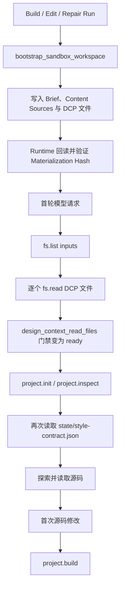
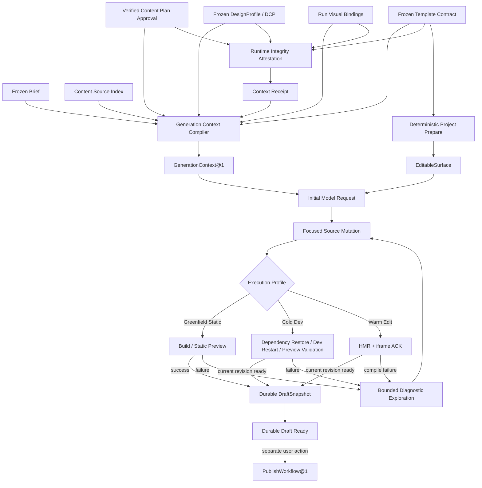

# Generation Context 与构建前探索优化实施方案

## 1. 文档结论

当前 Runtime 已能冻结 DesignProfile、编译 Design Context Package（DCP）、物化输入文件、校验
Artifact/Materialization Hash，并通过 Style Contract 约束生成结果。现阶段主要问题不是缺少安全
门禁，而是把以下两件事耦合在了一起：

1. Runtime 验证 DCP 数据完整性；
2. 模型通过 `fs.read` 理解设计上下文。

这种耦合导致 Runtime 已完成可信校验后，模型仍必须逐个读取 Brief、DesignProfile、usage、
component recipes 和 template style contract；同时 Agent 又会通过 `fs.list`、`project.inspect` 和
源码读取重新发现模板结构。结果是首个源码修改和首次构建发生得过晚，并增加 Tool Call、输入
Token、恢复分支和 Provider 行为差异。

本方案的核心改造是：

```text
Runtime 冻结并验证完整 DCP
          ↓
生成紧凑、不可变的 GenerationContext@1
          ↓
首轮模型请求直接注入一次
          ↓
模板返回声明式 EditableSurface
          ↓
模型直接修改目标源码
          ↓
Runtime 执行 Greenfield Static / Cold Dev / Warm HMR Profile
          ↓
失败时才开放有限诊断探索
```

完整 DCP 文件继续保留在 Workspace 中，作为审计、恢复、精确修复和按需读取的事实来源；正常
Build/Edit 不再要求模型逐文件读取后才允许修改或构建。

存在 DCP 时，每个 Run 只能绑定并加载自己的当前冻结 DCP，不得遍历、合并或注入历史 Run 的 DCP。后续 Run
如果得到相同的设计上下文语义，可以复用按 `contextContentHash` 缓存的编译结果，但必须生成独立的 Run
Binding，用于授权、审计、恢复和生命周期隔离。跨 Run 复用的是不可变编译结果，不是上一个 Run
的模型读取状态、Conversation 或工具结果。

一个 Run 的 GenerationContext、冻结资源与 Run Binding 在首轮模型请求前确定后不得替换。任何会改变
Content Plan、Visual Binding、Design/Profile Override、EditImpactPlan、EditBase 或适用规则集合的操作，
都必须结束当前 Run 并创建新的 Build/Edit/Repair Run。新 Run 可以引用同一 Base Revision 或失败诊断，
但必须获得新的 `runId`、Context Payload、双 Hash 和独立 Approval Preflight；本方案不引入 Run 内
`generationContextRevision` 或可变 Binding 历史。

DCP 只描述当前 Run 的冻结任务目标和设计约束，不描述项目当前源码，也不保存历史修改结果。
Build 可以使用完整设计 Capsule；Edit/Repair 必须以冻结的 Base Revision 和当前源码为事实起点，
通过已有 `EditImpactPlan` 限定目标范围，只加载安全可筛选的 DCP 内容。DCP 的 preferred rules 和
optional guidance 不得扩大修改范围或把用户已经接受的实现改回初始设计。

本方案是 2026-07-19 总方案的运行时优化子方案，不重新定义 `DraftPreviewSession`、
`DraftSnapshot`、`WorkVersion`、`PublishWorkflow@1`、`VisualArtifact`、`ElementObservation` 或完整
`EditImpactPlan`。这些资源继续由总方案负责；本方案必须显式组合它们，不能用简化的 Context 或
Workflow State 覆盖原有 Revision、一次性确认、视觉像素交付、版本晋升和发布隔离语义。

从用户结果出发，成功路径不是“模型开始写代码”或“执行了一次 Build”，而是：

```text
已确认内容与设计输入
→ 正确修改当前 Draft
→ 用户在 Preview 中看到对应 Revision
→ 修改形成可恢复 DraftSnapshot
→ 用户点击发布后才执行权威 Production Build 并切换固定 URL
```

因此 Greenfield Static Build、Cold Dev Validation 与 Warm HMR Edit 必须使用不同完成路径。Warm Edit 不得为了证明 Context
已生效而默认执行 Production Build；HMR Ready 也不得被解释为 WorkVersion 晋升或公网发布。

该改造不得降低以下安全边界：

- DesignProfile、Brief、Template 与 DCP 身份必须在 Run 启动时冻结；
- Artifact Hash、Materialization Hash、Template、Surface 和 App Root 必须由 Runtime 校验；
- Style Contract Identity 必须由 Runtime 校验；
- Imported Design Source 的读取范围与 Source Fallback 预算不得放宽；
- 缺少视觉模型、GenerationContext 优化能力或非必要 Design Profile 信息不得阻止主生成任务；
- 显式 `enforced` 的数据完整性错误继续失败关闭。
- 新 Build 必须绑定最近一次已确认的 Content Plan；未确认或已失效的内容方案不得进入生成；
- `run.complete` 最多完成当前 Draft 并创建 `DraftSnapshot`，不能隐式 Promote 或 Publish；
- Preview、Snapshot、WorkVersion 和 Published Release 的身份与 Revision 不得混用。

## 2. 范围

### 2.1 本期范围

- 新增 `GenerationContext@1` 运行时契约；
- 将已确认 Content Plan 的身份、Approval Attestation 和内容 Provenance 纳入冻结 Context；
- 将 DCP 门禁拆分为 Runtime Attestation 与 Model Context；
- 正常 Build/Edit 移除强制 DCP 文件读取；
- 为 Template Contract 增加 `EditableSurface`；
- 复用现有 `EditImpactPlan`，按 Phase、scope、targets 和 operations 选择本次适用的 DCP 规则；
- 按运行阶段裁剪观察工具和提示词；
- 基于现有 Read Lease 扩展 Mutation Lease，并对同一路径、同一内容 Hash、同一消息窗口 Epoch 的完整文件读取进行 Token 去重；
- 为会话压缩、重启恢复和旧 Run 提供兼容策略；
- 增加真实 Provider 的效率与可靠性验收指标。
- 组合总方案已有的 Draft Revision、HMR ACK、DraftSnapshot、VisualArtifact 和 Publish 隔离不变量。

### 2.2 不在本期范围

- 修改 DesignProfile 产品资源模型；
- 修改 DCP 的冻结版本语义；
- 重新设计 `DraftPreviewSession`、`DraftSnapshot`、`WorkVersion` 或 `PublishWorkflow@1`；
- 设计 Content Plan 编辑器、Approval UI 或“哪些变更属于重大变化”的产品策略；本方案只消费产品层输出的
  版本化 `ContentPlanApproval@1`；
- 重新设计 `VisualArtifact`、Provider Image Content Block 或 `ElementObservation`；本方案只定义它们与
  GenerationContext 的身份绑定和调用边界；
- 删除 Workspace 中的完整 DCP Artifact；
- 放宽跨 Project、Namespace、Run 或 Sandbox 的读取权限；
- 将 Visual Review 改成主 Run 的默认硬门禁；
- 用更高 Turn、Tool 或 Token 上限掩盖重复探索；
- 引入新的全栈、数据库、认证或 MCP 能力。
- 在首版 Observation 去重中新增 Range Read、File ETag 或全局 Workspace Revision 协议；这些能力
  等 Workspace Backend 提供稳定原语后再单独设计。

本方案虽然不负责 Content Plan 编辑器和“重大变化”产品策略，但 `ContentPlanApproval@1` 的 Producer、
Store、读取 API、失效事件和现有确认数据迁移是启用新 Context 的硬前置依赖。依赖未交付时只允许
`shadow`，不得进入 `enabled` 或通过伪造 `verified` Approval 绕过。

### 2.3 User Story 映射与范围决策

| User Stories | 本方案职责 | 依赖的总方案契约 |
|---|---|---|
| US-P0-08、10～13 | 冻结已确认 Content Plan、Design Profile、Template 和 Acceptance；减少重复上下文读取 | 内容整理、来源标记和 Approval UI |
| US-P0-13、13A、14 | 加快 Greenfield Static/Cold Dev 生成与失败恢复，不削弱 Template/Build Attestation | `next-app`、DraftSnapshot、确定性 Validation |
| US-P0-15A | 绑定 VisualArtifact 身份；不以文本摘要冒充图片，不把 Advisory Review 变成主任务硬门禁 | Image Content Block、Visual Review Sidechain |
| US-P0-15B | Warm Edit 走 HMR/iframe ACK/持久化路径，不默认执行 Production Build | DraftPreviewSession、Revision CAS、SSE/iframe ACK |
| US-P0-16、17 | 复用完整 EditImpactPlan 和 ElementObservation；保证局部性与一次性确认 | EditBase、Writer Lease、stale plan、History |
| US-P0-18～22 | 保证 `run.complete` 只创建 DraftSnapshot，优化不能改变 Promote/Publish/固定 URL 语义 | WorkVersion、Release、Publication、PublishWorkflow@1 |

首轮对 `next-app@2` 启用新 Context 和 Workflow；`next-app@1` 保留历史协议。`fumadocs-docs` 必须以
新 Template Version 提供自己的 EditableSurface，并通过
同等 Build/Edit/Repair/恢复 Evidence 后才能删除其旧协议，不能静默套用 Next 路径。

## 3. 当前实现与问题证据

### 3.1 当前调用链



Runtime 当前已经在 `materialize_design_context_package` 中：

1. 校验冻结 Manifest；
2. 写入每个 DCP Artifact；
3. 回读每个 Artifact；
4. 再次验证 Materialization Hash；
5. 将 Hash 持久化到 Run。

因此，后续“模型是否调用过 `fs.read`”只能证明模型请求过文件，不能证明模型真正理解或遵守了
内容，也不应承担数据完整性门禁职责。

### 3.2 强制读取范围过大

当前 DCP 对 Build 声明以下必读文件：

- `inputs/brief.md`；
- `inputs/design-profile.json`；
- `inputs/design-profile-usage.md`；
- `inputs/component-recipes.json`；
- `inputs/template-style-contract.json`。

Project 初始化后，还要求模型读取 `state/style-contract.json`。同时 Build Prompt 要求先列举
`inputs/`，再读取 Brief、Content Sources 和实际存在的可选设计文件。一次正常 Build 因此会在写
源码之前发生至少一次目录遍历和多次文件读取。

### 3.3 同一设计信息存在多份表达

当前模型可能同时接触：

- 完整 `inputs/design-profile.json`；
- `inputs/design-profile-usage.md`；
- `inputs/component-recipes.json`；
- `inputs/template-style-contract.json`；
- 拼接了 DesignProfile Capsule 的 `inputs/design.md`；
- `state/context.md` 中的 DesignProfile 决策元数据；
- System Prompt 中的 DesignProfile ID、版本和 Hash。

这些文件各自有审计价值，但不应该全部作为模型正常生成路径的强制输入。

### 3.4 Observation Budget 缺少语义去重

当前预算按以下工具调用数统计：

- `fs.read`、`fs.list` 统一计入 read budget；
- `fs.search` 计入 search budget；
- Repair 使用更小的独立预算。

预算不记录标准化路径、内容 Hash、读取目的或先前回合，因此同一未变化文件可以重复消耗预算。
在会话压缩或 Provider 恢复提示后，模型也可能重新读取同一批上下文。

### 3.5 真实运行基线

2026-07-19 的真实 Provider Next.js Build 记录中：

- `project.build` 前发生 13 次 `fs.read`；
- `project.build` 前发生 3 次 `fs.list`；
- 首次 `project.build` 距 Run 启动约 141 秒；
- 其中前 7 次读取集中发生在 DCP/Brief 初始化阶段。

已接受的真实 Edit Run 使用了：

- 30 个模型 Turn；
- 74 个 Tool Call；
- 483,148 Input Tokens；
- 17 次 `fs.read`、3 次 `fs.list` 和 2 次 `project.inspect`。

这些指标不能全部归因于 DCP，但足以证明启动上下文和构建前探索需要独立治理。

基线证据：

- `services/runtime/target/e2e-evidence/zerondesign-greenfield/real-provider-runs/suite-20260719131101003-failed/run-build-run-69962.events.ndjson`
- `services/runtime/target/e2e-evidence/zerondesign-greenfield/real-provider-edits/edit-20260719153832095-accepted/real-provider-edit-summary.json`

上述 `target/` 路径是产生本方案时的本地原始证据，不在当前版本化 Workspace 中，因此本节数字在 Wave 0
完成前只能作为假设基线，不能直接作为第 18 节放量门禁。Wave 0 必须生成并提交脱敏的
`BaselineEvidence@1` Manifest（建议路径
`services/runtime/evidence/baselines/generation-context-2026-07-19.json`），至少包含：原始 Evidence 的
内容 Hash/受控存储引用、Run/Model Resource/Template/Phase、成功或失败状态、各指标计算结果、计算器版本、
样本纳入/排除原因和可重放 Fixture Identity。CI 必须能从 Manifest 或受控 Evidence Store 重新计算摘要；
无法取得原始证据的条目不得进入百分比改善分母。

#### 3.5.1 2026-07-21 受治理 Provider 复测

2026-07-21 在重新部署的 k3d 环境中，Runtime 通过内部 Provider Gateway 使用版本化
`deepseek-v4-pro@4` Model Resource 完成了资源对账、Secret 挂载校验和真实 readiness 请求。Runtime
请求只携带 Model Resource Identity；Provider endpoint、物理模型和密钥仍由 Gateway 资源负责，未使用
Runtime 临时 Provider 凭证。

随后执行完整五案例真实 Provider 套件。套件预算上限为 20,000,000 Token，实际使用：

- Input Tokens：1,760,670；
- Output Tokens：37,571；
- Cached Input Tokens：464,256；
- Total Tokens：1,798,241；
- 预算未超限，Provider 身份与 Gateway 模式验证通过；
- 0/5 案例达到最终 Artifact 验收，稳定性门禁为 `incomplete`，连续通过批次为 0/3。

失败不是 endpoint、Secret、Docker 网络或 Provider 鉴权错误，而是当前 Agent Workflow 的可复现缺口：

1. 一个 Next 案例完成依赖安装、Production Build 和开发预览后直接调用 `run.complete`，没有创建
   `DraftSnapshot`，因此 `/artifacts/current` 返回 404；
2. 两个 Next 案例在 Runtime 已声明 `nextAction=project.ensure_dependencies` 后继续执行
   `fs.list`、`fs.read`、`fs.search` 和 `content.*`，连续 5 个 Turn 没有 Workflow Progress 后被
   `no_progress` 保险丝终止；
3. 一个 Fumadocs 案例在 `nextAction=preview.publish` 后继续观察和写入，最终同样触发
   `no_progress`；
4. 另一个 Fumadocs 案例进入 Build Repair 后，没有在诊断预算内形成新的可构建 Revision，最终触发
   `no_progress`。

本批次直接验证了本方案的两个核心判断：仅在 Prompt 中给出 `nextAction` 不足以约束工具选择；正常
路径仍会把已知模板当作未知代码库重复探索。它也补充了 Completion 边界缺口：Runtime 必须在
`run.complete` 前确定性要求与当前 Revision 对应的 Preview Ready 和 Durable DraftSnapshot，不能依赖
模型自行选择正确的预览/快照工具。

本地原始证据：

- `services/runtime/target/e2e-evidence/zerondesign-e2e/real-provider-runs/suite-20260721072856857-failed/real-provider-examples-summary.json`
- `services/runtime/target/e2e-evidence/zerondesign-e2e/real-provider-runs/real-provider-stability-audit.json`
- `services/runtime/target/e2e-evidence/zerondesign-e2e/real-provider-runs/provider-resource-reconcile.json`

这些路径仍是未版本化原始 Evidence。该批次已经转换为版本化、脱敏且可重算的
`BaselineEvidence@1`：

- Manifest：`services/runtime/evidence/baselines/generation-context-2026-07-21.json`；
- Canonical Payload Hash：`03706854cc9359b9b64dac833b67093e0413ec6b2f506139c7fca7144fc387ba`；
- Calculator：`generation-context-baseline-calculator@1`；
- 5/5 样本具备已知 Run、Fixture、Template、`deepseek-v4-pro@4` 和原始 Event Stream Hash；
- Input Token 中位数 293,959，首次源码 Mutation 中位数 55,955ms / 第 10 Turn；
- Build 前观察调用中位数 37，`nextAction` 违背率 77.24%；
- 4/5 为 `no_progress`，首次 Build 成功率 20%，Artifact 接受率 0%；
- 一个完成 Run 缺少 Durable DraftSnapshot。

该 Manifest 关闭了 Wave 0 的真实 Greenfield Build Characterization 切片，但不代表 Wave 0 全部完成。
下一步不是提高 Turn/Tool 上限或重复同一套件，而是补齐 Visual Delivery、iframe ACK、Durable Snapshot、
Edit 局部性、设计冲突和 paired cohort 基线；同时确认 Wave -1 Approval Producer Readiness。满足 Wave -1
退出条件前，GenerationContext 只能进入 Shadow，不得启用硬工具裁剪。

### 3.6 Claude Code 对照结论

对 `/Users/carlos/Downloads/claude-code-main/src` 的实现分析表明，成熟的通用 Coding Agent 不会把
“避免重复把文件内容发送给模型”和“写入前确认文件仍是最新版本”混成一个门禁：

| Claude Code 机制 | 实现语义 | 本方案采用方式 |
|---|---|---|
| `readFileState` | 标准化路径、读取范围、内容与 mtime 的有界 LRU | 首版 Delivery State 使用标准化路径、完整内容 Hash 与 Window Epoch |
| Read Dedup | 相同 Range 且 mtime 未变化时返回成功型 `file_unchanged` stub | 完整文件 Path + Hash 在同 Epoch 已投递时返回 `unchanged=true` |
| `isPartialView` | 自动注入的裁剪视图不能授权 Edit/Write | GenerationContext 或源码摘要标记为 `injected/partial`，Patch 前仍需完整读取 |
| read-before-write | Edit/Write 独立检查之前读过且文件未变化 | 扩展为覆盖全部已有文件 Mutation 的 Lease + Content Hash CAS，Receipt 不参与授权 |
| 非淘汰 Loaded Set | LRU 淘汰后也不重复注入相同 CLAUDE.md | 当前 Window Epoch 内使用非淘汰可见集合；Compaction 后重建 |
| Post-Compact Restore | 只恢复少量最近文件，跳过 preserved tail 已存在内容 | 最多恢复 3～5 个最近源码文件，不恢复完整 DCP Tool Result |
| Microcompact | 清除旧 Read/Search/Shell Tool Result，只保留最近证据 | Build/Repair 保留最新失败、目标源码、Mutation 和 Workflow State |
| Context Analysis | 显式统计重复 Read 次数和 Token | 增加 Duplicate Read Count/Token/Percent 指标 |

Claude Code 面向未知代码库，因此仍提供独立 Explore/Plan Agent。zeronDesign 的 `next-app` 是由
Runtime 创建的确定性模板，不应照搬通用探索流程；新 Build 应通过 `EditableSurface` 将构建前
探索压缩到接近零。只有未知导入项目或构建失败诊断才需要独立 Explore 阶段。

对照证据定位：`FileReadTool.ts:502-564`、`fileStateCache.ts:17-38`、
`attachments.ts:1719-1749`、`FileWriteTool.ts:190-208`、`FileEditTool.ts:275-300`、
`compact.ts:1404-1429`、`microCompact.ts:446-483`、`queryHelpers.ts:345-452`、
`contextAnalysis.ts:83-236`。Explore/Plan 的只读隔离和 `omitClaudeMd` 分别见
`tools/AgentTool/built-in/exploreAgent.ts:24-82` 与 `planAgent.ts:21-90`。这些位置只作为本次
对照基线；实现时应按 zeronDesign 的 Content Hash Mutation Lease、Run 生命周期和工具协议重新建模，
不直接复制 mtime 或 Transcript 语义。

### 3.7 P0 User Story 对齐缺口

2026-07-18 User Stories 要求生成绑定最近确认内容、视觉参考以真实像素进入模型、Warm Edit 达到
HMR SLO、成功操作可恢复，并且 Draft 与 Published Release 隔离。Revision 5 之前的本方案只优化
Time to First Mutation/Build，存在以下集成缺口：

- Brief/Acceptance Hash 不能证明 Content Plan 已确认且仍是当前 Revision；
- 文本 Source Index 不能证明 Provider 收到了真实图片字节；
- “源码变化后必须 Build”会把 Warm Edit 错误带入 Production Build 路径；
- 简化的 ImpactPlan 视图可能丢失 Revision、一次性 Approval 和 ElementObservation 身份；
- `draft_ready → completed` 未显式声明它不能 Promote/Publish；
- 当前 Signature Rule Schema 无法支持任意 target 级 required-rule 精确裁剪。

2026-07-19 总方案已经定义 DraftPreviewSession、VisualArtifact、完整 EditImpactPlan、DraftSnapshot 和
PublishWorkflow。本方案的责任是通过引用和身份绑定复用这些权威契约，并补足 Context/Cache/Workflow
交界面，而不是再创建一套相似资源。

## 4. 设计原则

1. Runtime 验证数据真实性，模型消费任务上下文；二者不能继续共用一个 `fs.read` 门禁。
2. 完整 Artifact 负责审计与恢复，紧凑 Context 负责模型执行。
3. 正常路径必须短，异常路径才允许扩大探索。
4. Template 必须声明可编辑面，模型不应猜测框架目录结构。
5. 观察预算按唯一内容而不是原始调用次数计算；扩展现有 Read Lease 得到的 Mutation Lease 继续作为
   已有文件修改的唯一授权依据。
6. 重复读取优先返回缓存或上下文回执，不用 recoverable error 驱动模型换路径重试。
7. 缺少可选优化能力时允许回退，不能让主要生成流程失效。
8. 数据完整性、授权、App Root 和 Template Identity 继续失败关闭。
9. 会话压缩后重新注入紧凑 Context，不重新展开全部 DCP。
10. 优化是否成功必须由真实 Provider 的时间、Token、Tool Call 和生成质量共同证明。
11. 自动注入的摘要只代表模型获得上下文，不代表模型获得修改对应源文件的授权。
12. 重复读取返回成功型 unchanged 回执，不通过错误驱动模型更换路径或工具绕过。
13. Context 可见性按消息窗口 Epoch 管理；源码内容投递状态使用有容量上限的 LRU，两者不能共用
    生命周期或权限语义。
14. Prompt Cache 是可选成本优化，不参与正确性、授权或恢复判断。
15. DCP 是约束，不是当前源码快照；项目事实来自 Base Revision、Workspace 和 Mutation Lease。
16. Edit 默认保持局部性；未被 EditImpactPlan 覆盖的文件和可见行为必须保持不变。
17. DCP preferred 规则和 optional guidance 不能触发无关重构或整页重建。
18. 用户意图与 DCP required 规则冲突时必须按 Observe/Enforced 显式决策，不能让模型静默裁决。
19. 新 Build 只消费 Runtime 已验证的最新 Content Plan Approval；模型不能用 Prompt 自证“已确认”。
20. 用户体验指标以 `iframeApplied` 和 Durable Snapshot 为准，首次 Mutation/Build 只是诊断指标。
21. HMR、DraftSnapshot、WorkVersion 和 Published Release 是不同成功层级，任何优化都不能合并它们。
22. 真实图片字节由 Provider Request Assembly 交付；Context 中的 URI、Hash 或描述不能冒充视觉输入。
23. 在没有确定性适用性证据时，Surface 内 required rule 默认保留；宁可压缩表达，不能静默删掉约束。

## 5. 目标架构



### 5.1 Greenfield Static Build 与 Cold Dev Validation

```text
Run Start
→ Runtime 验证 DCP 与 Template Identity
→ Runtime 生成 GenerationContext@1
→ 首轮请求注入 Context 与 EditableSurface
→ project.init（如尚未初始化）
→ 模型直接修改目标文件
→ project.ensure_dependencies(mode=restore)
→ project.build（仅 Greenfield Static Profile，不代表公网发布）
→ Static Preview Ready
→ 创建不可变 DraftSnapshot
→ run.complete
```

P0-B 的 Cold Dev Edit 使用独立路径：

```text
依赖、配置或路由拓扑变化
→ project.ensure_dependencies(mode=restore)
→ 重启/重建受控 Dev Session
→ static_export_eligibility 等轻量预检
→ 等待当前 Revision iframe ACK
→ 创建不可变 DraftSnapshot
→ run.complete
```

Cold Dev Validation 不调用权威 Production Build。P0-B 点击发布必须从冻结 Snapshot 执行
`npm ci && next build`。Greenfield Static Build 的结果是否可被后续发布复用，由 2026-07-19 总方案的
PublishSource/Completion Policy 决定，不能由本 Agent Workflow 推断。

### 5.2 Build/Dev/HMR 失败流程

```text
project.build / Dev Restart / HMR failed
→ Runtime 返回带 Execution Profile 与 Revision 的结构化 diagnostics
→ 状态切换为 diagnostic_required
→ 开放有限 fs.read / fs.search
→ 模型只读取失败相关文件
→ focused mutation
→ 对应 Profile 的单次验证重试
```

正常路径不预先执行泛化搜索或完整目录扫描。Warm/Cold Dev 的 Preview ACK 属于完成条件，不等同于预先
执行泛化 Browser 探索或 Visual Review。

### 5.3 Edit/Repair 事实流

```text
Current Run User Intent
        +
Frozen EditBase / Base Revision
        +
Validated EditImpactPlan（完整 planHash / EditBase / Revision / approval state）
        ↓
Read current target source through observed_full Mutation Lease
        ↓
Select required rules conservatively and filter preferred guidance
        ↓
Resolve user-intent ↔ design-rule conflicts by mode
        ↓
Focused mutation inside declared targets
        ↓
Warm HMR or Cold validation according to the verified execution profile
```

Edit/Repair 不从 DCP 重建当前页面。Base Revision 决定“现在是什么”，用户意图决定“本次改什么”，
DCP 只决定“修改时仍需遵守哪些相关约束”。Repair 还必须以当前构建诊断为主要输入，不能借修复机会
重新设计无关区域。

### 5.4 Warm HMR Edit 流程

```text
Validated EditBase + Writer Lease + expected Session Epoch/Workspace Revision
→ Mutation Lease + focused file transaction
→ workspaceRevision 单调递增
→ 复用现有 DraftPreviewSession
→ 等待 iframeApplied(sessionEpoch, sourceRevision)
→ lastReadyRevision 更新
→ 创建或合并本次 Agent 操作的 Durable DraftSnapshot
→ durableRevision / durableSnapshotId 更新
→ run.complete
```

普通文案、CSS、局部组件修改默认走该路径，不先执行 Production Build。过期 Epoch/Revision 的编译、
Ready、Screenshot 或 iframe ACK 事件必须丢弃。编译失败时保留上一 `lastReadyRevision` 画面，进入
`diagnostic_required`；修复后继续复用同一 Session。依赖、配置、全局路由拓扑或 Dev Server 无法安全
热更新时，Runtime 才将执行 Profile 升级为 `cold_dev`，通过 Dev Restart/Preview Validation 完成，不升级
为权威 Production Build，并记录原因。

### 5.5 Completion 与发布边界

本方案的 Agent Workflow 只编排到 Durable Draft Ready：

```text
HMR/Static Preview Ready
+ 本次成功操作已有 DraftSnapshot
= run.complete

run.complete
!= WorkVersion promoted
!= Release created
!= Publication switched
```

发布继续由 `PublishWorkflow@1` 冻结目标 Snapshot/Revision，执行权威 Production Build、Validation、
WorkVersion/Release/Publication 编排和外部 URL Probe。失败 Build/Edit/Repair 不创建可发布版本，也不得
改变当前 Published Release。

## 6. `GenerationContext@1` 契约

### 6.1 目标

`GenerationContext` 是面向单次 Run、不可变、可重建的模型执行输入。它只包含冻结事实，不包含
`initialized`、Build、Dev、Preview 等运行时状态。运行时状态由独立的 `WorkflowProgress` 每轮覆盖。
它不是新的业务资源，也不替代 Brief、DesignProfile、DCP、Template 或 Workspace 文件。

建议将可跨 Run 复用的语义 Payload 与当前 Run 的绑定 Envelope 分开：

```rust
#[derive(Debug, Clone, Serialize, Deserialize, PartialEq)]
#[serde(rename_all = "camelCase")]
pub struct GenerationContext {
    pub schema_version: String,
    pub run_binding: GenerationContextRunBinding,
    pub payload: GenerationContextPayload,
    pub attestation: GenerationContextAttestation,
    pub context_content_hash: String,
    pub run_context_binding_hash: String,
}

pub struct GenerationContextPayload {
    pub phase: AgentPhase,
    pub change: Option<GenerationChangeContext>,
    pub identity: GenerationContextIdentity,
    pub content_plan: GenerationContentPlanContext,
    pub acceptance: GenerationAcceptanceContext,
    pub design: GenerationDesignContext,
    pub content: GenerationContentContext,
    pub visuals: GenerationVisualContext,
    pub project: GenerationProjectContext,
}
```

### 6.2 JSON 示例

本契约中的内容 Hash、Manifest Hash、Artifact Hash 和 Binding Hash 统一使用
`Sha256Hex = ^[0-9a-f]{64}$`，与现有 Runtime `canonical_json_hash`/`sha256_hex` 返回值一致，不带
`sha256:` 前缀。只有 OCI Digest 等外部协议明确要求时才使用 `sha256:<hex>`，且必须使用不同的
`DigestUri` 类型，不能与 `Sha256Hex` 混用。下例中的 64 个 `0` 仅代表合法格式的占位值。

```json
{
  "schemaVersion": "generation-context@1",
  "runBinding": {
    "runId": "run-123",
    "projectId": "project-123",
    "workspaceNamespace": "ws-example"
  },
  "payload": {
    "phase": "build",
    "change": null,
    "identity": {
      "briefHash": "0000000000000000000000000000000000000000000000000000000000000000",
      "baseRevision": null,
      "designSource": {
        "kind": "design_profile",
        "dcpContentHash": "0000000000000000000000000000000000000000000000000000000000000000",
        "designProfileId": "design-profile-1",
        "designProfileVersion": 3,
        "effectiveProfileHash": "0000000000000000000000000000000000000000000000000000000000000000"
      },
      "templateId": "next-app",
      "templateVersion": "next-app@2",
      "templateManifestHash": "0000000000000000000000000000000000000000000000000000000000000000",
      "surface": "website",
      "appRoot": "project"
    },
    "contentPlan": {
      "planId": "content-plan-1",
      "revision": 4,
      "contentHash": "0000000000000000000000000000000000000000000000000000000000000000",
      "approval": {
        "state": "verified",
        "approvalId": "approval-1",
        "approvedRevision": 4
      }
    },
    "acceptance": {
      "requiredRoutes": ["/"],
      "requiredText": [],
      "forbiddenText": [],
      "responsiveViewports": [375, 1440]
    },
    "design": {
      "visualDirection": "Calm editorial SaaS",
      "requiredRules": [],
      "runtimeTokens": {},
      "componentRecipes": [],
      "layoutGuidance": [],
      "fidelityMode": "profile_only",
      "compatibilityMode": "observe"
    },
    "content": {
      "inlineSources": [
        {
          "sourceId": "content-1",
          "provenance": "user_original",
          "confirmationState": "confirmed",
          "content": "..."
        }
      ],
      "indexedSources": [],
      "requiredSourceSections": []
    },
    "visuals": {
      "bindings": [
        {
          "artifactId": "visual-1",
          "role": "reference",
          "sha256": "0000000000000000000000000000000000000000000000000000000000000000",
          "mediaType": "image/png",
          "width": 1440,
          "height": 900,
          "order": 0
        }
      ],
      "deliveryMode": "provider_image_content_blocks",
      "reviewMode": "advisory"
    },
    "project": {
      "editableSurface": {
        "primaryRoutes": [
          { "route": "/", "source": "project/app/page.tsx" }
        ],
        "globalStyleFiles": ["project/app/globals.css"],
        "componentRoots": ["project/components", "project/components/ui"],
        "contentRoots": [],
        "tokenFile": "project/app/tokens.css",
        "protectedPaths": [
          "project/package.json",
          "project/package-lock.json",
          "project/next.config.mjs",
          "project/components.json"
        ]
      }
    }
  },
  "attestation": {
    "artifactState": "verified",
    "materializationState": "pending",
    "templateIdentityState": "verified",
    "appRootDeclarationState": "verified",
    "contentApprovalState": "verified",
    "visualBindingsState": "verified",
    "frozenResourcesHash": "0000000000000000000000000000000000000000000000000000000000000000",
    "runtimeAttestationHash": "0000000000000000000000000000000000000000000000000000000000000000",
    "verifiedAt": "2026-07-20T00:00:00Z"
  },
  "contextContentHash": "0000000000000000000000000000000000000000000000000000000000000000",
  "runContextBindingHash": "0000000000000000000000000000000000000000000000000000000000000000"
}
```

新 Build 的 `contentPlan.approval.state` 必须为 `verified`。Legacy Run 可以使用显式
`legacy_not_applicable`，但不得把缺失 Approval 伪装为 verified。Content Plan 发生结构、导航、关键事实
或页面范围的重大变化后，旧 Approval 必须失效；Runtime 必须拒绝编译新 Build Context，直到新 Revision
获得确认。Edit 则由完整 EditImpactPlan 决定本次内容变更是否属于低风险局部修改或需要重新确认。

产品层负责判定变更是否需要重新确认，并输出版本化 `ContentPlanApproval@1`；Runtime 不从自然语言猜测
“重大变化”。Runtime 只接受绑定精确 `planId + revision + contentHash` 的 verified Approval。Content Hash
发生变化但没有新的 Approval，或产品层没有显式产生允许继承的确定性决策时，一律视为失效。

Runtime 消费的最小不可变投影必须至少包含：

```json
{
  "schemaVersion": "content-plan-approval@1",
  "approvalId": "approval-1",
  "projectId": "project-123",
  "planId": "content-plan-1",
  "revision": 4,
  "contentHash": "0000000000000000000000000000000000000000000000000000000000000000",
  "decision": "approved",
  "confirmationEventId": "confirmation-event-1",
  "approvedAt": "2026-07-20T00:00:00Z",
  "invalidatedAt": null,
  "invalidationReason": null
}
```

Producer/Store 必须提供按 `projectId + planId + revision + contentHash` 的一致性读取，并保证 Plan Revision
提交与旧 Approval 失效在同一事务或同一有序事件流中完成。Runtime 只把 `decision=approved &&
invalidatedAt=null` 映射为 `verified`。现有 Brief Confirmation 只有在持久化记录能够确定性证明同一
Content Plan Revision/Hash 时才允许迁移；无法证明的旧数据保持 `legacy_not_applicable` 仅供旧 Run
恢复，新 Build 必须重新确认。

放量 Evidence 必须包含 `contentApprovalProducerReady=true`、Producer Schema Version、一次
approval→plan-change→rejection→reapproval 的端到端记录。缺少任一证据时
`RUNTIME_GENERATION_CONTEXT_MODE=enabled` 和 `RUNTIME_CONTENT_PLAN_ATTESTATION_MODE=enforce` 必须拒绝
启动，而不是在请求路径内生成伪 Approval。

内容 Provenance 使用稳定枚举：`user_original | ai_rewritten | ai_inferred | pending`，并独立记录
`confirmationState: confirmed | unconfirmed | not_required`。关键 `ai_inferred` 或 `pending` 内容在确认前
不得进入可发布 Acceptance。

`visuals.bindings` 只保存不可变 Artifact 身份，不保存 Storage URI、临时下载 URL 或图片字节。
Provider Request Assembly 必须读取当前 Run 已绑定 Artifact，重新校验 MIME、尺寸和 Hash，并以真实
Image Content Block 交付给具备视觉能力的模型。文本 Context、Artifact URI、Hash、DOM 指标或图片描述
都不能把 `visualDeliveryState` 标记为 delivered。

GenerationContext 只包含 Run 启动前冻结的 `role=reference` 输入绑定。构建后产生的 Candidate Screenshot
属于 Draft/Version 目标的 Workflow State，并由独立 Visual Review Run 绑定；它不能回写不可变 Payload、
改变本 Run 的 `contextContentHash` 或触发主 Context 重编译。

没有视觉参考时 `bindings=[]`、`visualBindingsState=not_applicable`、Review 默认为 `not_requested`，不能
报错。存在绑定但当前模型不支持视觉时，Delivery/Review 记录 `unavailable` 并继续主任务；如果用户在
项目中选择了另一个支持视觉的模型，新 Run 必须重新 Assembly，不能复用旧 Provider Envelope。

### 6.3 Hash 语义与跨 Run 复用

必须定义两个带 Domain Separation 的 Hash，并直接复用现有 Runtime `canonical_json_hash`：

```text
contextContentHash = canonical_json_hash({
  "domain": "generation-context-content-hash@1",
  "compilerVersion": compilerVersion,
  "payload": GenerationContextPayload
})
```

`contextContentHash` 不得包含 `runId`、时间戳、临时 URL、Sandbox ID 或注入 Turn，因此相同冻结
输入可以跨 Run 复用编译结果。这里的“相同冻结输入”包括 Content Plan/Approval、Visual Bindings、
本次 Acceptance 和 `payload.change`：只要用户意图、已确认内容、视觉参考、EditBase、ImpactPlan 或
适用规则集合发生变化，就必须生成新的 Payload 和
`contextContentHash`，不能复用初始 Build 或其他 Edit 的 Payload。

```text
runContextBindingHash = canonical_json_hash({
  "domain": "run-context-binding-hash@1",
  "contextContentHash": contextContentHash,
  "runId": runId,
  "projectId": projectId,
  "workspaceNamespace": workspaceNamespace,
  "frozenResourcesHash": frozenResourcesHash,
  "runtimeAttestationHash": runtimeAttestationHash
})
```

`runContextBindingHash` 用于授权、审计、Checkpoint 和恢复，不允许跨 Run 复用。Runtime 从缓存
取得 Payload 后，必须重新创建并校验当前 Run Binding。两个 Hash 都以结构化 JSON 对象作为输入，
禁止用字符串拼接计算。`runtimeAttestationHash` 绑定规范化后的
Artifact、Materialization、Template、Expected App Root Declaration 与 Frozen Resource 校验结果，不包含
`verifiedAt`。Run 启动时只能证明 App Root 声明是相对、规范化、属于当前 Workspace 且与 DCP/Template
一致，不能声称尚未初始化的目录已经物化。初始化后才产生的 App Root Materialization 和 Style Contract
State 属于独立 `ProjectRuntimeAttestation`，不回写不可变 Binding。
当 RunStart 绑定发生在 Sandbox Bootstrap 之前且存在 DCP 时，`materializationState` 必须为 `pending`，
不能把“尚未执行”误记为 `failed`，也不能提前伪造 `verified`。AgentLoop 物化 DCP 后，Runtime Gate
必须从实时 Run 状态校验 `designContextMaterializationHash == frozen artifactManifestHash`；只有该校验
通过后才允许 `project.init`、源码 Mutation、Build 或 Snapshot。不可变 RunStart Binding 保留
`pending` 作为两阶段证明的初始事实，实时 `ProjectRuntimeAttestation` 承载完成证明；Hash 缺失或不匹配
均以 `runtime_attestation.materialization_unverified` 失败关闭。
`frozenResourcesHash` 的输入固定为 Brief Hash、Content Plan Hash、Content Approval Identity、
Acceptance Hash、Visual Binding Set Hash、Template Manifest Hash、Base Revision，以及可选的 DCP
Content/Artifact/Materialization Hash。Edit/Repair 还必须包含已验证的
`EditImpactPlan.plan_hash`；`template_default` 场景省略 DCP 字段并加入
`templateDefaultContractHash`。缺省字段必须通过显式联合类型表达，不能用空字符串或伪 Hash。

硬约束：

- 一个 Run 在整个生命周期中恰好只有一个不可变 `runContextBindingHash`；
- 一个 Run 只物化当前 Binding 指向的 DCP；`template_default` 不物化伪 DCP；
- 不读取或合并 parent/历史 Run 的 DCP Artifact；
- 新 Build 不读取未确认或 Approval 已失效的 Content Plan Revision；
- Visual Binding Set 变化后不得沿用旧 Context 或旧 Provider Media Envelope；
- Edit/Repair 可以从 Base Version 继承冻结身份，但必须为新 Run 创建独立 Binding；
- 缓存命中不继承前一个 Run 的 `readFileState`、Conversation、Tool Result 或 Permission。

### 6.4 无 DesignProfile 契约

没有 DesignProfile/DCP 时仍然编译 `GenerationContext@1`，不能伪造 Profile ID，也不能因缺少 DCP
退回不存在的文件协议。此时 `identity.designSource` 使用显式联合类型：

```json
{
  "kind": "template_default",
  "templateDefaultContractHash": "0000000000000000000000000000000000000000000000000000000000000000"
}
```

`templateDefaultContractHash` 由 Template Manifest、Style Contract 和默认 Token Snapshot 规范化计算。
Attestation 的状态字段使用 `verified | pending | not_applicable | failed` 枚举；`pending` 只允许用于
RunStart 时尚待 Sandbox Bootstrap 完成的 DCP Materialization，不适用于 Content Approval、Template
Identity 或其他必须在启动前确定的门禁。无 DCP 时 `artifactState` 与
`materializationState` 为 `not_applicable`，Template、App Root 和 Brief 仍正常验证。
Content Plan Approval 与 Visual Binding Attestation 独立于 DesignProfile，仍按各自契约验证；缺少 DCP
不能把无效 Content Approval 或被篡改 VisualArtifact 降级为可接受。
只有用户显式要求某个 DesignProfile 且该冻结资源缺失时，Enforced 模式才允许阻断。

### 6.5 Model Resource 与 Secret 边界

模型服务必须使用既有 AI Provider 资源模型。产品或 Runtime 请求只提交 `modelResourceId`；Provider
Gateway 根据该 ID 解析固定 Revision、Selection Policy、Capability Snapshot、Physical Model 和
`SecretRef`。Provider API Key 是 Model Resource 背后的受管 Secret，不是 Run 级“临时凭证”，不得写入
请求、Run、Evidence、日志或本地配置文件。Secret 轮换只更新 Secret Store/Resource 解析结果，不改变
业务 API 契约。

Runtime 到 Provider Gateway 的 Bearer Token 属于服务间认证，与 Provider API Key 是两个独立边界；
它不能替代 Model Resource，也不能被模型或用户内容读取。正式 Canary、paired cohort 与发布 Evidence
必须经过 Provider Gateway，并记录 `modelResourceId + revision`、Selection Policy Revision、Capability
Snapshot Hash、Provider Request ID 和 Usage。绕过 Gateway 的直接 Provider Client 只允许做隔离的连通性
诊断，不得作为正式退出样本或发布依据。Gateway 幂等键必须由 Workspace/Project 范围与规范化模型请求
Hash 派生，不能只使用可能在 Runtime 重启后重复的本地 `runId + turn`。

如果无 DCP 场景的完整 GenerationContext Compiler 自身异常，Observe 模式使用 Runtime 内建的
`minimal_template_context`：只包含 verified Content Plan/Approval、Brief Acceptance、Template Identity、
Visual Binding Identity、派生 Editable Surface 和默认 Style Contract，并记录 Warning。它不读取任何
DCP 路径，也不关闭 Build/Edit 工具。Content Approval 无效、Template/App Root 身份失败或 Visual
Binding 完整性失败不属于“缺少 DesignProfile”的可降级条件，不能通过 minimal fallback 绕过。

### 6.5 内容预算

`GenerationContext` 必须有独立文本预算；图片字节使用独立的 Provider Media Budget，不计入下表：

| 内容 | 建议上限 | 超限策略 |
|---|---:|---|
| Acceptance | 8 KiB | 不截断 required route/text；拒绝无界 Brief |
| Design Capsule | 16 KiB | required 不裁剪；preferred rules 与 optional guidance 按关联性裁剪 |
| Runtime Tokens | 8 KiB | 只包含模板支持且本次有效的 Token |
| Component Recipes | 16 KiB | 只包含当前 surface/template 适用项 |
| Inline Content | 24 KiB | 大内容转为 Source Index |
| Editable Surface | 8 KiB | Template Contract 本身必须有界 |
| 总序列化大小 | 64 KiB | 超限时生成索引，不允许静默丢失必需项 |

各分类上限是独立输入上限，不代表可以把 80 KiB 分类预算同时装入 64 KiB Payload。Compiler 使用固定、
版本化顺序：先规范化和去重；再预留 Acceptance required、适用 required rules、Change Targets 和
Editable Surface；随后按 Runtime Tokens、相关 Recipes、Inline Content、preferred/optional guidance
顺序填充。排序键、裁剪 reason code 和预算算法进入 `compilerVersion`/Golden Vector。

如果 required 集合本身超过任一硬分类上限或 64 KiB 总上限，Compiler 必须返回
`generation_context.required_content_overflow`，不能截断、摘要或假装完整交付。DCP 存在的 Observe Run
可以进入显式 `fallback_file_protocol` 并把必需 Section 加入 `onDemandReads` 门禁；Enforced Run 失败关闭。
无 DCP 时不得用 `minimal_template_context` 丢弃 required 内容，而应要求产品层缩小/拆分 Content Plan 或
Acceptance。该异常必须进入 Metric/Evidence 和测试。

完整 Profile 和 Design Source 不直接展开到 Context。对于大于阈值的来源，只注入 Section ID、
标题、Hash、字节范围和读取理由，继续使用现有 `design_source.read_sections` 精确读取。
VisualArtifact 不适用文本 Section Fallback；它必须通过总方案定义的 RunVisualBinding 和 Provider
Image Content Block 路径交付真实像素，或明确记录 unavailable。

### 6.6 注入方式

`GenerationContext` 作为独立的 Runtime Context Message 注入首轮请求：

```json
{
  "role": "user",
  "kind": "runtime_generation_context",
  "contextContentHash": "0000000000000000000000000000000000000000000000000000000000000000",
  "runContextBindingHash": "0000000000000000000000000000000000000000000000000000000000000000",
  "content": {}
}
```

要求：

- 同一消息窗口 Epoch、同一 `runContextBindingHash` 最多完整注入一次；
- Runtime 使用 `ContextVisibilityState` 记录当前 Epoch 中模型仍可见的 Binding，不能使用 Source LRU
  推断 Context 是否可见；
- 新 Run 的 `contextContentHash` 相同可以复用编译后的 Payload，但仍注入新的 Run Binding；
- 后续轮次只携带 Context Identity 和当前 Workflow Progress；
- Conversation Compaction 后扫描 retained tail；其中没有完整 Context 时进入新 Epoch 并重新注入；
- Checkpoint 同时保存两个 Hash，恢复时从冻结资源重建并分别校验；
- 不把 Context 当作用户消息展示到产品对话 UI；
- Context 中的设计文本仍标记为不可信设计参考，不能覆盖 Runtime Policy。

### 6.7 Edit Change Context 与事实优先级

Edit/Repair 的 `payload.change` 必须引用已经验证的 `EditImpactPlan`，不能让模型从自然语言自行扩大
范围。`GenerationChangeContext` 是现有 Plan 的只读投影视图，不是第二套范围或授权模型：

```json
{
  "editImpactPlanHash": "0000000000000000000000000000000000000000000000000000000000000000",
  "editBaseHash": "0000000000000000000000000000000000000000000000000000000000000000",
  "sessionEpoch": 7,
  "workspaceRevision": 42,
  "scope": "local",
  "targets": ["project/app/page.tsx"],
  "targetRoutes": ["/"],
  "elementObservationIds": ["observation-1"],
  "operations": ["copy"],
  "risk": "low",
  "requiresConfirmation": false,
  "approvalState": "not_required"
}
```

`editImpactPlanHash` 必须覆盖完整 EditBase、session ID/Epoch、workspace revision、scope、targets、
operations、risk 和 `requiresConfirmation`。高影响 Plan 只有在 Runtime 验证绑定该 planHash 的一次性
Approval 尚未消费且 Revision 未变化后，才能将 `approvalState` 设为 `verified`。Context 不携带可被
模型伪造的批准 Token；实际消费在首个 Mutation 提交前由 Runtime 原子完成。ElementObservation 只在
其签名、Session Epoch 和 Workspace Revision 仍有效时使用，过期后必须重新定位/规划。

事实来源与约束顺序：

1. Runtime Policy、权限、Template/Source Contract 和数据完整性始终最高，不可由用户或 DCP 覆盖；
2. Base Revision、当前 Workspace 内容和 Mutation Lease 是项目当前状态的唯一事实来源；
3. 当前 Run 的显式用户意图和由其编译的 Acceptance 决定本次目标；
4. Surface 内 required 规则默认进入模型约束；只有能确定关联本次 affected scope 的 Assertion 才能
   阻断 Local Edit，范围外既存失败不得归因于本次修改；
5. DCP preferred rules 和 optional guidance 只提供实现指导，不允许扩大 targets 或重写无关区域。

上述顺序用于区分“当前状态、任务目标和设计约束”的职责，不代表用户意图可以无条件绕过
required 规则；真正发生冲突时必须由下表的 Runtime 模式决定结果，不能交给 Prompt 或模型自由裁决。

当用户意图与适用的 DCP required 规则冲突：

| 模式 | 行为 |
|---|---|
| `observe` | 当前 Run 的显式用户意图优先；记录 `design_constraint_overridden` Warning 和 Evidence |
| `enforced` | 返回结构化 `design_constraint_conflict`，列出 rule ID、目标、用户意图和可用动作；在首个 Mutation 前只阻断受影响操作 |

Enforced 冲突只能通过具备权限的 Profile/Override 更新后创建新 Run 解决。当前 Run 的 Binding 不得
重新编译、替换或追加 Override；它进入 `replan_required`，记录冲突 Evidence，且不得提交部分 Mutation。
新 Run 重新冻结 Profile/Override、Content、EditBase 和 Plan，并创建新的双 Hash。模型不得自行降级
required 规则。无冲突时，DCP 也不能被用来“顺便优化” EditImpactPlan 之外的代码。

## 7. DCP 门禁重构

### 7.1 新的职责拆分

将现有 `requiredReads` 拆成：

```json
{
  "runtimeRequirements": [
    "artifact_manifest_verified",
    "materialization_verified",
    "template_identity_verified",
    "app_root_declaration_verified",
    "content_plan_approval_verified",
    "visual_bindings_verified_or_not_applicable",
    "edit_plan_verified_or_not_applicable"
  ],
  "modelContextSections": [
    "acceptance",
    "design_capsule",
    "runtime_tokens",
    "component_recipes"
  ],
  "onDemandReads": []
}
```

兼容期内可以继续反序列化旧 `requiredReads`，但新建 Run 必须编译为上述三类要求。

Runtime Attestation 分成两个不混用的层级：

- `RunStartAttestation`：冻结在 Binding 中，包含 DCP/Artifact/Template/Expected App Root Declaration、
  Content Approval、Visual Binding 和 Edit Plan 身份；
- `ProjectRuntimeAttestation`：由 `project.init/inspect` 后的真实 Workspace 产生，包含
  `appRootMaterializationState`、Style Contract State、当前 Template State 与 Source Revision。

`project.init` 只要求前者；`project.build`、Dev/Preview 和 Token Mutation 同时要求后者达到各自状态，
避免用“尚未初始化的 App Root 已验证”作为 `project.init` 的循环前置条件。

### 7.2 工具门禁矩阵

| 工具 | Runtime Attestation | 模型必须读取 DCP 文件 | Style Contract 要求 |
|---|---|---|---|
| `project.init` | RunStartAttestation 必须 | 否 | 初始化后由 Runtime 自动验证 |
| 普通源码 Mutation | RunStart + ProjectRuntime；已有文件还需 Mutation Lease + CAS | 否 | 否 |
| `project.ensure_dependencies` | RunStart + ProjectRuntime Attestation 必须 | 否 | 否 |
| `project.build` | RunStart + ProjectRuntime Attestation 必须 | 否 | Identity 必须有效；模型不必读取文件 |
| `preview.dev_start` | RunStart + ProjectRuntime Attestation 必须 | 否 | App Root 必须已物化 |
| `style.update_tokens` | 必须 | 否 | 必须为 VerifiedDcp/VerifiedTemplateDefault，并对当前 Token Hash CAS |
| 直接修改 Token File | 必须；已有文件还需 Mutation Lease + CAS | 否 | 必须读取当前 Hash |
| Source Fallback 精确段落 | 必须 | 仅必需 Section | 不相关 |

该表只描述 DCP 文件读取门禁，不替代其他授权：新 Build 还需 verified Content Plan；Edit/Repair 还需
有效 EditBase/ImpactPlan/Writer Lease/Revision CAS；Warm/Cold Dev 完成还需当前 Epoch/Revision 的 Preview
ACK 与 Durable Snapshot。Runtime Attestation 是这些独立条件的组合，不是一个可以跳过它们的总布尔值。

### 7.3 Style Contract

`project.init` 已能比较 DCP 中的 `inputs/template-style-contract.json` 与生成后的
`state/style-contract.json`。应继续由 Runtime 完成并记录验证，不再要求模型读取一次来证明
完整性。

建议新增：

```rust
pub enum StyleContractState {
    PendingInitialization,
    VerifiedDcp { identity: String },
    VerifiedTemplateDefault { identity: String },
    Mismatch { expected: String, actual: String },
}
```

`VerifiedDcp` 表示初始化后的 `state/style-contract.json` 与冻结 DCP 中的 Template Style Contract 一致；
`VerifiedTemplateDefault` 表示它与冻结 TemplateSpec、默认 Token Snapshot 和
`templateDefaultContractHash` 一致。两者都允许受声明 Token 限制的 `style.update_tokens`。`Mismatch`
继续阻断 Token Mutation 和 Enforced Build。不存在 DesignProfile/DCP 不等于不存在 Style Contract，
不得使用 `NotApplicable` 绕过模板默认 Token 的身份校验。

### 7.4 Observe 与 Enforced 模式

| 场景 | Observe | Enforced |
|---|---|---|
| 没有 DesignProfile | 使用模板默认值 | 仅在用户明确要求 Profile 时阻断 |
| GenerationContext 编译失败且 DCP 存在 | Warning + 非门禁式文件协议回退 | Run 启动失败 |
| GenerationContext 编译失败且无 DCP | 使用 Brief + Template 的最小内建 Context | 仅用户显式要求 Profile 时阻断 |
| DCP Hash 不一致 | 失败关闭 | 失败关闭 |
| Style Contract 不可验证 | 禁止 Token Mutation；普通生成继续并告警 | 阻断 Build |
| 用户意图与适用 DCP required 规则冲突 | 用户意图优先并记录 override Evidence | 结构化冲突，仅阻断受影响操作 |
| DCP preferred rule/optional guidance 与现有实现不同 | 保持 ImpactPlan 外现状 | 保持 ImpactPlan 外现状 |
| 可选 Recipe 不支持 | 丢弃并记录 Warning | 按 Profile required 级别决定 |
| Visual Model 不可用 | `visualReview.status=unavailable`，主 Run 和 Draft 保留 | 只有显式 required 发布策略阻断 Promotion，不把已完成生成改为失败 |

所有 Fallback 只允许降低 DCP Model Context 或视觉 Review 能力，不得绕过 Content Plan Approval、
Template/App Root、EditBase/Plan/Writer Lease、VisualArtifact 完整性或 Published Release 隔离。任何 Fallback
Evidence 必须分别记录“主生成是否完成”和“可选能力是否 unavailable”，不能用一个总体 success 掩盖。

### 7.5 DCP Rule Applicability V1

当前 Design Profile `signatureRules` 的权威优先级只有 `required | preferred`，`appliesTo` 只表达
`all | website | docs`。本方案不得在 Runtime 内发明第三种 Signature Rule 优先级：`optional` 只用于
Recipe、Layout Guidance 或其他非 Signature Rule 内容。所有 Prompt、Event、API 和 Evidence 必须统一
使用该术语。

在现有 Schema 无法表达 route/component/operation 级适用性时，V1 使用保守算法：

1. 先按 Template Surface 过滤 `appliesTo`；
2. Surface 内所有 required rules 默认进入模型使用的 `ContextRuleSet`；
3. 只有 Verification Target、Source Pattern 或编译后的确定性映射能证明与本次 targets 完全不相交时，
   才允许排除 required rule；仅凭模型判断、Rule 文本语义或 Token 预算不得排除；
4. preferred rules 和 optional guidance 可以按 operation/category 映射筛选，例如 copy→content、
   style→color/typography/spacing、layout→composition；
5. 无法分类时 preferred 内容默认不注入 Local Edit，但仍保留在完整 DCP Artifact 中供按需读取；
6. Runtime 另行计算 `EnforcedAssertionSet`：只有 Verification Target 与本次 changed targets/affected
   routes 确定相交，或规则属于可确定应用于该受影响 Surface 的全局不变量，才可阻断 Local Edit；
7. 范围外的既存 required failure 记录为 baseline finding，不能让无关 Local Edit 失败；全站 Promotion
   Validation 仍按发布策略验证完整 required set；
8. 每次选择输出 `contextRuleSetHash`、`enforcedAssertionSetHash`、included/excluded rule IDs、确定性
   reason code 和 `ruleSelectionVersion`；模型不能修改该结果。

目标级 required-rule 激进裁剪必须等待版本化 `CompiledRuleApplicability` 契约单独评审。该契约可以是
DCP Compiler 输出，不要求本期修改 DesignProfile 产品资源，但在它落地前不能声称已按任意 Target 精确
筛选 required rules。

## 8. Template `EditableSurface` 契约

### 8.1 数据结构

不得在 `EditableSurface` 中复制 `TemplateSpec` 已有的 Style、Source 和 Mutation Contract。只为
`TemplateSpec` 增加现有契约无法推导的元数据：

```rust
pub struct EditableSurfaceMetadata {
    pub primary_routes: Vec<EditableRoute>,
    pub component_roots: Vec<String>,
    pub content_roots: Vec<String>,
    pub inspection_hints: Vec<String>,
}
```

`EditableSurfaceMetadata` 中的所有路径统一为 **App-Root-Relative Path**：不得以 `/` 开头、不得包含
`..`，也不得自行带上 `project/`。它是 TemplateSpec 的身份组成部分，必须进入 Template Manifest 的
规范化输入。新增该字段不得原地修改已有 `templateId + templateVersion + manifestSha256`：`next-app`
首个启用版本注册为 `next-app@2` 并生成新 Manifest，历史 `next-app@1` 继续保留在 Registry 供旧 Run/
Project 恢复。`fumadocs-docs` 也必须以新 Template Version/Manifest 独立迁移。

Runtime 返回的 `EditableSurfaceView` 必须由同一个 `TemplateSpec` 计算：

```text
primaryRoutes       ← prepend_once(verifiedAppRoot, editable_surface.primary_routes)
componentRoots      ← prepend_once(verifiedAppRoot, editable_surface.component_roots)
contentRoots        ← prepend_once(verifiedAppRoot, editable_surface.content_roots)
inspectionHints     ← editable_surface.inspection_hints
globalStyleFiles    ← prepend_once(verifiedAppRoot, style.global_css_file)
tokenFile           ← prepend_once(verifiedAppRoot, style.token_file)
protectedPaths      ← prepend_once(verifiedAppRoot,
                           union(source_contract.protected_paths,
                                 mutation_policy.protected_write_paths))
```

`EditableSurfaceView` 对模型和 API 统一使用 **Workspace-Relative Path**，例如
`project/app/page.tsx`。转换只能在 Runtime 的单一 helper 中发生一次，并在 join 前后执行规范化和
Workspace 边界检查；AgentLoop、Prompt 或 API Adapter 不得再次硬编码、重复 prepend 或剥离这些路径。

`next-app@2` 的 Metadata（App-Root-Relative）第一版契约：

```json
{
  "primaryRoutes": [
    { "route": "/", "source": "app/page.tsx" }
  ],
  "globalStyleFiles": ["app/globals.css"],
  "componentRoots": ["components", "components/ui"],
  "contentRoots": [],
  "tokenFile": "app/tokens.css",
  "protectedPaths": [
    "package.json",
    "package-lock.json",
    "next.config.mjs",
    "components.json"
  ]
}
```

该 View 必须与 `next-app` 当前的 shadcn Base UI、Tailwind v4 和 Token Contract 保持一致。若未来
希望保护 `postcss.config.mjs`，必须先修改 Source/Mutation Contract，再由 View 自动反映，不能只改
Editable Surface。

Fumadocs Docs 必须由自己的 Template Spec 提供入口和内容根，AgentLoop 不允许新增框架名称分支。

Template Registry 测试必须证明：旧 Manifest 只能解析旧 Spec；新增/修改 EditableSurfaceMetadata 必须
产生新 Manifest/Version、导致 Context Cache Miss，并且旧 Project 恢复不会看到新 Surface。

### 8.2 `project.inspect` 返回值

`project.inspect` 应一次返回：

- App Root；
- Template Identity 与 Manifest Hash；
- initialized/build/dev 状态；
- Editable Surface；
- Source Revision；
- Style Contract State；
- 推荐的唯一下一步动作。

模型不再需要读取 `state/project.json` 或遍历根目录来发现这些字段。

## 9. Observation Receipt 与读取去重

### 9.1 Receipt 模型

扩展后的 `state/read-tracking.json` 是源码 Mutation 的权威 Mutation Lease。Observation Receipt 只描述模型
内容投递和效率，不得成为第二套修改授权来源。

```rust
pub struct ObservationReceipt {
    pub run_id: String,
    pub normalized_path: String,
    pub content_sha256: String,
    pub context_window_epoch: u64,
    pub view: ObservationView,
    pub last_outcome: ObservationOutcome,
    pub first_read_turn: u32,
    pub last_read_turn: u32,
    pub read_count: u32,
    pub purpose: ObservationPurpose,
}
```

建议 Purpose：

- `context`：DCP、Brief、Content Source；
- `source`：待修改源码；
- `diagnostic`：构建或预览失败诊断；
- `verification`：修复后确认；
- `runtime_internal`：Bootstrap/Attestation，不进入模型预算。

`ObservationView`：

- `full`：模型获得了目标 Content Hash 的完整内容；
- `partial`：内容被截断、清理 Frontmatter 或去除部分结构；
- `injected`：内容来自 GenerationContext 或摘要，而不是实际文件读取。

`ObservationOutcome` 与 View 分离：

- `content_returned`：本次向模型返回了内容；
- `unchanged`：本次只返回未变化回执，没有产生新的内容视图。

`ObservationView` 本身不参与修改授权。所有会替换、追加、Patch 或删除已有文件的工具都必须读取权威
Mutation Lease，并将其 `contentHash` 与调用时的真实文件内容比较；这包括 `fs.write`、
`fs.commit_chunks(overwrite|append)`、`fs.patch`、`fs.multi_patch`、`fs.delete` 以及结构化 Template Writer。
新文件 create 可以在 EditableSurface 和 Mutation Policy 允许时不持有旧 Lease。

Mutation Lease 有两个明确来源：

- `observed_full`：统一的 `observe_full_file` 从当前 Workspace 读取完整内容并确实投递给模型后建立；
  `project.init` 可在同一个工具结果的 `sourceObservations` 中返回初始化后 Primary Route、Global Style 与
  Token File 的有界完整内容，并通过同一校验与记账路径建立 Lease；
- `self_authored`：工具在已有有效 Lease + 实时 CAS 下成功提交确定性新内容，或成功创建全新文件后，
  原子推进到工具刚写入的确切 Content Hash。模型已经拥有旧全文和本次确定性变更，因此不要求为连续
  Patch 重复投递整份文件。

普通 `fs.read`、`project.init.sourceObservations` 和受信任的压缩后 Full Restore 调用
`observe_full_file`。`sourceObservations` 只能包含 TemplateSpec 派生 Editable Surface 中的源码，单次总量
不超过 24 KiB；超过预算或不存在的目标不得伪造成完整观察，模型必须仅对缺失目标执行定向读取。
`partial`、`injected` 或
`unchanged` 不能建立初始 Lease；`unchanged` 只能确认当前 Hash 已存在有效的 `observed_full` 或
`self_authored` Lease。Mutation Tool Result 不产生 Observation Receipt，也不能把未授权覆盖写伪装成
`self_authored`。

### 9.2 三层状态

Runtime 明确维护三类不同职责的状态：

```text
MutationLease（扩展已有 state/read-tracking.json）
  - 按 Run + Path 保存 contentHash、origin=observed_full|self_authored 和建立 Turn
  - 所有已有文件 Mutation 的唯一修改授权依据
  - Mutation 时继续执行实时内容 Hash CAS
  - observe_full_file 建立 observed_full；成功的确定性 Mutation 原子推进为 self_authored
  - Delete 成功后立即失效；跨 Run 不继承

ContextVisibilityState
  - 保存 contextWindowEpoch + visibleBindingHashes
  - 同一 Epoch 内非淘汰
  - Compaction 后依据 retained tail 重建；不能一直保留到 Run 结束

ObservationDeliveryState
  - 有条目数和字节数上限的 LRU
  - 保存路径、Content Hash、完整文本、最近投递 Epoch 与 Turn
  - 只用于避免在同一有效消息窗口重复向模型发送内容
  - 淘汰不撤销 Mutation Lease，也不改变修改权限
```

`ObservationDeliveryState` 建议初始上限为 100 个条目和 25 MiB；实际值通过 Runtime 数据校准。
Observation Receipt 可以持久化用于指标和恢复提示，完整文件正文不写入 Run WAL。Runtime 重启后
通过 Transcript 和重新读取 Workspace 重建 Delivery State，不能把 Receipt 当成仍可见内容。

### 9.3 去重规则

首版只处理完整文本文件读取。`fs.read` 仍读取真实文件并计算 Content Hash，因此该优化首先节省
模型输入 Token，不承诺减少 Workspace I/O。以
`(runId, normalizedPath, contentSha256, contextWindowEpoch)` 为投递去重键：

1. 每次 `fs.read` 先从 Workspace 取得真实内容并计算 Hash；
2. 返回完整内容时通过 `observe_full_file` 更新 `observed_full` Lease；返回 Stub 时只能确认已有同 Hash Lease，
   不得凭 Stub 新建 Lease；
3. 当前 Epoch 已完整投递相同 Path + Hash：返回成功型轻量 `unchanged` 结果，不增加 unique-read budget；
4. 当前 Epoch 未完整投递、Delivery LRU 已淘汰或 Compaction 后不可见：返回完整内容并记录新 Receipt；
5. Content Hash 变化：返回新内容，替换对应 Mutation Lease 和 Delivery State；
6. 所有已有文件 Mutation 调用统一 `authorize_existing_file_mutation`，检查 Lease + 实时 Content Hash CAS；
7. Mutation 成功后在同一临界区把 Lease 原子推进为 `self_authored(newContentHash)`；Delete 后删除 Lease；
8. `fs.write` 对不存在的路径使用原子 create-if-absent 语义；Backend 暂无该原语时必须在同一路径临界区
   内紧邻提交重新检查。路径已存在或竞态中出现但没有有效 Lease 时返回 `mutation.read_required`，不能
   静默覆盖；
9. 跨 Run 不复用 Mutation Lease、Delivery State 或消息可见性，只复用冻结 Context 编译缓存；
10. Range Read、File ETag 和 Workspace Revision 去重不进入首版。

当前 `fs.read` 因 `state/read-tracking.json` 的 read-modify-write 不是并发安全工具。首版保持串行语义，
并将 Mutation Lease 与 Delivery State 的更新放在同一工具调用临界区；在 Workspace State 支持原子更新
之前，不得仅为降低延迟开启并行 `fs.read`。

建议轻量结果：

```json
{
  "path": "project/app/page.tsx",
  "contentSha256": "0000000000000000000000000000000000000000000000000000000000000000",
  "contextWindowEpoch": 4,
  "unchanged": true,
  "alreadyObservedAtTurn": 3,
  "suggestedAction": "Use the previously observed content or mutate the file."
}
```

不得把重复读取返回为 recoverable error，否则部分 Provider 会改用 `shell.run`、绝对路径或目录
扫描绕过，反而扩大探索。

### 9.4 新预算

将原始调用预算改成语义预算：

| 预算 | Build | Edit | Repair |
|---|---:|---:|---:|
| Unique Context Reads | 0（已注入） | 0（已注入） | 0（已注入） |
| Unique Full Source Reads | 6 | 8 | 4 |
| Search Calls | 2 | 3 | 2 |
| Diagnostic Reads | 构建失败后 4 | 失败后 4 | 4 |
| Duplicate Unchanged Reads | 不计预算但记录指标 | 同左 | 同左 |

首版预算只产生 Warning、Metric、Evidence 和 `nextAction`，不隐藏 `fs.read/search`，也不阻断写入、
构建或 `run.complete`。只有真实 Provider 证明状态判断和诊断召回率稳定后，才允许单独评审硬过滤；
即使未来启用硬过滤，`project.inspect` 与显式诊断升级入口也必须始终可用。

## 10. Agent Workflow 状态机

### 10.1 状态定义

```text
context_preparing
→ context_ready
→ project_ready
→ source_authoring
→ hmr_apply_required（Warm Edit）
→ durable_snapshot_required
→ draft_ready
→ completed

source_authoring
→ build_required（Greenfield Static）
→ preview_ready_required
→ durable_snapshot_required

source_authoring
→ dev_restart_required（Cold Dev）
→ preview_ready_required
→ durable_snapshot_required

build_required / dev_restart_required / hmr_apply_required
→ diagnostic_required
→ source_authoring

diagnostic_required / source_authoring
→ replan_required（Plan/Profile/Content/Visual Binding 必须变化）
→ 当前 Run 停止 Mutation；Orchestrator 创建独立后继 Run
```

上述 Agent Workflow 与 `DraftPreviewSession`、WorkVersion 和 Publication 状态机正交。它只描述当前
Agent Run 的下一步，不复制或覆盖 Session/Version/Release 的权威字段。

### 10.2 状态与工具暴露

Workflow State 只能由 Runtime 已确认的事件推进，不能根据模型自然语言自行猜测：

```text
context_ready       ← GenerationContext 编译或确定性 fallback 已完成
project_ready       ← project.init/inspect 返回 Template + App Root 验证成功；init 可同时交付有界完整源码观察
source_authoring    ← 首个有效源码 Mutation，或诊断修复开始
hmr_apply_required  ← Warm Edit 文件事务已提交，等待当前 Epoch/Revision 的 iframe ACK
build_required      ← Greenfield Static Profile 需要 Build；不是 P0-B Edit 的默认后继
dev_restart_required ← Cold Dev Profile 需要依赖恢复/Dev Restart/轻量预检，不执行权威 Production Build
diagnostic_required ← build/dev/validation 返回结构化失败
preview_ready_required ← Greenfield Build 或 Cold Dev Restart 成功，但对应 Preview 尚未 Ready
durable_snapshot_required ← 当前成功操作尚无对应的不可变 DraftSnapshot
draft_ready         ← 当前目标 Revision 已可见，且 durableRevision/durableSnapshotId 与它一致
replan_required     ← 当前冻结 Binding 无法覆盖必要目标；当前 Run 只记录 Evidence，不再 Mutation
completed           ← run.complete 成功
```

Restart 时从 Project State、最后成功 Build Revision、DraftPreviewSession 的 sessionEpoch/workspaceRevision/
lastReadyRevision/durableRevision、Preview Lease 和 Draft Snapshot 重建状态；如果
持久化状态与 Runtime 事实冲突，以 Runtime 事实为准并记录 `workflow.reconciled`。任何 Build、Dev 或
Validation 失败都可以从后续状态退回 `diagnostic_required`。迟到的 Epoch/Revision 事件不能推进状态。

`replan_required` 对当前 AgentLoop 是终止态，且不开放 `run.complete` 或任何 Mutation/Build/Snapshot
工具。若新 Plan 需要确认，当前 Run 进入 `NeedsUserInput`；确认后由 Orchestrator 创建后继 Run，再把当前
Run 终结为 `Partial`，`terminalReason=replan_required`。低风险自动重规划则直接原子记录
`edit_plan.replacement_required`、创建后继 Run、写入双方 predecessor/successor 引用，并把当前 Run 终结
为 `Partial`。当前 Run 不创建 DraftSnapshot，也不把失败前的 Workspace 状态报告为成功；后继 Run 从同一
冻结 EditBase/诊断重新开始并获得独立 Lease/Context。

首版只调整推荐顺序和 Prompt Snapshot，不做硬工具隐藏：

| 状态 | 首选动作 | 推荐工具 | 默认降权工具 |
|---|---|---|---|
| `context_ready` | `project.init` 或读取明确入口 | `project.init`, `project.inspect` | `fs.search`, 泛化 `fs.list` |
| `project_ready` | 编辑 Editable Surface；已有 `sourceObservations` 时直接写入 | 目标源码 `fs.read/write/patch` | 重复 `project.inspect`、泛化 `fs.list`、Browser |
| `source_authoring` | 完成源码修改 | 写入、Token 工具 | 无关上下文读取 |
| `hmr_apply_required` | 等待当前 Revision iframe ACK | Dev Status/SSE 状态 | Production Build、泛化探索 |
| `build_required` | `project.ensure_dependencies` / `project.build` | Greenfield Static Build 工具 | 泛化观察工具 |
| `dev_restart_required` | 恢复依赖、重启 Dev、轻量预检 | Dependencies/Dev/Preview 工具 | Production Build、泛化探索 |
| `diagnostic_required` | 根据 diagnostics 修复 | 有限 read/search/write | 无关 Content/Profile 读取 |
| `replan_required` | 结束当前 Mutation 路径并创建后继 Run | Orchestrator replan/create-run | 所有源码写入、Build、Snapshot |
| `preview_ready_required` | 启动并检查 Preview | Dev/Static Preview 工具 | 泛化源码探索 |
| `durable_snapshot_required` | 持久化当前成功 Revision | `draft.snapshot_create` | Promote/Publish 工具 |
| `draft_ready` | `run.complete` | `run.complete` | 新增 Mutation；验证失败时自动重新开放 |

### 10.3 `nextAction`

每轮 System Context 应包含机器生成的下一步：

```json
{
  "workflowState": "hmr_apply_required",
  "nextAction": {
    "tool": "preview.dev_status",
    "reason": "workspace revision 42 committed; waiting for iframeApplied(epoch=7, revision=42)"
  },
  "blockedActions": []
}
```

模型仍可在必要时偏离建议。首版 Runtime 只对明显无关工具降权和移出首选列表，不从协议中删除。
如果连续两次偏离或发生 Build/Dev/Validation 失败，Runtime 必须返回结构化原因并进入
`diagnostic_required`，不能让模型停留在没有可用修复工具的状态。

## 11. Prompt 精简

### 11.1 Build Prompt

当前 Build Prompt 同时包含输入发现、响应式规则、依赖策略、文件大小、修复流程、Fumadocs 特例、
Preview 和发布说明。建议拆成：

- 固定 Runtime Policy：权限、安全、路径和 Tool Result 不变量；
- Template Instruction：来自 Template Spec；
- Phase Instruction：当前阶段唯一目标；
- GenerationContext：任务事实；
- Workflow Progress：状态与下一步；
- Failure Guidance：只在失败发生后注入。

首轮 Next Build 指令应缩短为：

```text
Use GenerationContext as the frozen task and design input.
Use only the verified Content Plan revision and preserve its provenance/confirmation states.
Initialize the declared template if needed, then edit only files in EditableSurface.
Satisfy every acceptance requirement in the first implementation.
For the Greenfield Static profile, perform the declared Build validation, prepare Preview,
create a durable DraftSnapshot, and then complete the run.
Do not inventory the workspace unless a declared source file is missing.
```

构建失败前不注入 Repair、Validation Report、Browser 或发布故障指导。
如果 Context 声明 Visual Bindings，Prompt 不能声称模型“已经看到图片”；只有 Request Assembly Evidence
确认真实 Image Content Blocks 已交付时，才允许引用像素内容。视觉交付 unavailable 时继续主任务并记录
明确状态，不伪装成已参考或 Review passed。

### 11.2 Edit Prompt

Edit 首轮直接注入：

- 用户本次变更要求；
- 冻结的 Base Draft Revision；
- 已验证的 `EditImpactPlan` scope、targets、operations 和 risk；
- 当前 Editable Surface；
- 目标源码的当前摘要；修改已有文件前仍通过 `observe_full_file` 建立初始 `observed_full` Mutation Lease；
- 相同 `contextContentHash` 的紧凑 GenerationContext Payload，以及当前 Run 的独立 Binding。

无需重新读取完整 DesignProfile。只有用户明确要求主题、Token 或品牌规则修改时，才开放对应
Style Contract 操作。

Edit Phase Instruction 必须包含以下不可省略的局部性规则：

```text
Treat the frozen EditBase and current target source as the project truth.
Apply only the requested change inside EditImpactPlan targets.
Use applicable DCP rules as constraints, not as instructions to regenerate the page.
Preserve files, visible behavior, and accepted design choices outside the declared impact scope.
Do not apply preferred design rules or optional guidance to unrelated surfaces.
Follow the Runtime execution profile. For Warm Edit, wait for the current Revision's
iframeApplied acknowledgement and durable DraftSnapshot; do not run a default Production Build.
For Cold Dev Edit, restore dependencies or restart Dev as instructed, run only the declared
lightweight validation, and do not run the authoritative Production Build.
```

### 11.3 按 Phase 控制 DCP 强度

| Phase | 项目事实来源 | 默认 DCP 内容 | 验证范围 |
|---|---|---|---|
| Greenfield Build | Verified Content Plan + Template + Brief | 完整 Acceptance、Design Capsule、Tokens、适用 Recipes | Content Approval、全部 required acceptance 与模板契约 |
| Local/Content Edit | EditBase + ImpactPlan + 当前目标源码 | Surface required rules；相关 preferred guidance | Plan Approval、ImpactPlan targets 与受影响 Route |
| Style/Token Edit | 当前 Token File + Style Contract | 目标 Token、相关 required rules、映射关系 | Style Contract 和受影响 Surface |
| Global Layout Edit | EditBase + `scope=global` ImpactPlan | 与目标布局相关的 Capsule/Recipes | 明确声明的全局 Targets；高风险确认 |
| Repair | 当前失败诊断 + 失败相关源码 | Surface required rules；默认不注入 preferred/optional guidance | 失败路径、回归 Acceptance、Greenfield Build/Cold Dev/Warm HMR |

Phase 筛选只减少模型上下文，不删除完整 DCP Artifact。需要调查规则来源时仍可按 Section 精确读取，
但普通 Edit 不得因此自动升级为全量 Profile 读取或整页重建。

Repair diagnostics 如果确定指向原 ImpactPlan 外的文件，模型不得直接越权，也不能因固定 targets 无法修复
而无限重试。Runtime 为当前 Run 生成结构化 `edit_plan.replacement_required` Evidence，并停止后续 Mutation；
Orchestrator 必须基于同一 EditBase 和失败诊断创建新的 Repair Run，在新 Run 中生成/验证扩展后的
EditImpactPlan：仅增加由结构化诊断证明必需的 targets，重新计算 risk/planHash。低风险且满足既有自动
执行策略时可以自动创建后继 Run；高风险或影响导航、依赖、全局布局时必须先重新确认。旧 Approval
不得转移到扩展 Plan，前一 Run 的 Mutation Lease、Context Visibility、Delivery State 和工具结果也不得继承。

## 12. 缓存与恢复

### 12.1 GenerationContext 编译缓存

缓存键：

```text
canonical_json_hash({
  "domain": "generation-context-compile-key@1",
  "briefHash": briefHash,
  "acceptanceHash": acceptanceHash,
  "contentPlanHash": contentPlanHash,
  "contentApprovalIdentityHash": contentApprovalIdentityHash,
  "designSourceIdentity": designSourceIdentity,
  "visualBindingSetHash": visualBindingSetHash,
  "templateManifestHash": templateManifestHash,
  "phase": phase,
  "baseRevision": baseRevision,
  "changeContextHash": optional(changeContextHash),
  "ruleSelectionVersion": ruleSelectionVersion,
  "compilerVersion": compilerVersion
})
```

`designSourceIdentity` 在 `design_profile` 分支包含冻结 DCP Content Hash，在 `template_default` 分支
取 `templateDefaultContractHash`。缓存实现必须以该联合类型的规范化对象生成键，不能让两种来源落入
同一个空值键空间。`contentPlanHash` 必须指向获得当前 Approval 的精确 Revision；Approval 或 Plan
Revision 变化必须 Cache Miss。`visualBindingSetHash` 覆盖 Artifact Hash、role、route/viewport/order 和
目标身份，不包含临时 URL。`changeContextHash` 以完整、已验证的 `EditImpactPlan.plan_hash` 为主身份，
并覆盖 EditBase、Session/Epoch/Revision、scope、targets、operations、risk、确认要求和当前 Approval
State；Build 使用显式 `null`。`acceptanceHash` 必须覆盖当前 Run 的显式用户
要求，不能只使用最初创建项目时的 Brief。规则选择算法变化时必须递增 `ruleSelectionVersion`。

缓存值必须是不可变 `GenerationContextPayload + contextContentHash`。缓存可以驻留内存并可选
落盘，但 Runtime 重启后必须能从冻结资源重新构建，不能因缓存丢失阻断 Run。`runId` 和
`runContextBindingHash` 不进入共享缓存；每次命中后由 Runtime 为当前 Run 重新创建 Binding。命中后
还必须重新计算并比对 Payload 的 `contextContentHash`；任何 Key/Payload 不一致都视为缓存损坏并重编译，
不得继续使用旧 Context。

Semantic Payload Cache 与 Provider Request Assembly Cache 必须分离。前者可以跨模型复用相同
`GenerationContextPayload`；后者如存在，Cache Key 必须额外包含 Provider、Model Resource、Capability
Snapshot、消息协议版本、Visual Binding Set Hash 和当前 `runContextBindingHash`，不得跨 Run 复用完整
Request Envelope。底层解码后的不可变媒体可以按 Artifact Hash 缓存，但每次 Assembly 仍要重新验证当前
RunVisualBinding 权限。没有视觉能力时不得复用曾包含 Image Content Block 的 Envelope，具备视觉能力时
也不得把纯文本 Envelope 记为像素已交付。

### 12.2 Checkpoint 恢复

Checkpoint 增加：

```json
{
  "contextContentHash": "0000000000000000000000000000000000000000000000000000000000000000",
  "runContextBindingHash": "0000000000000000000000000000000000000000000000000000000000000000",
  "contextWindowEpoch": 4,
  "visibleContextBindingHashes": ["..."],
  "executionProfile": "warm_hmr",
  "targetSessionEpoch": 7,
  "targetWorkspaceRevision": 42,
  "workflowState": "source_authoring",
  "observationReceiptsVersion": 1
}
```

恢复规则：

1. 重建 Payload，校验 `contextContentHash`，再校验当前 Run 的 `runContextBindingHash`；
2. 从 Runtime 的 DraftPreviewSession/DraftSnapshot 事实重新读取 Epoch、Workspace/Ready/Durable Revision，
   重建并校正 Workflow State；Checkpoint 中目标值只用于检测迟到事件，不能覆盖权威状态；
3. 扫描当前消息窗口；仍包含完整 Context 时把 Binding 加入当前 Epoch 的可见集合；
4. 如果已 Compaction 且 retained tail 不含完整 Context，递增 `contextWindowEpoch`、清空可见集合并
   重新注入同 Binding 的紧凑 Context；
5. 任一 Hash 不一致视为冻结身份漂移，失败关闭；
6. 旧 Checkpoint 没有新字段时按冻结资源分流：DCP 存在则进入兼容文件协议，无 DCP 则使用
   `minimal_template_context`。

### 12.3 压缩后源码恢复

Conversation Compaction 后不恢复完整 DCP Tool Result。Runtime 只恢复对继续任务最有价值的源码
视图：

1. 扫描 preserved tail，取得其中仍存在的 Read 路径和 Content Hash；
2. 从 `ObservationDeliveryState` 按最近访问排序；
3. 跳过 preserved tail 已包含的相同 Path + Content Hash；
4. 最多恢复 3～5 个源码文件，并同时受总 Token Budget 与单文件 Token Budget 限制；
5. 恢复时重新读取当前 Workspace 内容并计算 Hash，不能信任旧缓存正文；只有完整内容实际加入
   新消息窗口后，才通过 `observe_full_file` 更新 `observed_full` Lease；
6. 如果 Content Hash 已变化，返回新内容并更新 Mutation Lease，不恢复旧内容；
7. DCP 只重新注入紧凑 GenerationContext，不恢复 Profile/usage/recipes/style contract 的历史 Read。

Resume 时可以从 Transcript 重建当前 Epoch 的最近 Full Read，但 `unchanged` Stub 不能覆盖先前
真实内容，裁剪摘要不能提升为 Full View。无论恢复出何种 Observation，Patch 授权都必须重新校验
`state/read-tracking.json` 中的 Mutation Lease 与当前文件 Hash。

### 12.4 `state/context.md`

当前 Bootstrap 可能在每次启动或恢复时追加同一 DesignProfile 决策。改造后应使用有身份的区块：

```text
<!-- runtime-context:design-profile:<effectiveHash> -->
...
<!-- /runtime-context -->
```

相同 `effectiveHash` 覆盖或跳过，不继续追加。Conversation Compaction 使用独立区块，避免设计上下文随多次
恢复线性增长。

## 13. API 与持久化变更

### 13.1 Run 字段

建议新增：

```text
run_contract_version
generation_context_schema_version
generation_context_content_hash
run_context_binding_hash
generation_context_runtime_attestation_hash
generation_context_compiler_version
generation_context_status
content_plan_hash
content_approval_state
visual_binding_set_hash
visual_delivery_state
execution_profile
workflow_state
context_window_epoch
context_injected_turn
predecessor_run_id
successor_run_id
```

`generation_context_status`：

- `compiled`；
- `fallback_file_protocol`；
- `fallback_minimal_template_context`；
- `failed_integrity`。

`execution_profile` 使用 `greenfield_static | cold_dev | warm_hmr | repair_cold_dev | repair_warm`。Revision、Session、
DraftSnapshot、WorkVersion 和 Publication 字段继续保存在其现有权威资源中；Run 只保存目标身份或引用，
不得复制一份可独立漂移的版本状态。

`CreateEditImpactPlanRequest` 可选携带 `predecessorRunId`，把权威 Replacement Plan 与持久化的
`replan_required` 动作绑定。低风险 Plan 创建成功后 Orchestrator 自动派发后继 Run；需要确认的 Plan 只保存
绑定，确认成功后再派发。派发复用前驱的 Project/Phase/Sandbox/Model Resource/Content Plan/Design Profile/
Content Sources，通过正常 Run-start 边界重新编译 GenerationContext，并以 `successorRunId` 幂等去重。

### 13.2 Event

新增事件：

```text
generation_context.compiled
generation_context.injected
generation_context.fallback
content_plan.approval_rejected
visual_binding.assembled
visual_binding.unavailable
observation.cached
edit_plan.replacement_required
run.successor_created
workflow.transitioned
workflow.reconciled
```

事件不得包含完整 DesignProfile、Source 文本或 Secret，只记录 Hash、大小、Section 数量、状态和
原因。

### 13.3 兼容性

- 新 Run 使用 `GenerationContext@1`；
- 存在 DCP 时，每个新 Run 只绑定当前 DCP，不加载历史 Run 的 DCP；
- 相同 `contextContentHash` 只复用编译 Payload，不复用 Run Binding 或模型读取状态；
- 未完成旧 Run 恢复时继续识别 `requiredReads`；
- 旧 Run 不做持久化数据回填；
- 新字段为读取旧 Run 提供 serde default，但必须由 `run_contract_version` 区分 Legacy；新建
  `generation-context@1` Run 必须显式写入所有安全关键字段，缺失 Approval/Hash/Attestation 不得因 default
  变成 verified 或 compiled；
- Shared API 只暴露状态、Hash 和指标，不暴露完整 Context；
- 稳定后删除旧 model-read mutation gate，不长期保留双路径。

## 14. 代码改造点

### 14.1 Runtime

| 文件/模块 | 改造内容 |
|---|---|
| `src/design_context.rs` | 编译 `GenerationContext`；绑定 Content Plan Approval/Visual Binding；实现保守 ContextRuleSet/EnforcedAssertionSet；拆分 runtime/model requirements；保留完整 DCP Artifact |
| Content Plan Approval Adapter | 读取 Wave -1 Producer 的精确 Approval Identity；验证 Schema/Readiness/失效顺序；不得在 Runtime 内推断或生成 Approval |
| `src/run_lifecycle/start.rs` | 在模型请求前解析并冻结 `ContentPlanApproval@1`、Visual Bindings 和 Execution Profile；无效 Approval 失败关闭 |
| `src/run_lifecycle/start.rs` / Product Orchestrator | 消费绑定 `predecessorRunId` 的 Replacement Plan；低风险创建后自动派发，高风险确认后派发；复用权威输入但重新创建 Run Binding |
| `src/edit_guard.rs` / `src/visual_contracts.rs` | 复用完整 EditImpactPlan、EditBase、Revision/Session、一次性确认和 ElementObservation；不新增第二套变更范围模型 |
| `src/agent_loop.rs` | 首轮注入 Context；加入 Edit 局部性指令；拆分 Greenfield Static/Cold Dev/Warm HMR nextAction；维护 Context Window Epoch；压缩后按 retained tail 重建可见性 |
| `src/tools/runtime.rs` | mutation gate 改用 Runtime Attestation；处理 Observe Override/Enforced Conflict；移除普通 Mutation 的 model-read gate |
| `src/tools/sandbox/fs/read.rs` | 每次读取真实内容；通过统一 `observe_full_file` 建立 Lease；同 Epoch、同 Path + Hash 返回成功 `unchanged` Stub |
| `src/tools/sandbox/fs/write.rs` / `delete.rs` / Template Writer | 所有已有文件 write/append/patch/delete 统一使用 Mutation Lease + 实时 CAS；成功后原子推进 self-authored Lease，Delete 后失效 |
| `src/tools/sandbox/support/project.rs` | 扩展现有 read-tracking helper；实现 `observe_full_file` 与 `authorize_existing_file_mutation`；集中管理 Lease 来源/推进/失效 |
| `src/tools/sandbox/design_context_status.rs` | 返回 attestation/context 状态，不再把模型文件读取作为主要 ready 条件 |
| `src/tools/sandbox/project/lifecycle.rs` | 自动验证 Style Contract；返回 Editable Surface、`nextAction` 与最多 24 KiB 的初始化源码 `sourceObservations`，并建立同 Run 的 `observed_full` Lease |
| `src/templates/spec.rs` | 新增最小 `EditableSurfaceMetadata`；纳入 Manifest 身份；从现有 Style/Source/Mutation Contract 计算 Workspace-Relative View |
| `src/templates/next_app/` | 注册 `next-app@2`/新 Manifest 并保留 `next-app@1`；只新增 route/component/content 元数据，既有 Token 与保护路径继续单点维护 |
| Provider Gateway / Request Assembly | 将 RunVisualBinding 转为真实 Image Content Block；记录 capability/delivery Evidence；不把文本摘要当作像素交付 |
| DraftPreviewSession / Preview Event Adapter | 复用 sessionEpoch/sourceRevision/iframeApplied；拒绝迟到事件；Warm Edit 不默认触发 Production Build |
| DraftSnapshot / PublishWorkflow Adapter | `run.complete` 只引用 Durable DraftSnapshot；Promote/Publish 继续消费冻结 Snapshot/Revision |
| `src/conversation.rs` | 持久化 Context Identity、Workflow State、Window Epoch 和指标 Receipt |
| `src/types.rs` | 新增契约、状态和事件类型 |

### 14.2 Shared 与 Web

| 模块 | 改造内容 |
|---|---|
| `packages/shared` | Run Context Status、Content Approval/Visual Delivery、Execution Profile、Workflow State、效率指标类型 |
| Web Run 详情 | 可选显示“上下文已验证/已降级”，不展示内部完整 Context |
| Web Debug/Admin | 显示 unique reads、duplicate reads、time-to-first-mutation、iframeApplied 和 durable snapshot |

产品 UI 不应要求普通用户理解 DCP 文件读取状态。

### 14.3 Consumer Migration Matrix

`requiredReads/readFiles` 当前被 Runtime、HTTP、Shared、Evidence 和测试共同消费，不能只修改 Gate。

| Consumer | Shadow/兼容期 | 新契约 | 删除条件 |
|---|---|---|---|
| `src/tools/runtime.rs` mutation gate | 同时计算旧 Gate 与 Runtime Attestation，仅记录差异 | `RuntimeAttestationState` | Shadow 差异为零且篡改测试通过 |
| `src/tools/sandbox/design_context_status.rs` | 保留旧字段并标记 deprecated | Context/Attestation/Workflow 状态 | Web 与真实 Provider 不再读取旧字段 |
| `src/http_api/routes/runs/design_context.rs` | `requiredReads/readFiles` 保持可选兼容字段 | `generationContext` + `attestation` + `workflow` | Shared API 完成版本切换 |
| `packages/shared/src/api-types.ts` | 新旧字段均可解析 | `GenerationContextStatus@1` | 旧 Run 恢复窗口结束 |
| Canary/Release Evidence scripts | 同时接受 legacy 与 generation-context evidence | 双 Hash、Attestation、效率指标 | 新 Run 样本全部使用新 Schema |
| k8s/BFF/Runtime tests | 保留旧 Run fixture | 新 Run 断言不要求 model read | 旧版本兼容测试独立归档 |

必须显式覆盖 `validate-design-context-canary-evidence.mjs`、`design-context-canary-ledger.mjs`、
`validate-release-evidence.mjs`、`aggregate-release-evidence.mjs` 及其测试脚本。Wave 5 只删除新 Run 的
旧 Gate；旧 Run 的只读 API 适配按明确版本和日期单独移除。

## 15. 分阶段实施

### Wave -1：外部前置契约就绪

目标：在改变新 Build 行为前，先确保 Runtime 所依赖但不由本方案生产的 Approval 事实可用。

- 产品/Content Plan 域交付 `ContentPlanApproval@1` Producer、Store、读取 API 和失效事件；
- 冻结 `projectId + planId + revision + contentHash` 精确绑定和事务/事件顺序；
- 为可确定映射的历史确认生成迁移 Evidence；无法映射的记录不升级为 verified；
- Shared/HTTP 只暴露 Approval Identity/State，不暴露可伪造的确认 Token；
- 增加 approval、重大变化失效、重新确认和并发 Plan 更新的端到端测试；
- Runtime 启动时验证 Producer Readiness 和 Schema Version。

退出条件：真实环境可以完成 approval→plan-change rejection→reapproval 全链路；在此前 Wave 1 只能
Shadow，Wave 2/3 不得进入 enabled/enforce。

截至 2026-07-22 的执行状态：

- Runtime 已提供 append-only Producer/Store、精确 Identity 读取、单调事务序列、Plan Change 失效和
  重启重放；Rust 核心测试、HTTP 权限/全链路测试和 Shared 读取客户端测试已通过；
- 审批和 Plan Change 写 API 仅接受内部 Producer 授权，公共 Shared Runtime Client 只保留 Approval
  Identity/State 与 Producer Readiness 读取，不再暴露审批写入口；
- k3d 的真实链路已完成 approval→plan-change invalidation→旧确认 409→reapproval→Runtime 重启后
  verified 重放，证据位于
  `services/runtime/target/e2e-evidence/zerondesign-e2e/content-plan-approval-readiness.json`，版本化摘要及源
  Evidence Hash 位于 `services/runtime/evidence/content-plan-approval-readiness-2026-07-21.json`；探针不读取
  或轮换公共 Principal Secret，也不记录任何凭证材料；
- 当前主 Runtime 已切换到 `RUNTIME_GENERATION_CONTEXT_MODE=shadow`、Content Plan Attestation
  `shadow`；尚未进入 `enabled/enforce`；
- 已对 Runtime Control Plane PostgreSQL 中完整的 `briefs.jsonl@revision=91` 做只读迁移审计：91 条源记录
  归并为 46 个 Brief，其中 45 个处于 confirmed；它们均缺少 `planId + revision + contentHash +
  confirmationEventId`，因此 45 条全部标记为 unmappable，创建 verified Approval 数量为 0。源内容 Hash、
  逐条匿名 Identity Hash 和分类原因位于
  `services/runtime/evidence/content-plan-approval-migration-2026-07-21.json`；
- Wave -1 的 Producer、权限、真实失效/重启链路和历史迁移 Evidence 已满足退出条件；
- 已在 `k3d-zerondesign-e2e` 部署同镜像、同 Provider Gateway Resource 的 control/candidate：control 为
  Context `off`，candidate 为 Context `enabled`，两侧 attestation 均保持 `shadow`。candidate 仍要求精确
  Producer Approval，因此缺失或 stale Approval 的 Build fail-closed；
- control/candidate 已分别使用独立 PostgreSQL database、PVC、对象存储前缀和公共 Principal Secret，主
  Runtime 的数据库、对象前缀与 Principal Secret 未改变。修复后两侧固定在同一镜像
  `sha256:2469ac217fc3b41dedd391bcf63603195cb15d2408c719220a30d27b92dbdaf4`，隔离引用位于
  `services/runtime/evidence/generation-context-cohort-deployments-required-text-2026-07-21.json`；
- 首轮采集依次暴露并修复了三项不能由数据掩盖的 harness/产品缺陷：prepared runner 读取了主 Runtime
  Principal Secret、Greenfield 错用 Published current Artifact 而非 Durable Draft Preview、Dev Snapshot
  被误分类为 Static Preview；相关失败 session/ledger 均保持 append-only，未删除或重标；
- 真实 candidate 随后证明 Generation Context 精简 prompt 遗漏了“每个 requiredText 必须保存在单一
  rendered text node”的不变量。该不变量已补回、加入 Rust 回归并部署新镜像；最终 candidate Source
  Snapshot 中精确标题连续出现 1 次；
- `deepseek-v4-pro-20260721T103843Z` 已产生首个双侧 accepted Greenfield pair：candidate 相对 control 的
  input Token、首次 Build 时间、Cold Dev Ready 和首次 Mutation Turn 分别减少 29.06%、30.18%、30.25%
  和 57.14%，两侧 First Build/Required Fidelity 均通过。hashes-only 证据位于
  `services/runtime/evidence/generation-context-first-paired-sample-2026-07-21.json`；
- Fumadocs 保留自己的 `preview.publish` Candidate/Version 生命周期；配对 runner 已按 Template 分流验收，
  不再把 Docs 误判为 Next Draft Preview。Generation Context Docs Repair 采用 Runtime 执行层三阶段门禁：
  精确读取 `state/validation-report.json`、只修复源码、重新 `preview.publish`。门禁拒绝以可恢复的
  `workflow.tool_not_allowed` 事件返回，但不动态删除 Provider 已见过的 Tool Definition，避免历史工具策略恢复循环；
- 历史发布事务日志累积曾使 `release-evidence` 在写锁内重复全量 hydration 并持续超时。当前版本对
  `current_project_version`、`get_project_version` 和 `artifact_publish_for_version` 增加 live-memory 快路径，
  冷启动仍保留持久化回退；恶意损坏持久化快照的回归测试证明热路径不会触发重放。真实 Candidate-only
  Docs 诊断已 accepted，Build-only release evidence 按契约快速返回无 Edit baseline，而非超时；
- `deepseek-v4-pro-20260721T115817Z` 已产生首个双侧 accepted Fumadocs Greenfield pair。candidate 相对
  control 的 Input Token、Turn、Tool Call、首次源码 Mutation 时间、总时长和 Build 前 `fs.read` 分别减少
  47.56%、38.46%、40.00%、27.01%、19.50% 和 66.67%；两侧 Required Fidelity、`/docs/` HTTP 200 和
  required text 均通过，且均未在第一次 Build 成功，因此质量口径可比。版本化 hashes-only 摘要位于
  `services/runtime/evidence/generation-context-fumadocs-first-paired-sample-2026-07-21.json`；
- 同一 session 的首个 Fumadocs `warm_copy_css` 尝试按不可变失败样本保留：control 在 Build 基线阶段以
  `no_progress` 终止，candidate 完成 Build 后因 Docs 不存在 Next 专用 `DraftPreviewSession` 而在 Warm
  canary 预检返回 404。pair runner 现已在付费调用前拒绝 Docs Warm，collector 也会将缺少某侧 Warm
  Evidence 明确分类，而不是误报 prompt hash mismatch；Fumadocs Warm 必须由专用 Edit 生命周期 runner
  补齐，不能套用 Next Draft Preview 语义；
- Next `warm_copy_css` 的首个完整 pair 已在 `batch-04-zenova-agent-cloud-warm-copy-css` 原子入账。control
  Edit 与 Durable Snapshot 完成但没有 iframe ACK 指标，因此 Required Fidelity=false；candidate 的 marker、
  iframe ACK 和 durable revision/snapshot 均验收通过，Required Fidelity=true。candidate 相对 control 的
  Input Token、首次 Mutation Turn 和 Cold Dev Ready 分别减少 23.22%、33.33% 和 64.91%，但
  `timeToIframeAppliedMs=7080` 仍超过 1s/3s SLO，且效率指标遗漏了已被 Draft Preview 证实的 Candidate
  Durable Snapshot 时间。版本化摘要位于
  `services/runtime/evidence/generation-context-first-warm-copy-css-paired-sample-2026-07-21.json`；
- Durable Snapshot 指标遗漏已定位为采集器只识别顶层 `status=durable`，未识别 `fs.write/fs.patch` 返回的
  `draftPreview.status=durable` 自动快照。采集器现要求嵌套结果同时具备非空 Snapshot ID 且
  `workspaceRevision == durableRevision` 才记录指标，回归测试覆盖 durable/pending 两条路径。修复镜像
  `anydesign/runtime:gctx-warm-metrics-20260721`（image ID
  `sha256:642cacc37625d7029e69b8faabf1c1fed9be953cd0e831c106a6c0e5b7326daa`）已部署到双侧 Runtime；新的
  冻结 session `deepseek-v4-pro-20260721T124238Z` 随后作为首轮 Cold Dev 诊断样本保留；
- Cold Dev 已使用专用 `cold_dev` pair runner 和 collector，不再复用 Warm HMR。它只允许 website Draft
  Edit，按源码修改→`project.ensure_dependencies`→Dev Stop→Dev Start→Dev Status→Ready 的顺序执行，
  禁止直接修改 Runtime-owned `package.json`、禁止执行权威 Production Build，并要求当前源码修改对应的
  Cold Dev Ready 与 Durable Snapshot 指标同时存在；Docs 会在付费 Provider 调用前被拒绝；
- 三轮不可变 Cold Dev 诊断 session 分别暴露并修复了 Runtime-owned 依赖契约、停止 session 被错误重选、
  control 未从冻结 EditImpactPlan 推导 `cold_dev`、Sandbox 只终止 npm 父进程导致子 Dev 进程占用端口、
  candidate 在首次源码修改前停止 Writer，以及未修改的 EditBase 被误计为 Cold Ready 等问题。Runtime 现将
  Execution Profile 独立于 Generation Context 开关绑定，workflow 强制有序生命周期；Sandbox 对整个进程组
  执行 stop，Cold Ready 也只接受当前 revision 的真实源码修改；
- `deepseek-v4-pro-20260721T134741Z` 已产生首个双侧 accepted Cold Dev pair
  `batch-01-zenova-agent-cloud-cold-dev`。两侧 marker、依赖恢复、Dev Restart/Status、Durable Snapshot 和
  Required Fidelity 均通过，均未执行 Production Build。candidate 相对 control 的 Tool Call 和 Build 前
  `fs.read` 分别减少 6.67% 和 50%，但 Input Token 增加 6.53%、首次源码修改增加 20.67%、Cold Dev Ready
  增加 17.23%、Durable Snapshot 增加 20.67%、总时长增加 28.42%；candidate 的 Cold Dev Ready 为
  37.112 秒，超过 15/30 秒 P50/P95 目标，两侧 Durable Snapshot 15.566/18.783 秒也均超过 5 秒 P95。
  因此该 pair 只证明正确性链路可采集，不证明优化收益；版本化 hashes-only 摘要位于
  `services/runtime/evidence/generation-context-first-cold-dev-paired-sample-2026-07-21.json`；
- Repair 已使用专用 `repair` pair runner 完成 Build→隔离 Setup Edit→只读 Review finding→定向
  Repair→fresh Fumadocs Version 的双侧生命周期。四轮不可变诊断 session 依次暴露并修复了 legacy
  Build 在首次发布前重复探索、Review 在形成源码证据后继续诊断、Repair 未强制重新
  `preview.publish`、父 Candidate Metadata 污染当前 Repair Candidate 状态，以及模型通过删除可见内容
  “修复”视觉缺陷的问题。Runtime 现在分别对 Fumadocs 首次发布、定向 Review 和 Repair 施加阶段门禁；
  `project.inspect` 不再提升父 Candidate；视觉/无障碍 Repair Prompt 要求保留目标元素的精确可见文本和
  语义，除非 finding 明确要求删除；
- `deepseek-v4-pro-20260721T171447Z` 已产生首个双侧 accepted Repair pair
  `batch-05-agent-cloud-quickstart-repair`。两侧均记录 blocking finding、限定范围源码修改、重新发布、fresh
  Version、marker 保留和 Required Fidelity=true，Provider Resource revision=4 且均由内部 Gateway
  验证。candidate 相对 control 的 Input Token 仅减少 0.48%，但首次源码修改从 14.197 秒增至
  32.942 秒、总时长增加 29.98%，Mutation Turn 从 4 增至 5，Build 前搜索从 1 次增至 2 次；两侧均无
  重复全文读取或越界修改，且第一次 Build 均未成功。因此该 pair 证明 Repair 正确性和采集链路，不证明
  优化收益；Repair 当前为 1/10 pair、1/3 batch。版本化 hashes-only 摘要位于
  `services/runtime/evidence/generation-context-first-repair-paired-sample-2026-07-21.json`；
- Runtime Restart 已接入专用 paired runner：真实 Provider suite 在 Build accepted 后保留 SandboxClaim，
  分别对 control/candidate 采集重启前快照、删除并等待替换 Runtime Pod、采集重启后快照，随后才释放
  SandboxClaim；collector 只有在 Pod UID 确实变化且 Deployment 身份、Generation Context/legacy 身份、
  Workflow State、Run 指标、Project State/History、Release Evidence 和最终 Artifact 全部保持一致时才允许
  原子入账。三轮不可变诊断样本依次暴露并修复了 Gateway bearer token 尾随换行、Fumadocs
  RepairSource 阶段缺少 `fs.search`，以及 suite 过早释放 SandboxClaim 导致重启探针无法读取 Runtime State；
- `deepseek-v4-pro-20260722-runtime-restart-003` 已产生首个双侧 accepted Runtime Restart pair
  `batch-10-agent-cloud-quickstart-greenfield`。control/candidate Runtime Pod UID 均发生变化，重启分别耗时
  2.338/2.313 秒；control 保持 `legacy@1/not_compiled`，candidate 保持
  `generation-context@1/compiled/enabled` 与同一双 Hash/Attestation，双方均保持 `draft_ready`、Run 指标、
  Project State/History、Release Evidence、HTTP 200 Artifact 和 required marker。candidate 相对 control 的
  Input Token、总时长、首次源码修改时间、Mutation Turn 和 Build 前 `fs.read` 分别减少 28.70%、18.31%、
  36.76%、57.14% 和 68.75%；两侧 Required Fidelity=true，但均在验收修复后才通过，不能据此宣称
  First Build 或稳定性门禁已满足。版本化 hashes-only 摘要位于
  `services/runtime/evidence/generation-context-first-runtime-restart-paired-sample-2026-07-22.json`；
- Runtime Restart Evidence 现将恢复事实显式区分为 `published_version` 与 `durable_draft`。Fumadocs
  Published Version 仍要求 Artifact 字节级一致；Next Greenfield 不存在 current Version，因此绑定并验证
  Durable DraftSnapshot 的 Source Hash、Preview Lease、Project History、HTTP 200 和冻结 acceptance marker。
  Next Dev SSR HTML 可能包含动态 Runtime 片段，整页 Body SHA 是否一致保留为 observation，不能替代也不
  阻断上述持久化与语义恢复门禁；
- `deepseek-v4-pro-20260722-runtime-restart-003` 进一步产生首个双侧 accepted Next Runtime Restart pair
  `batch-13-oilfield-operations-dashboard-greenfield`。control/candidate Pod UID 均发生变化，重启分别耗时
  3.376/2.326 秒；两侧 Durable DraftSnapshot、Preview Lease、Source Hash、History、Workflow、Run 指标和
  required marker 均保持一致，candidate 的 Generation Context 双 Hash、Attestation、Approval 和
  `greenfield_static/draft_ready` 也保持一致。candidate 相对 control 的 Input Token、首次源码修改时间、
  Mutation Turn、Build 前 `fs.read` 分别减少 16.70%、32.05%、62.50% 和 87.50%，但总时长增加 5.77%、
  首次 Greenfield Build 增加 4.76%，且 145.655 秒 Durable Snapshot 远超 5 秒 P95 目标；因此只证明恢复
  正确性，不证明 rollout 收益。版本化 hashes-only 摘要位于
  `services/runtime/evidence/generation-context-first-next-runtime-restart-paired-sample-2026-07-22.json`；
- Next `warm_structural` 已使用专用 Structural marker 完成首个双侧 accepted pair
  `batch-15-oilfield-operations-dashboard-warm-structural`。两侧均只修改 `project/app/page.tsx`，新增语义
  section 并保持原内容，复用现有 Dev Session，记录当前 Revision iframe ACK 与 Durable DraftSnapshot，
  未产生范围外 Mutation。candidate 相对 control 的 Input Token、总时长、首次源码修改时间、Mutation
  Turn 和 Build 前 `fs.read` 分别减少 38.32%、12.95%、21.40%、50.00% 和 80.00%；但 candidate
  `timeToIframeAppliedMs=3762` 超过 Structural 2 秒 P50 目标，`timeToDurableSnapshotMs=19146` 远超 5 秒
  P95，Input Token 降幅也未达到 50%。因此该 pair 只证明 Structural HMR 正确性和采集链路，不证明 SLO
  或 rollout 收益；当前为 1/20 pair、1/3 batch。版本化 hashes-only 摘要位于
  `services/runtime/evidence/generation-context-first-warm-structural-paired-sample-2026-07-22.json`；
- Visual Binding 已收紧为 StartRun 的原子冻结输入：`inputContext.visualBindings` 只接受最多 16 个
  `role=reference` 绑定，Runtime 在创建 Run 前验证 Artifact/Project/Target/Source Hash 与 Draft
  Epoch/Revision，并在 Generation Context 编译前持久化。一旦已存在 Generation Context Status，后置
  Visual Binding 变更返回 conflict，调用方必须启动新 Run，不得改写已冻结 Attestation；
- 真实非视觉 Provider 降级链路暴露并修复了两个协议缺口：Runtime 现仅在实际请求包含
  `runtime_generation_visuals` 时将 Gateway 的 `provider_capability_mismatch` 识别为视觉不可用，
  避免吞掉无关 capability 错误；Provider Gateway 则将内部 `runtime` 控制消息规范化为
  Provider `system` role，保证 unavailable 降级后的后续模型 Turn 可继续执行；
- 多模态 canary 已补齐不依赖 Provider 自报的像素交付证明。Gateway 在从 Runtime 读取当前 Run
  绑定 Artifact 后重新校验 bytes/MIME/SHA/尺寸，只在上游 Provider 接受包含图片的请求并返回
  有效响应后，才在 `model.execution.visualInput` 记录已验证图片数、Artifact SHA 和 MIME；不记录
  图片字节、Data URL 或存储地址。prepared session、real-provider suite、Edit canary 与 paired runner 现均从
  冻结 Provider Resource 身份参数化，collector 只在 Runtime 双 Hash、`delivered` 状态、session
  `visionCapable=true` 和 Gateway 字节证明全部一致时接受 `multimodalVisualDelivered`；相关离线
  正反向契约测试已通过，真实视觉 Provider 样本仍待采集；
- 上述多模态证明已构建并部署到 `k3d-zerondesign-e2e`：control/candidate 固定在
  `anydesign/runtime:6a5603c0a464-dirty-dd5b89a754a9`，仍分别保持 Context `off/enabled`；
  Gateway 固定在 `zerondesign/provider-gateway:6a5603c0a464-dirty-997a4e0fbfbc`。三个 Deployment 均
  Ready，集群无异常 Pod、SandboxClaim 或 Sandbox 残留，当前 `deepseek-v4-pro@4` 能力与凭证
  引用未改动。版本化 readiness 证据位于
  `services/runtime/evidence/generation-context-multimodal-canary-readiness-2026-07-22.json`；
- `deepseek-v4-pro-20260722-nonvisual-003` 已产生首个双侧 accepted 非视觉降级 pair
  `batch-20-oilfield-operations-dashboard-warm-copy-css`。candidate 的冻结 Visual Binding Set Hash 和
  Runtime Attestation Hash 均经 collector 验证，记录一次 `unavailable` 后仍完成 5 次真实
  Provider 执行、源码修改、iframe ACK、Durable Snapshot 和主 Run。candidate 相对 control 的
  Input Token、Tool Call、总时长、首次修改和 iframe ACK 分别变化 -13.81%、-8.33%、-1.29%、
  -13.94% 和 -53.37%；但 candidate iframe ACK 4.029 秒仍超过 Warm Copy/CSS 3 秒 P95，Durable
  Snapshot 12.726 秒仍超过 5 秒 P95，且只有 1/20 pair、1/3 batch。版本化 hashes-only 摘要位于
  `services/runtime/evidence/generation-context-first-nonvisual-unavailable-paired-sample-2026-07-22.json`；
- 新冻结 session `deepseek-v4-pro-20260722-sample-expansion-001` 的 `batch-21` 首次扩样按不可变诊断保留：
  control Build 以 `no_progress` 终止，candidate accepted，collector 拒绝缺少 control 的 pair，ledger 保持
  仅 session header。该失败同时暴露 `GENERATION_COHORT_MAX_CASE_ATTEMPTS` 只重试 Provider 瞬态错误、
  未重试运行时 `no_progress`，与 runbook 承诺不一致；runner 现将 `no_progress` 纳入最多 3 次的有界重试，
  每次使用独立 Project、保留完整 Run/Usage/Error 证据，并新增“首次 no_progress、第二次 accepted”回归测试；
- 同一 session 使用新身份 `batch-22-oilfield-operations-dashboard-warm-copy-css` 重跑后完成第二个独立的双侧
  accepted 非视觉降级 pair。control 前两次 `no_progress`，第 3/3 次 accepted，candidate 第 1 次 accepted，
  从而同时验证真实环境的有界重试和 append-only attempt 证据。双侧 Provider、marker、iframe ACK、Durable
  Snapshot 与 Required Fidelity 均通过，candidate 记录 `unavailable` 后完成 5 次真实 Provider 执行及主任务；
  candidate 相对 control 的 Input Token、Turn、Tool Call 分别减少 13.25%、16.67%、9.09%，但总时长、首次
  Mutation、iframe ACK 和 Durable Snapshot 分别增加 8.75%、11.34%、5.92%、11.34%，且 iframe 3.383 秒和
  Durable Snapshot 16.353 秒仍未达到 SLO。账本为 3 records/2 samples/1 complete pair/0 pending，哈希链通过；
  版本化 hashes-only 摘要位于
  `services/runtime/evidence/generation-context-second-nonvisual-unavailable-paired-sample-2026-07-22.json`；
- 扩样继续执行 `batch-23-ai-governance-console-warm-copy-css`：control 在 3 次有界尝试中全部
  `no_progress`，对应 Build Tool Call 为 45/71/138、Build 前 `fs.read` 为 20/27/40；candidate 同 fixture
  第一次即完成 Build（25 Tool Call、Build 前 1 次 `fs.read`）和 Warm Edit。该差异证明 legacy control 的
  重复探索是可复现的可靠性问题，不是 Docker 或 Provider 故障；但因 control 未进入 Warm 生命周期，collector
  正确拒绝入账，不能把 candidate-only 成功冒充配对样本；
- `batch-24-zenova-agent-cloud-warm-copy-css` 随后双侧首次 accepted 并原子入账，当前 session 达到
  5 records/4 samples/2 complete pairs/2 batches/0 pending。candidate 相对 control 的 Input Token、Turn、
  Tool Call、总时长和 iframe ACK 分别变化 -13.78%、-20.00%、-10.00%、-53.40%、-88.63%，但首次
  Mutation 和 Durable Snapshot 均增加 31.60%，Mutation Turn 从 2 增至 3，iframe 3.829 秒、Durable
  Snapshot 16.199 秒仍未达到 SLO。candidate 记录 `unavailable` 后继续完成 4 次真实 Provider 执行和主任务；
  rollout 仍为 `insufficient_evidence`。扩样及 batch-23 诊断的版本化 hashes-only 摘要位于
  `services/runtime/evidence/generation-context-nonvisual-sample-expansion-2026-07-22.json`；
- 同一冻结 session 的 `batch-25-oilfield-operations-dashboard-warm-copy-css` 也已双侧 accepted 并原子
  入账。control 首次 Brief `no_progress`、第 2/3 次 accepted，candidate 首次 accepted；candidate 记录
  `unavailable` 后继续完成 4 次真实 Provider 执行、源码修改、iframe ACK、Durable Snapshot 与主任务。
  candidate 相对 control 的 Input Token、Turn、Tool Call、总时长和 Durable Snapshot 分别变化
  -30.57%、-33.33%、-10.00%、-1.62%、-4.13%，但首次 Mutation 仍在第 3 Turn，iframe ACK 从
  1.933 秒退化到 3.696 秒，Durable Snapshot 14.949 秒仍超过 5 秒 P95。当前账本为 7 records/6 samples/
  3 complete pairs/3 batches/0 pending，Warm Copy/CSS 已达到最低批次数但只有 3/20 pair；由于中间
  `batch-23` 失败，“连续三个真实 Provider 批次通过”的独立稳定性门禁仍未满足。版本化 hashes-only 摘要位于
  `services/runtime/evidence/generation-context-nonvisual-third-batch-2026-07-22.json`；
- 同一冻结 session 已开始扩展另一个普通高频分桶：
  `batch-26-oilfield-operations-dashboard-warm-structural` 双侧首次 accepted 并原子入账。Structural 模式的
  视觉降级开关在付费调用前被正确拒绝，随后以不带 Visual Binding 的普通 Structural HMR 运行；双侧均完成
  局部结构修改、iframe ACK、Durable Snapshot、Required Fidelity 和 Provider 验证，无越界 Mutation。
  candidate 的首次 Mutation Turn 从 3 改善到 2，但 Input Token、Tool Call、总时长、首次 Mutation、iframe
  ACK 和 Durable Snapshot 分别退化 37.21%、9.09%、74.13%、7.93%、243.96%、7.93%；candidate iframe
  11.017 秒、Durable Snapshot 19.195 秒均未达到 SLO。因此该 pair 只证明正确性与采集链路，不证明收益；
  当前 session 账本为 9 records/8 samples/4 complete pairs/0 pending，Structural 为 1/20 pair、1/3 batch。
  版本化 hashes-only 摘要位于
  `services/runtime/evidence/generation-context-warm-structural-expansion-2026-07-22.json`；
- 后续 `batch-27-zenova-agent-cloud-warm-structural` 暴露采集器 Fidelity 映射缺陷：control/candidate 的
  Structural Edit marker、iframe ACK 和 Durable Snapshot 均完成，但两侧外层 suite 都因基础 Draft 缺少
  冻结 required text 而正确返回 `acceptance_rejected`；旧 collector 只检查 lifecycle marker，错误写入
  `completed + requiredFidelityPassed=true`。collector 现要求 lifecycle 与外层 case 同时 accepted，并将
  外层 acceptance contract/status/error classification 纳入 Evidence Hash；失败执行仍保留为 completed
  Runtime 事实，但 Required Fidelity=false。pair runner 也新增 `session-invalidation.json` fail-closed 预检；
  相关正反向测试已通过。由于 ledger append-only，不删除或重写 batch-27，整个
  `deepseek-v4-pro-20260722-sample-expansion-001` 已标记 invalidated、不得继续采样或用于 rollout；版本化事故
  摘要位于 `services/runtime/evidence/generation-context-cohort-session-invalidation-2026-07-22.json`；
- 修复后已创建替代冻结 session `deepseek-v4-pro-20260722-fidelity-fixed-001`，重新冻结相同
  `deepseek-v4-pro@4`、control `off`/candidate `enabled` 和新的 Deployment Revision。旧 session 的真实
  `batch-28` 预检返回 `session_invalidated` 且未创建 pair 目录；新 session 的
  `batch-01-zenova-agent-cloud-warm-structural` 已双侧 accepted 并原子入账。control 前两次
  `no_progress`、第 3/3 次 accepted，candidate 首次 accepted；新 acceptance Evidence Hash 已绑定外层
  case，双侧记录 `completed + requiredFidelityPassed=true`。新 ledger 为 3 records/2 samples/1 complete
  pair/0 pending；candidate 相对 control 的 Input Token、Output Token、Turn 分别减少 12.04%、17.79%、
  14.29%，但总时长、首次 Mutation、iframe ACK 和 Durable Snapshot 分别退化 3.27%、7.39%、21.68%、
  7.39%，仍不证明 Structural 收益。版本化验证摘要位于
  `services/runtime/evidence/generation-context-collector-fidelity-fix-validation-2026-07-22.json`；
- 替代 session 的 `batch-02-oilfield-operations-dashboard-cold-dev` 已双侧首次 accepted 并原子入账；
  双侧均按源码修改→依赖恢复→Dev Stop/Start/Status→当前 Revision Ready→Durable Snapshot 的顺序完成，
  Provider、外层 acceptance 和 Required Fidelity 均通过，无 Production Build 或越界 Mutation。candidate
  的首次 Mutation Turn 从 4 改善到 3，但 Input Token、Tool Call、总时长、首次 Mutation、Cold Dev Ready
  和 Durable Snapshot 分别退化 14.67%、6.25%、22.84%、5.20%、7.22%、5.20%；candidate Cold Ready
  36.709 秒超过 30 秒 P95，Durable Snapshot 18.210 秒超过 5 秒 P95。因此该 pair 证明修复后 Cold Dev
  正确性与采集链路，不证明优化收益；替代 ledger 现为 5 records/4 samples/2 complete pairs/0 pending，
  Cold Dev 为 1/10 pair、1/3 batch。版本化 hashes-only 摘要位于
  `services/runtime/evidence/generation-context-cold-dev-fidelity-fixed-session-2026-07-22.json`；
- 替代 session 的 `batch-03-agent-cloud-quickstart-repair` 已双侧 accepted 并原子入账。control 首次基础
  Build `no_progress`、第 2/3 次完成；candidate 首次完成。双侧均验证隔离 Setup Edit、只读 Review
  blocking finding、定向源码 Repair、fresh Fumadocs Version、重新 `preview.publish`、marker 保留、Provider
  身份、外层 acceptance 和 Required Fidelity。candidate 相对 control 的 Input Token、Output Token、Turn、
  Tool Call、总时长、首次 Mutation、Mutation Turn、Build 前 `fs.read/search` 分别改善 52.45%、40.82%、
  37.50%、25.00%、20.37%、31.70%、25.00%、50.00%/100.00%；这是替代 session 中首个单 pair 达到
  50% Input Token 目标的分桶，但首次 Mutation 仍在第 3 Turn，且 1/10 pair、1/3 batch 尚不能形成统计结论。
  替代 ledger 现为 7 records/6 samples/3 complete pairs/0 pending。版本化 hashes-only 摘要位于
  `services/runtime/evidence/generation-context-repair-fidelity-fixed-session-2026-07-22.json`；
- 替代 session 的 `batch-04-oilfield-operations-dashboard-greenfield` 双侧均已 accepted，但首次 collector
  因 control 有两个 attempt、Evidence 中存在多个 Build Run 而拒绝 phase-only 选择。collector 现对未显式
  `runId` 的 `source=runs` 只从最终 attempt 的 `runIds` 选择 Phase，显式 Run ID 仍保持权威；新增回归通过，
  并直接复用既有双侧 accepted Evidence 完成原子入账，未重复付费调用。candidate 相对 control 的 Input
  Token、Turn、Tool Call、总时长、首次 Mutation、Mutation Turn、首次 Greenfield Build、Build 前
  `fs.read/list` 分别改善 72.62%、66.67%、82.72%、43.75%、54.32%、80.00%、47.71%、100%/100%；
  candidate 达到第 2 Turn 首次 Mutation、Build 前 `list+search=1`、重复全文读取率 0 和越界 Mutation 0，
  但 Durable Snapshot 122.043 秒远超 5 秒 P95。单 pair 达到多个点估计目标，仍不能替代 20 对样本与区间
  门禁；替代 ledger 现为 9 records/8 samples/4 complete pairs/0 pending。版本化摘要位于
  `services/runtime/evidence/generation-context-greenfield-final-attempt-selection-2026-07-22.json`；
- `batch-03-agent-cloud-quickstart-repair` 完成后发现两个临时 SandboxClaim 残留。根因不是 Docker、模型或
  Repair 结果，而是 real-provider runner 在 `finally` 中只执行一次 best-effort release，并丢弃失败返回值，
  使清理失败时外层 case 仍可保持 accepted。runner 现对 release 执行最多 3 次、默认间隔 1 秒的有界重试，
  将每次 HTTP/请求结果写入 `sandboxRelease`；若最终仍失败，则把原本 accepted 的 case fail-closed 为
  `sandbox_release_failed`。原业务失败或 rejected 不被清理错误覆盖，另以 `cleanupError` 保留清理事实；
  `KEEP_SANDBOX` 模式显式记录 `required=false`。一次 503 后成功与连续三次 503 两个回归及全量契约门禁均
  已通过，两个残留 Claim 已定向删除，集群当前 SandboxClaim/Sandbox 均为 0，未修改配对账本且无需重复
  付费调用。版本化摘要位于
  `services/runtime/evidence/generation-context-repair-sandbox-cleanup-2026-07-22.json`；
- 替代 session 的 `batch-05-oilfield-operations-dashboard-warm-structural` 已双侧 accepted 并原子入账。
  control 首次 `no_progress`、第 2/3 次 accepted，candidate 首次 accepted；两侧最终 attempt 的外层
  acceptance、Structural marker、iframe ACK、Durable Snapshot、Required Fidelity 与新 `sandboxRelease`
  清理证据均通过，集群结束后无 SandboxClaim/Sandbox 残留。candidate 相对 control 的 Input Token、
  Output Token、Tool Call、总时长、首次 Mutation、Mutation Turn、iframe ACK、Durable Snapshot 与 Build 前
  `fs.read/search` 分别改善 20.48%、34.98%、16.67%、10.81%、12.85%、33.33%、42.06%、12.85%、
  50%/100%；首次 Mutation 达到第 2 Turn，iframe 4.046 秒低于 Structural 5 秒 P95 单点阈值但高于 2 秒
  P50，Durable Snapshot 20.814 秒仍远超 5 秒 P95。Structural 当前为 2/20 pair、2/3 batch，candidate
  两样本 Input Token 中位数只比 control 低约 16.41%，不能宣称达到 50% 目标。替代 ledger 现为
  11 records/10 samples/5 complete pairs/0 pending；rollout 仍为 `insufficient_evidence`。版本化摘要位于
  `services/runtime/evidence/generation-context-warm-structural-second-pair-2026-07-22.json`；
- 替代 session 的 `batch-06-ai-governance-console-warm-structural` 已双侧首次 accepted 并原子入账，形成
  Structural 的第三个独立 fixture/batch。两侧外层 acceptance、Structural marker、iframe ACK、Durable
  Snapshot、Required Fidelity 与 `sandboxRelease` 均通过，结束后集群仍无 SandboxClaim/Sandbox 残留。
  candidate 相对 control 的 Input/Output Token 和 iframe ACK 分别改善 2.31%、13.83% 和 34.50%，Build 前
  `fs.search` 从 1 降至 0；但 Tool Call 不变，总时长、首次 Mutation、Mutation Turn 和 Durable Snapshot
  分别退化 10.89%、27.57%、50% 和 27.57%。candidate iframe 4.227 秒低于 Structural 5 秒 P95 单点阈值，
  但高于 2 秒 P50；Durable Snapshot 23.009 秒仍远超 5 秒 P95。Structural 已达到 3/3 batch，但只有
  3/20 pair，三样本 candidate Input Token 中位数相对 control 仅改善约 17.98%；替代 ledger 为
  13 records/12 samples/6 complete pairs/0 pending，rollout 仍为 `insufficient_evidence`。版本化摘要位于
  `services/runtime/evidence/generation-context-warm-structural-third-batch-2026-07-22.json`；
- 替代 session 的 `batch-07-zenova-agent-cloud-warm-copy-css` 已双侧 accepted 并原子入账。control 首次
  `no_progress`、第 2/3 次 accepted，candidate 首次 accepted；两侧外层 acceptance、Copy/CSS marker、
  iframe ACK、Durable Snapshot、Required Fidelity 与 `sandboxRelease` 均通过。candidate 还验证冻结 PNG
  Reference Binding 和 Runtime Attestation，DeepSeek 非视觉能力产生明确 `unavailable` metric 后继续完成
  6 次真实模型执行与主任务，未伪造 Gateway 图片接收。candidate iframe 2.937 秒低于 Warm Copy/CSS
  3 秒 P95 单点阈值，但 Durable Snapshot 17.420 秒仍远超 5 秒；Input/Output Token、Tool Call、总时长、
  首次 Mutation、iframe ACK、Durable Snapshot 和 Build 前 `fs.read` 分别退化 12.28%、24.40%、10%、
  29.02%、7.44%、4.19%、7.44% 和 100%，Mutation Turn 均为 3。Warm Copy/CSS 当前只有 1/20 pair、
  1/3 batch；替代 ledger 为 15 records/14 samples/7 complete pairs/0 pending，rollout 仍为
  `insufficient_evidence`。版本化摘要位于
  `services/runtime/evidence/generation-context-warm-copy-css-fidelity-fixed-session-2026-07-22.json`；
- 替代 session 的 `batch-08-oilfield-operations-dashboard-warm-copy-css` 已双侧首次 accepted 并原子
  入账。candidate 再次以冻结 Visual Binding/Attestation 证明 DeepSeek 非视觉 `unavailable` 后完成 5 次
  真实模型执行与主任务；两侧 acceptance、Copy/CSS 生命周期、Required Fidelity 和 Sandbox 清理均通过。
  candidate Input/Output Token 分别改善 9.44%/1.95%，Tool Call 与 Mutation Turn 不变；总时长、首次
  Mutation、iframe ACK 和 Durable Snapshot 分别退化 0.67%、6.09%、11.58% 和 6.09%。candidate iframe
  3.855 秒超过 3 秒 P95，Durable Snapshot 18.052 秒仍远超 5 秒。Warm Copy/CSS 达到 2/20 pair、2/3
  batch；两样本 candidate Input Token 中位数反而比 control 高约 1.13%，candidate iframe P95 3.809 秒、
  Durable Snapshot P95 18.020 秒均未过门禁。替代 ledger 为 17 records/16 samples/8 complete pairs/
  0 pending，rollout 仍为 `insufficient_evidence`。版本化摘要位于
  `services/runtime/evidence/generation-context-warm-copy-css-second-batch-2026-07-22.json`；
- 第三个 Warm Copy/CSS fixture 尝试 `batch-09-ai-governance-console-warm-copy-css` 按不可变失败证据保留，
  不计入 cohort。control 三次有界尝试均为 `no_progress`，未产生 Warm 生命周期；candidate 完成 Copy/CSS
  marker、非视觉 `unavailable` 和主任务生命周期，但外层 Draft Preview 缺少冻结 required text，正确返回
  `acceptance_rejected`。collector 因缺少 control lifecycle fail-closed 拒绝采集，未创建 `pair-result.json`、
  未追加账本，也未把 candidate lifecycle accepted 冒充 Required Fidelity。所有四个 Project 的
  `sandboxRelease` 均成功，集群无残留；账本保持 17 records/16 samples/8 complete pairs/0 pending。后续只能
  使用新 batch ID 重试，不覆盖 batch-09。版本化诊断位于
  `services/runtime/evidence/generation-context-warm-copy-css-third-fixture-diagnostic-2026-07-22.json`；
- 新身份 `batch-10-zenova-agent-cloud-warm-copy-css` 形成第三个可计数 Warm Copy/CSS batch。两侧
  Copy/CSS 生命周期均完成，因此效率 pair 有效；control 外层 Draft Preview 缺少冻结 required text，按修复后
  语义记录 `completed + requiredFidelityPassed=false`，candidate 外层 acceptance 通过并记录
  `completed + true`，证明 collector 没有把生命周期 marker 等同于 Required Fidelity。candidate 非视觉
  `unavailable` 后继续完成 6 次真实模型执行和主任务，但 Input/Output Token、Tool Call、总时长、首次
  Mutation、iframe ACK、Durable Snapshot 和 Build 前 `fs.read` 分别退化 34.93%、21.31%、10%、44.21%、
  15.88%、28.06%、15.88% 和 100%；Mutation Turn 均为 3。Warm Copy/CSS 达到 3/3 batch 但仅 3/20 pair，
  candidate Required Fidelity 为 3/3、control 为 2/3；candidate Input Token 中位数比 control 高约 11.49%，
  iframe P95 3.869 秒、Durable Snapshot P95 18.024 秒均未过门禁。替代 ledger 为 19 records/18 samples/
  9 complete pairs/0 pending。版本化摘要位于
  `services/runtime/evidence/generation-context-warm-copy-css-third-batch-2026-07-22.json`；
- 替代 session 的 `batch-11-zenova-agent-cloud-cold-dev` 已双侧首次 accepted 并原子入账。两侧均按
  Source Mutation→Dependency Restore→Dev Stop/Start/Status→当前 Revision Ready→Durable Snapshot 完成，
  外层 acceptance、Required Fidelity 和 Sandbox 清理通过。candidate Input Token 和 Build 前 `fs.read`
  分别改善 2.22%/50%，Tool Call 与 Mutation Turn 不变；但 Output Token、总时长、首次 Mutation、Cold Dev
  Ready 和 Durable Snapshot 分别退化 10.61%、23.65%、27.21%、18.23% 和 27.21%。candidate Cold Ready
  42.480 秒、Durable Snapshot 22.683 秒均未过 30 秒/5 秒 P95；Cold Dev 达到 2/10 pair、2/3 batch，
  两样本 candidate Input Token 中位数比 control 高约 7.04%，candidate Cold Ready P95 42.191 秒、Durable
  Snapshot P95 22.459 秒。替代 ledger 为 21 records/20 samples/10 complete pairs/0 pending。版本化摘要位于
  `services/runtime/evidence/generation-context-cold-dev-second-batch-2026-07-22.json`；
- 替代 session 的 `batch-12-ai-governance-console-cold-dev` 形成第三个可计数 Cold Dev batch。两侧有序
  Cold Dev 生命周期均完成；control 外层 acceptance rejected，记录 `completed + requiredFidelityPassed=false`，
  candidate 外层 acceptance 通过并记录 `completed + true`。candidate Output Token、Tool Call、Build 前
  `fs.read` 分别改善 9%、6.67%、66.67%，Mutation Turn 不变；但 Input Token、总时长、首次 Mutation、
  Cold Dev Ready 和 Durable Snapshot 分别退化 48.48%、21.02%、23.59%、23.31% 和 23.59%。Cold Dev
  达到 3/3 batch 但仅 3/10 pair，candidate Required Fidelity 3/3、control 2/3；candidate Input Token
  中位数比 control 高约 29.43%，Cold Ready P95 42.262 秒、Durable Snapshot P95 22.454 秒均未过门禁。
  替代 ledger 为 23 records/22 samples/11 complete pairs/0 pending。版本化摘要位于
  `services/runtime/evidence/generation-context-cold-dev-third-batch-2026-07-22.json`；
- 替代 session 的 `batch-13-private-ai-security-runbook-repair` 已双侧首次 accepted 并原子入账，覆盖第二个
  Fumadocs fixture。两侧均完成隔离 Setup Edit、只读 blocking Review finding、定向 Repair、fresh Version、
  `preview.publish` 和 marker 保留，外层 acceptance 与 Required Fidelity 均通过。candidate Input/Output
  Token、Tool Call、首次 Mutation、Mutation Turn 和 Build 前 `fs.read` 分别改善 17.23%、25.67%、13.33%、
  7.63%、20% 和 50%，但总时长退化 5.97%，`fs.search` 从 1 增至 2。Repair 达到 2/10 pair、2/3 batch，
  两样本 candidate Input Token 中位数比 control 低约 31.15%；替代 ledger 为 25 records/24 samples/
  12 complete pairs/0 pending。版本化摘要位于
  `services/runtime/evidence/generation-context-repair-second-batch-2026-07-22.json`；
- batch-13 同时暴露 release 的第二层缺口：两侧 release API 返回 200 且 Store 报 `deleted`，但 Kubernetes
  中 SandboxClaim/Sandbox 仍为 Ready。重复调用同一受管 release endpoint 后四个资源才实际消失。Runtime
  Kubernetes backend 现会在 `kubectl delete` 后轮询 SandboxClaim 与 Sandbox 同时 absent，超时返回错误且不
  将 binding 标记 Deleted；该修复随后通过 replacement Deployment 和专用 smoke 验证。为保护冻结 session，
  local runner 要求最多 3 次内获得两次成功 release 响应，否则 fail-closed 为
  `sandbox_release_failed`。JS 回归、19 项 SandboxAdapter 测试和全量契约门禁均通过；版本化事故/修复摘要位于
  `services/runtime/evidence/generation-context-repair-sandbox-terminal-cleanup-2026-07-22.json`；
- `batch-14-agent-cloud-quickstart-repair` 作为不可变诊断保留：control Setup Edit 超时且三次 release 请求均
  120 秒超时，candidate 完整 accepted 并取得两次 HTTP 200；collector 因 control 未形成 Repair Run 在原子
  append 前拒绝，旧 ledger 仍为 25 records/24 samples/12 complete pairs/0 pending。该批进一步证明旧
  `kubectl delete` 默认 `--wait=true` 会在 Runtime 终态轮询前阻塞；replacement smoke 又发现生产使用的
  `Arc<dyn SandboxKubeClient>` 漏转发 `sandbox_resources_absent`，资源删除后会回退 `claim_phase` 并以
  NotFound 返回 500；
- release 最终修复将删除请求改为 `--wait=false`、保留 Claim+Sandbox 双 absent 轮询，并补齐 Arc 动态转发。
  20 项 SandboxAdapter 测试、生产等价 k3d Adapter smoke、runner 回归和全量契约门禁通过；最终部署的受管
  HTTP smoke 在 live Claim Ready 后分别以 0.281 秒和 0.096 秒取得两次 HTTP 200，返回后集群
  SandboxClaim/Sandbox 均为 0，且未调用 Provider、未追加 cohort 样本；
- 按执行决策停止扩大量化样本并冻结基础设施。control/candidate 固定在
  `anydesign/runtime:6a5603c0a464-dirty-0b333f162a0b`，Deployment generation 均为 20、各 1 Ready/0 restart，
  Provider 保持 `deepseek-v4-pro@4`，Gateway 固定为
  `zerondesign/provider-gateway:6a5603c0a464-dirty-997a4e0fbfbc`。两个 prepared session 均已显式 invalidated，
  当前不存在可用于继续采样的 active prepared session；冻结摘要位于
  `services/runtime/evidence/generation-context-release-terminal-smoke-and-infrastructure-freeze-2026-07-22.json`；
- 已冻结的历史替代 session rollout 仍为 `insufficient_evidence`：账本包含 12 个完整 pair，其中 Greenfield
  1/20 pair、1/3 batch，Warm Structural 3/20 pair、3/3 batch，Cold Dev 3/10 pair、3/3 batch，Repair
  2/10 pair、2/3 batch，Warm Copy/CSS 为 3/20 pair、3/3 batch。Structural 与 Warm Copy/CSS 虽达到最低
  批次数，但 Structural candidate Input Token 中位数只改善约 17.98%，iframe P95 4.209 秒低于 5 秒阈值而
  P50 4.046 秒高于 2 秒阈值，Durable Snapshot P95 23.281 秒仍严重超标；Warm Copy/CSS candidate Input
  Token 中位数反而退化约 11.49%，iframe P95 3.869 秒、Durable Snapshot P95 18.024 秒也均超标。Runtime
  Restart 已有历史冻结 session 的 Fumadocs 与 Next 双侧
  accepted 交叉覆盖，非视觉 unavailable 不阻断主任务也已有 accepted 证据；这些以及失效 session 的样本
  只能作为独立诊断，不能并入当前冻结 cohort 的统计。真实多模态像素交付仍缺失，Greenfield、Cold Dev、
  Repair 的样本量和批次数均未满足，Structural/Warm Copy/CSS 也仍缺 17 个 pair。主 Runtime 在全部定量门禁
  满足前继续保持 Generation
  Context/attestation Shadow。

### Wave 0：指标与 Characterization

目标：先冻结当前行为，避免优化后无法证明收益。

- 记录首个模型 Turn、首次 Mutation、首次 Greenfield Static Build、Cold Dev Ready、`iframeApplied`、Durable Snapshot 和 Draft Ready 时间；
- 记录 Context/Source/Diagnostic 各类读取；
- 记录 Content Plan/Approval 身份、Visual Binding Delivery 和 Execution Profile；
- 记录 EditImpactPlan targets、实际修改文件数、范围外 Mutation 和设计规则冲突；
- 统计标准化路径 + Content Hash + Context Window Epoch 的重复投递及其 Token 成本；
- 为现有真实 Build/Edit Evidence 生成基线摘要；
- 提交可由 CI 重算的 `BaselineEvidence@1` Manifest、Hash 和版本化指标计算器；本地 `target/` 文件不得
  作为唯一基线来源；
- 增加不改变行为的 Observation Receipt 影子记录。

退出条件：可以从单个 Run 自动计算第 18 节所有效率指标，并能在另一台机器上从版本化 Manifest/
受控 Evidence Store 重算同一基线摘要。

### Wave 1：GenerationContext 影子编译

目标：生成并校验 Context，但暂不改变模型请求和门禁。

- 消费 Wave -1 已冻结的 `ContentPlanApproval@1`；Producer 未 Ready 时只允许 Shadow，不为新 Build 伪造 Approval；
- 实现 `GenerationContext@1`，绑定已确认 Content Plan、内容 Provenance 与 Visual Binding Set；
- 使用冻结资源编译 Payload，分别计算 `contextContentHash` 与 `runContextBindingHash`；
- 复用 Runtime `canonical_json_hash` 并生成跨 Rust/TypeScript 的 Golden Vector；
- 覆盖 `design_profile` 与 `template_default` 两种 Design Source；
- Edit/Repair 从完整 EditImpactPlan 编译只读 `payload.change`，并影子记录保守 ContextRuleSet 与
  EnforcedAssertionSet；
- 按第 12.1 节建立包含 Content Plan/Approval、Visual Bindings、Acceptance、Base Revision、Change
  Context 和规则选择版本的编译 Cache Key；
- 与旧 DCP 文件内容做等价性断言；
- 事件只记录 Hash、大小和 Sections；
- 编译失败时按 Design Source 分流：DCP 存在则进入非门禁式文件 Fallback；无 DCP 则进入
  `minimal_template_context`，两者都记录原因。

退出条件：Fixture/真实 Provider Run 对相同语义输入生成稳定 `contextContentHash`，对 Content Plan、
Approval、Visual Binding、EditBase 或 Plan 变化产生新 Hash，对不同 Run 生成独立且可验证的
`runContextBindingHash`，并且不影响现有结果。

### Wave 2：Context 注入与 Prompt 精简

目标：模型正常路径不再列举和读取 DCP 文件。

- 首轮注入 Context；
- Provider Request Assembly 将已绑定视觉 Artifact 转为真实 Image Content Block，或记录明确 unavailable；
- 将注入内容标记为 `injected` View，不能据此获得源码 Edit/Write 权限；
- 使用当前 Epoch 的 `ContextVisibilityState` 防止重复注入，并在 Compaction 后按 retained tail 重建；
- 注册 `next-app@2`/新 Manifest 并提供 Editable Surface，保留 `next-app@1` 历史 Spec；
- 删除 Next Build Prompt 的 `inventory inputs` 指令；
- Edit Prompt 明确 Base Source 是项目事实、DCP 是约束，并禁止 ImpactPlan 外重构；Build Prompt 只使用
  verified Content Plan；
- 根据 Runtime Capability 和变更类型选择 `greenfield_static | cold_dev | warm_hmr`，不让 Prompt 自行决定
  是否执行或跳过 Build；
- Context 已注入时隐藏 `design_context.status` 和 DCP 文件读取建议；
- 保留旧 mutation gate 作为影子比较，不实际阻断。

退出条件：Fixture Build 在不读取任何 DCP 文件的情况下完成初始化、源码写入和 Greenfield Static Build；
Warm Edit 在不执行默认 Production Build 的情况下达到当前 Revision 的 iframe ACK 和 Durable Snapshot；
Cold Dev Edit 通过依赖恢复/Dev Restart/轻量预检达到 Ready，同样不执行权威 Production Build。

### Wave 3：Runtime Attestation 门禁

目标：正式删除 model-read gate 的阻断职责。

- `project.init/build/ensure_dependencies` 改用 Attestation；
- 普通源码修改不要求 `design_context_read_files`；
- Style Contract 由 Runtime 自动验证；
- required rules 使用第 7.5 节保守算法，preferred/optional guidance 才允许按 Operation 裁剪；
- Observe 模式记录显式用户 override；Enforced 模式只对受影响目标返回结构化冲突；
- 设计冲突、stale Plan 和一次性 Approval 必须在首个 Mutation 前完成原子 Preflight；
- Source Fallback 精确段落读取继续保持；
- Observe/Enforced 降级规则落地。

退出条件：篡改 DCP/Style Contract 测试仍失败关闭，未读取文件的正常生成不被阻断。

### Wave 4：Observation 去重与工作流裁剪

目标：控制剩余源码探索和恢复重复读取。

- 扩展现有 Read Lease 为覆盖全部已有文件写入的 Mutation Lease，并持久化只用于指标的 Observation Receipt；
- 引入有界 `ObservationDeliveryState` LRU 与按 Epoch 管理的 `ContextVisibilityState`；
- 对当前 Epoch 中相同 Path + Content Hash 的完整读取返回成功的 `unchanged` Stub；
- Unique Read Budget 替代原始 Read Call Budget；
- Workflow State 驱动 Tool Snapshot；
- Warm Edit Workflow 复用 DraftPreviewSession 的 Epoch/Revision/iframe ACK；迟到事件不得推进状态；
- Repair 需要 Plan 外目标时把当前 Run 置为 `replan_required`，由 Orchestrator 创建绑定新 Plan/双 Hash 的
  独立后继 Repair Run，禁止模型或当前 Run 自行扩权；
- 构建失败后再开放 Diagnostic Budget；
- Context Compaction/Reinjection 落地；压缩后仅在预算内恢复最近 3—5 个源码文件，并跳过已在
  保留尾部中的路径；
- Resume 重建 Delivery State 时忽略 `unchanged` Stub，且不把 Partial/Injected View 提升为 Full View；
- Workflow Tool Filtering 保持 recommendation/shadow，不在本 Wave 硬隐藏观察工具。

退出条件：真实 Provider 达到效率指标，且失败修复能力不下降。

### Wave 5：旧路径清理

目标：删除长期双路径和过期字段。

- 按 Template 分批停止为新 Run 生成 model `requiredReads`；
- 删除正常路径的旧 Prompt 强制读取文本；仅在 DCP 实际存在且 Context 编译失败的 Observe Fallback
  中保留非门禁式文件说明；
- 删除旧 `design_context.read_required` 对普通 mutation 的分支；
- 保留旧 Run 只读恢复适配，设置明确移除版本；
- 更新架构脚本、运行手册和 Evidence 规则。

退出条件：`next-app@2` 与 `fumadocs-docs` 新版本均有自己的 EditableSurface 和同等 Evidence，新 Run 不依赖
`design_context_read_files` 完成正常生成；未通过的 Template 保留旧兼容协议，不能被全局 Flag 误删。

## 16. 测试矩阵

### 16.1 单元测试

- 相同语义冻结输入产生稳定 `contextContentHash`；
- 相同 Payload 在不同 Run 中产生不同且可验证的 `runContextBindingHash`；
- 字段顺序变化不改变 Canonical Hash；
- Rust 与 TypeScript Golden Vector 产生相同双 Hash；
- 所有 Context/API Hash 使用小写 64 位 `Sha256Hex`；`sha256:<hex>` 不能进入这些字段；
- `template_default` 在没有 DesignProfile/DCP 时产生稳定 Context 与 Binding；
- `design_profile` 与 `template_default` 的 Cache Key 不会因空字段发生碰撞；
- Content Plan/Approval、Visual Bindings、Acceptance、Base Revision、EditImpactPlan 或适用规则集合变化时，
  编译 Cache 必须 Miss；
- 未确认、Revision 不匹配或因重大变化失效的 Content Plan 不能编译新 Build Context；
- Provenance/confirmation 状态进入 Content Hash，关键 unconfirmed inference 不进入可发布 Acceptance；
- Signature Rule 只接受 `required | preferred`；optional 不能作为 Signature Rule priority；
- 无确定性不相交证据时 required rule 保留，preferred guidance 才按 Operation/Category 筛选；
- ContextRuleSet/EnforcedAssertionSet 输出稳定 Hash、included/excluded IDs 和 reason codes；
- Visual Binding Set Hash 不包含临时 URL，但覆盖 Artifact/target/role/order 身份；
- Semantic Payload Cache 与 Provider Envelope Cache 使用不同 Key；完整 Envelope 绑定当前 Run，底层媒体
  Cache 命中后仍重新校验 RunVisualBinding；
- Cache 命中后 Payload Hash 不一致时丢弃缓存并确定性重编译；
- 无 DCP Attestation 明确返回 `not_applicable`，不使用伪造的 verified/Hash；
- 无 DCP 的 Style Contract 在初始化前为 PendingInitialization，初始化后只能成为
  `VerifiedTemplateDefault` 或 `Mismatch`；不得返回 NotApplicable；
- Edit/Repair 的 `payload.change` 必须匹配已验证的完整 EditImpactPlan Hash、EditBase、Session/Revision、
  scope、targets、operations、risk 和确认状态；
- 高影响 Plan 的 Approval 只能消费一次，Plan 或 Revision 变化后失效；
- 当前 Run 的 Content Plan、Visual Binding、Profile/Override、EditBase 或 EditImpactPlan 变化时不得替换
  Binding；必须产生 `replan_required` 和独立后继 Run；
- ContextRuleSet 保留 Surface required rules；preferred guidance 按 Phase/scope/targets/operations 筛选；
- EnforcedAssertionSet 只包含与 changed targets/affected routes 有确定性交集的 Assertion，范围外既存失败
  只记录 baseline finding；
- preferred rules/optional guidance 不能扩大 EditImpactPlan targets；
- Observe Override 与 Enforced Conflict 矩阵返回确定性结果；
- 必需 Acceptance 不被预算裁剪；
- 可选 Recipe 超限时按优先级裁剪；
- Editable Surface 拒绝绝对路径和 `..`；
- Editable Surface 的 Token、Global CSS 和 Protected Paths 与 TemplateSpec 派生结果完全一致；
- Metadata 保持 App-Root-Relative，View 恰好 prepend 一次 verified App Root 并输出 Workspace-Relative；
- EditableSurfaceMetadata 变化必须产生新 Template Manifest/Version 和 Context Cache Miss；旧 Manifest
  仍解析旧 Spec，不能看到新 Surface；
- 同 Epoch、Path 和 Content Hash 只产生一个 Unique Delivery Receipt；
- 重复读取返回成功的 `unchanged` Stub，而不是协议错误；
- `unchanged` Stub 仍确认权威 Mutation Lease，随后 Mutation 可正常通过实时 Hash CAS；
- 当前 Hash 没有有效 Mutation Lease 时不得只返回 Stub，必须投递完整内容并建立 Lease；
- 文件内容变化后返回新内容、更新 Mutation Lease 并产生新 Receipt；
- `partial` 或 `injected` View 不能授权修改已有文件；
- Observation Receipt 或 Delivery LRU 淘汰不能创建、延长或撤销 Mutation Lease；
- `fs.write`、`fs.commit_chunks(overwrite|append)`、`fs.patch`、`fs.multi_patch`、`fs.delete` 和结构化
  Template Writer 修改已有文件时都要求统一 Lease + CAS；不存在的路径只允许 create；
- 未读已有文件不能通过 `fs.write` 或 Chunk Commit 绕过 `partial/injected` 限制；
- 成功 Mutation 原子推进 `self_authored(newContentHash)`，允许连续 Patch；失败/部分提交不得推进 Lease；
- Delete 成功后 Lease 失效，同路径重建使用 create 语义并产生新的 self-authored Lease；
- 同 Epoch 的 Context 区块相同 Binding Hash 不重复追加；
- Compaction retained tail 不含 Context 时递增 Epoch 并恰好重新注入一次；
- Observe/Enforced 降级矩阵正确。

### 16.2 Runtime 集成测试

- Build 不调用 DCP `fs.read` 也能 `project.init`；
- Build 不调用 DCP `fs.read` 也能写入源码和构建；
- 未验证 Content Plan Approval 时 Build 在模型调用前失败，已保存用户输入和上一成功版本保持不变；
- Content Plan 重大变化后旧 Approval/Context Cache 失效，重新确认后生成新 Binding；
- 被篡改的 DCP Artifact 仍阻断 Run；
- 被篡改的 Style Contract 阻断 Token Mutation 和 Enforced Build；
- 没有 DesignProfile 时正常完成 Next Build；
- 没有 DesignProfile 时 `VerifiedTemplateDefault` 允许声明 Token 内的 `style.update_tokens`，并继续执行
  当前 Token Hash CAS；篡改默认 Style Contract 时必须阻断；
- 没有 DesignProfile 时 Build/Edit/Restart/Compaction 均不进入不存在的 DCP 文件协议；
- 无 DCP 且完整 Compiler 失败时，`minimal_template_context` 仍可完成正常 Build；
- DCP 实际存在但 Context 编译失败时，Observe 模式回退非门禁式旧文件协议；
- Edit 仅在 Acceptance、EditBase、ImpactPlan 和规则选择结果完全相同时复用同一
  `contextContentHash` 的编译 Payload；新 Run 仍必须创建独立 Binding；
- Local Copy Edit 只修改 ImpactPlan target，保持 Token、布局和其他 Route 不变；
- Warm Copy/CSS Edit 不执行默认 Production Build；只在当前 Revision iframe ACK 且 Durable Snapshot 完成后
  `run.complete`；
- 依赖/配置变化进入 Cold Dev Profile，完成依赖恢复、Dev Restart、轻量预检和 DraftSnapshot，但不执行
  权威 Production Build；
- 旧 Session Epoch/Revision 的 HMR Ready、iframe ACK 和 Screenshot 不能推进新 Run；
- Warm 编译失败保留上一 lastReadyRevision，修复成功后复用同一 Session；
- `run.complete` 不创建 WorkVersion/Release/Publication，失败 Edit/Repair 不改变 Published Release；
- 当前源码与 DCP preferred guidance 不同时，普通 Edit 不把源码改回初始设计；
- Observe 冲突按用户意图完成修改并记录 `design_constraint_overridden`；
- Enforced 冲突返回 `design_constraint_conflict`，且不产生部分 Mutation；
- Enforced Override/Profile 更新不能重编译当前 Binding；只有新 Run 能消费更新后的冻结资源；
- Global Layout Edit 必须使用 `scope=global` 且满足现有高风险确认；
- 新 Run 只加载当前冻结 DCP，不遍历、合并或注入 parent/历史 Run 的 DCP；
- 新 Run 不继承前一 Run 的模型读取状态、Conversation Tool Result 或修改权限；
- Repair 只开放目标文件和有限诊断读取；
- Repair 修复构建失败后不修改诊断与 ImpactPlan 无关的视觉区域；
- Repair 需要 Plan 外目标时当前 Run 不再 Mutation；独立后继 Run 绑定新 Plan/双 Hash，旧 Approval、
  Lease 和 Context 可见性不可复用，未经确认不得执行高风险扩展；
- 多模态 Provider 收到真实 Image Content Block，其 bytes/MIME/hash 与当前 RunVisualBinding 一致；
- 非视觉 Provider 记录 `visual_review_unavailable` 并完成主任务，不伪装像素已交付或 Review passed；
- Compaction 后按 Binding 恢复 Context，不重复读取完整 Profile；
- Compaction 后只在预算内恢复最近源码，并跳过已在保留尾部出现的路径；
- Compaction 后 Full Restore 只有在当前完整内容实际进入消息窗口后才建立新 `observed_full` Lease；
- Resume 时 `unchanged` Stub 不覆盖真实内容，Partial/Injected Receipt 不提升为 Full；
- Runtime 重启后恢复双 Hash，按事实校正 Workflow State，并重建 Window Epoch 可见性；
- Provider 并行提交的重复 `fs.read` 被 Runtime 串行化，不丢失 sibling Mutation Lease，也不产生重复完整投递；
- 旧 API/Evidence Fixture 继续可读，新 Run Canary 不再要求 `requiredReadsPassed=true`。
- `next-app@2` 和 `fumadocs-docs` 新版本各自使用 TemplateSpec 派生的 EditableSurface 完成 Build/Edit/Repair/Resume；
  一个 Template 未迁移时不影响另一个 Template 放量，也不能提前删除前者旧协议。

### 16.3 Provider 回归

至少覆盖：

- 一个工具调用严格的模型；
- 一个支持并行 Tool Call 的模型；
- 一个上下文窗口较小的模型；
- 一个不支持视觉输入的模型；
- 一个支持多模态的模型，但 Visual Review 保持独立 Sidechain。

每个模型执行：

1. 新 Next Website Build；
2. 在已有人工接受的样式偏移上执行 Warm Local Copy Edit，断言只修改 ImpactPlan target、不执行默认
   Production Build，并达到 iframe ACK/Durable Snapshot；
3. Design Token Edit；
4. 分别覆盖 Observe Override 与 Enforced Conflict；
5. 一次人为构建失败后的 Repair，并断言不修改无关视觉区域；
6. Runtime 重启恢复。

矩阵整体还必须至少包含：一个 Cold Dev 依赖/配置 Edit；一个 `fumadocs-docs`
Build/Edit/Repair/Resume；一个多模态模型接收真实参考图；一个非视觉模型返回 unavailable 但主任务成功。
视觉 Review 继续保持独立 Sidechain，不计入普通生成完成延迟。

### 16.4 安全与边界测试

- Context 中的恶意 Design Source 不能改变工具权限；
- Context API 不暴露 Raw Source 或 Secret；
- 跨 Project/Namespace Receipt 不可复用；
- 跨 Run 只允许复用不可变 Payload Cache，不允许复用 Binding、读取状态或修改权限；
- Template Editable Surface 不能授权访问保护路径；
- 模型不能修改、伪造或扩大当前 Run 绑定的 EditImpactPlan；
- 模型不能伪造 Content Plan Approval、消费高影响 Plan Approval 或提升 visual delivery/review 状态；
- stale Plan、重复 Approval、旧 Writer Lease、旧 Session Epoch/Revision 均不能提交 Mutation；
- Observation Receipt、`partial/injected` View 和 `unchanged` Outcome 不能绕过 Mutation Lease 与实时
  Content Hash CAS；
- 所有已有文件 Mutation 工具都不能绕过统一 Lease/CAS；新文件 create 不得覆盖竞态中刚出现的路径；
- `contextContentHash` 或 `runContextBindingHash` 漂移必须失败关闭；
- Source Fallback 的大文件 Section Gate 不得被 Context 注入绕过。
- `run.complete`、HMR Ready 或 DraftSnapshot 创建不能调用 Promote/Publish；发布只读取冻结 Snapshot。

## 17. 可观测性

### 17.1 Metrics

```text
generation_context_compile_total{status}
generation_context_bytes{phase,template}
generation_context_fallback_total{reason}
content_plan_approval_rejected_total{reason}
visual_binding_delivery_total{provider,capability,outcome}
agent_time_to_first_mutation_seconds{phase,template,modelResource}
agent_time_to_first_greenfield_build_seconds{template,modelResource}
cold_dev_ready_seconds{template,reason}
draft_hmr_iframe_applied_seconds{operation,template,modelResource}
draft_snapshot_durable_seconds{operation,template}
draft_preview_late_event_rejected_total{event}
agent_unique_read_total{purpose,phase}
agent_duplicate_read_total{purpose,phase}
agent_duplicate_read_tokens_total{purpose,phase}
agent_unchanged_read_stub_total{purpose,phase}
agent_post_compact_source_restore_total{result}
agent_prebuild_list_total{phase,template}
agent_context_reinjection_total{reason}
agent_workflow_transition_total{from,to}
agent_workflow_reconcile_total{from,to,reason}
agent_context_window_epoch_total{reason}
agent_edit_files_changed_total{phase,scope}
agent_out_of_scope_mutation_total{phase,mode}
design_constraint_conflict_total{mode,outcome}
edit_impact_plan_replaced_total{reason,risk}
agent_successor_run_created_total{reason,phase}
run_completion_boundary_violation_total{attemptedTransition}
```

Metrics 标签不得包含 Project ID、Run ID、路径全文或用户输入，避免高基数和信息泄漏。

本地实现已提供受 Internal Admin Secret 保护的 `/internal/metrics/generation-context` OpenMetrics 出口，
从持久化 Run/Event 计算 Dashboard 当前使用的低基数序列；Prometheus Operator `ServiceMonitor` 与 Grafana
sidecar ConfigMap 通过 `infra/generation-reliability` 的 Kustomize 入口交付。部署完成仍须证明 Target 为
`UP` 并用真实 Canary 数据验证序列持续增长；本地渲染成功不能替代该上线证据。

### 17.2 Run Evidence

每个 Run 的 Evidence 摘要增加：

```json
{
  "generationContext": {
    "schemaVersion": "generation-context@1",
    "contextContentHash": "0000000000000000000000000000000000000000000000000000000000000000",
    "runContextBindingHash": "0000000000000000000000000000000000000000000000000000000000000000",
    "contextWindowEpoch": 4,
    "bytes": 12000,
    "status": "compiled"
  },
  "runLineage": {
    "predecessorRunId": "run-previous",
    "successorRunId": null,
    "reason": "edit_plan_replacement"
  },
  "contentPlan": {
    "contentHash": "0000000000000000000000000000000000000000000000000000000000000000",
    "approvalState": "verified",
    "approvalIdentityHash": "0000000000000000000000000000000000000000000000000000000000000000"
  },
  "visualInput": {
    "bindingSetHash": "0000000000000000000000000000000000000000000000000000000000000000",
    "deliveryState": "delivered",
    "reviewMode": "advisory",
    "reviewStatus": "not_requested"
  },
  "execution": {
    "profile": "warm_hmr",
    "sessionEpoch": 7,
    "workspaceRevision": 42,
    "lastReadyRevision": 42,
    "durableRevision": 42,
    "durableSnapshotId": "draft-snapshot-42"
  },
  "edit": {
    "impactPlanHash": "0000000000000000000000000000000000000000000000000000000000000000",
    "contextRuleSetHash": "0000000000000000000000000000000000000000000000000000000000000000",
    "enforcedAssertionSetHash": "0000000000000000000000000000000000000000000000000000000000000000",
    "scope": "local",
    "targetCount": 1,
    "changedFileCount": 1,
    "outOfScopeMutationCount": 0,
    "designConflictOutcome": "none"
  },
  "efficiency": {
    "timeToFirstMutationMs": 12000,
    "timeToIframeAppliedMs": 720,
    "timeToDurableSnapshotMs": 1800,
    "timeToFirstGreenfieldBuildMs": null,
    "timeToColdDevReadyMs": null,
    "uniqueContextReads": 0,
    "uniqueSourceReads": 3,
    "duplicateReads": 0,
    "duplicateReadTokens": 0,
    "unchangedReadStubs": 0,
    "postCompactSourceRestores": 0,
    "prebuildLists": 0
  }
}
```

非 Edit/Repair Run 的 `edit` 字段必须为 `null`；不得用空对象、伪 ImpactPlan 或 Build 默认值填充。
Edit/Repair Evidence 还应记录适用 DCP rule IDs 或其集合 Hash，便于解释为什么某条规则被应用或忽略，
但不得记录用户原始文本或完整源码。
Visual Evidence 只记录 Artifact/Binding Hash、能力和交付状态，不记录图片字节、可重放 URL 或 Provider
临时副本。Warm Run 的 Evidence 必须能证明 iframe ACK 和 Durable Snapshot 对应同一 Session Epoch/
Revision；Cold Run 对 HMR 字段使用显式 `not_applicable`，不能填伪时间值。

## 18. 验收标准

### 18.1 功能正确性

- 没有模型 DCP 文件读取时，正常 Build/Edit 可以完成；
- 新 Build 只使用最近一次 verified Content Plan Revision；未确认、失效或重大变化后的旧 Approval 不能
  编译 Context；
- Content Provenance 和确认状态被保留，关键 AI inference 未确认时不得进入可发布 Acceptance；
- 存在 DCP 时，每个 Run 只绑定当前冻结 DCP；历史 Run 的 DCP 不进入本 Run 的模型上下文；
- 没有 DesignProfile/DCP 时使用 `template_default`，不伪造 Profile 身份或进入不存在的文件协议；
- 跨 Run 只复用相同 `contextContentHash` 的不可变编译 Payload，并创建新的 Run Binding；
- DCP、Template、App Root、Style Contract 的 Runtime 校验不弱于当前实现；
- Context 编译和注入支持重启、Checkpoint 与 Conversation Compaction；
- Editable Surface 必须从 TemplateSpec 单点派生，不能出现另一份 Token 或保护路径配置；
- required Signature Rule 在无确定性排除证据时必须保留；preferred rules 和 optional guidance 才按
  ImpactPlan/Operation 裁剪；
- Edit/Repair 必须以 EditBase 和当前源码为项目事实，不得从 DCP 重建当前页面；
- Local Edit 不得修改 ImpactPlan 外文件或改变无关 Route 的可见行为；
- DCP preferred rules/optional guidance 不得覆盖用户已经接受但与初始 Profile 不同的实现；
- Observe/Enforced 的设计冲突分别产生可审计 Override 或结构化 Conflict，不能静默选择；
- 自动注入或裁剪的上下文不能替代修改已有文件前由统一 `observe_full_file` 建立的初始
  `observed_full` Mutation Lease；
- Source Fallback 和 Required Section 规则保持；
- 无 DesignProfile、无视觉模型和 Observe 降级均不阻断主任务；
- 有 Visual Binding 且模型支持视觉时必须交付真实 Image Content Block；不支持时明确 unavailable，不能
  伪装已看图或 Review passed；
- Warm Edit 默认通过 HMR/iframe ACK/Durable Snapshot 完成，不执行 Production Build；迟到 Revision 事件
  不得推进状态；
- Cold Dev Edit 通过依赖恢复、Dev Restart、轻量预检和当前 Revision Preview ACK 完成，不执行权威
  Production Build；Greenfield Static Profile 才在生成路径运行 `project.build`；
- `run.complete` 只完成 Durable Draft，不创建 WorkVersion、Release 或 Publication；失败操作不改变
  Published Release；
- `next-app@2` 与 `fumadocs-docs` 新版本分别达到迁移门禁后才删除各自旧协议；历史 Template Version
  继续使用其冻结 Spec/兼容协议；
- `enforced` 数据完整性失败继续阻断对应 Run 或 Build。

### 18.2 效率目标

以同类真实 Provider 案例和相同模板比较：

比较必须采用版本化 `BaselineEvidence@1` 和 paired cohort：相同 Fixture/User Intent、Model Resource
及版本、Provider 参数、Template Version、Capability Snapshot 和执行 Phase，仅切换本方案 Flag。普通
Greenfield/Warm 指标每个分桶至少 20 对有效样本；Cold Dev/Repair 等低频分桶至少 10 对，并跨至少 3 个
批次。失败、超时和 Fallback 必须保留在样本中，不能只比较成功 Run。时间/Token 改善报告中位数、P95、
样本数和 95% bootstrap confidence interval；成功率/Fidelity 使用百分点差和 95% interval。“不低于
基线”定义为 interval 下界不低于预先声明的非劣化边界：首次成功率 -5 个百分点、Required Fidelity
-2 个百分点。样本不足时状态为 `insufficient_evidence`，不得按通过处理。

| 指标 | 目标 |
|---|---:|
| 强制 DCP `fs.read` | 0 |
| 首次源码 Mutation | 不超过 2 个模型 Turn |
| 首次 Build 前 `fs.list + fs.search` | 不超过 2 次 |
| 同 Epoch、Path + Content Hash 重复完整投递率 | 小于 5% |
| 重复读取 Token | 比基线降低至少 80% |
| Greenfield Static Time to First Build | 比同类基线降低至少 40% |
| Cold Dev Session Ready | P50 ≤ 15 秒；P95 ≤ 30 秒 |
| Warm 文案/CSS commit → iframe applied | P50 ≤ 1 秒；P95 ≤ 3 秒 |
| Warm 结构修改 commit → iframe applied | P50 ≤ 2 秒；P95 ≤ 5 秒 |
| 成功 Agent 操作 commit → Durable DraftSnapshot | P95 ≤ 5 秒 |
| Input Tokens | 比基线中位数降低至少 50% |
| Build 首次成功率 | 不低于基线 |
| Design Fidelity Required Rule 通过率 | 不低于基线 |
| Local Edit 范围外 Mutation | 0 |

Token 与时间指标按模型、Template 和 Phase 分桶，不跨不同模型直接比较。

### 18.3 稳定性门禁

- Next/Fumadocs Fixture Build/Edit/Repair/Restart 全部通过；
- 至少三个真实 Provider 批次连续通过；
- 每批必须包含 Greenfield Build、Cold Dev Edit、Warm Edit、Token Edit、失败 Repair、Content Approval 变化和 stale Revision；
- 多模态 Canary 必须证明真实像素交付；非视觉模型必须证明 unavailable 不阻断主任务；
- 不允许通过提高 Turn/Token 上限获得通过；
- Context Fallback 比例稳定低于 1%；
- Duplicate Read 不得通过替换为 `shell.run cat` 隐藏。

## 19. 风险与缓解

| 风险 | 影响 | 缓解 |
|---|---|---|
| Context 过度压缩导致设计细节丢失 | Fidelity 下降 | 必需规则不裁剪；保留按需精确读取；对比 Fidelity 指标 |
| 不可变 Payload 混入运行状态 | 恢复后重复 Init 或 Hash 漂移 | Payload 只保存冻结事实；Workflow Progress 每轮独立覆盖 |
| 未确认或过期 Content Plan 进入 Context | 生成错误内容或未经确认事实 | Content Plan/Approval 纳入 Frozen Hash、Attestation 和 Cache Key；重大变化使 Approval 失效 |
| 冻结 DCP 覆盖后续已接受修改 | Edit 回退或无关重构 | EditBase/当前源码作为事实；required 保守应用；preferred/optional guidance 不扩大范围 |
| 当前 Rule Schema 无法精确 Target 筛选 | required 规则被静默漏掉 | V1 默认保留 Surface required；只在确定性不相交时排除；记录 reason code |
| 用户意图与 required 规则冲突 | 结果不可预测或被静默覆盖 | Observe 记录 Override；Enforced 返回结构化 Conflict；模型不得自行裁决 |
| Warm Edit 被默认 Production Build 拖慢 | 无法达到 v0.dev 式反馈速度 | Execution Profile 分流；Warm 走 HMR/ACK/Snapshot，Publish 才权威 Build |
| 迟到 HMR/截图事件覆盖当前 Revision | 用户看到或保存错误版本 | 绑定 Session Epoch + Revision，单调校验并记录 rejected metric |
| Repair 必须修改 Plan 外文件 | 死循环、越权修改或 Binding 漂移 | 当前 Run 进入 replan_required；后继 Repair Run 绑定新 risk/planHash；必要时重新确认 |
| HMR Ready 被当成可发布版本 | 草稿或失败内容进入线上 | run.complete/DraftSnapshot 与 WorkVersion/Publication 硬隔离；发布只读冻结 Snapshot |
| 图片只有 URI/描述而无像素 | 伪视觉生成或错误 Review | Visual Binding + Provider Image Content Block + Delivery Evidence；unavailable 明示 |
| 模型未真正理解注入 Context | 错误实现 | Acceptance/Build/Fidelity 继续验证结果，不用“读过文件”代替结果校验 |
| 工具降权或未来过滤过早 | 无法诊断失败 | 首版不硬隐藏；失败进入 `diagnostic_required`；未来过滤需独立门禁评审 |
| Context 与 Workspace 漂移 | 不可复现 | Content Hash 绑定语义 Payload；Binding Hash 绑定 Run/Project/Workspace/Frozen Resources；任一漂移均失败关闭 |
| 缓存隐藏文件变化 | 覆盖或 Patch 错误 | Observation 不参与授权；Mutation Lease 绑定 Content Hash；所有已有文件 Mutation 继续实时 CAS |
| 自动注入摘要被误当成完整读取 | 覆盖未知源码 | View 本身不授权；只有 `observe_full_file` 完成当前全文投递后才能创建初始 observed_full Lease |
| 可见集合跨 Compaction 未重置 | Context 丢失或重复注入 | 使用 Window Epoch，并从 retained tail 重建 `visibleBindingHashes` |
| 压缩恢复重新灌入大量源码 | Token 和延迟反弹 | 跳过保留尾部路径，仅恢复最近 3—5 个文件，并设置文件数与 Token 双预算 |
| 双路径长期存在 | 维护复杂度增加 | Wave 5 明确删除旧路径，不把兼容层永久化 |
| Observe 模式掩盖配置问题 | 质量下降 | 明确 Warning、Metric 和 Evidence；超过阈值停止放量 |
| Enforced 模式误伤生成 | 用户任务失败 | 仅显式绑定且配置为 enforced 时启用；普通缺失能力不自动升级为 enforced |

## 20. 发布与回滚

### 20.1 Feature Flags

建议使用以下临时 Flag：

```text
RUNTIME_GENERATION_CONTEXT_MODE=off|shadow|enabled
RUNTIME_MODEL_READ_GATE_MODE=enforce|shadow|disabled
RUNTIME_OBSERVATION_RECEIPTS_ENABLED=true|false
RUNTIME_READ_DEDUP_ENABLED=true|false
RUNTIME_POST_COMPACT_SOURCE_RESTORE_ENABLED=true|false
RUNTIME_WORKFLOW_TOOL_FILTERING_MODE=off|shadow|recommend
RUNTIME_CONTENT_PLAN_ATTESTATION_MODE=shadow|enforce
RUNTIME_CONTENT_PLAN_APPROVAL_PRODUCER_REQUIRED=true|false
RUNTIME_VISUAL_BINDING_ASSEMBLY_MODE=shadow|enabled
RUNTIME_WARM_EDIT_WORKFLOW_MODE=off|shadow|enabled
```

Flag 只用于迁移和回滚，不应成为长期产品配置。

当 Generation Context 为 `enabled` 或 Content Plan Attestation 为 `enforce` 时，
`RUNTIME_CONTENT_PLAN_APPROVAL_PRODUCER_REQUIRED` 必须为 true，且 Runtime 启动探针必须确认 Producer
Readiness/Schema；不满足时启动失败。该 Flag 不能关闭新 Build 的 Approval 校验，只用于 Shadow 迁移期。

### 20.2 放量顺序

1. Wave -1 Approval Producer/Store/API 与迁移 Evidence Ready；
2. 本地 Fixture：Context Shadow；
3. k3d Fixture：Context 注入、旧 Gate Shadow（已部署隔离 control/candidate，待 paired cohort 采样）；
4. 更新 Shared/API/Canary/Release Evidence 双 Schema 并跑旧 Fixture；
5. `next-app@2` 内部真实 Provider：5%；
6. 按 Model Resource 与 `greenfield_static/cold_dev/warm_hmr` 分桶扩大到 25%、50%、100%；
7. `fumadocs-docs` 新版本完成自己的 EditableSurface/Evidence 后独立放量；
8. 按 Template Version 禁用旧 Model Read Gate；
9. 稳定后删除正常路径 Flag 和旧 Gate；Fallback/旧 Run 适配按版本单独下线。

### 20.3 回滚条件

以下任一情况触发回滚：

- Build 首次成功率比基线下降超过 5 个百分点；
- Required Design Fidelity 通过率相对 paired baseline 下降超过 2 个百分点，或 95% interval 越过
  第 18.2 节的 -2 个百分点非劣化边界；
- `contextContentHash` 出现非确定性，或 `runContextBindingHash` 无法稳定验证；
- Source Fallback 安全边界被绕过；
- Runtime 重启后 Context/Workflow 无法恢复；
- 未确认 Content Plan 被编译或 Cache 命中；
- Warm Edit 的 iframe ACK/Durable Snapshot SLO 退化，或迟到事件推进了当前 Revision；
- HMR/Run Complete 创建了 WorkVersion、Release 或改变 Published Release；
- Visual Delivery Evidence 与 Provider 实际请求不一致；
- Provider 因工具降权或未来过滤进入更高比例的协议错误或空回合。

回滚时优先恢复旧文件协议，但不得关闭 DCP Runtime Integrity 验证。

## 21. Definition of Done

本方案完成必须同时满足：

- `ContentPlanApproval@1` Producer/Store/API、失效顺序、历史迁移 Evidence 和启动 Readiness 门禁已交付；
- `GenerationContext@1`、Editable Surface、Attestation 和 Observation Receipt 契约已冻结；
- Content Plan/Approval、Provenance 和 Visual Binding 身份已进入 Context/Attestation/Cache 契约；
- `contextContentHash` 与 `runContextBindingHash` 的 Canonical 输入、边界和验证规则已冻结；
- 存在 DCP 时每个 Run 仅绑定当前 DCP；无 DCP 时使用稳定的 `template_default`；
- 跨 Run 仅复用不可变编译 Payload；
- 新 Build/Edit 正常路径不依赖模型逐文件读取 DCP；
- Greenfield Static、Cold Dev 与 Warm HMR Workflow 已分流，P0-B Edit 不默认执行 Production Build；
- iframe ACK、Durable Snapshot、run.complete、WorkVersion 和 Published Release 的边界已有确定性测试；
- Runtime 数据完整性门禁和权限边界保持；
- `injected/partial/full` View、`content_returned/unchanged` Outcome 与 observed_full/self_authored Mutation Lease 权限边界已有确定性测试；
- Window Epoch Context Visibility、有界 Delivery LRU 和压缩后有限恢复已实现；
- 所有已有文件 Mutation 工具统一使用 observed_full/self_authored Mutation Lease + 实时 CAS；
- EditableSurfaceMetadata 已进入 Template Manifest；`next-app@2`/Fumadocs 新版本与历史 Template Spec 可并存恢复；
- Next Build 首次源码修改和首次构建显著提前；
- 重复读取、目录探索、Token 和 Tool Call 指标达到第 18 节目标；
- Fixture、重启、安全和真实 Provider 门禁通过；
- Observe/Enforced/Fallback 行为有确定性测试；
- 完整 EditImpactPlan 的 Revision/一次性确认/局部性、保守 Rule Applicability 和设计冲突优先级已有
  确定性测试；
- 多模态 Provider 获得真实像素、非视觉 Provider 明确 unavailable 且不阻断主任务；
- `next-app@2` 与 `fumadocs-docs` 新版本分别完成迁移 Evidence，旧 Gate 按 Template Version 下线；
- 旧 Prompt 和普通 Mutation 的 `design_context.read_required` 分支已删除；
- 运行手册、架构文档、Evidence Schema 和监控 Dashboard 已更新；
- Shared、HTTP、Canary、Release Evidence 和旧 Run Fixture 已按 Consumer Migration Matrix 完成迁移；
- 版本化 `BaselineEvidence@1` 和指标计算器可在 CI/另一台机器上重算效率基线；
- 没有把 Visual Review、可选 DesignProfile 或 Context 优化能力变成主任务的隐式硬门禁。

## 22. 推荐实施顺序

最终推荐按以下顺序执行：

1. 先交付 Wave -1 的 ContentPlanApproval Producer/Store/API、失效顺序、历史迁移和 Readiness Evidence；
2. 补齐可复现 BaselineEvidence、Visual Delivery、iframe ACK、Durable Snapshot、Edit 局部性和设计冲突基线；
3. 将 19 日总方案的 DraftPreviewSession/DraftSnapshot/EditImpactPlan/VisualArtifact 身份接入，不复制其状态机；
4. 实现 `GenerationContext@1`、双 Hash、verified Content Plan、Visual Binding、`template_default` 和每 Run Binding；
5. 冻结 V1 保守 Rule Applicability 与 `required | preferred` 术语，禁止不可靠的 required target 裁剪；
6. 将 EditableSurfaceMetadata 纳入 Template Manifest，注册并先完成 `next-app@2`，保留 `next-app@1`，
   再为 `fumadocs-docs` 注册新版本并单独验证；
7. 把完整 `EditImpactPlan` 接入 `payload.change`、Cache Key 和一次性 Approval Preflight；Plan 扩展必须创建独立后继 Run；
8. 拆分 Greenfield Static、Cold Dev 与 Warm HMR Workflow，接入 Epoch/Revision/iframe ACK/Durable Snapshot；
9. 实现 Window Epoch Context Visibility，并与有界 Observation Delivery LRU 分离；
10. 向模型注入 Context，Provider Assembly 交付真实图片，精简 Build/Edit Prompt；
11. 将普通 Mutation/Greenfield Build 门禁切换为两层 Runtime Attestation，落地 Observe Override 与 Enforced Conflict；
12. 将所有已有文件写入接入 Mutation Lease/CAS，再增加 Read Dedup、成功 `unchanged` Stub、recommendation-only Tool Snapshot 和安全 Resume；
13. 完成 Shared/API/Canary/Release Evidence 迁移，并用真实 Provider 覆盖 Next/Fumadocs、视觉/非视觉、Greenfield Static、Cold Dev 和 Warm HMR；
14. 按 Template Version 删除旧 Model Read Gate 和重复 Context 表达。

不建议从“把 `max_read_tool_calls` 从 36 调低到某个更小数字”开始。那只能更早触发预算耗尽，
不能消除 Runtime 已验证、模型仍重复读取的结构性问题。
